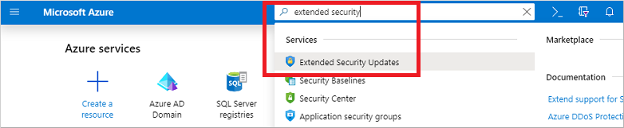
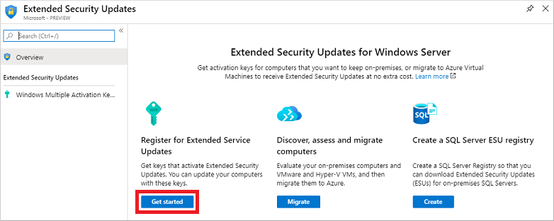
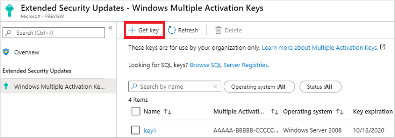

# How to use Windows Server 2008 and 2008 R2 extended security updates (ESU)

>Applies to: Windows Server 2008 and Windows Server 2008 R2

Windows Server 2008 and Windows Server 2008 R2 reached the end of their support lifecycle on January 14, 2020. Windows Server Long Term Servicing Channel (LTSC) has a minimum of ten years of support—five years for mainstream support and five years for extended support. This support includes regular security updates.

End of support also means the end of security updates. This scenario can cause security or compliance issues and put business applications at risk. Microsoft recommends that you [upgrade to the current version of Windows Server](modernize-windows-server-2008.md) for the most advanced security, performance, and innovation.

If you haven't already upgraded your servers, the following options will help protect your apps and data during the transition:

* Migrate existing Windows Server 2008 and 2008 R2 workloads as-is to Azure Virtual Machines (VMs).
  * This migration to Azure automatically provides an additional three years of extended security updates (ESU). There's no additional charge for extended security updates on top of Azure VM's cost, and there's no additional configuration required.
* Purchase an extended security update subscription for your servers and remain protected until you're ready to upgrade to a newer Windows Server version.
  * These updates are provided for up to three years after the end of support lifecycle date.

After the three year period of extended updates, we'll stop updating for Windows Server 2008 and 2008 R2. We recommend you update your version of Windows Server to a more recent version as soon as possible.

## What are extended security updates for Windows Server?

Extended security updates (ESUs) for Windows Server include security updates and bulletins rated *critical* and *important*, for a maximum of three years after January 14, 2020. Extended security updates don't include the following:

* New features
* Customer-requested non-security hotfixes
* Design change requests

For more information, see the [Extended Security Updates frequently asked questions](https://www.microsoft.com/cloud-platform/extended-security-updates).

## How to use Extended Security Updates

If you run Windows Server 2008 or 2008 R2 VMs in Azure, they're automatically enabled for Extended Security Updates. You don't need to configure anything, and there's no additional charge for using Extended Security Updates with Azure VMs. Extended Security Updates are automatically delivered to Azure VMs if they're configured to receive updates.

For other environments, such as on-premises VMs or physical servers, you need to manually request and configure Extended Security Updates. You can purchase Extended Security Updates through Volume Licensing Programs such as Enterprise Agreement (EA), Enterprise Agreement Subscription (EAS), Enrollment for Education Solutions (EES), or Server and Cloud Enrollment (SCE).

When you've purchased Extended Security Updates, you can use one of the following methods to get your keys:

* If you want to get Extended Security Update keys from the Azure Portal, you can [register for Extended Security Updates in the Azure Portal](#register-for-extended-security-updates-on-azure-portal).
* You can also [sign in to the Microsoft Volume Licensing Service Center](#sign-in-to-the-microsoft-volume-licensing-service-center) to get your keys without using the Azure Portal.

### Register for Extended Security Updates on Azure Portal

To use Extended Security Updates on non-Azure VMs, create a multiple activation key (MAK) and apply it to Windows Server 2008 and 2008 R2 computers. The MAK key lets the Windows Update servers know that you can continue to receive security updates. You register for Extended Security Updates and manage these keys using the Azure portal, even if you only use on-premises computers.

> [!NOTE]
> You don't need to register for Extended Security Updates if you're running Windows Server 2008 and 2008 R2 on Azure VMs. For other environments, such as on-premises VMs or physical servers, [purchase Extended Security Updates](https://www.microsoft.com/licensing/how-to-buy/how-to-buy) before you try to register and use them.

To register your VM for Extended Security Updates and create a key, open the Azure Portal and follow these instructions:

1. Sign in to the [Azure Portal](https://portal.azure.com/).
2. In the search box at the top of the Azure Portal, search for and select **Extended Security Updates**.

    

    If you haven't use extended security updates before, select **+ Create** to create an Extended Security Updates resource first. Otherwise, select your resource from the list.

3. Under **Register for Extended Service Updates**, select **Get started**.

    

4. To create your first key, select **Get key**.

    

    You need an Azure subscription associated with your account to create the Extended Security Update resource and key. If you don't have an Azure subscription associated with your account, sign in with a different user account or create an Azure subscription in the Azure Portal.

    Your Azure subscription must also be assigned the Contributor role for the security update to work. To check your role, enter "Subscriptions" into the search box. You'll see a table that will show you your role next to your subscription ID and name.

    If you aren't a Contributor, you can ask the subscription owner to change your role. To find out who owns your subscription, go to the role table described in the previous paragraph and select your subscription's name. Next, go to the menu on the left side of the page and select **Access control (IAM)** > **Role assignments** and look for the "Owners" section in the table.

5. If you see a page that says "Register to get a Multiple Activation Key," that means you need to request access to the private preview before you can use Extended Security Updates. If you don't see this page, skip ahead to step 6.

   To request access, select **join the private preview**. An email message window will open. This email is your access request to the product team.
  
    Include the following information in your request:

    * Customer name
    * Azure subscription ID
    * Agreement number (for ESU)
    * Number of ESU servers

    When you're done, send the email.

    The team will review the information you provide in your request email. If everything looks okay, they'll add you to the approved list.

    If the team doesn't approve your request, you'll see the following error:

    [The resource type could not be found in the namespace 'Microsoft.WindowsESU'](https://social.msdn.microsoft.com/Forums/office/94b16a89-3149-43da-865d-abf7dba7b977/the-resource-type-could-not-be-found-in-the-namespace-microsoftwindowsesu-for-api-version)

6. Under **Azure details**, select your Azure subscription, a resource group, and location for your key.

    Under **Registration details**, enter the following information:

    | Setting             | Value |
    |---------------------|-------|
    | Key name            | A display name for your key, such *Agreement01*. |
    | Agreement number    | Your agreement number generated by the volume licensing contract management system, or MSLicense for Enterprise Agreement programs. |
    | Number of computers | Choose the number of computers on which you want to install Extended Security Updates with this key. |
    | Operating system    | Choose the operating system to use this key with, such as Windows Server 2008 or Windows Server 2008 R2. |

    When ready, select **Review + register**.

    >[!NOTE]
    >Make sure you've selected the Azure subscription that you joined the private preview with in your global filter. Select the **Filter** button in the Azure Portal ribbon to check your global subscription filter.
    >
    > 

7. After successful validation, a summary of your choices for the new registry resource is shown. If needed, correct any validation errors or update your configuration choice. The Azure [Terms of Use](https://azure.microsoft.com/support/legal/) and [Privacy Policy](https://privacy.microsoft.com/privacystatement) are available.

    Check the box to confirm that you have eligible computers and the key is only to be used within your organization:

    

    When ready, select **Create** to generate the MAK.

Extended Security Updates registration is now available for use with your computers. The key created should be applied to Windows Server 2008 and 2008 R2 computers that you wish to remain eligible for security updates.

### Sign in to the Microsoft Volume Licensing Service Center

If you don't have access to the Azure Portal, then you can use the Volume Licensing Service Center to view and download your activation keys.

To get your keys from the Volume Licensing Service Center:

1. Go to the [Volume Licensing Service Center page](https://www.microsoft.com/vlsc) and sign in with your Azure credentials.

2. Select **Licenses** > **Relationship Summary** > **Licensing ID** > **Product Keys**.

To learn more about how to get Extended Security Updates for eligible Windows devices, see [our Tech Community post](https://techcommunity.microsoft.com/t5/windows-it-pro-blog/obtaining-extended-security-updates-for-eligible-windows-devices/ba-p/1167091#).

## Download and apply Extended Security Updates

Delivery, download and application of Extended Security Updates for Windows Server is no different than existing deployment processes. The updates provided through Extended Security Updates are only for *Security*, and are released every Patch Tuesday.

You can install the updates using whatever tools and processes already in place. The only difference is that the system must be registered using the key generated in the previous section for the updates to download and install.

For Azure VMs, the process of enabling the computer for Extended Security Updates is automatically completed for you. Updates should download and install without additional configuration.
