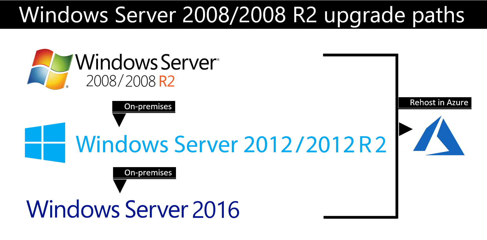

# Upgrade Windows Server 2008 and Windows Server 2008 R2

Extended support for Windows Server 2008 and Windows Server 2008 R2 is ending on January 14, 2020. There are two modernization paths available: On-premises upgrade, or migration by rehosting in Azure. **If you rehost in Azure, you can migrate your existing Server images free of charge.**

## On-premises upgrade
If you need to keep your servers on-premises, and you are running Windows Server 2008 or Windows Server 2008 R2, you will need to [upgrade to Windows Server 2012/2012 R2](installation-and-upgrade.md#upgrading-to-windows-server-2012-r2) before you can [upgrade to Windows Server 2016](installation-and-upgrade.md#upgrading-to-windows-server-2016). As you upgrade, you still have the option to migrate to Azure by rehosting.

See [Upgrading from Windows Server 2008 R2 or Windows Server 2008](installation-and-upgrade.md#upgrading-from-windows-server-2008-r2-or-windows-server-2008), for more information about your on-premises upgrade options.

If you are running Windows Server 2003, you will need to [upgrade to Windows Server 2008](https://docs.microsoft.com/previous-versions/windows/it-pro/windows-server-2008-R2-and-2008/ff972408(v%3dws.10)). See [upgrade paths for Windows Server 2008](https://docs.microsoft.com/previous-versions/windows/it-pro/windows-server-2008-R2-and-2008/dd979563(v=ws.10)) for more information about your on-premises upgrade options.

## Migrate to Azure
You can migrate your on-premises Windows Server 2008 and Windows Server 2008 R2 servers to Azure, where you can continue to run them on virtual machines. In Azure you'll stay compliant, become more secure, and add cloud innovation to your work. The benefits of migrating to Azure include:

- Security updates in Azure.
- Get three more years of Windows Server 2008 R2 or 2008 critical and important security updates, included at no additional charge. 
- No-charge upgrades in Azure.
- Adopt more cloud services as you are ready.
- By migrating SQL Server to Azure Managed Instances or VMs, you get three more years of Windows Server 2008 R2 or 2008 critical security updates, included at no additional charge. 
- Leverage existing SQL Server and Windows Server licenses for cloud savings unique to Azure.

To get started migrating, see [Upload a Windows Server 2008/2008 R2 specialized image to Azure](uploading-specialized-WS08-image-to-azure.md).

To help you understand how to analyze existing IT resources, assess what you have, and identify the benefits of moving specific services and applications to the cloud or keeping workloads on-premises and upgrading to the latest version of Windows Server, see [Migration Guide for Windows Server](https://go.microsoft.com/fwlink/?linkid=872689).

## Upgrade SQL Server 2008/2008 R2 in parallel with your Windows Servers

If you are running SQL Server 2008/2008 R2, you can upgrade to SQL Server [2016](https://docs.microsoft.com/sql/sql-server/sql-server-technical-documentation?view=sql-server-2016) or [2017](https://docs.microsoft.com/sql/sql-server/sql-server-technical-documentation?view=sql-server-2017).

## Additional resources
[Microsoft Azure](https://docs.microsoft.com/azure/#pivot=products)