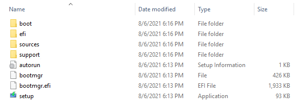
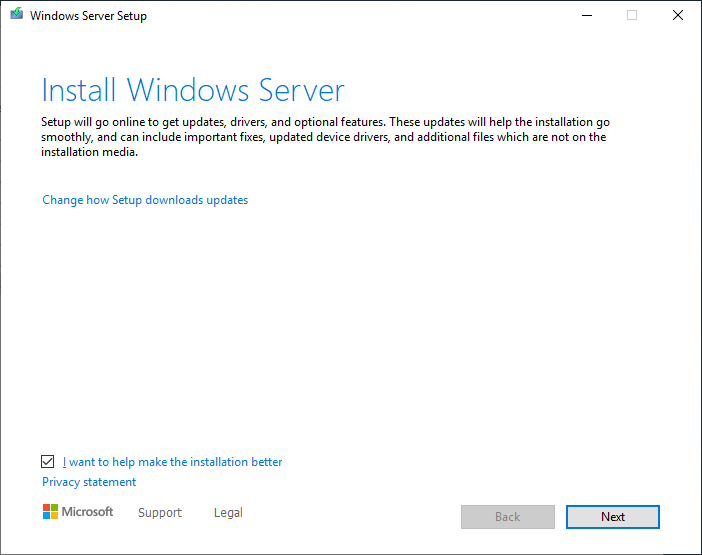
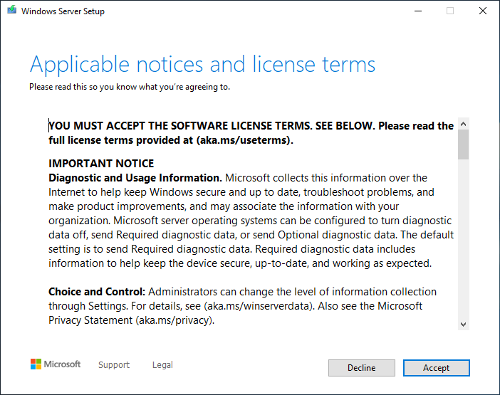
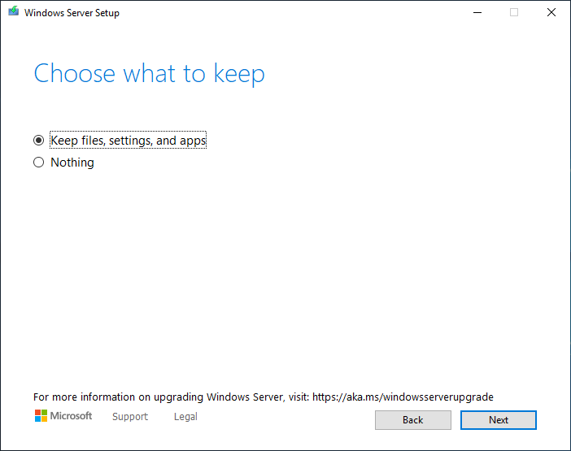
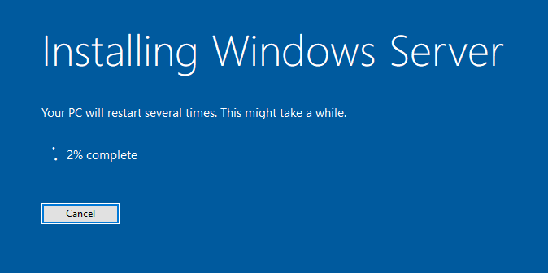

# Perform an in-place upgrade of Windows Server

An in-place upgrade allows you to go from an older operating system to a newer one while keeping your settings, server roles, and data intact. This article will teach you how to move to a later version of Windows Server using an in-place upgrade.

## Prerequisites

Before you start upgrading, your computer must meet the following requirements:

- You have determined [which version of Windows Server should I upgrade to](upgrade-overview.md#which-version-of-windows-server-should-i-upgrade-to).
- The hardware meets or exceeds the [hardware requirements for Windows Server](hardware-requirements.md).
- You have the install media ready to use.
- You have the product key and an available activation method. Keys and methods may depend based on the distribution channel that you received Windows Server media from, for example, a Commercial Licensing program, Retail, Original Equipment Manufacturer (OEM), and so on.
- You've reviewed [upgrade and migrate roles and features in Windows Server](upgrade-migrate-roles-features.md).
- You've reviewed [Microsoft server applications compatibility](application-compatibility-windows-server-2022.md).
- You've reviewed any 3rd party application vendors support requirements.

## Before you begin your in-place upgrade

Before you start your Windows Server upgrade, we recommend that you collect some information from your devices for diagnostic and troubleshooting purposes in case the upgrade is unsuccessful. We also recommend you store the information somewhere you can get to even if you can't access your device.

### Collect diagnostic info

To collect your info:

1. Open a command prompt, go to **C:\Windows\system32**, then enter **systeminfo.exe**.

1. Copy, paste, and store the resulting system information somewhere off of your device.

1. Next, enter **ipconfig /all** into the command prompt, then copy and paste the resulting configuration information into the same location you used in step 2.

1. Open an elevated PowerShell prompt, run the following command, and then copy and paste the **WindowsBuildLabEx** and **WindowsEditionID** values into the same location you used in steps 2 and 3.

   ```powershell
   Get-ComputerInfo -Property "WindowsProductName"
   ```

> [!TIP]
> Get-ComputerInfo requires PowerShell 5.1 or later. If your Windows Server version doesn't include Powershell you can find this information in the registry. Open Registry Editor, go to the  **HKEY_LOCAL_MACHINE\SOFTWARE\Microsoft\Windows NT\CurrentVersion** key, and then copy and paste the Windows Server **BuildLabEx** and **EditionID** values.

After you've collected all of your Windows Server-related information, we highly recommend that you backup your server operating system, apps, and virtual machines. You must also shut down, quick migrate, or live migrate any virtual machines currently running on the server. You can't have any virtual machines running during the in-place upgrade.

## Perform the upgrade

To perform the in-place upgrade:

1. Using File Explorer, navigate to the Windows Server Setup media. Then select **setup.exe**. For example, if you are using removal media this might be D:\setup.exe.

    

    > [!IMPORTANT]
    >  Depending on your security settings, User Account Control may prompt you to allow setup to make changes to your device. If you're happy to continue select **Yes**.

1. By default, setup will automatically download updates for the installation. If you're okay with the default settings, select **Next** to continue. If you don't want Setup to automatically download updates, select **Change how Setup downloads updates**.

    

    If you selected **Change how Setup downloads updates**, choose the option appropriate to your environment, then select **Next**.

    

1. Next, Setup will download any required updates, and will check your device configuration. Depending on the distribution channel that you received Windows Server media from (Retail, Volume License, OEM, ODM, etc.) and the license for the server, you may be prompted to enter a product key to continue.

    

1. Select the edition of Windows Server you want to install, then select **Next**.

    

1. To upgrade, you must accept the applicable notices and license terms by selecting **Accept**. The agreement may vary based on your distribution channel (such as a Commercial Licensing program, Retail, OEM, and so on.).

    

1. Select **Keep personal files and apps** to choose to do an in-place upgrade, then select **Next**.

    

1. After Setup finishes analyzing your device, select **Install** to continue the upgrade.

    

    1. The in-place upgrade will start, and you should see a progress bar. After the upgrade finishes, your server will restart.

    

## Checking if your upgrade was successful

After the upgrade to Windows Server is done, you must make sure the upgrade was successful.

To make sure your upgrade was successful:

1. Open an elevated PowerShell prompt, run the following command to verify the version and edition matches the media and values you selected during setup. For example, if you installed Windows Server 2022 Datacenter, you should see "Windows Server 2022 Datacenter" in the output.

   ```powershell
   Get-ComputerInfo -Property "WindowsProductName"
   ```

1. Make sure all of your applications are running and that your client connections to the applications are successful.

If your machine isn't working as expected after the upgrade, copy and zip the **%SystemRoot%\Panther** (usually located at **C:\Windows\Panther**) directory and contact Microsoft support.

## Next steps

Now that you've upgraded Windows Server, here are some articles that might help you as you use the new version:

- [Install or Uninstall Roles, Role Services, or Features](../administration/server-manager/install-or-uninstall-roles-role-services-or-features.md)
- [Windows Server management overview](../administration/overview.md)
- [Get Started with Windows Admin Center](../manage/windows-admin-center/use/get-started.md)
- [Key Management Services (KMS) activation planning](kms-activation-planning.md)
- [Activate using Active Directory-based activation](/windows/deployment/volume-activation/activate-using-active-directory-based-activation-client)

If you'd like to learn more about deploying, post-installation configuration and activation options, check out the [Windows Server deployment, configuration, and administration learning path](/learn/paths/windows-server-deployment-configuration-administration/).
