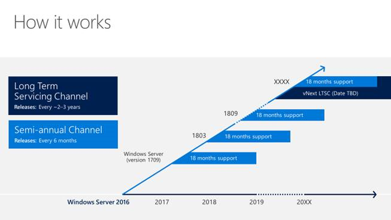

# Windows Server Semi-annual Channel Overview

>Applies To: Windows Server Semi-annual Channel

The Windows Server release model is offering a new option in order to align with similar release and servicing models for [Windows 10](https://docs.microsoft.com/windows/deployment/update/waas-overview) and [Office 365 ProPlus](https://support.office.com/article/Overview-of-the-upcoming-changes-to-Office-365-ProPlus-update-management-78b33779-9356-4cdf-9d2c-08350ef05cca). If you've been working with Windows 10 or Office 365 ProPlus, these improvements might already be familiar to you.

**There will be two primary release channels available to Windows Server customers, the Long-term Servicing Channel, and the new Semi-annual Channel.**

## Long-term Servicing Channel
This is the release model you’re already familiar with (currently called the “Long-term Servicing *Branch*”) where a new major version of Windows Server is released every 2-3 years. Users are entitled to 5 years of mainstream support, 5 years of extended support, and optionally 6 more years with [Premium Assurance](https://microsoft.com/cloud-platform/premium-assurance). This channel is appropriate for systems that require a longer servicing option and functional stability. Deployments of Windows Server 2016 and earlier versions of Windows Server will not be affected by the new Semi-annual Channel releases. The Long-term Servicing Channel will continue to receive security and non-security updates, but it will not receive the new features and functionality.

## Semi-annual Channel
The Semi-annual Channel releases will deliver new functionality for customers who are moving at a “cloud cadence," such as those on rapid development cycles or hosters keeping up with the latest Hyper-V investments. Windows Server products in the Semi-annual Channel will have new releases available twice a year, in spring and fall. Each release in this channel will be supported for 18 months from the initial release.

Most of the features introduced in the Semi-annual Channel will be rolled up into the next Long-term Servicing Channel release of Windows Server. The editions, functionality, and supporting content might vary from release to release depending on customer feedback.

The Semi-annual Channel will be available to volume-licensed customers with [Software Assurance](https://www.microsoft.com/licensing/licensing-programs/software-assurance-default.aspx), as well as via the Azure Marketplace or other cloud/hosting service providers and loyalty programs such as MSDN.

In this new model, Windows Server releases are identified by the year and month of release: for example, in 2017, a release in the 9th month (September) would be identified as **version 1709**. Windows Server will release semi-annually in fall and spring. Another release in March 2018 would be version 1803. The support lifecycle for each release is 18 months.

## Release channels and installation options

The available release channels are different for each Windows Server installation option:

| Installation option | Semi-annual Channel (Windows Server) | Long-term Servicing Channel (Windows Server 2016) |
| ------------------- | ------------------------------------ | ------------------------------------------------- |
| Nano Server         | Yes                                  | No                                                |
| Server Core         | Yes                                  | Yes                                               |
| Server with Desktop | No                                   | Yes                                               |

## Device compatibility
Unless otherwise communicated, the minimum hardware requirements to run the Semi-annual Channel releases will be the same as the most recent Long-term Servicing Channel release of Windows Server. For example, the current Long-term Servicing Channel release is Windows Server 2016. Most hardware drivers will continue to function in these releases.

## Servicing
Both the Long-term Servicing Channel and the Semi-annual Channel releases will be supported with security updates and non-security updates. The difference is the length of time that the release is supported, as described above.

### Servicing tools
There are many tools with which IT pros can service Windows Server. Each option has its pros and cons, ranging from capabilities and control to simplicity and low administrative requirements. The following are examples of the servicing tools available to manage servicing updates:

- **Windows Update (stand-alone)**: This option is only available for servers that are connected to the Internet and have Windows Update enabled.
- **Windows Server Update Services (WSUS)** provides extensive control over Windows 10 updates and is natively available in the Windows Server operating system. In addition to the ability to defer updates, organizations can add an approval layer for updates and choose to deploy them to specific computers or groups of computers whenever ready.
- **System Center Configuration Manager** provides the greatest control over servicing. IT pros can defer updates, approve them, and have multiple options for targeting deployments and managing bandwidth usage and deployment times.

You’ve likely already chosen to use at least one of these options based on your resources, staff, and expertise. You can continue using the same process for Semi-annual Channel Releases: for example, if you already use System Center Configuration Manager to manage updates, you can continue to use it. Similarly, if you are using WSUS, you can continue to use that.

## Windows Insider Program
For many IT pros and application developers, gaining visibility into new functionality early--before they’re released--can be both intriguing and valuable. Testing the early builds of Windows Server helps both Microsoft and its customers because of the opportunity to discover possible issues before release. It also gives customers a unique opportunity to directly influence the functionality in the product. Microsoft depends on receiving feedback throughout the development process so that adjustments may be made as quickly as possible. Early testing and feedback is essential to the rapid release model.

Pre-release builds of Windows Server will be available for download via the Windows Insider Program and the Windows Insider Program for Business. The server editions available on the Windows Insider Program may vary depending on the current stage of the development cycle. To join the Windows Insider Program, follow these steps:

1. Register at [Windows Insider Program for Business](https://insider.windows.com/ForBusiness). 
2. Register a Windows 10 device for Insider flights. 
3. Choose one or more servers for preview testing. 
4. Download builds from the [Windows Server Insider Preview](https://www.microsoft.com/en-us/software-download/windowsinsiderpreviewserver) page. See the [Windows Server blog](https://blogs.technet.microsoft.com/windowsserver/ )  for an announcement when the preview is available.
5. Bookmark the Docker Hub or other external sites where some code and docs will be published. See [Windows Containers Documentation](http://aka.ms/containers/insiders).
6. Send us your feedback via the Windows 10 Feedback Hub application.
7. Join the [Windows Server Tech Community](https://techcommunity.microsoft.com/t5/Windows-Server/ct-p/Windows-Server) to collaborate, share and learn from experts. 

 
# Related topics
[Changes to Nano Server in the next release of Windows Server](nano-in-semi-annual-channel.md)

[Windows Server support lifecycle](https://support.microsoft.com/en-us/lifecycle)

[Windows Server 2016 System Requirements](https://docs.microsoft.com/windows-server/get-started/system-requirements) 

