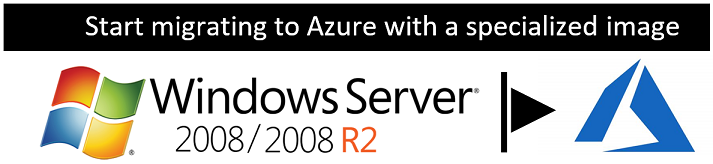
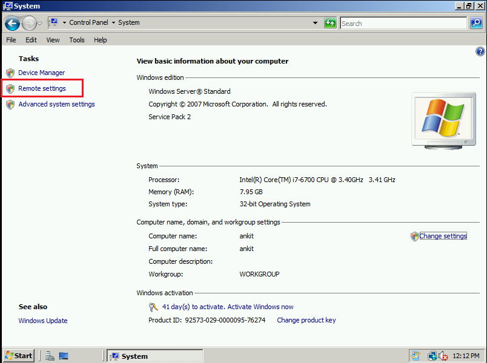
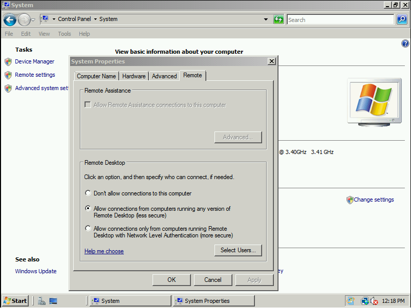
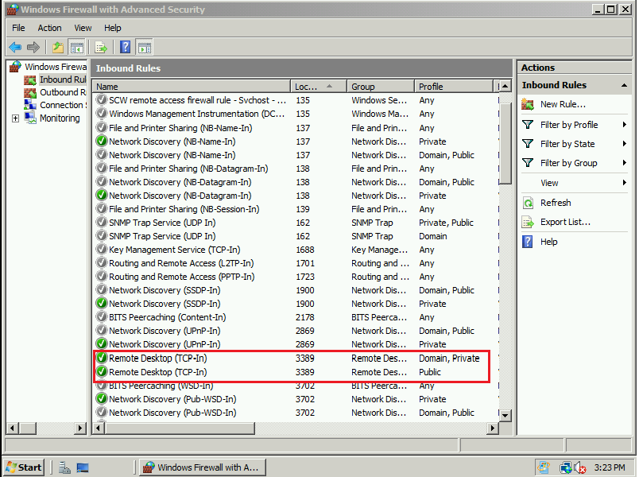
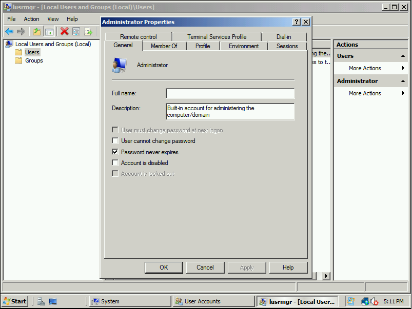

# Upload a Windows Server 2008/2008 R2 specialized image to Azure 



You can now run a Windows Server 2008/2008 R2 VM in the cloud with Azure. 

## Prep the Windows Server 2008/2008 R2 specialized image
Before you can upload an image, make the following changes:

- Download and install Windows Server 2008 Service Pack 2 (SP2) if you don't already have it installed on your image.

- Configure Remote Desktop (RDP) settings.
  1. Go to **Control Panel** > **System settings**.   
  2. Select **Remote settings** in the left-hand menu.

     

  3. Select the **Remote** tab in System Properties.   

     

  4. Select Allow connections from computers running any version of Remote Desktop (less secure).   
  5. Click **Apply**, and **OK**.
- Configure Windows Firewall settings.   
   1. At the command prompt in Admin mode, enter “**wf.msc**” for Windows Firewall and advanced security settings.   
   2. Sort findings by **Ports**, select **port 3389**.   
        
   3. Enable Remote Desktop (TCP-IN) for the profiles: **Domain**, **Private**, and **Public** (shown above).

- Save all settings and shut down the image.   
- If you're using Hyper-V, make sure the child AVHD is merged into the parent VHD for persisting changes.

A current known bug causes the administrator password on the uploaded image to expire within 24 hours. Follow these steps to avoid this issue: 

1. Go to **Start** > **Run**
2. Type **lusrmgr.msc**
3. Select **Users** under Local Users and Groups
4. Right-click **Administrator** and select **Properties**
5. Select **password never expires** and select **OK**


## Uploading the image VHD
You can use the script below to upload the VHD. Before you do this, you'll need the publish settings file for your Azure account. Get your [Azure file settings](https://azure.microsoft.com/downloads/).

Here is the script:

```powershell
Get-AzurePublishSettingsFile 

Login-AzureRmAccount
 
      # Import publishsettings
      Import-AzurePublishSettingsFile -PublishSettingsFile <LocationOfPublishingFile>
	  $subscriptionId = 'xxxx-xxxx-xxxx-xxxx-xxxxx'
 
      # Set NodeFlight subscription as default subscription
      Select-AzureRmSubscription -SubscriptionId $subscriptionId
      Set-AzureRmContext -SubscriptionId $subscriptionId
      $rgName = "<resourcegroupname>"
	
	  $urlOfUploadedImageVhd = "<BlobUrl>/<NameForVHD>.vhd"
      Add-AzureRmVhd -ResourceGroupName $rgName -Destination $urlOfUploadedImageVhd -LocalFilePath "<FilePath>"  
```
## Deploy the image in Azure
In this section, you will be deploying the image VHD in Azure. 

> [!IMPORTANT]
> Do not use pre-defined user images in Azure.

1.	Create a new [resource group](https://docs.microsoft.com/rest/api/resources/resourcegroups/createorupdate). 
2.	Create a new [storage blob](https://docs.microsoft.com/rest/api/storageservices/put-blob) inside the resource group.
3.	Create a [container](https://docs.microsoft.com/rest/api/storageservices/create-container) inside the storage blob.
4.	Copy the URL of the blob storage from properties.
5.	Use the script provided above to upload your image to the new storage blob.
6.	Create a [disk](https://docs.microsoft.com/azure/virtual-machines/windows/prepare-for-upload-vhd-image) for your VHD.   
     a.	Go to Disks, click **Add**.  
     b.	Enter a name for the disk. Select the subscription you want to use, set the region, and choose the account type.   
     c. For Source Type, select storage. Browse to the blob VHD location created using the script.  
     d. Select OS type Windows and Size (default: 1023).   
     e. Click **Create**.   

7.	Go to the Disk Created, click **Create VM**.   
     a.	Name the VM.   
     b.	Select the existing group you created in step 5 where you uploaded the disk.   
     c.	Pick a size and SKU plan for your VM.   
     d.	Select a network interface on the settings page. Make sure the network interface has the following rule specified:
 
        PORT:3389 Protocol: TCP Action: Allow Priority: 1000 Name: ‘RDP-Rule'.   
     e.	Click **Create**.


