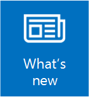

# What's New in Windows Server 2016

>Applies to: Windows Server 2016

 To learn about the latest features in Windows, see [What's New in Windows Server](whats-new-in-windows-server.md). The content in this section describes what's new and changed in Windows Server&reg; 2016. The new features and changes listed here are the ones most likely to have the greatest impact as you work with this release.

## [Compute](../virtualization/virtualization.md)

The Virtualization area includes virtualization products and features for the IT professional to design, deploy, and maintain Windows Server.  

### General  
Physical and virtual machines benefit from greater time accuracy due to improvements in the Win32 Time and Hyper-V Time Synchronization Services. Windows Server can now host services that are compliant with upcoming regulations which require a 1ms accuracy with regards to UTC.  

### Hyper-V  
-   [What's new in Hyper-V on Windows Server 2016](../virtualization/hyper-v/What-s-new-in-Hyper-V-on-Windows.md). This topic explains the new and changed functionality of the Hyper-V role in Windows Server 2016, Client Hyper-V running on Windows 10, and Microsoft Hyper-V Server 2016.  

-   [Windows Containers](https://msdn.microsoft.com/virtualization/windowscontainers/containers_welcome):  Windows Server 2016 container support adds performance improvements, simplified network management, and support for Windows containers on Windows 10. For some additional information on containers, see [Containers: Docker, Windows and Trends](https://azure.microsoft.com/blog/2015/08/17/containers-docker-windows-and-trends/).  

### Nano Server  
What's New in [Nano Server](getting-started-with-nano-server.md). Nano Server now has an updated module for building Nano Server images, including more separation of physical host and guest virtual machine functionality as well as support for different Windows Server editions.   

There are also improvements to the Recovery Console, including separation of inbound and outbound firewall rules as well as the ability to repair the configuration of WinRM.  

### Shielded Virtual Machines  
Windows Server 2016 provides a new Hyper-V-based Shielded Virtual Machine to protect any Generation 2 virtual machine from a compromised fabric. Among the features introduced in Windows Server 2016 are the following:  

- New "Encryption Supported" mode that offers more protections than for an ordinary virtual machine, but less than "Shielded" mode, while still supporting vTPM, disk encryption, Live Migration traffic encryption, and other features, including direct fabric administration conveniences such as virtual machine console connections and Powershell Direct.  

- Full support for converting existing non-shielded Generation 2 virtual machines to shielded virtual machines, including automated disk encryption.

- Hyper-V Virtual Machine Manager can now view the fabrics upon which a shielded virtual is authorized to run, providing a way for the fabric administrator to open a shielded virtual machine's key protector (KP) and view the fabrics it is permitted to run on.  

- You can switch Attestation modes on a running Host Guardian Service. Now you can switch on the fly between the less secure but simpler Active Directory-based attestation and TPM-based attestation.  

- End-to-end diagnostics tooling based on Windows PowerShell that is able to detect misconfigurations or errors in both guarded Hyper-V hosts and the Host Guardian Service.  

- A recovery environment that offers a means to securely troubleshoot and repair shielded virtual machines within the fabric in which they normally run while offering the same level of protection as the shielded virtual machine itself.

- Host Guardian Service support for existing safe Active Directory – you can direct the Host Guardian Service to use an existing Active Directory forest as its Active Directory instead of creating its own Active Directory instance

For more details and instructions for working with shielded virtual machines, see [Shielded VMs and Guarded Fabric Validation Guide for Windows Server 2016 (TPM)](https://aka.ms/shieldedvms).  

## [Identity and Access](../identity/Identity-and-Access.md)  
New features in Identity improve the ability for organizations to secure Active Directory environments and help them migrate to cloud-only deployments and hybrid deployments, where some applications and services are hosted in the cloud and others are hosted on premises.  

### Active Directory Certificate Services  
Active Directory Certificate Services (AD CS) in Windows Server 2016 increases support for TPM key attestation: You can now use Smart Card KSP for key attestation, and devices that are not joined to the domain can now use NDES enrollment to get certificates that can be attested for keys being in a TPM.  

### Active Directory Domain Services  
Active Directory Domain Services includes improvements to help organizations secure Active Directory environments and provide better identity management experiences for both corporate and personal devices. For more information, see [What's new in Active Directory Domain Services (AD DS) in Windows Server 2016](../identity/whats-new-active-directory-domain-services.md).   

### Active Directory Federation Services  
What's New in Active Directory Federation Services. Active Directory Federation Services (AD FS) in Windows Server 2016 includes new features that enable you to configure AD FS to authenticate users stored in Lightweight Directory Access Protocol (LDAP) directories. For more information, see [What's New in AD FS for Windows Server 2016](../identity/ad-fs/overview/whats-new-active-directory-federation-services-windows-server.md).  

### Web Application Proxy  
The latest version of Web Application Proxy focuses on new features that enable publishing and preauthentication for more applications and improved user experience. Check out the full list of new features that includes preauthentication for rich client apps such as Exchange ActiveSync and wildcard domains for easier publishing of SharePoint apps. For more information, see [Web Application Proxy in Windows Server 2016](../remote/remote-access/web-application-proxy/web-application-proxy-windows-server.md).  

##  [Administration](../administration/manage-windows-server.md)  
The Management and Automation area focuses on tool and reference information for IT pros who want to run and manage Windows Server 2016, including Windows PowerShell.

Windows PowerShell 5.1 includes significant new features, including support for developing with classes and new security features that extend its use, improve its usability, and allow you to control and manage Windows-based environments more easily and comprehensively. See [New Scenarios and Features in WMF 5.1](https://docs.microsoft.com/powershell/wmf/5.1/scenarios-features) for details.

New additions for Windows Server 2016 include: the ability to run PowerShell.exe locally on Nano Server (no longer remote only), new Local Users & Groups cmdlets to replace the GUI, added PowerShell debugging support, and added support in Nano Server for security logging & transcription and JEA.

Here are some other new administration features:

### PowerShell Desired State Configuration (DSC) in Windows Management Framework (WMF) 5
Windows Management Framework 5 includes updates to Windows PowerShell Desired State Configuration (DSC), Windows Remote Management (WinRM), and Windows Management Instrumentation (WMI).

For more info about testing the DSC features of Windows Management Framework 5, see the series of blog posts discussed in [Validate features of PowerShell DSC](https://blogs.msdn.microsoft.com/powershell/2015/07/06/validate-features-of-powershell-dsc/). To download, see [Windows Management Framework 5.1](https://docs.microsoft.com/powershell/scripting/wmf/setup/install-configure).

### PackageManagement unified package management for software discovery, installation, and inventory
Windows Server 2016 and Windows 10 includes a new PackageManagement feature (formerly called OneGet) that enables IT Professionals or DevOps to automate software discovery, installation, and inventory (SDII), locally or remotely, no matter what the installer technology is and where the software is located. 

For more info, see [https://github.com/OneGet/oneget/wiki](https://github.com/OneGet/oneget/wiki).

### PowerShell enhancements to assist digital forensics and help reduce security breaches
To help the team responsible for investigating comprimised systems - sometimes known as the "blue team" - we've added additional PowerShell logging and other digital forensics functionality, and we've added functionality to help reduce vulnerabilities in scripts, such as constrained PowerShell, and secure CodeGeneration APIs.

For more info, see [PowerShell ♥ the Blue Team](https://blogs.msdn.microsoft.com/powershell/2015/06/09/powershell-the-blue-team/).

## [Networking](../networking/Networking.md)  
This area addresses networking products and features for the IT professional to design, deploy, and maintain Windows Server 2016.  

### Software-Defined Networking
You can now both mirror and route traffic to new or existing virtual appliances. Together with a distributed firewall and Network security groups, this enables you to dynamically segment and secure workloads in a manner similar to Azure. Second, you can deploy and manage the entire Software-defined networking (SDN) stack using System Center Virtual Machine Manager. Finally, you can use Docker to manage Windows Server container networking, and associate SDN policies not only with virtual machines but containers as well. For more information, see [Plan a Software Defined Network Infrastructure](../networking/sdn/plan/plan-a-software-defined-network-infrastructure.md).

### TCP performance improvements
The default Initial Congestion Window (ICW) has been increased from 4 to 10 and TCP Fast Open (TFO) has been implemented. TFO reduces the amount of time required to establish a TCP connection and the increased ICW allows larger objects to be transferred in the initial burst. This combination can significantly reduce the time required to transfer an Internet object between the client and the cloud.

In order to improve TCP behavior when recovering from packet loss we have implemented TCP Tail Loss Probe (TLP) and Recent Acknowledgement (RACK). TLP helps convert Retransmit TimeOuts (RTOs) to Fast Recoveries and RACK reduces the time required for Fast Recovery to retransmit a lost packet. 

## [Security and Assurance](../security/Security-and-Assurance.md)  
Includes security solutions and features for the IT professional to deploy in your datacenter and cloud environment. For information about security in Windows Server 2016 generally, see [Security and Assurance](../security/Security-and-Assurance.md).  

### Just Enough Administration  
Just Enough Administration in Windows Server 2016 is security technology that enables delegated administration for anything that can be managed with Windows PowerShell. Capabilities include support for running under a network identity, connecting over PowerShell Direct, securely copying files to or from JEA endpoints, and configuring the PowerShell console to launch in a JEA context by default. For more details, see [JEA on GitHub](https://aka.ms/JEA).

### Credential Guard
Credential Guard uses virtualization-based security to isolate secrets so that only privileged system software can access them. See [Protect derived domain credentials with Credential Guard](https://technet.microsoft.com/itpro/windows/keep-secure/credential-guard).

###  Remote Credential Guard
Credential Guard includes support for RDP sessions so that the user credentials remain on the client side and are not exposed on the server side. This also provides Single Sign On for Remote Desktop. See [Protect derived domain credentials with Windows Defender Credential Guard](https://docs.microsoft.com/windows/access-protection/credential-guard/credential-guard).   

### Device Guard (Code Integrity)
Device Guard provides kernel mode code integrity (KMCI) and user mode code integrity (UMCI) by creating policies that specify what code can run on the server. See [Introduction to Windows Defender Device Guard: virtualization-based security and code integrity policies](https://docs.microsoft.com/windows/device-security/device-guard/introduction-to-device-guard-virtualization-based-security-and-code-integrity-policies).

### Windows Defender  
[Windows Defender Overview for Windows Server 2016](../security/windows-defender/windows-defender-overview-windows-server.md). Windows Server Antimalware is installed and enabled by default in Windows Server 2016, but the user interface for Windows Server Antimalware is not installed. However, Windows Server Antimalware will update antimalware definitions and protect the computer without the user interface. If you need the user interface for Windows Server Antimalware, you can install it after the operating system installation by using the Add Roles and Features Wizard.

### Control Flow Guard
Control Flow Guard (CFG) is a platform security feature that was created to combat memory corruption vulnerabilities. See [Control Flow Guard](https://msdn.microsoft.com/library/windows/desktop/mt637065(v=vs.85).aspx) for more information.

## [Storage](../storage/storage.md)

Storage in Windows Server 2016 includes new features and enhancements for software-defined storage, as well as for traditional file servers. Below are a few of the new features, for more enhancements and further details, see [What's New in Storage in Windows Server 2016](../storage/whats-new-in-storage.md).

### Storage Spaces Direct

Storage Spaces Direct enables building highly available and scalable storage using servers with local storage. It simplifies the deployment and management of software-defined storage systems and unlocks use of new classes of disk devices, such as SATA SSD and NVMe disk devices, that were previously not possible with clustered Storage Spaces with shared disks.

For more info, see [Storage Spaces Direct](../storage/storage-spaces/storage-spaces-direct-overview.md).

### Storage Replica

Storage Replica enables storage-agnostic, block-level, synchronous replication between servers or clusters for disaster recovery, as well as stretching of a failover cluster between sites. Synchronous replication enables mirroring of data in physical sites with crash-consistent volumes to ensure zero data loss at the file-system level. Asynchronous replication allows site extension beyond metropolitan ranges with the possibility of data loss.

For more info, see [Storage Replica](../storage/storage-replica/storage-replica-overview.md).

### Storage Quality of Service (QoS)

You can now use storage quality of service (QoS) to centrally monitor end-to-end storage performance and create management policies using Hyper-V and CSV clusters in Windows Server 2016.

For more info, see [Storage Quality of Service](../storage/storage-qos/storage-qos-overview.md).

## [Failover Clustering](../failover-clustering/whats-new-in-failover-clustering.md)

Windows Server 2016 includes a number of new features and enhancements for multiple servers that are grouped together into a single fault-tolerant cluster using the Failover Clustering feature. Some of the additions are listed below; for a more complete listing, see [What's New in Failover Clustering in Windows Server 2016](../failover-clustering/whats-new-in-failover-clustering.md).

### Cluster Operating System Rolling Upgrade

Cluster Operating System Rolling Upgrade enables an administrator to upgrade the operating system of the cluster nodes from  Windows Server 2012 R2  to Windows Server 2016 without stopping the Hyper-V or the Scale-Out File Server workloads. Using this feature, the downtime penalties against Service Level Agreements (SLA) can be avoided.

For more info, see [Cluster Operating System Rolling Upgrade](../failover-clustering/Cluster-Operating-System-Rolling-Upgrade.md).

### Cloud Witness

Cloud Witness is a new type of Failover Cluster quorum witness in Windows Server 2016 that leverages Microsoft Azure as the arbitration point. The Cloud Witness, like any other quorum witness, gets a vote and can participate in the  quorum calculations. You can configure cloud witness as a quorum witness using the Configure a Cluster Quorum Wizard.

For more info, see [Deploy Cloud Witness](../failover-clustering/deploy-cloud-witness.md).

### Health Service

The Health Service improves the day-to-day monitoring, operations, and maintenance experience of cluster resources on a Storage Spaces Direct cluster.

For more info, see [Health Service](../failover-clustering/health-service-overview.md).

## Application development

### Internet Information Services (IIS) 10.0
New features provided by the IIS 10.0 web server in Windows Server 2016 include:

- Support for HTTP/2 protocol in the Networking stack and integrated with IIS 10.0, allowing IIS 10.0 websites to automatically serve HTTP/2 requests for supported configurations. This allows numerous enhancements over HTTP/1.1 such as more efficient reuse of connections and decreased latency, improving load times for web pages. 
- Ability to run and manage IIS 10.0 in Nano Server. See [IIS on Nano Server](iis-on-nano-server.md).
- Support for Wildcard Host Headers, enabling administrators to set up a web server for a domain and then have the web server serve requests for any subdomain.
- A new PowerShell module (IISAdministration) for managing IIS. 

For more details see [IIS](https://iis.net/learn).

### Distributed Transaction Coordinator (MSDTC)
Three new features are added in Microsoft Windows 10 and Windows Server 2016:

- A new interface for Resource Manager Rejoin can be used by a resource manager to determine the outcome of an in-doubt transaction after a database restarts due to an error. See [IResourceManagerRejoinable::Rejoin](https://msdn.microsoft.com/library/mt203799(v=vs.85).aspx) for details.

- The DSN name limit is enlarged from 256 bytes to 3072 bytes. See [IDtcToXaHelperFactory::Create](https://msdn.microsoft.com/library/ms686861(v=vs.85).aspx), [IDtcToXaHelperSinglePipe::XARMCreate](https://msdn.microsoft.com/library/ms679248(v=vs.85).aspx), or [IDtcToXaMapper::RequestNewResourceManager](https://msdn.microsoft.com/library/ms680310(v=vs.85).aspx) for details.

- Improved tracing allowing you to set a registry key to include an image file path in the trace log file name so you can tell which trace log file to check. See [How to enable diagnostic tracing for MS DTC on a Windows-based computer](https://support.microsoft.com/kb/926099) for details on configuring tracing for MSDTC.

## See Also  
-   [Release Notes: Important Issues in Windows Server 2016](Windows-Server-2016-GA-Release-Notes.md)  
