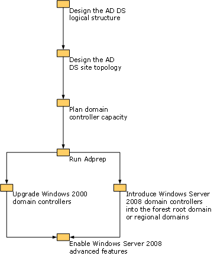

# Deploying AD DS in a Windows 2000 Organization
If your organization is currently running Windows 2000 Active Directory, you can deploy [!INCLUDE[nextref_longhorn]()] Active Directory Domain Services \(AD DS\) by either performing an in\-place upgrade of some or all of your domain controllers' operating systems to [!INCLUDE[nextref_longhorn]()] or by introducing domain controllers running [!INCLUDE[nextref_longhorn]()] into your environment.  
  
Before you can add a domain controller running [!INCLUDE[nextref_longhorn]()] to an existing Windows 2000 Active Directory domain, you must run **adprep**, a command\-line tool. Adprep extends the AD DS schema, updates default security descriptors of selected objects, and adds new directory objects as required by some applications. Adprep is available on the [!INCLUDE[nextref_longhorn]()] installation disk \(\\sources\\adprep\\adprep.exe\). For more information, see Adprep \([http:\/\/go.microsoft.com\/fwlink\/?LinkId\=99215](http://go.microsoft.com/fwlink/?LinkId=99215)\).  
  
> [!NOTE]  
> If you want to perform an in\-place upgrade of an existing Windows 2000 AD DS domain controller to [!INCLUDE[nextref_longhorn]()], you must first upgrade the server to Windows Server 2003, and then upgrade it to [!INCLUDE[nextref_longhorn]()].  
  
The following illustration shows the steps for deploying the [!INCLUDE[nextref_longhorn]()] AD DS in a network environment that is currently running Windows 2000 Active Directory.  
  
  
  
> [!NOTE]  
> If you want to set the domain or forest functional level to [!INCLUDE[nextref_longhorn]()], all domain controllers in your environment must run the [!INCLUDE[nextref_longhorn]()] operating system.  
  
Consolidating resource and account domains that are upgraded in place from a Windows 2000 environment as part of your [!INCLUDE[nextref_longhorn]()] AD DS deployment may require interforest or intraforest domain restructuring. Restructuring AD DS domains between forests helps you reduce the complexity of your organization and the associated administrative costs. Restructuring AD DS domains within a forest helps you to decrease the administrative overhead for your organization by reducing replication traffic, reducing the amount of user and group administration that is required, and simplifying the administration of Group Policy. For more information, see ADMT v3.1 Migration Guide \([http:\/\/go.microsoft.com\/fwlink\/?LinkId\=93678](http://go.microsoft.com/fwlink/?LinkId=93678)\).  
  
For a list of detailed tasks that you can use to plan and deploy AD DS in an organization that is currently running Windows 2000 Active Directory, see [Checklist: Deploying AD DS in a Windows 2000 Organization]().  
  

