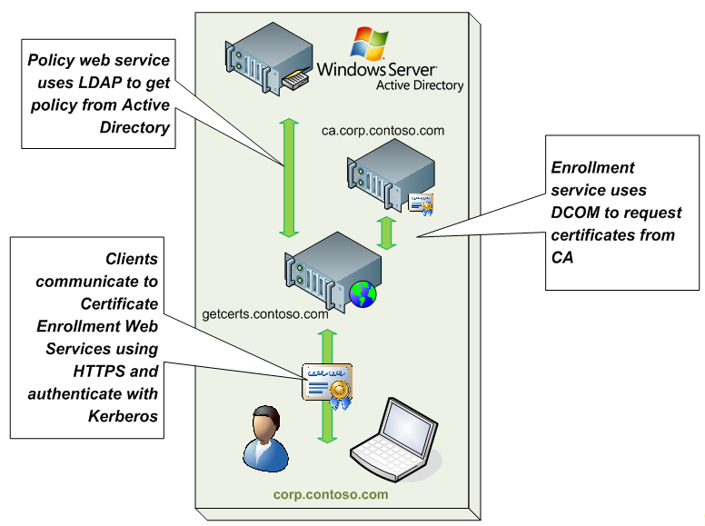
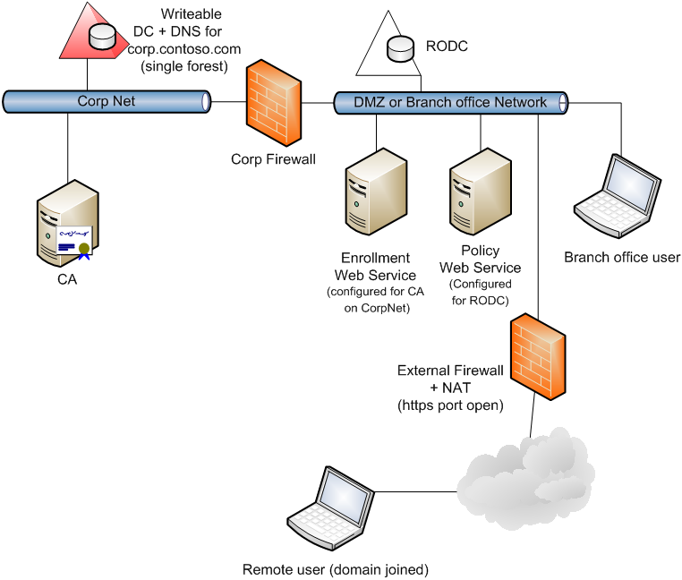
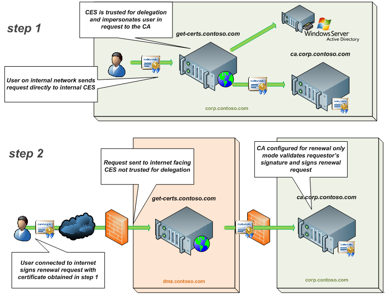
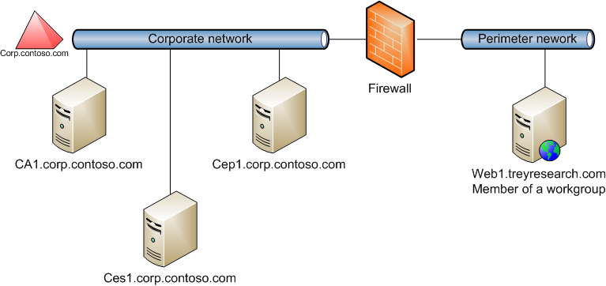

# Certificate Enrollment Web Service overview

The Certificate Enrollment Web Service is an Active Directory Certificate Services (AD CS) role service that enables users and computers to perform certificate enrollment by using the HTTPS protocol. Together with the Certificate Enrollment Policy Web Service, this enables policy-based certificate enrollment when the client computer isn't a member of a domain or when a domain member isn't connected to the domain. The Certificate Enrollment Web Service uses the HTTPS protocol to accept certificate requests from and return issued certificates to network client computers. The Certificate Enrollment Web Service uses the DCOM protocol to connect to the certification authority (CA) and complete certificate enrollment on behalf of the requester.

Certificate enrollment over HTTPS enables:

- Certificate enrollment across forest boundaries to reduce the number of CAs in an enterprise
- Extranet deployment to issue certificates to mobile workers and business partners

This article provides an overview of the Certificate Enrollment Web Service, including information about the authentication types, load balancing considerations, and configuration options.

## Authentication types

The Certificate Enrollment Web Service supports the three following authentication types:

- Windows integrated authentication

- Client certificate authentication

- User name and password authentication

Each of these authentication types is discussed in more detail in the following sections.

### Windows integrated authentication

Windows Integrated Authentication uses either Kerberos or NT LAN Manager (NTLM) to provide a seamless authentication flow for devices connected to the internal network and joined to a domain. This method is preferred for internal deployments because it uses the existing infrastructure present within Active Directory Domain Services (AD DS), and requires minimal changes to certificate client computers. Use this authentication method if you only need clients to access the web service while connected directly to your internal network.

### Client certificate authentication

If certificates are provisioned to computers, then clients computers can use client certificate authentication. Client certificate authentication doesn't require a direct connection to the corporate network. Client certificate authentication is preferred over username and password authentication because it provides a more secure method of authenticating. However, this method requires that [x.509 certificates](https://datatracker.ietf.org/doc/html/rfc5280) are initially provisioned to clients by separate means. Use this authentication method if you plan to provide users with digital X.509 certificates for client authentication. This authentication method enables you to make the web service available on the Internet.

If you want to use certificate-based authentication from outside the domain for a computer configured in a workgroup or that is a member of a domain from which there's no forest trust relationship, then you must also do the following:

- Ensure that a computer account exists in the forest of which the CA is a member that has the same name as the computer receiving the certificate.
- Issue a certificate using names that are appropriate for the computer to which the certificate is issued.
- Manually transfer the issued certificate from a computer inside the domain to the appropriate computer that is either configured in a workgroup or that is a member of a domain from which there's no forest trust relationship.

### User name and password authentication

The simplest form of authentication is username and password. This method typically is used for servicing clients that aren't directly connected to the internal network. It's a less secure authentication option than using client certificates, but it doesn't require provisioning a certificate to clients, and therefore often easier to implement than client certificate authentication. Use this authentication method if you would like users to enter a username and password to authenticate to the web service. This authentication method can be used when the web service is accessed on the internal network or over the Internet.

### Delegation requirements

Delegation allows a service to impersonate a user account, or computer account in order to access resources throughout the network. When a service is trusted for delegation, that service can impersonate a user to use other network services.

Delegation is required for the Certificate Enrollment Web Service account when all of the following are true:

- The CA isn't on the same computer as the Certificate Enrollment Web Service

- Certificate Enrollment Web Service needs to be able to process initial enrollment requests, as opposed to only processing certificate renewal requests

- The authentication type is set to Windows Integrated Authentication or Client certificate authentication

Delegation for the Certificate Enrollment Web Service isn't required when:

- The CA and the Certificate Enrollment Web Service are on the same computer

- Username and password is the authentication method.

If the Certificate Enrollment Web Service is running as the built in application pool identity, you should configure delegation on the computer account that's hosting the service. If the Certificate Enrollment Web Service is running as a domain user account, then you must first create an appropriate service principal name (SPN) and then configure delegation on the domain user account.

The specific type of delegation that you should configure depends upon the authentication method selected for the Certificate Enrollment Web Service:

- If you selected Windows integrated authentication, then you should configure delegation to Use Kerberos only.
- If the service is using client certificate authentication, then you should configure delegation to Use any authentication protocol.

## Load balancing and fault tolerance best practices

The single biggest factor affecting throughput, according to extensive performance testing by Microsoft, is network latency. Rather than relying on network load balancing (NLB) technologies, the Certificate Enrollment Policy Web Service, and Certificate Enrollment Web Service client components have load balancing and fault tolerance logic built in. For example, the clients automatically randomize the list of endpoints they're provided and attempt to iterate through the list if the first endpoint is unresponsive. As long as multiple uniform resource identifiers (URIs) are published, basic load balancing and fault tolerance is built in.

NLB shouldn't be used to provide fault tolerance or high availability because NLB could route traffic to a host where the policy or web service is stopped or unavailable. If all endpoints are published behind a single NLB balanced URI, the built in client logic wouldn't be able to try the next URI, which results in a less fault tolerant solution than if no special load balancing was used at all.

General best practices for load balancing the policy and enrollment web services include:

- Publish multiple enrollment and policy URIs, each with unique DNS names and preferably available through different network paths; allow the built in client logic to provide load balancing and fault tolerance.
- Don't publish multiple URIs behind a single URI (unless that URI is load balanced behind a device that is both network and application layer aware).
- Don't use DNS round robin or other DNS load balancing techniques that don't provide application layer intelligence and routing.

## Configuration options

The following sections explain different configuration options for Certificate Enrollment Web Service.

### Intranet with a single forest

The most simple deployment scenario involves a single forest with intranet connected clients. In this design, the Certificate Enrollment Policy Web Service and Certificate Enrollment Web Service may be installed on an issuing CA, but it's recommended that they're installed on separate computers. If the Certificate Enrollment Policy Web Service and Certificate Enrollment Web Service are run on separate computers, the Certificate Enrollment Policy Web Service must be able to communicate with AD DS using LDAP. The Certificate Enrollment Web Service must be able to connect to the CA using DCOM. In intranet scenarios, either Kerberos or NTLM is the typical authentication type.

### Intranet with multiple forests

A more advanced intranet scenario involves multiple forests with centralized issuing services in only one (or some) of them. In this design, the forests are connected with a two-way forest trust and the CA and the certificate enrollment web services are hosted in the same forest. The advantages of this model are that it provides for a high degree of consolidation in multiple forest environments. In the past, each forest required its own CA for autoenrollment, now all PKI services are centralized, potentially resulting in a large reduction of the total number of CAs required. Again, because this is an intranet scenario, the most common authentication scheme is either Kerberos or NTLM.

### Perimeter network & branch office

This deployment scenario provides the ability to enroll users and computers that aren't directly connected to an organization's network or connected over a virtual private network (VPN). In this design, the Certificate Enrollment Policy Web Service and the Certificate Enrollment Web Service are both placed in the perimeter network, and internet based clients enroll over HTTPS to these endpoints. This deployment model is ideally suited to domain users who often work remotely or branch office scenarios in which the VPN or direct connection back to the corporate network is unreliable.

A Read Only Domain Controller (RODC) can optionally be used. The external clients (remote users) have no access through the Corp firewall to the writeable domain controller or to the CA. The enrollment and policy web service servers have no access to the writeable domain controller. However, the Certificate Enrollment Web Service must be allowed to connect through the firewall to the CA over DCOM.

### Renewal-only mode

For the Certificate Enrollment Web Service to be able to request certificates from a CA, it needs to delegate the call to the CA while impersonating the caller. This means that the Certificate Enrollment Web Service account should have delegation enabled. For internet facing Certificate Enrollment Web Service endpoints, this may not be preferred because it represents an increased level of exposure to internet based threats.

To mitigate this risk, renewal-only mode allows the Certificate Enrollment Web Service to process only certificate renewal requests without delegation enabled. The Certificate Enrollment Web Service uses the original certificate, provisioned from within the internal network, to authenticate the renewal request sent over the internet. The Certificate Enrollment Web Service then submits the request to the CA under its own credential, and the CA will renew the certificate based on the Active Directory information of the requester of the original certificate and/or the subject information in the original certificate. In this mode, new certificate enrollment requests are denied by the Certificate Enrollment Web Service, and never reach the CA.

From a network design perspective, this scenario combines both the internal and perimeter network models discussed previously.

### Key-based renewal

Key-based renewal mode allows an existing valid certificate to be used to authenticate its own renewal request. This enables computers that aren't connected directly to the internal network the ability to automatically renew an existing certificate.

You can use key-based renewal to allow certificate client computers outside your AD DS forest to renew their certificates before they expire. This includes clients that are configured in workgroups or clients that are members of other AD DS forests. An account in the forest of the CA must be used in order to obtain the initial certificate. However, once that certificate is distributed to the client, key-based renewal doesn't require forest trusts in order to allow for certificate renewal.

For example, a certificate issued to a web server configured in a workgroup could be renewed by an Enterprise CA domain member. An example of such a configuration is shown in the following diagram.

 Web1 must have the root CA certificate in the Trusted Root Certification Authorities store before requesting a certificate renewal. Web1 uses Certificate Enrollment Web Services to renew its certificates automatically if key-based renewal is enabled. And an administrator of Web1 must ensure that the URI of the Certificate Enrollment Policy Web Service is configured on Web1.

> [!NOTE]
> If you want to enable key-based renewal, you must enable client certificate authentication for the Certificate Enrollment Web Service.

## Differences with Certification Authority Web Enrollment Role Service

Although CA Web Enrollment and Certificate Enrollment Web Services both use HTTPS, they're fundamentally different technologies. CA Web Enrollment provides a browser-based interactive method of requesting individual certificates that doesn't require specific client components, or configuration. CA Web Enrollment only supports interactive requests that the requester creates and uploads manually through the web site. For example, if an administrator want to provision a certificate to an Apache Web server running the Linux operating system, a PKCS #10 request that was created by using OpenSSL could be uploaded. After the CA issued the request, the certificate could be downloaded by using the browser.

The Certificate Enrollment Policy Web Service and the Certificate Enrollment Web Service focus on automated certificate requests and provisioning by using the native client. Certificate Enrollment Web Services and CA Web Enrollment are complementary technologies. CA Web Enrollment supports certificate requests and a broad set of client operating systems. The Certificate Enrollment Web Services offers automated requests and certificate provisioning for client computers.

## Related content

- [Configure the Certificate Enrollment Web Service](/windows-server/identity/ad-cs/configure-certificate-enrollment-web-service)
- [Certification Authority Web Enrollment Role Service](/windows-server/identity/ad-cs/certificate-authority-web-enrollment)

