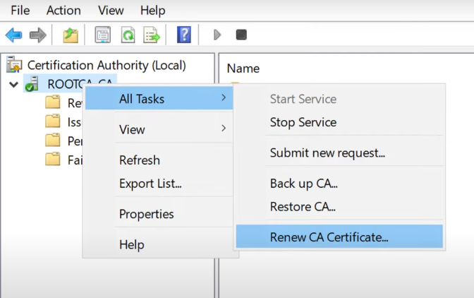
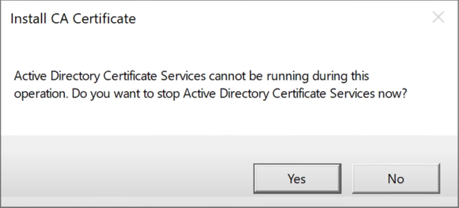
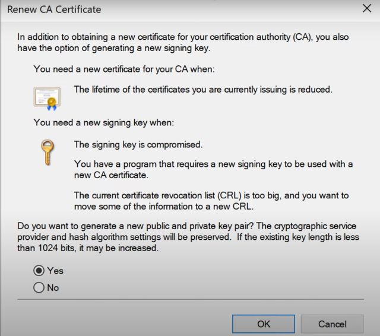

# Renew root CA certificate

A root CA is the top of the public key infrastructure (PKI) and issues its own self-signed certificate. Renewing the root CA certificate is a critical task to ensure the continued trust and security of your PKI. In this article, learn about how-to renew a root Certification Authority (CA) certificate using either a new or existing key pair. The information is valid for both Enterprise CA and Standalone CA.

## Prerequisites

Before you begin, ensure you complete the following prerequisites:

- Administrative access to the Root CA server.
- Backup of the CA database and private key.
- Understanding of your organization's PKI hierarchy and certificate policies.

## Overview of root CA certificate renewal

When the time comes to renew your root CA certificate, you'll use either your existing public and private key pair, or generate a new public and private key pair. Renewing with an existing pair is the easiest and most straightforward approach. However, there might be a requirement to renew a CA certificate with a new key pair if:

- The CA signing (existing CA key pair) is compromised.
- You have a program that requires a new signing key to be used with a new CA certificate.
- The current certificate revocation list (CRL) is too large, and you want to move some of the information to a new CRL.

The following two sections provide an overview of what changes happen to the certificate when it's renewed using either a new or existing key pair.

### Renew the root CA certificate with existing key pair

When you renew a CA certificate with an existing key pair, the new certificate contains the same public and private key. As a result, all previously issued certificates chain up to the new CA certificate without any changes, and you just replace the old certificate (.crt) file.

>[!NOTE]
>After CA certificate renewal, a new CA certificate doesn't replace a previous CA certificate. Instead, a new file is added and a certificate index is appended to the file name in parentheses. For example, the old certificate has a name: **TestCA.crt**, and the new certificate has the name: **TestCA(1).crt**.

In addition, the new CA certificate has the same **Valid From** value as the old certificate. For example, if the old CA certificate is valid from 08/10/2020 to 08/10/2025, the new certificate is valid from 08/10/2020 to 08/10/2030. The renewal increases the current CA certificate validity period.

Also, the new CA certificate's hash contains the previous certificate's **Thumbprint** value. And the new CA certificate changes the **CA Version**. The CA version extension helps to build the correct chains when a CA has more than one certificate. This extension consists of two values: the **CA Certificate Index**, and the **CA Key Index**. These values are separated by dot, for example: 0.0, 2.1, and 3.3. Each time you renew a CA certificate, the CA Certificate Index increases by 1. Since the key pair remains the same, the **CA Key Index** value doesn't increase. The CA maintains the same CRL, and clients chain previously and newly issued certificates up to new CA certificate. This is because all these client certificates are signed by the same CA signing key, and both CA certificates produce the same signature for the identical data.

### Renew the root CA certificate with new key pair

Renewal with a new key pair is more complex, and includes many changes in the CA certificate. A new public key produces a different **Subject Key Identifier**, which is the hash of public key. When the CA issues a new certificate, it gives a certificate a **Subject Key Identifier** value to an issued certificate **Authority Key Identifier** extension. The extension comparison is used by the certificate chaining engine (CCE). As a result, the previously issued certificates chain up to the previous CA certificate, and newly issued certificates chain up to the new CA certificate respectively.

And, a new CRL is generated. The new CRL contains only those revoked certificates that were signed using the renewed CA certificate, or signing key, and the new CRL file contains the CRL suffix. For example, the old CRL has the name **TestCA.crl**, and the new CRL has the name: **TestCA(1).crl**. This CRL suffix is maintained by the **CRLNameSuffix** variable in CDP location settings and the number always equals the CA Version extension value.

>[!NOTE]
>Unlike CA Certificate Index value, the CA Key Index doesn't always increase by 1, but is set to the CA Certificate Index value. For example, the previous CA certificate has CA Version extension as 2.0, and the new CA certificate CA Version extension has the value: 3.3.

When you use the new root CA certificate, but it isn't deployed to all clients yet, Windows CA generates two cross-certificates. The first cross-certificate is signed by the previous CA signing key and certifies the new CA certificate. Certification direction is determined by numbers in parentheses. In our case one cross-certification will have (0-1) suffix.

By using cross-certification, CCE constructs certification paths for previously and newly  issued certificates, so both paths chain up to only the previous CA certificate, because new CA certificate isn't deployed yet. To chain both paths to a new CA certificate, when the new CA certificate is deployed, and you're ready to remove the old CA certificate from clients, another cross-certificate is generated. In that case, the new CA certificate certifies the previous CA certificate. This direction is shown in the file name parentheses: (1-0).

By using these cross-certificates, you maintain only one root CA certificate with the ability to build correct chains for any certificate issued by this CA before and after CA certification renewal with new key pair.

Once you have deployed the new CA certificate to clients, it must be published to the Trusted Root CAs container on the client computer, and only then you may remove the previous CA certificate from clients. Although, it's not recommended to remove old CA certificates, because they can be used during file digital signature validation.

## How to renew the root CA certificate

This section describes the steps to renew a root CA certificate.

### Step 1: Back up the root CA

Start by making a full backup of your root CA, including the CA database and private keys. This is crucial in case something goes wrong, and you need to roll back changes.

1. From Server Manager, select **Tools**, then **Certification Authority**.
1. Right-click the CA name, select **All Tasks**, and then **Back up CA...**.
1. Follow the wizard to back up the CA database and private key.

### Step 2: Renew the root CA certificate

1. From Server Manager, select **Tools**, then **Certification Authority**.
1. Right-click the CA name, select **All Tasks**, and then **Renew CA Certificate...**.
    
1. A dialog opens and asks if you want to stop Active Directory Certificate Services. Select **Yes**.
    
1. Choose whether to generate a new key pair or use the existing key pair.
    1. Select **Yes** to generate a new key pair.
    1. Select **No** to use the existing key pair.
    
1. View the Properties for the root CA, and then view the new certificate details to confirm it was created successfully.
    

### Step 3: Distribute the new root CA certificate

After renewing the root CA certificate, you must deploy it to the clients to make them trust all certificates issued by the Certification Authority. This process is different depending on whether you're using an Enterprise CA or Standalone CA.

#### Enterprise CA

If you're running an enterprise CA, the root certificate is automatically distributed within the domain. Clients receive it during the refresh of Group Policies. If you want to speed up this process, you can force a refresh using the command prompt: `gpupdate /force`.

#### Standalone CA

With a standalone CA, you have to export the certificate and publish it to all trusted clients. Follow the instructions to [distribute the root certificate via Group Policy](/windows-server/identity/ad-fs/deployment/distribute-certificates-to-client-computers-by-using-group-policy). It might be necessary to manually distribute the new certificate to non-domain-joined devices.

### Post-renewal tasks

After the changes, monitor your environment for any issues related to certificate authentication or trust. Be prepared to troubleshoot and address issues promptly.

- Verify that the new Root CA certificate is trusted by all clients.
- Monitor the CA for any issues related to the renewal process.

## Related content

- [Certification Authority Renewal](/windows/win32/seccrypto/certification-authority-renewal)
- [Microsoft Learn: Active Directory Certificate Services](/windows-server/identity/ad-cs/)
