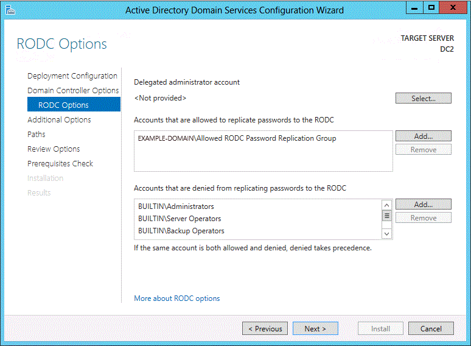

# AD DS Installation and Removal Wizard Page Descriptions

>Applies To: Windows Server 2016, Windows Server 2012 R2, Windows Server 2012

This topic provides descriptions for the controls on the following wizard pages that comprise the AD DS server role installation and removal in Server Manager.  
  
-   [Deployment Configuration](../../ad-ds/deploy/AD-DS-Installation-and-Removal-Wizard-Page-Descriptions.md#BKMK_DepConfigPage)  
  
-   [Domain Controller Options](../../ad-ds/deploy/AD-DS-Installation-and-Removal-Wizard-Page-Descriptions.md#BKMK_DCOptionsPage)  
  
-   [DNS Options](../../ad-ds/deploy/AD-DS-Installation-and-Removal-Wizard-Page-Descriptions.md#BKMK_DNSOptionsPage)  
  
-   [RODC Options](../../ad-ds/deploy/AD-DS-Installation-and-Removal-Wizard-Page-Descriptions.md#BKMK_RODCOptionsPage)  
  
-   [Additional Options](../../ad-ds/deploy/AD-DS-Installation-and-Removal-Wizard-Page-Descriptions.md#BKMK_AdditionalOptionsPage)  
  
-   [Paths](../../ad-ds/deploy/AD-DS-Installation-and-Removal-Wizard-Page-Descriptions.md#BKMK_Paths)  
  
-   [Preparation Options](../../ad-ds/deploy/AD-DS-Installation-and-Removal-Wizard-Page-Descriptions.md#BKMK_AdprepCreds)  
  
-   [Review Options](../../ad-ds/deploy/AD-DS-Installation-and-Removal-Wizard-Page-Descriptions.md#BKMK_ViewInstallOptionsPage)  
  
-   [Prerequisites Check](../../ad-ds/deploy/AD-DS-Installation-and-Removal-Wizard-Page-Descriptions.md#BKMK_PrerqCheckPage)  
  
-   [Results](../../ad-ds/deploy/AD-DS-Installation-and-Removal-Wizard-Page-Descriptions.md#BKMK_Results)  
  
-   [Role Removal credentials](../../ad-ds/deploy/AD-DS-Installation-and-Removal-Wizard-Page-Descriptions.md#BKMK_RemovalCredsPage)  
  
-   [AD DS Removal Options and Warnings](../../ad-ds/deploy/AD-DS-Installation-and-Removal-Wizard-Page-Descriptions.md#BKMK_RemovalOptionsPage)  
  
-   [New Administrator Password](../../ad-ds/deploy/AD-DS-Installation-and-Removal-Wizard-Page-Descriptions.md#BKMK_NewAdminPwdPage)  
  
-   [Confirm Role Removal Selections](../../ad-ds/deploy/AD-DS-Installation-and-Removal-Wizard-Page-Descriptions.md#BKMK_ConfirmRoleRemovalPage)  
  
## Deployment Configuration  
Server Manager begins every domain controller installation with the **Deployment Configuration** page. The remaining options and required fields change on this page and subsequent pages, depending on which deployment operation you select. For example, if you create a new forest, the **Preparation Options** page does not appear, but it does if you install the first domain controller that runs  Windows Server 2012  in an existing forest or domain.  
  
Some validations tests are performed on this page, and again later as part of prerequisite checks. For example, if you try to install the first  Windows Server 2012  domain controller in a forest that has Windows 2000 functional level, an error appears on this page.  
  
The following options appear when you create a new forest.  
  
  
  
-   When you create a new forest, you must specify a name for the forest root domain. The forest root domain name cannot be single-labeled (for example, it must be "contoso.com" instead of "contoso"). It must use allowed DNS domain naming conventions. You can specify an Internationalized Domain Name (IDN). For more information about DNS domain naming conventions, see [KB 909264](https://support.microsoft.com/kb/909264).  
  
-   Do not create new Active Directory forests with the same name as your external DNS name. For example, if your Internet DNS URL is http:\//contoso.com, you must choose a different name for your internal forest to avoid future compatibility issues. That name should be unique and unlikely for web traffic, such as corp.contoso.com.  
  
-   You must be a member of Administrators group on the server where you want to create a new forest.  
  
For more information about how to create a forest, see [Install a New Windows Server 2012 Active Directory Forest &#40;Level 200&#41;](../../ad-ds/deploy/Install-a-New-Windows-Server-2012-Active-Directory-Forest--Level-200-.md).  
  
The following options appear when you create a new domain.  
  
  
  
> [!NOTE]  
> If you create a new tree domain, you need to specify the name of the forest root domain instead of the parent domain, but the remaining wizard pages and options are the same.  
  
-   Click **Select** to browse to the parent domain or Active Directory tree, or type a valid parent domain or tree name. Then type the name of the new domain in **New domain name**.  
  
-   Tree domain: provide a valid, fully qualified root domain name; the name cannot be single-labeled and must use DNS domain name requirements.  
  
-   Child domain: provide a valid, single-label child domain name; the name must use DNS domain name requirements.  
  
-   The Active Directory Domain Services Configuration Wizard prompts you for domain credentials if your current credentials are not from the domain. Click **Change** to provide domain credentials.  
  
For more information about how to create a domain, see [Install a New Windows Server 2012 Active Directory Child or Tree Domain &#40;Level 200&#41;](../../ad-ds/deploy/Install-a-New-Windows-Server-2012-Active-Directory-Child-or-Tree-Domain--Level-200-.md).  
  
The following options appear when you add a new domain controller to an existing domain.  
  
  
  
-   Click **Select** to browse to the domain, or type a valid domain name.  
  
-   Server Manager prompts you for valid credentials if needed. Installing an additional domain controller requires membership in the Domain Admins group.  
  
    In addition, installing the first domain controller that runs  Windows Server 2012  in a forest requires credentials that include group memberships in both the Enterprise Admins and Schema Admins groups. The Active Directory Domain Services Configuration Wizard prompts you later if your current credentials do not have adequate permissions or group memberships.  
  
For more information about how to add a domain controller to an existing domain, see [Install a Replica Windows Server 2012 Domain Controller in an Existing Domain &#40;Level 200&#41;](../../ad-ds/deploy/Install-a-Replica-Windows-Server-2012-Domain-Controller-in-an-Existing-Domain--Level-200-.md).  
  
## Domain Controller Options  
If you are creating a new forest, the Domain Controller Options page has these options:  
  
  
  
-   The forest and domain functional levels are set to  Windows Server 2012  by default.  
  
    There is one new feature available at the  Windows Server 2012  domain functional level: the Support for Dynamic Access Control and Kerberos armoring KDC administrative template policy has two settings (Always provide claims and Fail unarmored authentication requests) that require  Windows Server 2012  domain functional level. For more information, see "Support for claims, compound authentication and Kerberos armoring" in [What's new in Kerberos Authentication](https://technet.microsoft.com/library/hh831747.aspx).    
    The  Windows Server 2012  forest functional level does not provide any new features, but it ensures that any new domain created in the forest will automatically operate at the  Windows Server 2012  domain functional level. The  Windows Server 2012  domain functional level does not provide any new other features beside support for Dynamic Access Control and Kerberos armoring, but it ensures that any domain controller in the domain runs  Windows Server 2012 . For more information about other features that are available at different functional levels, see [Understanding Active Directory Domain Services (AD DS) Functional Levels](../active-directory-functional-levels.md).  
  
    Beyond functional levels, a domain controller that runs  Windows Server 2012  provides additional features that are not available on a domain controller that runs an earlier version of Windows Server. For example, a domain controller that runs  Windows Server 2012  can be used for virtual domain controller cloning, whereas a domain controller that runs an earlier version of Windows Server cannot.  
  
-   DNS server is selected by default when you create a new forest. The first domain controller in the forest must be a global catalog (GC) server, and it cannot be a read only domain controller (RODC).  
  
-   The Directory Services Restore Mode (DSRM) password is needed in order to log on to a domain controller where AD DS is not running. The password you specify must adhere to the password policy applied to the server, which by default does not require a strong password; only a non-blank password. Always choose a strong, complex password or preferably, a passphrase. For information about how to synchronize the DSRM password with the password of a domain user account, see [KB 961320](https://support.microsoft.com/kb/961320).  
  
For more information about how to create a forest, see [Install a New Windows Server 2012 Active Directory Forest &#40;Level 200&#41;](../../ad-ds/deploy/../../ad-ds/deploy/Install-a-New-Windows-Server-2012-Active-Directory-Forest--Level-200-.md).  
  
If you are creating a child domain, the Domain Controller Options page has these options:  
  
  
  
-   The domain functional level is set to  Windows Server 2012  by default. You can specify any other value that is at least the value of the forest functional level or higher.  
  
-   The configurable domain controller options include **DNS server** and **Global Catalog**; you cannot configure read-only domain controller as the first domain controller in a new domain.  
  
    Microsoft recommends that all domain controllers provide DNS and global catalog services for high availability in distributed environments, which is why the wizard enables these options by default when creating a new domain.  
  
-   The **Domain Controller Options** page also enables you to choose the appropriate Active Directory logical **site name** from the forest configuration. By default, it selects the site with the most correct subnet. If there is only one site, it selects that site automatically.  
  
    > [!IMPORTANT]  
    > If the server does not belong to an Active Directory subnet and there is more than one site, nothing is selected and the **Next** button is unavailable until you choose a site from the list.  
  
For more information about how to create a domain, see [Install a New Windows Server 2012 Active Directory Child or Tree Domain &#40;Level 200&#41;](../../ad-ds/deploy/../../ad-ds/deploy/../../ad-ds/deploy/Install-a-New-Windows-Server-2012-Active-Directory-Child-or-Tree-Domain--Level-200-.md).  
  
If you are adding a domain controller to a domain, the Domain Controller Options page has these options:  
  
  
  
-   The configurable domain controller options include **DNS server** and **Global Catalog**, and **Read-only domain controller**.  
  
    Microsoft recommends that all domain controllers provide DNS and global catalog services for high availability in distributed environments, which is why the wizard enables these options by default. For more information about deploying RODCs, see [Read-Only Domain Controller Planning and Deployment Guide](https://technet.microsoft.com/library/cc771744(v=WS.10).aspx).  
  
For more information about how to add a domain controller to an existing domain, see [Install a Replica Windows Server 2012 Domain Controller in an Existing Domain &#40;Level 200&#41;](../../ad-ds/deploy/../../ad-ds/deploy/Install-a-Replica-Windows-Server-2012-Domain-Controller-in-an-Existing-Domain--Level-200-.md).  
  
## DNS Options  
If you install DNS server, the following **DNS Options** page appears:  
  
  
  
When you install DNS server, delegation records that point to the DNS server as authoritative for the zone should be created in the parent Domain Name System (DNS) zone. Delegation records transfer name resolution authority and provide correct referral to other DNS servers and clients of the new servers that are being made authoritative for the new zone. These resource records include the following:  
  
-   A name server (NS) resource record to effect the delegation. This resource record advertises that the server named ns1.na.example.microsoft.com is an authoritative server for the delegated subdomain.  
  
-   A host (A or AAAA) resource record also known as a glue record must be present to resolve the name of the server that is specified in the name server (NS) resource record to its IP address. The process of resolving the host name in this resource record to the delegated DNS server in the name server (NS) resource record is sometimes referred to as "glue chasing."  
  
You can have the Active Directory Domain Services Configuration Wizard create them automatically. The wizard verifies that the appropriate records exist in the parent DNS zone after you click **Next** on the **Domain Controller Options** page. If the wizard cannot verify that the records exist in the parent domain, the wizard provides you with the option to create a new DNS delegation for a new domain (or update the existing delegation) automatically and continue with the new domain controller installation.  
  
Alternatively, you can create these DNS delegation records before you install DNS server. To create a zone delegation, open **DNS Manager**, right-click the parent domain, and then click **New Delegation**. Follow the steps in the New Delegation Wizard to create the delegation.  
  
The installation process tries to create the delegation to ensure that computers in other domains can resolve DNS queries for hosts, including domain controllers and member computers, in the DNS subdomain. Note that the delegation records can be automatically created only on Microsoft DNS servers. If the parent DNS domain zone resides on third party DNS servers such as BIND, a warning about the failure to create DNS delegation records appears on the Prerequisites check page. For more information about the warning, see [Known issues for installing AD DS](https://technet.microsoft.com/library/cc754463(v=WS.10).aspx).  
  
Delegations between the parent domain and the subdomain being promoted can be created and validated before or after the installation. There is no reason to delay the installation of a new domain controller because you cannot create or update the DNS delegation.  
  
For more information about delegation, see [Understanding Zone Delegation](https://go.microsoft.com/fwlink/?LinkId=164773) (https://go.microsoft.com/fwlink/?LinkId=164773). If zone delegation is not possible in your situation, you might consider other methods for providing name resolution from other domains to the hosts in your domain. For example, the DNS administrator of another domain could configure conditional forwarding, stub-zones, or secondary zones in order to resolve names in your domain. For more information, see the following topics:  
  
-   [Understanding zone types](https://go.microsoft.com/fwlink/?LinkID=157399) (https://go.microsoft.com/fwlink/?LinkID=157399)  
  
-   [Understanding stub zones](https://go.microsoft.com/fwlink/?LinkId=164776) (https://go.microsoft.com/fwlink/?LinkId=164776)  
  
-   [Understanding forwarders](https://go.microsoft.com/fwlink/?LinkId=164778) (https://go.microsoft.com/fwlink/?LinkId=164778)  
  
## RODC Options  
The following options appear when you install a read-only domain controller (RODC).  
  
  
  
-   Delegated administrator accounts gain local administrative permissions to the RODC. These users can operate with privileges equivalent to the local computer's Administrators group. They are not members of the Domain Admins or the domain built-in Administrators groups. This option is useful for delegating branch office administration without giving out domain administrative permissions. Configuring delegation of administration is not required. For more information, see [Administrator Role Separation](https://technet.microsoft.com/library/cc753170(v=WS.10).aspx).  
  
-   The Password Replication Policy acts as an access control list (ACL). It determines if an RODC should be permitted to cache a password. After the RODC receives an authenticated user or computer logon request, it refers to the Password Replication Policy to determine if the password for the account should be cached. The same account can then perform subsequent logons more efficiently.  
  
    The Password Replication Policy (PRP) lists the accounts whose passwords are allowed to be cached, and accounts whose passwords are explicitly denied from being cached. The list of user and computer accounts that are permitted to be cached does not imply that the RODC has necessarily cached the passwords for those accounts. An administrator can, for example, specify in advance any accounts that an RODC will cache. This way, the RODC can authenticate those accounts, even if the WAN link to the hub site is offline.  
  
    Any users or computers who are not allowed (including implicit) or denied do not cache their password. If those users or computers do not have access to a writable domain controller, they cannot access AD DS-provided resources or functionality. For more information about the PRP, see [Password Replication Policy](https://technet.microsoft.com/library/cc730883(v=ws.10).aspx). For more information about managing the PRP, see [Administering the Password Replication Policy](https://technet.microsoft.com/library/rodc-guidance-for-administering-the-password-replication-policy(v=ws.10).aspx).  
  
For more information about installing RODCs, see [Install a Windows Server 2012 Active Directory Read-Only Domain Controller &#40;RODC&#41; &#40;Level 200&#41;](../../ad-ds/deploy/RODC/Install-a-Windows-Server-2012-Active-Directory-Read-Only-Domain-Controller--RODC---Level-200-.md).  
  
## Additional Options  
The following option appears on the **Additional Options** page if you are creating a new domain:  
  
  
  
The following options appear on the **Additional Options** page if you install an additional domain controller in an existing domain:  
  
  
  
-   You can either specify a domain controller as the replication source, or allow the wizard to choose any domain controller as the replication source.  
  
-   You can also choose to install the domain controller using backed up media using the Install from media (IFM) option. If the installation media is stored locally, the **Install from media Path** option allows you to browse to the file location. The browse option is not available for a remote installation. You can click **Verify** to ensure the provided path is valid media. Media used by the IFM option must be created with Windows Server Backup or Ntdsutil.exe from another existing  Windows Server 2012  computer only; you cannot use a Windows Server 2008 R2 or previous operating system to create media for a  Windows Server 2012  domain controller. If the media is protected with a SYSKEY, Server Manager prompts for the image's password during verification.  
  
For more information about how to create a domain, see [Install a New Windows Server 2012 Active Directory Child or Tree Domain &#40;Level 200&#41;](../../ad-ds/deploy/../../ad-ds/deploy/../../ad-ds/deploy/Install-a-New-Windows-Server-2012-Active-Directory-Child-or-Tree-Domain--Level-200-.md). For more information about how to add a domain controller to an existing domain, see [Install a Replica Windows Server 2012 Domain Controller in an Existing Domain &#40;Level 200&#41;](../../ad-ds/deploy/../../ad-ds/deploy/Install-a-Replica-Windows-Server-2012-Domain-Controller-in-an-Existing-Domain--Level-200-.md).  
  
## Paths  
The following options appear on the **Paths** page.  
  
  
  
-   The **Paths** page enables you to override the default folder locations of the AD DS database, the database transaction logs, and the SYSVOL share. The default locations are always in %systemroot%.  
  
Specify the location for the AD DS database (NTDS.DIT), log files, and SYSVOL. For a local installation, you can browse to the location where you want to store the files.  
  
## Preparation Options  
  
  
If you are not currently logged on with sufficient credentials to run adprep.exe commands and adprep is required to run in order to complete the AD DS installation, you are prompted to supply credentials to run adprep.exe. Adprep is required to run in order to add the first domain controller that runs  Windows Server 2012  to an existing domain or forest. More specifically:  
  
-   Adprep /forestprep must be run to add the first domain controller that runs  Windows Server 2012  to an existing forest. This command must be run by a member of the Enterprise Admins group, the Schema Admins group, and the Domain Admins group of the domain that hosts the schema master. For this command to complete successfully, there must be connectivity between the computer where you run the command and the schema master for the forest.  
  
-   Adprep /domainprep must be run to add the first domain controller that runs  Windows Server 2012  to an existing domain. This command must be run by a member of the Domain Admins group of the domain where you are installing the domain controller that runs  Windows Server 2012 . For this command to complete successfully, there must be connectivity between the computer where you run the command and the infrastructure master for the domain.  
  
-   Adprep /rodcprep must be run to add the first RODC to an existing forest. This command must be run by a member of the Enterprise Admins group. For this command to complete successfully, there must be connectivity between the computer where you run the command and the infrastructure master for each application directory partition in the forest.  
  
For more information about Adprep.exe, see [Adprep.exe integration](../../ad-ds/deploy/What-s-New-in-Active-Directory-Domain-Services-Installation-and-Removal.md#BKMK_NewAdprep) and see [Running Adprep.exe](https://technet.microsoft.com/library/dd464018(WS.10).aspx).  
  
## Review Options  
  
  
-   The **Review Options** page enables you to validate your settings and ensure that they meet your requirements before you start the installation. This is not the last opportunity to stop the installation using Server Manager. This page simply enables you to review and confirm your settings before continuing the configuration.  
  
-   The **Review Options** page in Server Manager also offers an optional **View Script** button to create a Unicode text file that contains the current ADDSDeployment configuration as a single Windows PowerShell script. This enables you to use the Server Manager graphical interface as a Windows PowerShell deployment studio. Use the Active Directory Domain Services Configuration Wizard to configure options, export the configuration, and then cancel the wizard. This process creates a valid and syntactically correct sample for further modification or direct use.  
  
## Prerequisites Check  
  
  
Some of the warnings that appear on this page include:  
  
-   Domain controllers that run  Windows Server 2008  or later have a default setting for "Allow cryptography algorithms compatible with Windows NT 4" that prevents weaker cryptography algorithms when establishing secure channel sessions. For more information about the potential impact and a workaround, see KB article [942564](https://support.microsoft.com/kb/942564).  
  
-   DNS delegation could not be created or updated. For more information, see [DNS Options](../../ad-ds/deploy/../../ad-ds/deploy/../../ad-ds/deploy/../../ad-ds/deploy/../../ad-ds/deploy/../../ad-ds/deploy/../../ad-ds/deploy/../../ad-ds/deploy/../../ad-ds/deploy/../../ad-ds/deploy/../../ad-ds/deploy/../../ad-ds/deploy/../../ad-ds/deploy/../../ad-ds/deploy/../../ad-ds/deploy/AD-DS-Installation-and-Removal-Wizard-Page-Descriptions.md#BKMK_DNSOptionsPage).  
  
-   The prerequisite check requires WMI calls. They can fail if they are blocked firewall rules block, and return an RPC server unavailable error.  
  
For more information about the specific prerequisite checks that are performed for AD DS installation, see [Prerequisite Tests](../../ad-ds/manage/AD-DS-Simplified-Administration.md#BKMK_ADDSInstallPrerequisiteTests).  
  
## Results  
  
  
On this page, you can review the results of the installation.  
  
You can also select to restart the target server after the wizard completes, but if the installation succeeds, the server will always restart regardless of whether you select that option. In some cases after the wizard completes on a target server that was not joined to the domain before the installation, the system state of the target server can make the server unreachable on the network, or the system state can prevent you from having permissions to manage the remote server.  
  
If the target server fails to restart in this case, you must manually restart it. Tools such as shutdown.exe or Windows PowerShell cannot restart it. You can use Remote Desktop Services to log on and remotely shut down the target server.  
  
## Role Removal credentials  
  
  
You configure demotion options on the **Credentials** page. Provide the credentials necessary to perform the demotion from the following list:  
  
-   Demoting an additional domain controller requires Domain Admin credentials. Selecting **Force removal of the domain controller** demotes the domain controller without removing the domain controller object's metadata from Active Directory.  
  
    > [!IMPORTANT]  
    > Do not select this option unless the domain controller cannot contact other domain controllers and there is *no reasonable way* to resolve that network issue. Forced demotion leaves orphaned metadata in Active Directory on the remaining domain controllers in the forest. In addition, all un-replicated changes on that domain controller, such as passwords or new user accounts, are lost forever. Orphaned metadata is the root cause in a significant percentage of Microsoft Customer Support cases for AD DS, Exchange, SQL, and other software. If you forcibly demote a domain controller, you *must* manually perform metadata cleanup immediately. For steps, review [Clean Up Server Metadata](https://technet.microsoft.com/library/cc816907(WS.10).aspx).  
  
-   Demoting the last domain controller in a domain requires Enterprise Admins group membership, as this removes the domain itself (if this is the last domain in the forest, this removes the forest). Server Manager informs you if the current domain controller is the last domain controller in the domain. Select **Last domain controller in the domain** to confirm the domain controller is the last domain controller in the domain.  
  
For more information about removing AD DS, see [Remove Active Directory Domain Services (Level 100)](assetId:///99b97af0-aa7e-41ed-8c81-4eee6c03eb4c) and [Demoting Domain Controllers and Domains &#40;Level 200&#41;](Demoting-Domain-Controllers-and-Domains--Level-200-.md).  
  
## AD DS Removal Options and Warnings  
If you need help with the Review Options page, see Review Options  
  
If the domain controller hosts additional roles, such as DNS server role or global catalog server, the following Warning page appears:  
  
  
  
You must click **Proceed with removal** in order to acknowledge that the additional roles will no longer be available before you can click **Next** to continue.  
  
If you force the removal of a domain controller, any Active Directory object changes that have not replicated to other domain controllers in the domain will be lost. Additionally, if the domain controller hosts operation master roles, the global catalog, or DNS server role, critical operations in the domain and forest may be impacted as follows. Before you remove a domain controller that hosts any operations master role, try to transfer the role to another domain controller. If it is not possible to transfer the role, first remove Active Directory Domain Services from this computer, and then use Ntdsutil.exe to seize the role. Use Ntdsutil on the domain controller that you plan to seize the role to; if possible, use a recent replication partner in the same site as this domain controller. For more information about transferring and seizing operations master roles, see [article 255504](https://go.microsoft.com/fwlink/?LinkId=80395) in the Microsoft Knowledge Base. If the wizard cannot determine if the domain controller host an operations master role, run netdom.exe command to determine whether this domain controller performs any operations master roles.  
  
-   Global catalog: Users might have trouble logging on to domains in the forest. Before you remove a global catalog server, ensure that enough global catalog servers are in this forest and site to service user logons. If necessary, designate another global catalog server and update clients and applications with the new information.  
  
-   DNS server: All of the DNS data that is stored in Active Directory-integrated zones will be lost. After you remove AD DS, this DNS server will not be able to perform name resolution for the DNS zones that were Active Directory-integrated. Therefore, we recommend that you update the DNS configuration of all computers that currently refer to the IP address of this DNS server for name resolution with the IP address of a new DNS server.  
  
-   Infrastructure master: clients in the domain might have difficulty locating objects in other domains. Before you continue, transfer the infrastructure master role to a domain controller that is not a global catalog server.  
  
-   RID master: you might have problems creating new user accounts, computer accounts, and security groups. Before you continue, transfer the RID master role to a domain controller in the same domain as this domain controller.  
  
-   Primary domain controller (PDC) emulator: operations that are performed by the PDC emulator, such as Group Policy updates and password resets for non-AD DS accounts, will not function properly. Before you continue, transfer the PDC emulator master role to a domain controller that is in the same domain as this domain controller.  
  
-   Schema master: you will no longer be able to modify the schema for this forest. Before you continue, transfer the schema master role to a domain controller in the root domain in the forest.  
  
-   Domain naming master: you will no longer be able to add domains to or remove domains from this forest. Before you continue, transfer the domain naming master role to a domain controller in the root domain in the forest.  
  
-   All application directory partitions on this Active Directory domain controller will be removed. If a domain controller holds the last replica of one or more application directory partitions, when the removal operation is complete, those partitions will no longer exist.  
  
Be aware that the domain will no longer exist after you uninstall Active Directory Domain Services from the last domain controller in the domain.  
  
If the domain controller is a DNS server that is delegated to host the DNS zone, the following page will provide the option to remove the DNS server from the DNS zone delegation.  
  
  
  
For more information about removing AD DS, see [Remove Active Directory Domain Services (Level 100)](assetId:///99b97af0-aa7e-41ed-8c81-4eee6c03eb4c) and [Demoting Domain Controllers and Domains &#40;Level 200&#41;](Demoting-Domain-Controllers-and-Domains--Level-200-.md).  
  
## New Administrator Password  
The **New Administrator Password** page requires you to provide a password for the built-in local computer's Administrator account, once the demotion completes and the computer becomes a domain member server or workgroup computer.  
  
  
  
For more information about removing AD DS, see [Remove Active Directory Domain Services (Level 100)](assetId:///99b97af0-aa7e-41ed-8c81-4eee6c03eb4c) and [Demoting Domain Controllers and Domains &#40;Level 200&#41;](Demoting-Domain-Controllers-and-Domains--Level-200-.md).  
  
## Review Options  
The **Review Options** page provides you the chance to export the configuration settings for demotion to a Windows PowerShell script so you can automate additional demotions. Click **Demote** to remove AD DS.  
  
  
  

