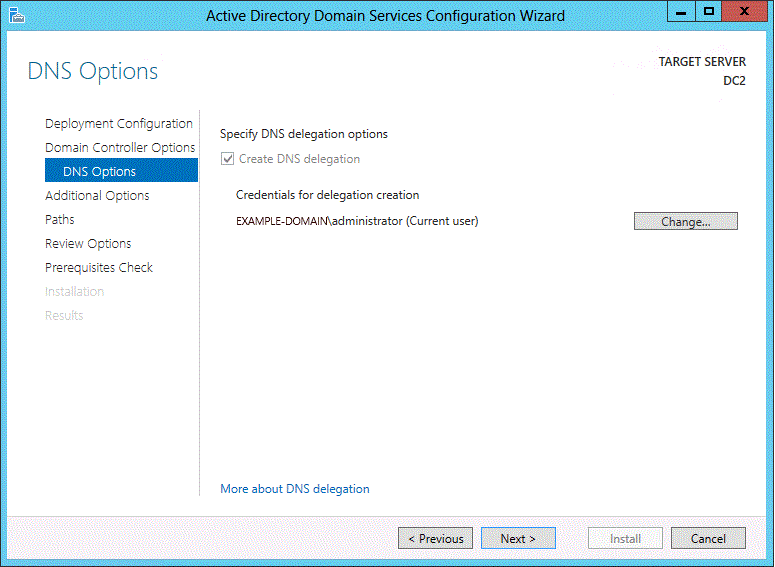
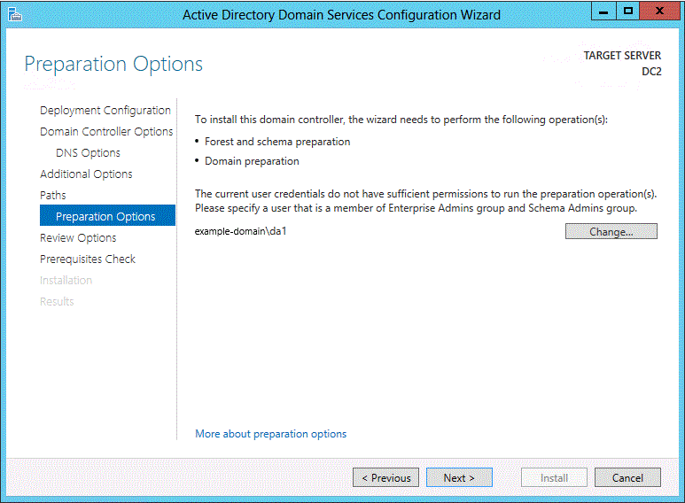
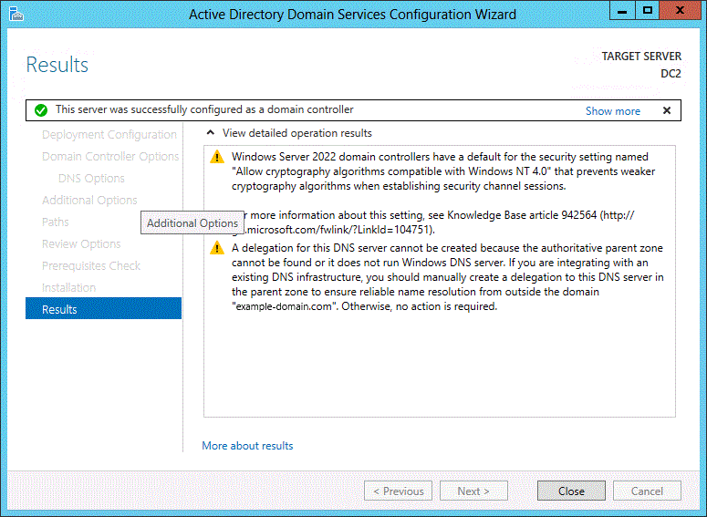

# Active Directory Domain Services (AD DS) installation and removal wizard page descriptions

In Server Manager, you can use the Active Directory Domain Services Configuration Wizard to promote a server to a domain controller and to demote a server. This article describes the controls on the following pages in that wizard.

- For promoting a server to a domain controller:
  - [Deployment Configuration](#BKMK_DepConfigPage)
  - [Domain Controller Options](#BKMK_DCOptionsPage)
  - [DNS Options](#BKMK_DNSOptionsPage)
  - [RODC Options](#BKMK_RODCOptionsPage)
  - [Additional Options](#BKMK_AdditionalOptionsPage)
  - [Paths](#BKMK_Paths)
  - [Preparation Options](#BKMK_AdprepCreds)
  - [Review Options](#BKMK_ViewInstallOptionsPage)
  - [Prerequisites Check](#BKMK_PrerqCheckPage)
  - [Results](#BKMK_Results)
- For demoting a domain controller:
  - [Credentials](#BKMK_RemovalCredsPage)
  - [Warnings](#BKMK_RemovalOptionsPage)
  - [Removal Options](#removal-options)
  - [New Administrator Password](#BKMK_NewAdminPwdPage)
  - [Review Options](#BKMK_ConfirmRoleRemovalPage)

## Promote a server to a domain controller

The following sections describe the pages that you see when you use the Active Directory Domain Services Configuration Wizard to promote a server to a domain controller.

### Deployment Configuration

Server Manager begins every domain controller installation with the **Deployment Configuration** page. The options and required fields that you see on this page and subsequent pages depend on which deployment operation you select. For example, if you create a forest, the **Preparation Options** page doesn't appear. But if you install the first domain controller that runs Windows Server 2012  in an existing forest or domain, that page does appear.

Some validations and tests are run on this page, and again later as part of prerequisite checks. For example, a check is performed when you try to install the first Windows Server domain controller in a forest. If the functional level of the forest doesn't support the Windows Server version of the domain controller, an error appears on this page.

The following sections describe the deployment operations that you can select on this page.

#### Create a forest

The following screenshot shows the options that appear when you create a forest:

- When you create a forest, you must specify a name for the forest root domain.
  - The forest root domain name can't be single-labeled. For example, it must be `contoso.com` instead of `contoso`.
  - It must use allowed Domain Name System (DNS) domain naming conventions. For more information about DNS domain naming conventions, see [Naming conventions in Active Directory for computers, domains, sites, and OUs](/troubleshoot/windows-server/active-directory/naming-conventions-for-computer-domain-site-ou).
  - You can specify an internationalized domain name (IDN).

- The name of any Active Directory forest that you create must be different than your external DNS name. For example, if your internet DNS URL is `https://contoso.com`, you must choose a different name for your internal forest to avoid future compatibility issues. That name should be unique and unlikely for web traffic, such as `corp.contoso.com`.

- You must be a member of Administrators group on the server that you want to create a forest on.

For more information about how to create a forest, see [Install a New Windows Server 2012 Active Directory Forest &#40;Level 200&#41;](./Install-a-New-Windows-Server-2012-Active-Directory-Forest--Level-200-.md).

#### Create a domain

The following screenshot shows the options that appear when you create a domain:

> [!NOTE]
> If you create a tree domain, you need to specify the name of the forest root domain instead of the parent domain. But the remaining wizard pages and options are the same whether you create a child domain or a tree domain.

- For **Parent domain name**, select **Select** to go to the parent domain or Active Directory tree, or enter a valid parent domain or tree name.

- For **New domain name**, enter the name of the new domain.
  - For a tree domain, provide a valid, fully qualified root domain name. The name can't be single-labeled, and it must meet DNS domain name requirements.
  - For a child domain, provide a valid, single-label child domain name. The name must meet DNS domain name requirements.

- If your current credentials aren't from the domain, the Active Directory Domain Services Configuration Wizard prompts you for domain credentials. Select **Change** to provide domain credentials.

For more information about how to create a domain, see [Install a New Windows Server 2012 Active Directory Child or Tree Domain &#40;Level 200&#41;](./Install-a-New-Windows-Server-2012-Active-Directory-Child-or-Tree-Domain--Level-200-.md).

#### Add a domain controller to an existing domain

The following screenshot shows you the options that appear when you add a new domain controller to an existing domain:

- For **Domain**, select **Select** to go to the domain, or enter a valid domain name.

- If needed, Server Manager prompts you for valid credentials. Installing an additional domain controller requires membership in the Domain Admins group.

  Also, installing the first domain controller that runs Windows Server in a forest requires credentials that include group memberships in both the Enterprise Admins and Schema Admins groups. The Active Directory Domain Services Configuration Wizard prompts you later if your current credentials don't have adequate permissions or group memberships.

For more information about how to add a domain controller to an existing domain, see [Install a Replica Windows Server 2012 Domain Controller in an Existing Domain &#40;Level 200&#41;](./Install-a-Replica-Windows-Server-2012-Domain-Controller-in-an-Existing-Domain--Level-200-.md).

### Domain Controller Options

The options that you see on the **Domain Controller Options** page depend on your deployment operation. The following sections describe the options that you configure for each operation.

#### New forest options

When you create a forest, the **Domain Controller Options** page displays the options shown in the following screenshot:

- The default values of the forest and domain functional levels depend on your Windows Server version.

  Starting with the Windows Server 2012 version, the domain functional level offers the following settings in the key distribution center (KDC) administrative template policy **KDC support for claims, compound authentication, and Kerberos armoring**:

  - Always provide claims
  - Fail unarmored authentication requests

  For more information, see [Support for claims, compound authentication, and Kerberos armoring](s/previous-versions/windows/it-pro/windows-server-2012-R2-and-2012/hh831747(v=ws.11)#support-for-claims-compound-authentication-and-kerberos-armoring).

  Any domains that you create in a forest automatically operate at the domain functional level that corresponds to the same version of Windows Server as the selected forest functional level. Also, any domain controllers in the domain run the version of Windows Server that corresponds to the selected domain functional level.

  For more information about features that are available at various functional levels, see [Understanding Active Directory Domain Services (AD DS) Functional Levels](../active-directory-functional-levels.md).

  The features that are available on a domain controller depend on the version of Windows Server that the domain controller runs.

- When you create a forest, the **Domain Name System (DNS) server** option is selected by default. The first domain controller in the forest must be a global catalog (GC) server, and it can't be a read-only domain controller (RODC).

- To sign in to a domain controller that's not running AD DS, you need the Directory Services Restore Mode (DSRM) password. The password you specify must adhere to the password policy applied to the server. By default, that policy doesn't require a strong password. It only requires a non-blank password. Always choose a strong, complex password or preferably, a passphrase. For information about how to synchronize the DSRM password with the password of a domain user account, see a [support article about synchronizing the passwords](https://support.microsoft.com/topic/a-feature-is-available-for-windows-server-2008-that-lets-you-synchronize-the-dsrm-administrator-password-with-a-domain-user-account-a9a2ef06-2771-b0d4-6cd3-e1fe836f69e1).

For more information about how to create a forest, see [Install a New Windows Server 2012 Active Directory Forest &#40;Level 200&#41;](./Install-a-New-Windows-Server-2012-Active-Directory-Forest--Level-200-.md).

#### New child domain options

When you create a child domain, the **Domain Controller Options** page displays the options shown in the following screenshot:

- The default value of the domain functional level depends on your Windows Server version. You can specify any value that's equal to or greater than the forest functional level.

- You can configure the following domain controller options:
  - **Domain Name System (DNS) server**
  - **Global Catalog (GC)**
  
  You can't configure the first domain controller in a new domain to be an RODC.

  We recommend that all domain controllers provide DNS and global catalog services for high availability in distributed environments. For this reason, the wizard enables these options by default when you create a domain.

- You can also use this page to select an appropriate Active Directory logical site name from the forest configuration. By default, the site with the most correct subnet is selected. If there's only one site, that site is automatically selected.

  > [!IMPORTANT]
  > If the server doesn't belong to an Active Directory subnet and there's more than one site, nothing is selected. The **Next** button isn't available until you select a site from the list.

For more information about how to create a domain, see [Install a New Windows Server 2012 Active Directory Child or Tree Domain &#40;Level 200&#41;](./Install-a-New-Windows-Server-2012-Active-Directory-Child-or-Tree-Domain--Level-200-.md).

#### Options for adding a domain controller to a domain

When you add a domain controller to a domain, the **Domain Controller Options** page displays the options shown in the following screenshot:

You can configure the following domain controller options:

- **Domain Name System (DNS) server**
- **Global Catalog (GC)**
- **Read only domain controller (RODC)**

We recommend that all domain controllers provide DNS and global catalog services for high availability in distributed environments. For this reason, these options are enabled by default. For more information about deploying RODCs, see [Read-Only Domain Controller Planning and Deployment Guide](/previous-versions/windows/it-pro/windows-server-2008-R2-and-2008/cc771744(v=ws.10)).

For more information about how to add a domain controller to an existing domain, see [Install a Replica Windows Server 2012 Domain Controller in an Existing Domain &#40;Level 200&#41;](./Install-a-Replica-Windows-Server-2012-Domain-Controller-in-an-Existing-Domain--Level-200-.md).

### DNS Options

If you install the DNS server role, the following **DNS Options** page appears:

When you install the DNS server role, delegation records that point to the DNS server as authoritative for the zone should be created in the parent DNS zone. Delegation records transfer name resolution authority. They also provide correct referral to other DNS servers and clients of new servers that are authoritative for the new zone. These resource records include the following records:

- A name server (NS) resource record to effect the delegation. This resource record advertises that the server named `ns1.na.example.microsoft.com` is an authoritative server for the delegated subdomain.
- A host (A or AAAA) resource record, which is also known as a glue record. This record must be present to resolve the name of the server that's specified in the NS resource record to its IP address. The process of resolving the host name in this resource record to the delegated DNS server in the NS resource record is sometimes referred to as *glue chasing*.

You can have the Active Directory Domain Services Configuration Wizard create these records automatically. On the **Domain Controller Options** page, if you select **Next**, the wizard verifies that the appropriate records exist in the parent DNS zone. If the wizard can't verify that the records exist in the parent domain, the wizard provides you with the option to create a DNS delegation for a new domain (or update the existing delegation) automatically and continue with the new domain controller installation.

Alternatively, you can create these DNS delegation records before you install the DNS server role. To create a zone delegation, open **DNS Manager**, right-click the parent domain, and then select **New Delegation**. Follow the steps in the New Delegation Wizard to create the delegation.

The installation process tries to create the delegation to ensure that computers in other domains can resolve DNS queries for hosts, including domain controllers and member computers, in the DNS subdomain. The delegation records can be automatically created only on Microsoft DNS servers. If the parent DNS domain zone resides on third-party DNS servers such as Berkeley Internet Name Domain (BIND) servers, a warning about the failure to create DNS delegation records appears on the **Prerequisites Check** page. For more information about the warning, see [Known issues for installing AD DS](/previous-versions/windows/it-pro/windows-server-2008-R2-and-2008/cc754463(v=ws.10)).

Delegations between the parent domain and the subdomain being promoted can be created and validated before or after the installation. There's no reason to delay the installation of a new domain controller because you can't create or update the DNS delegation.

For more information about delegation, see [Understanding Zone Delegation](/previous-versions/windows/it-pro/windows-server-2008-R2-and-2008/cc771640(v=ws.11)) (https://go.microsoft.com/fwlink/?LinkId=164773). If zone delegation isn't possible in your situation, you can consider other methods for providing name resolution from other domains to the hosts in your domain. For example, the DNS administrator of another domain can configure conditional forwarding, stub-zones, or secondary zones in order to resolve names in your domain. For more information, see the following resources:

- [Understanding zone types](/previous-versions/windows/it-pro/windows-server-2008-R2-and-2008/cc771898(v=ws.11)) (https://go.microsoft.com/fwlink/?LinkID=157399)
- [Understanding stub zones](/previous-versions/windows/it-pro/windows-server-2003/cc779197(v=ws.10)) (https://go.microsoft.com/fwlink/?LinkId=164776)
- [Understanding forwarders](/previous-versions/windows/it-pro/windows-server-2003/cc782142(v=ws.10)) (https://go.microsoft.com/fwlink/?LinkId=164778)

### RODC Options

The following screenshot shows the options that appear when you install a RODC.

- You can use the **Delegated administrator account** option to specify the accounts that are assigned local administrative permissions to the RODC. These users can operate with privileges equivalent to the local computer's Administrators group. They aren't members of the Domain Admins or the domain built-in Administrators groups. This option is useful for delegating branch office administration without granting domain administrative permissions. Configuring delegation of administration isn't required. For more information, see [Administrator Role Separation](/previous-versions/windows/it-pro/windows-server-2008-R2-and-2008/cc753170(v=ws.10)).

- You can use the remaining options on the page to configure the password replication policy, which acts as an access control list (ACL). This policy determines whether an RODC can cache a password. After the RODC receives an authenticated user or computer sign-in request, it refers to the password replication policy to determine whether the password for the account should be cached. The same account can then perform subsequent sign-ins more efficiently.

  The password replication policy (PRP) lists two types of accounts:

  - Accounts that have passwords that can be cached
  - Accounts that have passwords that are explicitly denied from being cached

  If a user or computer account is on the list of accounts that can be cached, the RODC hasn't necessarily cached the password for that account. For example, an administrator can specify in advance the accounts that an RODC should cache. When an account is cached, the RODC can authenticate it even if the WAN link to the hub site is offline.

  The passwords aren't cached for any user or computer accounts that aren't denied or allowed, explicitly or implicitly. If those users or computers don't have access to a writable domain controller, they can't access AD DS-provided resources or functionality. For more information about the PRP, see [Password Replication Policy](/previous-versions/windows/it-pro/windows-server-2008-R2-and-2008/cc730883(v=ws.10)). For more information about managing the PRP, see [Administering the Password Replication Policy](/previous-versions/windows/it-pro/windows-server-2008-R2-and-2008/cc754646(v=ws.10)).

For more information about installing RODCs, see [Install a Windows Server 2012 Active Directory Read-Only Domain Controller &#40;RODC&#41; &#40;Level 200&#41;](./RODC/Install-a-Windows-Server-2012-Active-Directory-Read-Only-Domain-Controller--RODC---Level-200-.md).

### Additional Options

The following screenshot shows the option that appears on the **Additional Options** page when you create a domain:

The following screenshot shows the options that appear on the **Additional Options** page when you add a domain controller to an existing domain:

- You can use the **Replicate from** option to specify a domain controller as the replication source, or to allow the wizard to choose any domain controller as the replication source.

- You can use the **Install from media** option to specify a backed-up media source to use to install the domain controller. If the installation media is stored locally, you can use the **Path** option to select to the file location. This option isn't available for a remote installation. You can select **Verify** to ensure the provided path is valid media. You must create the media that you use for this option by using Windows Server Backup or `ntdsutil.exe` from another existing Windows Server computer. You can't use an operating system earlier than Windows Server 2012 to create media for the domain controller.

For more information about how to create a domain, see [Install a New Windows Server 2012 Active Directory Child or Tree Domain &#40;Level 200&#41;](./Install-a-New-Windows-Server-2012-Active-Directory-Child-or-Tree-Domain--Level-200-.md). For more information about how to add a domain controller to an existing domain, see [Install a Replica Windows Server 2012 Domain Controller in an Existing Domain &#40;Level 200&#41;](./Install-a-Replica-Windows-Server-2012-Domain-Controller-in-an-Existing-Domain--Level-200-.md).

### Paths

The following screenshot shows the options that appear on the **Paths** page:

You can use the **Paths** page to override the default folder locations of the AD DS database (NTDS.DIT), the database transaction logs, and the SYSVOL share. The default locations are always in the `%systemroot%` folder. For a local installation, you can select a location for storing the files.

### Preparation Options

The following screenshot shows the **Preparation Options** page:

This page prompts you to supply credentials to run `adprep.exe`. The wizard displays this page when both of the following conditions are met:

- You're not currently signed in with sufficient credentials to run `adprep.exe` commands.
- In order to complete the AD DS installation, `adprep.exe` is required to run.

The `adprep.exe` tool is required to run in the following situations:

- You must run `adprep /forestprep` to add the first domain controller that runs Windows Server to an existing forest. To run this command, you must be a member of the Enterprise Admins group, the Schema Admins group, and the Domain Admins group of the domain that hosts the schema master. For this command to run successfully, there must be connectivity between the computer that you run the command on and the schema master for the forest.

- You must run `adprep /domainprep` to add the first domain controller that runs Windows Server to an existing domain. This command must be run by a member of the Domain Admins group of the domain that you install the domain controller in that runs Windows Server. For this command to run successfully, there must be connectivity between the computer that you run the command on and the infrastructure master for the domain.

- You must run `adprep /rodcprep` to add the first RODC to an existing forest. This command must be run by a member of the Enterprise Admins group. For this command to run successfully, there must be connectivity between the computer that you run the command on and the infrastructure master for each application directory partition in the forest.

For more information about `adprep.exe`, see [Adprep.exe integration](./What-s-New-in-Active-Directory-Domain-Services-Installation-and-Removal.md#BKMK_NewAdprep) and [Running Adprep.exe](/previous-versions/windows/it-pro/windows-server-2008-R2-and-2008/dd464018(v=ws.10)).

### Review Options

The following screenshot shows the **Review Options** page:

- You can use the **Review Options** page to validate your settings and ensure that they meet your requirements before you start the installation. This page isn't the last opportunity in Server Manager to stop the installation. You can use this page to review and confirm your settings before continuing the configuration.

- On this page, you also have the option of using the **View script** button to create a Unicode text file that contains the current `ADDSDeployment` module configuration as a single Windows PowerShell script. As a result, you can use the Server Manager graphical interface as a Windows PowerShell deployment studio:
  - Use the Active Directory Domain Services Configuration Wizard to configure options.
  - Export the configuration.
  - Cancel the wizard.

  This process creates a valid and syntactically correct sample for further modification or direct use.

### Prerequisites Check

The following screenshot shows the **Prerequisites Check** page:

This page displays potential problems that are detected during the prerequisites check. The results can include the following warnings and others:

- Domain controllers that run Windows Server have a default setting, **Allow cryptography algorithms compatible with Windows NT 4**, that prevents clients that use weaker cryptography algorithms from establishing secure channel sessions. For more information about the potential impact and a workaround, see [Disable the AllowNT4Crypto setting on all affected domain controllers](/services-hub/unified/health/remediation-steps-ad/disable-the-allownt4crypto-setting-on-all-affected-domain-controllers).

- A DNS delegation can't be created or updated. For more information, see [DNS Options](#BKMK_DNSOptionsPage).

- Windows Management Instrumentation (WMI) calls fail. The prerequisite check requires WMI calls. If a WMI call is blocked by firewall rules, it can fail and return an RPC server unavailable error.

For more information about the specific prerequisite checks that are performed for AD DS installation, see [Prerequisite Tests](../../ad-ds/manage/AD-DS-Simplified-Administration.md#BKMK_ADDSInstallPrerequisiteTests).

### Results

The following screenshot shows the **Results** page:

On this page, you can review the results of the installation.

You can also restart the target server from this page after the wizard finishes. But if the installation succeeds, the server restarts regardless of whether you select that option.

In some cases, the target server fails to restart. If the wizard finishes on a target server that isn't joined to the domain before the installation, the system state of the target server can make the server unreachable on the network. The system state can also prevent you from having permissions to manage the remote server.

If the target server fails to restart in these cases, you must manually restart it. You can't use tools, such as `shutdown.exe` or Windows PowerShell, to restart it. You can use Remote Desktop Services to sign in and remotely shut down the target server.

## Demote a domain controller

The following sections describe the pages that you see when you use the Active Directory Domain Services Configuration Wizard to demote a domain controller.

### Credentials

The following screenshot shows the **Credentials** page that appears at the start of the demotion process.

On this page, you configure demotion options. The following credentials are needed to perform the demotion in various situations:

- Demoting an additional domain controller requires Domain Admin credentials. Selecting **Force removal of the domain controller** demotes the domain controller without removing the domain controller object's metadata from Active Directory.

  > [!IMPORTANT]
  > Don't select the **Force removal of the domain controller** option unless the domain controller can't contact other domain controllers and there's *no reasonable way* to resolve that network issue. Forced demotion leaves orphaned metadata in Active Directory on the remaining domain controllers in the forest. Also, all unreplicated changes on that domain controller, such as passwords or new user accounts, are lost forever. Orphaned metadata is the root cause in a significant percentage of Microsoft support cases for AD DS, Microsoft Exchange, SQL Server, and other software. If you forcibly demote a domain controller, you *must* manually perform metadata cleanup immediately. For instructions, see [Clean Up Server Metadata](/previous-versions/windows/it-pro/windows-server-2008-R2-and-2008/cc816907(v=ws.10)).

- Demoting the last domain controller in a domain requires Enterprise Admins group membership, because this action removes the domain itself. If the domain is the last one in the forest, this action also removes the forest. Server Manager informs you if the current domain controller is the last domain controller in the domain. Select **Last domain controller in the domain** to confirm the domain controller is the last domain controller in the domain.

For more information about removing AD DS, see [Remove Active Directory Domain Services (Level 100)](assetId:///99b97af0-aa7e-41ed-8c81-4eee6c03eb4c) and [Demoting Domain Controllers and Domains &#40;Level 200&#41;](Demoting-Domain-Controllers-and-Domains--Level-200-.md).

### Warnings

When you use Server Manager to demote a domain controller, the wizard displays warnings in certain cases. If the domain controller also hosts other roles, such as the DNS server or global catalog server roles, the following **Warnings** page appears:

Before you can select **Next** to continue, you must select **Proceed with removal** to acknowledge that demoting the domain controller makes those roles unavailable.

If you force the removal of a domain controller:

- Any Active Directory object changes that aren't replicated to other domain controllers in the domain are lost.
- All application directory partitions on the domain controller are removed. If the domain controller holds the last replica of one or more application directory partitions, those partitions no longer exist when the removal operation is complete.
- Critical operations in the domain and forest can be affected in the following ways if the domain controller hosts certain roles:

  | Role | Result of removing the domain controller | Action to take before you continue |
  | --- | --- | --- |
  | Global catalog | Users might have trouble signing in to domains in the forest. | Ensure that enough global catalog servers are in the forest and site to service user sign-ins. If necessary, designate another global catalog server, and update clients and applications with the new information. |
  | DNS server | All the DNS data that's stored in Active Directory-integrated zones is lost. After you remove AD DS, the DNS server isn't able to perform name resolution for the DNS zones that were Active Directory-integrated. | Update the DNS configuration of all computers that currently refer to the IP address of the DNS server for name resolution with the IP address of a new DNS server. |
  | Infrastructure master | Clients in the domain might have difficulty locating objects in other domains. | Transfer the infrastructure master role to a domain controller that isn't a global catalog server. |
  | RID master | You might have problems creating user accounts, computer accounts, and security groups. | Transfer the RID master role to a domain controller in the same domain as the domain controller that you're demoting. |
  | Primary domain controller (PDC) emulator | Operations that are performed by the PDC emulator, such as Group Policy updates and password resets for non-AD DS accounts, don't function properly. | Transfer the PDC emulator master role to a domain controller that's in the same domain as the domain controller that you're demoting. |
  | Schema master | You can no longer modify the schema for the forest. | Transfer the schema master role to a domain controller in the root domain in the forest. |
  | Domain naming master | You can no longer add domains to or remove domains from the forest. | Transfer the domain naming master role to a domain controller in the root domain in the forest. |

Before you remove a domain controller that hosts any operations master role, try to transfer the role to another domain controller. If it isn't possible to transfer the role, first remove AD DS from the computer. Then seize the role by using `ntdsutil.exe` on the domain controller that you plan to seize the role to. If possible, use a recent replication partner in the same site as the domain controller that you're demoting. For more information about transferring and seizing operations master roles, see [Transfer or seize Operation Master roles in Active Directory Domain Services](/troubleshoot/windows-server/active-directory/transfer-or-seize-operation-master-roles-in-ad-ds). If the wizard can't determine whether the domain controller hosts an operations master role, run the `netdom.exe` command to determine whether the domain controller performs any operations master roles.

After you uninstall Active Directory Domain Services from the last domain controller in the domain, the domain no longer exists.

## Removal Options

If the domain controller that you demote is a DNS server that's delegated to host the DNS zone, you see the following page. It provides the option to remove the DNS server from the DNS zone delegation.

For more information about removing AD DS, see [Remove Active Directory Domain Services (Level 100)](assetId:///99b97af0-aa7e-41ed-8c81-4eee6c03eb4c) and [Demoting Domain Controllers and Domains &#40;Level 200&#41;](Demoting-Domain-Controllers-and-Domains--Level-200-.md).

### New Administrator Password

The **New Administrator Password** page requires you to provide a password for the built-in local computer's Administrator account. This password is used when the demotion is complete and the computer becomes a domain member server or workgroup computer.

For more information about removing AD DS, see [Remove Active Directory Domain Services (Level 100)](assetId:///99b97af0-aa7e-41ed-8c81-4eee6c03eb4c) and [Demoting Domain Controllers and Domains &#40;Level 200&#41;](Demoting-Domain-Controllers-and-Domains--Level-200-.md).

### Review Options

The following screenshot shows the **Review Options** page that you see when you demote a domain controller:

You can use this page to review your selections and then to start the demotion.

This page also provides you with the chance to export the configuration settings for demotion to a Windows PowerShell script so you can automate other demotions.

To demote the server, select **Demote**.
