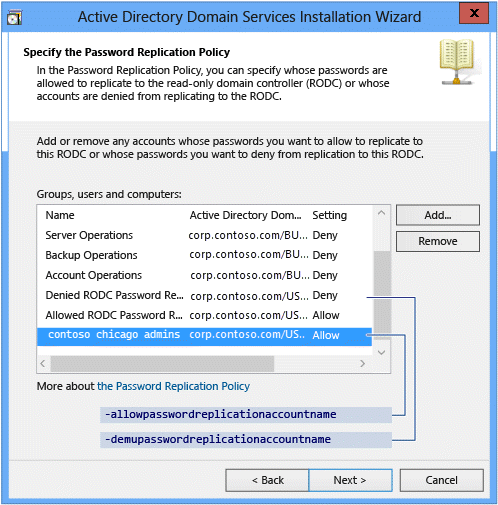

# Install a Windows Server 2012 Active Directory Read-Only Domain Controller (RODC) (Level 200)

>Applies To: Windows Server 2016, Windows Server 2012 R2, Windows Server 2012

This topic explains how to create a staged RODC account and then attach a server to that account during RODC installation. This topic also explains how to install an RODC without performing a staged installation.  
  
## Stage RODC Workflow  
A staged read only domain controller (RODC) installation works in two discrete phases:  
  
1.  Staging an unoccupied computer account  
  
2.  Attaching an RODC to that account during promotion  
  
The following diagram illustrates the Active Directory Domain Services Read-Only Domain Controller staging process, where you create an empty RODC computer account in the domain using the Active Directory Administrative Center (Dsac.exe).  
  
  
  
## <a name="BKMK_StagePS"></a>Stage RODC Windows PowerShell  
  
|||  
|-|-|  
|**ADDSDeployment Cmdlet**|Arguments (**Bold** arguments are required. *Italicized* arguments can be specified by using Windows PowerShell or the AD DS Configuration Wizard.)|  
|Add-addsreadonlydomaincontrolleraccount|-SkipPreChecks<br /><br />***-DomainControllerAccountName***<br /><br />***-DomainName***<br /><br />***-SiteName***<br /><br />*-AllowPasswordReplicationAccountName*<br /><br />***-Credential***<br /><br />*-DelegatedAdministratorAccountName*<br /><br />*-DenyPasswordReplicationAccountName*<br /><br />*-NoGlobalCatalog*<br /><br />*-InstallDNS*<br /><br />-ReplicationSourceDC|  
  
> [!NOTE]  
> The **-credential** argument is only required if you are not already logged on as a member of the Domain Admins group.  
  
## Attach RODC Workflow  
The diagram below illustrates the Active Directory Domain Services configuration process, where you already installed the AD DS role, you staged the RODC account, and started **Promote this Server to a Domain Controller** using Server Manager to create a new RODC in an existing domain, attaching it to the staged computer account.  
  
  
  
## <a name="BKMK_AttachPS"></a>Attach RODC Windows PowerShell  
  
|||  
|-|-|  
|**ADDSDeployment Cmdlet**|Arguments (**Bold** arguments are required. *Italicized* arguments can be specified by using Windows PowerShell or the AD DS Configuration Wizard.)|  
|Install-AddsDomaincontroller|-SkipPreChecks<br /><br />***-DomainName***<br /><br />*-SafeModeAdministratorPassword*<br /><br />*-ApplicationPartitionsToReplicate*<br /><br />*-CreateDNSDelegation*<br /><br />***-Credential***<br /><br />-CriticalReplicationOnly<br /><br />*-DatabasePath*<br /><br />*-DNSDelegationCredential*<br /><br />*-InstallationMediaPath*<br /><br />*-LogPath*<br /><br />-Norebootoncompletion<br /><br />*-ReplicationSourceDC*<br /><br />*-SystemKey*<br /><br />*-SYSVOLPath*<br /><br />***-UseExistingAccount***|  
  
> [!NOTE]  
> The **-credential** argument is only required if you are not already logged on as a member of the Domain Admins group.  
  
## Staging  
  
  
You perform the staging operation of a read-only domain controller computer account by opening the Active Directory Administrative Center (**Dsac.exe**). Click the name of the domain in the navigation pane. Double-click **Domain Controllers** in the management list. Click **Pre-create a Read-only domain controller account** in the tasks pane.  
  
For more information about the Active Directory Administrative Center, see [Advanced AD DS Management Using Active Directory Administrative Center &#40;Level 200&#41;](../../../ad-ds/get-started/adac/Advanced-AD-DS-Management-Using-Active-Directory-Administrative-Center--Level-200-.md) and review [Active Directory Administrative Center: Getting Started](https://technet.microsoft.com/library/dd560651(WS.10).aspx).  
  
If you have experience creating read-only domain controllers, you will discover that the installation wizard has the same graphical interface as seen when using the older Active Directory Users and Computers snap-in from Windows Server 2008 and uses the same code, which includes exporting the configuration in the unattend file format used by the obsolete dcpromo.  
  
Windows Server 2012 introduces a new ADDSDeployment cmdlet to stage RODC computer accounts, but the wizard does not use the cmdlet for its operation. The following sections display the equivalent cmdlet and arguments in order to make the information associated with each easier to understand.  
  
The **Pre-create a Read-only domain controller account** link in the Active Directory Administrative Center's task pane is equivalent to the ADDSDeployment Windows PowerShell cmdlet:  
  
```  
Add-addsreadonlydomaincontrolleraccount  
  
```  
  
### Welcome  
  
  
The **Welcome to the Active Directory Domain Services Installation Wizard** dialog has one option named **Use advanced mode installation**. Select this option and click **Next** to show password replication policy options. Clear this option to use the default values for password replication policy options (this is discussed in further detail later in this section).  
  
### Network Credentials  
  
  
The domain name option in the **Network Credentials** dialog displays the domain targeted by the Active Directory Administrative Center by default. Your current credentials are used by default. If they do not include membership in the Domain Admins group, click **Alternate Credentials**, and click **Set** to provide the wizard with a user name and password that is a member of Domain Admins.  
  
The equivalent ADDSDeployment Windows PowerShell argument is:  
  
```  
-credential <pscredential>  
```  
  
Keep in mind that the staging system is a direct port from Windows Server 2008 R2 and does not provide the new Adprep functionality. If you plan to deploy staged RODC accounts, you must either first deploy an un-staged RODC in that domain so that the automatic rodcprep operation runs, or manually run adprep.exe /rodcprep first.  
  
Otherwise, you will receive error "You will not be able to install a read-only domain controller in this domain because "adprep /rodcprep" was not yet run".  
  
  
  
### Specify the Computer Name  
  
  
The **Specify the Computer Name** dialog requires you to enter the single-label **Computer name** of a domain controller that does not exist. The domain controller you configure and attach to this account later must have the same name, or the promotion operation will not detect the staged account.  
  
The equivalent ADDSDeployment Windows PowerShell argument is:  
  
```  
-domaincontrolleraccountname <string>  
```  
  
### Select a Site  
  
  
The **Select a Site** dialog shows a list of Active Directory sites for the current forest. The staged read-only domain controller operation requires you to select a single site from the list. The RODC uses this information to create its NTDS Settings object in the Configuration partition and join itself to the correct site when it starts for the first time after being deployed.  
  
The equivalent ADDSDeployment Windows PowerShell argument is:  
  
```  
-sitename <string>  
```  
  
### Additional Domain Controller Options  
  
  
The **Additional Domain Controller Options** dialog enables you to specify that a domain controller include running as a **DNS Server** and a **Global Catalog**. Microsoft recommends that read-only domain controllers provide DNS and GC services, so both are installed by default; one intention of the RODC role is branch office scenarios where the wide area network may not be available and without those DNS and global catalog services, computers in the branch will not be able to use AD DS resources and functionality.  
  
The **Read-only domain controller (RODC)** option is pre-selected and cannot be disabled. The equivalent ADDSDeployment Windows PowerShell arguments are:  
  
```  
-installdns <string>  
-NoGlobalCatalog <{$true | $false}>  
  
```  
  
> [!NOTE]  
> By default, the **-NoGlobalCatalog** value is $false, which means the domain controller will be a global catalog server if the argument is not specified.  
  
### Specify the Password Replication Policy  
  
  
The **Specify the Password Replication Policy** dialog enables you to modify the default list of accounts that are allowed to cache their passwords on this read-only domain controller. Accounts in the list configured with **Deny** or that are not in the list (implicit) do not cache their password. Accounts that are not allowed to cache passwords on the RODC and cannot connect and authenticate to a writable domain controller cannot access resources or functionality provided by Active Directory.  
  
> [!IMPORTANT]  
> The wizard shows this dialog only if you select the **Use Advanced Mode Installation** check box on the welcome screen. If you clear this check box, then the wizard uses following default groups and values:  
>   
> -   Administrators - Deny  
> -   Server Operators - Deny  
> -   Backup Operators - Deny  
> -   Account Operators - Deny  
> -   Denied RODC Password Replication Group - Deny  
> -   Allowed RODC Password Replication Group - Allow  
  
The equivalent ADDSDeployment Windows PowerShell arguments are:  
  
```  
-allowpasswordreplicationaccountname <string []>  
-denypasswordreplicationaccountname <string []>  
```  
  
  
  
### Delegation of RODC Installation and Administration  
  
  
The **Delegation of RODC Installation and Administration** dialog enables you to configure a user or group containing users who are allowed to attach the server to the RODC computer account. Click **Set** to browse the domain for a user or group. The user or group specified in this dialog gains local administrative permissions to the RODC. The specified user or members of the specified group can perform operations on the RODC with privileges equivalent to the computer's Administrators group. They are *not* members of the Domain Admins or domain built-in Administrators groups.  
  
Use this option to delegate branch office administration without granting the branch administrator membership to the Domain Admins group. Delegating RODC administration is not required.  
  
The equivalent ADDSDeployment Windows PowerShell argument is:  
  
```  
-delegatedadministratoraccountname <string>  
```  
  
### Summary  
  
  
The **Summary** dialog enables you to confirm your settings. This is the last opportunity to stop the installation before the wizard creates the staged account. Click **Next** when you are ready to create the staged RODC computer account.  Click **Export Settings** to save an answer file in the obsolete dcpromo unattend file format.  
  
### Creation  
  
  
The **Active Directory Domain Services Installation Wizard** creates the staged read-only domain controller in Active Directory. You cannot cancel this operation after it starts.  
  
  
  
Use the following cmdlet to stage a read-only domain controller computer account using the ADDSDeployment Windows PowerShell module:  
  
```  
Add-addsreadonlydomaincontrolleraccount  
  
```  
  
See [Stage RODC Windows PowerShell](../../../ad-ds/deploy/RODC/Install-a-Windows-Server-2012-Active-Directory-Read-Only-Domain-Controller--RODC---Level-200-.md#BKMK_StagePS) for required and optional arguments.  
  
Because **Add-addsreadonlydomaincontrolleraccount** only has one action with two phases (prerequisite checking and installation), the following screen shots show the installation phase with the minimum required arguments.  
  
  
  
  
  
The stage RODC operation creates the RODC computer account in Active Directory. The Active Directory Administrative Center shows the **Domain Controller Type** as an **Unoccupied Domain Controller Account**. This domain controller types indicates that staged RODC account is ready for a server to attach to it as a read only domain controller.  
  
  
  
> [!IMPORTANT]  
> The Active Directory Administrative Center is no longer required to attach a server to a read-only domain controller computer account. Use Server Manager and the Active Directory Domain Services Configuration Wizard or the ADDSDeployment Windows PowerShell module cmdlet **Install-AddsDomainController** to attach a new RODC to its staged account. The steps are similar to adding a new writable domain controller to an existing domain, with the exception that the staged RODC computer account contains configuration options decided at the time you staged the RODC computer account.  
  
## Attaching  
  
### Deployment Configuration  
  
  
Server Manager begins every domain controller promotion with the **Deployment Configuration** page. The remaining options and required fields change on this page and subsequent pages, depending on which deployment operation you select.  
  
To add a read-only domain controller to an existing domain, select **Add a domain controller to an existing domain** and click the **Select** button to **Specify the domain information for this domain**. Server Manager automatically prompts you for valid credentials, or you can click **Change**.  
  
Attaching an RODC requires membership in the Domain Admins groups in Windows Server 2012. The Active Directory Domain Services Configuration Wizard prompts you later if your current credentials do not have adequate permissions or group memberships.  
  
The **Deployment Configuration** ADDSDeployment Windows PowerShell cmdlet and arguments are:  
  
```  
Install-AddsDomainController  
-domainname <string>   
-credential <pscredential>  
```  
  
### Domain Controller Options  
  
  
The **Domain Controller Options** page shows the domain controller options for the new domain controller. When this page loads, the Active Directory Domain Services Configuration Wizard sends an LDAP query to an existing domain controller to check for unoccupied accounts. If the query finds an unoccupied domain controller computer account that shares the same name as the current computer, then the wizard displays an informational message at the top of the page that reads "**A Pre-created RODC account that matches the name of the target server exists in the directory. Choose whether to use this existing RODC account or reinstall this domain controller**." The wizard uses the **Use existing RODC account** as the default configuration.  
  
> [!IMPORTANT]  
> You can use the **Reinstall this domain controller** option when a domain controller has suffered a physical problem and cannot return to functionality. This saves time when configuring the replacement domain controller, by leaving the domain controller computer account and object metadata in Active Directory. Install the new computer with the *same name*, and promote it as a domain controller in the domain. The **Reinstall this domain controller** option is unavailable if you removed the domain controller object's metadata from Active Directory (metadata cleanup).  
  
You cannot configure domain controller options when you are attaching a server to an RODC computer account. You configure domain controller options when you create the staged RODC computer account.  
  
The specified **Directory Services Restore Mode Password** must adhere to the password policy applied to the server. Always choose a strong, complex password or preferably, a passphrase.  
  
The **Domain Controller Options** ADDSDeployment Windows PowerShell arguments are:  
  
```  
-UseExistingAccount <{$true | $false}>  
-SafeModeAdministratorPassword <secure string>  
```  
  
> [!IMPORTANT]  
> The site name must already exist when provided as an argument to **-sitename**. The **install-AddsDomainController** cmdlet does not create site names. You can use cmdlet **new-adreplicationsite** to create new sites.  
  
The **Install-ADDSDomainController** arguments follow the same defaults as Server Manager if not specified.  
  
The **SafeModeAdministratorPassword** argument's operation is special:  
  
-   If *not specified* as an argument, the cmdlet prompts you to enter and confirm a masked password. This is the preferred usage when running the cmdlet interactively.  
  
    For example, to create a new RODC in the corp.contoso.com and be prompted to enter and confirm a masked password:  
  
    ```  
    Install-ADDSDomainController -DomainName corp.contoso.com -credential (get-credential)  
    ```  
  
-   If specified *with a value*, the value must be a secure string. This is not the preferred usage when running the cmdlet interactively.  
  
For example, you can manually prompt for a password by using the **Read-Host** cmdlet to prompt the user for a secure string:  
  
```  
-safemodeadministratorpassword (read-host -prompt "Password:" -assecurestring)  
  
```  
  
> [!WARNING]  
> As the previous option does not confirm the password, use extreme caution: the password is not visible.  
  
You can also provide a secure string as a converted clear-text variable, although this is highly discouraged.  
  
```  
-safemodeadministratorpassword (convertto-securestring "Password1" -asplaintext -force)  
```  
  
Finally, you could store the obfuscated password in a file, and then reuse it later, without the clear text password ever appearing. For example:  
  
```  
$file = "c:\pw.txt"  
$pw = read-host -prompt "Password:" -assecurestring  
$pw | ConvertFrom-SecureString | Set-Content $file  
  
-safemodeadministratorpassword (Get-Content $File | ConvertTo-SecureString)  
  
```  
  
> [!WARNING]  
> Providing or storing a clear or obfuscated text password is not recommended. Anyone running this command in a script or looking over your shoulder knows the DSRM password of that domain controller.  Anyone with access to the file could reverse that obfuscated password. With that knowledge, they can logon to a DC started in DSRM and eventually impersonate the domain controller itself, elevating their privileges to the highest level in an AD forest. An additional set of steps using **System.Security.Cryptography** to encrypt the text file data is advisable but out of scope. The best practice is to totally avoid password storage.  
  
### Additional Options  
  
  
The **Additional Options** page provides configuration options to name a domain controller as the replication source, or you can use any domain controller as the replication source.  
  
You can also choose to install the domain controller using backed up media using the Install from media (IFM) option. The **Install from media** checkbox provides a browse option once selected and you must click **Verify** to ensure the provided path is valid media.

Guidelines for the IFM source:
•	Media used by the IFM option is created with Windows Server Backup or Ntdsutil.exe from another existing Windows Server Domain Controller with the same operating system version only. For example, you cannot use a Windows Server 2008 R2 or previous operating system to create media for a Windows Server 2012 domain controller.
•	The IFM source data should be from a writable Domain Controller. While a source from RODC will technically work to create a new RODC, there are false positive replication warnings that the IFM source RODC is not replicating.

For more information about changes in IFM, see [Ntdsutil.exe Install from Media Changes](../../../ad-ds/deploy/Simplified-Administration-Appendix.md#BKMK_IFM). If using media protected with a SYSKEY, Server Manager prompts for the image's password during verification. 
  
  
  
The **Additional Options** ADDSDeployment cmdlet arguments are:  
  
```  
-replicationsourcedc <string>  
-installationmediapath <string>  
-systemkey <secure string>  
```  
  
### Paths  
  
  
The **Paths** page enables you to override the default folder locations of the AD DS database, the database transaction logs, and the SYSVOL share. The default locations are always in subdirectories of %systemroot%. The **Paths** ADDSDeployment cmdlet arguments are:  
  
```  
-databasepath <string>  
-logpath <string>  
-sysvolpath <string>  
```  
  
### Review Options and View Script  
  
  
The **Review Options** page enables you to validate your settings and ensure that they meet your requirements before you start the installation. This is not the last opportunity to stop the installation using Server Manager. This page simply enables you to review and confirm your settings before continuing the configuration. The **Review Options** page in Server Manager also offers an optional **View Script** button to create a Unicode text file that contains the current ADDSDeployment configuration as a single Windows PowerShell script. This enables you to use the Server Manager graphical interface as a Windows PowerShell deployment studio. Use the Active Directory Domain Services Configuration Wizard to configure options, export the configuration, and then cancel the wizard. This process creates a valid and syntactically correct sample for further modification or direct use. For example:  
  
```  
#  
# Windows PowerShell Script for AD DS Deployment  
#  
  
Import-Module ADDSDeployment  
Install-ADDSDomainController `  
-Credential (Get-Credential) `  
-CriticalReplicationOnly:$false `  
-DatabasePath "C:\Windows\NTDS" `  
-DomainName "corp.contoso.com" `  
-LogPath "C:\Windows\NTDS" `  
-SYSVOLPath "C:\Windows\SYSVOL" `  
-UseExistingAccount:$true `  
-Norebootoncompletion:$false  
-Force:$true  
  
```  
  
> [!NOTE]  
> Server Manager generally fills in all arguments with values when promoting and does not rely on defaults (as they may change between future versions of Windows or service packs). The one exception to this is the **-safemodeadministratorpassword** argument. To force a confirmation prompt omit the value when running cmdlet interactively  
  
Use the optional **Whatif** argument with the **Install-ADDSDomainController** cmdlet to review configuration information. This enables you to see the explicit and implicit values of the arguments for a cmdlet.  
  
  
  
### Prerequisites Check  
  
  
The **Prerequisites Check** is a new feature in AD DS domain configuration. This new phase validates that the server configuration is capable of supporting a new AD DS forest.  
  
When installing a new forest root domain, the Server Manager Active Directory Domain Services Configuration Wizard invokes a series of serialized modular tests. These tests alert you with suggested repair options. You can run the tests as many times as required. The domain controller installation process cannot continue until all prerequisite tests pass.  
  
The **Prerequisites Check** also surfaces relevant information such as security changes that affect older operating systems. For more information about the prerequisite checks, see [Prerequisite Checking](../../../ad-ds/manage/AD-DS-Simplified-Administration.md#BKMK_PrereuisiteChecking).  
  
You cannot bypass the **Prerequisite Check** when using Server Manager, but you can skip the process when using the AD DS Deployment cmdlet using the following argument:  
  
```  
-skipprechecks  
  
```  
  
> [!WARNING]  
> Microsoft discourages skipping the prerequisite check as it can lead to a partial domain controller promotion or damaged AD DS forest.  
  
Click **Install** to begin the domain controller promotion process. This is last opportunity to cancel the installation. You cannot cancel the promotion process once it begins. The computer will reboot automatically at the end of promotion, regardless of the promotion results.  
  
### Installation  
  
  
When the Installation page displays, the domain controller configuration begins and cannot be halted or canceled. Detailed operations display on this page and are written to logs:  
  
-   %systemroot%\debug\dcpromo.log  
  
-   %systemroot%\debug\dcpromoui.log  
  
To install a new Active Directory forest using the ADDSDeployment module, use the following cmdlet:  
  
```  
Install-addsdomaincontroller  
  
```  
  
See [Attach RODC Windows PowerShell](../../../ad-ds/deploy/RODC/Install-a-Windows-Server-2012-Active-Directory-Read-Only-Domain-Controller--RODC---Level-200-.md#BKMK_AttachPS) for required and optional arguments.  
  
The **Install-addsdomaincontroller** cmdlet only has two phases (prerequisite checking and installation). The two figures below show the installation phase with the minimum required arguments of **-domainname**, **-useexistingaccount**, and **-credential**. Note how, just like Server Manager, **Install-ADDSDomainController** reminds you that promotion will reboot the server automatically:  
  
  
  
  
  
To accept the reboot prompt automatically, use the **-force** or **-confirm:$false** arguments with any ADDSDeployment Windows PowerShell cmdlet. To prevent the server from automatically rebooting at the end of promotion, use the **-norebootoncompletion** argument.  
  
> [!WARNING]  
> Overriding the reboot is discouraged. The domain controller must reboot to function correctly.  
  
### Results  
  
  
The **Results** page shows the success or failure of the promotion and any important administrative information. The domain controller will automatically reboot after 10 seconds.  
  
## RODC without Staging Workflow  
The following diagram illustrates the Active Directory Domain Services configuration process, when you previously installed the AD DS role and you have started the Active Directory Domain Services Configuration Wizard using Server Manager to create a new non-staged read-only domain controller in an existing Windows Server 2012 domain.  
  
  
  
## RODC without Staging Windows PowerShell  
  
|||  
|-|-|  
|**ADDSDeployment Cmdlet**|Arguments (**Bold** arguments are required. *Italicized* arguments can be specified by using Windows PowerShell or the AD DS Configuration Wizard.)|  
|Install-AddsDomainController|-SkipPreChecks<br /><br />***-DomainName***<br /><br />*-SafeModeAdministratorPassword*<br /><br />***-SiteName***<br /><br />*-ApplicationPartitionsToReplicate*<br /><br />*-CreateDNSDelegation*<br /><br />***-Credential***<br /><br />*-CriticalReplicationOnly*<br /><br />*-DatabasePath*<br /><br />*-DNSDelegationCredential*<br /><br />-DNSOnNetwork<br /><br />*-InstallationMediaPath*<br /><br />*-InstallDNS*<br /><br />*-LogPath*<br /><br />-MoveInfrastructureOperationMasterRoleIfNecessary<br /><br />*-NoGlobalCatalog*<br /><br />-Norebootoncompletion<br /><br />*-ReplicationSourceDC*<br /><br />-SkipAutoConfigureDNS<br /><br />*-SystemKey*<br /><br />*-SYSVOLPath*<br /><br />*-AllowPasswordReplicationAccountName*<br /><br />*-DelegatedAdministratorAccountName*<br /><br />*-DenyPasswordReplicationAccountName*<br /><br />***-ReadOnlyReplica***|  
  
> [!NOTE]  
> The **-credential** argument is only required if you are not already logged on as a member of the Domain Admins group.  
  
## RODC without Staging Deployment  
  
### Deployment Configuration  
  
  
Server Manager begins every domain controller promotion with the **Deployment Configuration** page. The remaining options and required fields change on this page and subsequent pages, depending on which deployment operation you select.  
  
To add an un-staged read-only domain controller to an existing Windows Server 2012 domain, select **Add a domain controller to an existing domain** and click the **Select** button to **Specify the domain information for this domain**. Server Manager automatically prompts you for valid credentials, or you can click **Change**.  
  
Attaching an RODC requires membership in the Domain Admins groups in Windows Server 2012. The Active Directory Domain Services Configuration Wizard prompts you later if your current credentials do not have adequate permissions or group memberships.  
  
The **Deployment Configuration** ADDSDeployment Windows PowerShell cmdlet and arguments are:  
  
```  
Install-AddsDomainController  
-domainname <string>   
-credential <pscredential>  
```  
  
### Domain Controller Options  
  
  
The **Domain Controller Options** page specifies the domain controller capabilities for the new domain controller. The configurable domain controller capabilities are **DNS server**, **Global Catalog**, and **Read-only domain controller**. Microsoft recommends that all domain controllers provide DNS and GC services for high availability in distributed environments. GC is always selected by default and DNS server is selected by default if the current domain hosts DNS already on its DCs based on Start of Authority query.  
  
The **Domain Controller Options** page also enables you to choose the appropriate Active Directory logical **site name** from the forest configuration. By default, it selects the site with the most correct subnet. If there is only one site, it selects that site automatically.  
  
> [!IMPORTANT]  
> If the server does not belong to an Active Directory subnet and there is more than one Active Directory site, nothing is selected and the **Next** button is unavailable until you choose a site from the list.  
  
The specified **Directory Services Restore Mode Password** must adhere to the password policy applied to the server. Always choose a strong, complex password or preferably, a passphrase.The **Domain Controller Options** ADDSDeployment Windows PowerShell arguments are:  
  
```  
-UseExistingAccount <{$true | $false}>  
-SafeModeAdministratorPassword <secure string>  
```  
  
> [!IMPORTANT]  
> The site name must already exist when provided as an argument to **-sitename**. The **install-AddsDomainController** cmdlet does not create site names. You can use cmdlet **new-adreplicationsite** to create new sites.  
  
The **Install-ADDSDomainController** arguments follow the same defaults as Server Manager if not specified.  
  
The **SafeModeAdministratorPassword** argument's operation is special:  
  
-   If *not specified* as an argument, the cmdlet prompts you to enter and confirm a masked password. This is the preferred usage when running the cmdlet interactively.  
  
    For example, to create a new RODC in the corp.contoso.com and be prompted to enter and confirm a masked password:  
  
    ```  
    Install-ADDSDomainController -DomainName corp.contoso.com -credential (get-credential)  
    ```  
  
-   If specified *with a value*, the value must be a secure string. This is not the preferred usage when running the cmdlet interactively.  
  
For example, you can manually prompt for a password by using the **Read-Host** cmdlet to prompt the user for a secure string:  
  
```  
-safemodeadministratorpassword (read-host -prompt "Password:" -assecurestring)  
  
```  
  
> [!WARNING]  
> As the previous option does not confirm the password, use extreme caution: the password is not visible.  
  
You can also provide a secure string as a converted clear-text variable, although this is highly discouraged.  
  
```  
-safemodeadministratorpassword (convertto-securestring "Password1" -asplaintext -force)  
```  
  
Finally, you could store the obfuscated password in a file, and then reuse it later, without the clear text password ever appearing. For example:  
  
```  
$file = "c:\pw.txt"  
$pw = read-host -prompt "Password:" -assecurestring  
$pw | ConvertFrom-SecureString | Set-Content $file  
  
-safemodeadministratorpassword (Get-Content $File | ConvertTo-SecureString)  
  
```  
  
> [!WARNING]  
> Providing or storing a clear or obfuscated text password is not recommended. Anyone running this command in a script or looking over your shoulder knows the DSRM password of that domain controller.  Anyone with access to the file could reverse that obfuscated password. With that knowledge, they can logon to a DC started in DSRM and eventually impersonate the domain controller itself, elevating their privileges to the highest level in an AD forest. An additional set of steps using **System.Security.Cryptography** to encrypt the text file data is advisable but out of scope. The best practice is to totally avoid password storage.  
  
### RODC Options  
  
  
The **RODC Options** page enables you to modify the settings:  
  
-   Delegated Administrator Account  
  
-   Accounts that are allowed to replicate passwords to the RODC  
  
-   Accounts that are denied from replicating passwords to the RODC  
  
Delegated administrator accounts gain local administrative permissions to the RODC. These users can operate with privileges equivalent to the local computer's Administrators group.  They are not members of the Domain Admins or the domain built-in Administrators groups. This option is useful for delegating branch office administration without giving out domain administrative permissions. Configuring delegation of administration is not required.  
  
The equivalent ADDSDeployment Windows PowerShell argument is:  
  
```  
-delegatedadministratoraccountname <string>  
```  
  
Accounts that are not allowed to cache passwords on the RODC and cannot connect and authenticate to a writable domain controller cannot access resources or functionality provided by Active Directory.  
  
> [!IMPORTANT]  
> If not modified, the default groups and settings are used:  
>   
> -   Administrators - Deny  
> -   Server Operators - Deny  
> -   Backup Operators - Deny  
> -   Account Operators - Deny  
> -   Denied RODC Password Replication Group - Deny  
> -   Allowed RODC Password Replication Group - Allow  
  
The equivalent ADDSDeployment Windows PowerShell arguments are:  
  
```  
-allowpasswordreplicationaccountname <string []>  
-denypasswordreplicationaccountname <string []>  
```  
  
  
  
### Additional Options  
  
  
The **Additional Options** page provides configuration options to name a domain controller as the replication source, or you can use any domain controller as the replication source.  
  
You can also choose to install the domain controller using backed up media using the Install from media (IFM) option. The **Install from media** checkbox provides a browse option once selected and you must click **Verify** to ensure the provided path is valid media.

Guidelines for the IFM source:
•	Media used by the IFM option is created with Windows Server Backup or Ntdsutil.exe from another existing Windows Server Domain Controller with the same operating system version only. For example, you cannot use a Windows Server 2008 R2 or previous operating system to create media for a Windows Server 2012 domain controller.
•	The IFM source data should be from a writable Domain Controller. While a source from RODC will technically work to create a new RODC, there are false positive replication warnings that the IFM source RODC is not replicating.

For more information about changes in IFM, see [Ntdsutil.exe Install from Media Changes](../../../ad-ds/deploy/Simplified-Administration-Appendix.md#BKMK_IFM). If using media protected with a SYSKEY, Server Manager prompts for the image's password during verification.
  
  
  
The Additional Options ADDSDeployment cmdlet arguments are:  
  
```  
-replicationsourcedc <string>  
-installationmediapath <string>  
-systemkey <secure string>  
```  
  
### Paths  
  
  
The **Paths** page enables you to override the default folder locations of the AD DS database, the database transaction logs, and the SYSVOL share. The default locations are always in subdirectories of %systemroot%. The **Paths** ADDSDeployment cmdlet arguments are:  
  
```  
-databasepath <string>  
-logpath <string>  
-sysvolpath <string>  
```  
  
### Preparation Options  
  
  
The **Preparation Options** page alerts you that the AD DS configuration includes extending the Schema (forestprep) and updating the domain (domainprep). You only see this page when the forest or domain has not been prepared by previous Windows Server 2012 domain controller installation or from manually running Adprep.exe. For example, the Active Directory Domain Services Configuration Wizard suppresses this page if you add a new replica domain controller to an existing Windows Server 2012 forest root domain.  
  
Extending the Schema and updating the domain do not occur when you click **Next**. These events occur only during the installation phase. This page simply brings awareness about the events that will occur later in the installation.  
  
This page also validates that the current user credentials are members of the Schema Admin and Enterprise Admins groups, as you need membership in these groups to extend the schema or prepare a domain. Click **Change** to provide the adequate user credentials if the page informs you that the current credentials do not provide sufficient permissions.  
  
The Additional Options ADDSDeployment cmdlet argument is:  
  
```  
-adprepcredential <pscredential>  
```  
  
> [!IMPORTANT]  
> As with previous versions of Windows Server, Windows Server 2012's automated domain preparation does not run GPPREP. Run **adprep.exe /gpprep** manually for all domains that were not previously prepared for Windows Server 2003, Windows Server 2008, or Windows Server 2008 R2. You should run GPPrep only once in the history of a domain, not with every upgrade. Adprep.exe does not run /gpprep automatically because its operation can cause all files and folders in the SYSVOL folder to re-replicate on all domain controllers.  
>   
> Automatic RODCPrep runs when you promote the first un-staged RODC in a domain. It does not occur when you promote the first writeable Windows Server 2012 domain controller. You can also still manually run **adprep.exe /rodcprep** if you plan to deploy read-only domain controllers.  
  
### Review Options and View Script  
  
  
The **Review Options** page enables you to validate your settings and ensure that they meet your requirements before you start the installation. This is not the last opportunity to stop the installation using Server Manager. This page simply enables you to review and confirm your settings before continuing the configuration.  
  
The **Review Options** page in Server Manager also offers an optional **View Script** button to create a Unicode text file that contains the current ADDSDeployment configuration as a single Windows PowerShell script. This enables you to use the Server Manager graphical interface as a Windows PowerShell deployment studio. Use the Active Directory Domain Services Configuration Wizard to configure options, export the configuration, and then cancel the wizard. This process creates a valid and syntactically correct sample for further modification or direct use. For example:  
  
```  
#  
# Windows PowerShell Script for AD DS Deployment  
#  
  
Import-Module ADDSDeployment  
Install-ADDSDomainController `  
-AllowPasswordReplicationAccountName @("CORP\Allowed RODC Password Replication Group", "CORP\Chicago RODC Admins", "CORP\Chicago RODC Users and Computers") `  
-Credential (Get-Credential) `  
-CriticalReplicationOnly:$false `  
-DatabasePath "C:\Windows\NTDS" `  
-DelegatedAdministratorAccountName "CORP\Chicago RODC Admins" `  
-DenyPasswordReplicationAccountName @("BUILTIN\Administrators", "BUILTIN\Server Operators", "BUILTIN\Backup Operators", "BUILTIN\Account Operators", "CORP\Denied RODC Password Replication Group") `  
-DomainName "corp.contoso.com" `  
-InstallDNS:$true `  
-LogPath "C:\Windows\NTDS" `  
-ReadOnlyReplica:$true `  
-SiteName "Default-First-Site-Name" `  
-SYSVOLPath "C:\Windows\SYSVOL"  
-Force:$true  
  
```  
  
> [!NOTE]  
> Server Manager generally fills in all arguments with values when promoting and does not rely on defaults (as they may change between future versions of Windows or service packs). The one exception to this is the **-safemodeadministratorpassword** argument. To force a confirmation prompt, omit the value when running cmdlet interactively.  
  
Use the optional Whatif argument with the Install-ADDSDomainController cmdlet to review configuration information. This enables you to see the explicit and implicit values of the arguments for a cmdlet.  
  
  
  
### Prerequisites Check  
  
  
The **Prerequisites Check** is a new feature in AD DS domain configuration. This new phase validates that the server configuration is capable of supporting a new AD DS forest.  
  
When installing a new forest root domain, the Server Manager Active Directory Domain Services Configuration Wizard invokes a series of serialized modular tests. These tests alert you with suggested repair options. You can run the tests as many times as required. The domain controller process cannot continue until all prerequisite tests pass.  
  
The **Prerequisites Check** also surfaces relevant information such as security changes that affect older operating systems.  
  
You cannot bypass the **Prerequisite Check** when using Server Manager, but you can skip the process when using the AD DS Deployment cmdlet using the following argument:  
  
```  
-skipprechecks  
  
```  
  
Click **Install** to begin the domain controller promotion process. This is last opportunity to cancel the installation. You cannot cancel the promotion process once it begins. The computer will reboot automatically at the end of promotion, regardless of the promotion results.  
  
### Installation  
  
  
When the **Installation** page displays, the domain controller configuration begins and cannot be halted or canceled. Detailed operations display on this page and are written to logs:  
  
-   %systemroot%\debug\dcpromo.log  
  
-   %systemroot%\debug\dcpromoui.log  
  
To install a new Active Directory forest using the ADDSDeployment module, use the following cmdlet:  
  
```  
Install-addsdomaincontroller  
  
```  
  
See the **ADDSDeployment Cmdlet** table at the begininng of this section for required and optional arguments.  
  
The **Install-addsdomaincontroller** cmdlet only has two phases (prerequisite checking and installation). The two figures below show the installation phase with the minimum required arguments of **-domainname**, **-readonlyreplica**, **-sitename**, and **-credential**. Note how, just like Server Manager, **Install-ADDSDomainController** reminds you that promotion will reboot the server automatically:  
  
  
  
  
  
To accept the reboot prompt automatically, use the **-force** or **-confirm:$false** arguments with any ADDSDeployment Windows PowerShell cmdlet. To prevent the server from automatically rebooting at the end of promotion, use the **-norebootoncompletion** argument.  
  
> [!WARNING]  
> Overriding the reboot is not recommended. The domain controller must reboot to function correctly. If you log off the domain controller, you cannot log back on interactively until you restart it.  
  
### Results  
  
  
The **Results** page shows the success or failure of the promotion and any important administrative information. The domain controller will automatically reboot after 10 seconds.  
  

