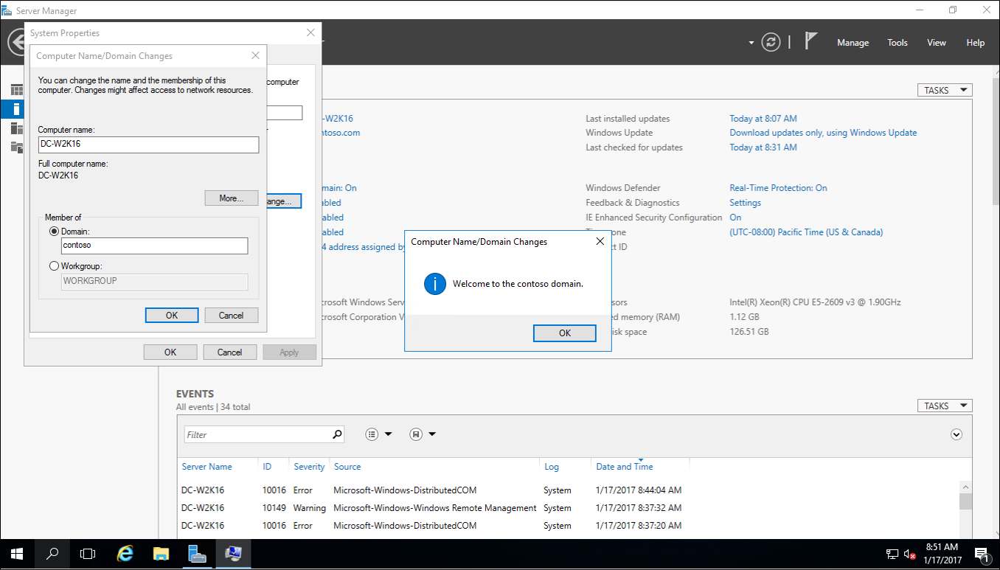
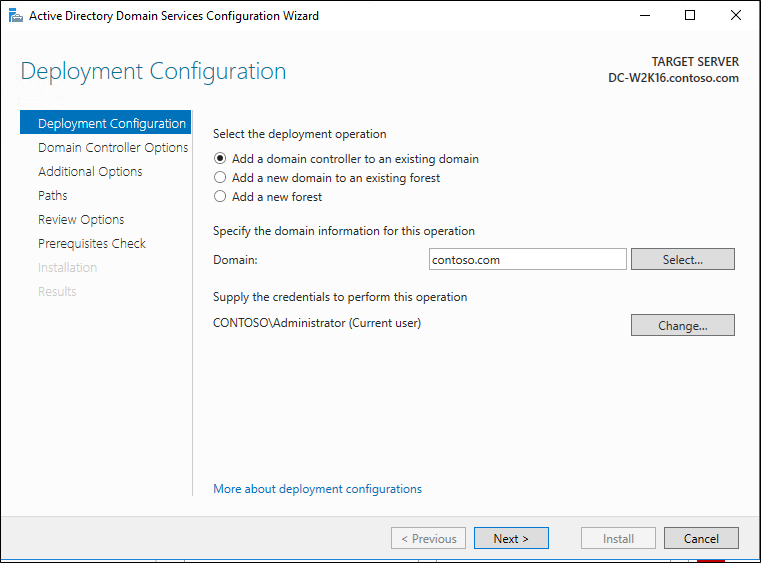

# Upgrade Domain Controllers to Windows Server 2016

Applies To: Windows Server 2016

This topic provides background information about Active Directory Domain 
Services in Windows Server 2016 and explains the process for upgrading domain controllers from Windows Server 2012 or Windows Server 2012 R2. 

## Pre-requisites
The recommended way to upgrade a domain is to promote domain controllers that run newer versions of Windows Server and demote the older domain controllers as needed. That method is preferable to upgrading the operating system of an existing domain controller. This list covers general steps to follow before you promote a domain controller that runs a newer version of Windows Server: 

1.  Verify the target server meets system requirements. 
2.	Verify Application compatibility. 
3.	Review Recommendations for moving to Windows Server 2016 
4.	Verify security settings. For more information, see [Deprecated features and behavior changes related  to AD DS in Windows Server 2016](../../../get-started\deprecated-features.md). 
5.	Check connectivity to the target server from the computer where you plan to run the installation. 
6.	Check for availability of necessary operation master roles: 
	- To install the first DC that runs Windows Server 2016 in an existing domain and forest, the machine where you run the installation needs connectivity to the **schema master** in order to run adprep /forestprep and the infrastructure master in order to run adprep /domainprep. 
	- To install the first DC in a domain where the forest schema is already extended, you only need connectivity to infrastructure master. 
	- To install or remove a domain in an existing forest, you need connectivity to the **domain naming master**. 
	- Any domain controller installation also requires connectivity to the **RID master.** 
	- If you are installing the first read-only domain controller in an existing forest, you need connectivity to the infrastructure master for each application directory partition, also known as a non-domain naming context or NDNC. 

### Installation steps and required administrative levels
The following table provides a summary of the upgrade steps and the permission requirements to accomplish these steps

|Installation action|Credential requirements|
| ----- | ----- |
|Install a new forest|Local Administrator on the target server|
|Install a new domain in an existing forest|Enterprise Admins|
|Install an additional DC in an existing domain|Domain Admins|
|Run adprep /forestprep|Schema Admins, Enterprise Admins, and Domain Admins|
|Run adprep /domainprep|Domain Admins|
|Run adprep /domainprep /gpprep|Domain Admins|
|Run adprep /rodcprep|Enterprise Admins|

For additional information on new features in Windows Server 2016, see [What's new in Windows Server 2016](../../../get-started/what-s-new-in-windows-server-2016.md).


## Supported in-place upgrade paths
Domain controllers that run 64-bit versions of Windows Server 2012 or Windows Server 2012 R2 can be upgraded to Windows Server 2012. Only 64-bit version upgrades are supported because Windows Server 2016 only comes in a 64-bit version.

|If you are running this edition:|You can upgrade to these editions:|
| ----- | ----- |	
|Windows Server 2012 Standard|Windows Server 2016 Standard or Datacenter|	
|Windows Server 2012 Datacenter|Windows Server 2016 Datacenter|	
|Windows Server 2012 R2 Standard|Windows Server 2016 Standard or Datacenter|	
|Windows Server 2012 R2 Datacenter|Windows Server 2016 Datacenter|	
|Windows Server 2012 R2 Essentials|Windows Server 2016 Essentials|	
|Windows Storage Server 2012 Standard|Windows Storage Server 2016 Standard|	
|Windows Storage Server 2012 Workgroup|Windows Storage Server 2016 Workgroup|	
|Windows Storage Server 2012 R2 Standard|Windows Storage Server 2016 Standard|	
|Windows Storage Server 2012 R2 Workgroup|Windows Storage Server 2016 Workgroup|	

For more information about supported upgrade paths, see [Supported Upgrade Paths](../../../get-started/supported-upgrade-paths.md)


## Functional level features and requirements
Windows Server 2016 requires a Windows Server 2003 forest functional level. That is, before you can add a domain controller that runs Windows Server 2016 to an existing Active Directory forest, the forest functional level must be Windows Server 2003 or higher. If the forest contains domain controllers running Windows Server 2003 or later but the forest functional level is still Windows 2000, the installation is also blocked. 

Windows 2000 domain controllers must be removed prior to adding Windows Server 2016 domain controllers to your forest. In this case, consider the following workflow: 


1. Install domain controllers that run Windows Server 2003 or later. These domain controllers can be deployed on an evaluation version of Windows Server. This step also requires running adprep.exe for that operating system release as a prerequisite. 
2.	Remove the Windows 2000 domain controllers. Specifically, gracefully demote or forcibly remove Windows Server 2000 domain controllers from the domain and used Active Directory Users and Computers to remove the domain controller accounts for all removed domain controllers. 
3.	Raise the forest functional level to Windows Server 2003 or higher. 
4.	Install domain controllers that run Windows Server 2016. 
5.	Remove domain controllers that run earlier versions of Windows Server. 
The new Windows Server 2016 domain functional level enables the following new features: 
	
	**- Add features here **
### Rolling back functional levels

After you set the forest functional level to a certain value, you cannot roll back or lower the forest functional level, with the following exceptions: 

- After you raise the forest functional level to Windows Server 2016 , you can lower it to Windows Server 2012 R2. 

After you set the domain functional level to a certain value, you cannot roll back or lower the domain functional level, with the following exceptions: 

- .
when you raise the domain functional level to Windows Server 2016 and if the forest functional level is Windows Server 2012 or lower, you have the option of rolling the domain functional level back to Windows Server 2012 or Windows Server 2012 R2 
For more information about features that are available at lower functional levels, see [Understanding Active Directory Domain Services (AD DS) Functional Levels](https://technet.microsoft.com/library/understanding-active-directory-functional-levels.aspx). 
 
## AD DS interoperability with other server roles and Windows operating systems
AD DS is not supported on the following Windows operating systems: 


- Windows MultiPoint Server 
- Windows Server 2012 Essentials 

AD DS cannot be installed on a server that also runs the following server roles or role services: 

- Hyper-V Server 
- Remote Desktop Connection Broker 

## Administration of Windows Server 2016 servers
Use the Remote Server Administration Tools for Windows 10 to manage domain controllers and other servers that run Windows Server 2016. You can run the Windows Server 20126 Remote Server Administration Tools on a computer that runs Windows 10. 

## Step-by-Step for Upgrading to Windows Server 2016
The following is a simple example of upgrading the Contoso forest from Windows Server 2012 R2 to Windows Server 2016.


1.	Join the new Windows Server 2016 to your forest. Restart when prompted. 

2.	Sign in to the new Windows Server 2016 with a domain admin account.
3.	In **Server Manager**, under **Add Roles and Features**, install **Active Directory Domain Services** on the new Windows Server 2016. This will automatically run adprep on the 2012 R2 forest and domain.
 
4.	In **Server Manager**, click the yellow triangle, and from the drop-down click **Promote the server to a domain controller**. 

5.	On the **Deployment Configuration** screen, select **Add a domain controller to an existing forest** and click next. 

6.	On the **Domain Controller options** screen, enter the **Directory Services Restore Mode (DSRM)** password and click next. 
7.	For the remainder of the screens click **Next**. 
8.	On the **Prerequisite Check** screen, click **install**. Once the restart has completed you can sign back in.
9.	On the Windows Server 2012 R2 server, in **Server Manager**, under tools, select **Active Directory Module for Windows PowerShell**. 

10.	In the PowerShell windows use the Move-ADDirectoryServerOperationMasterRole to move the FSMO roles. You can type the name of each -OperationMasterRole or use numbers to specify the roles. The numbers. For more information see [Move-ADDirectoryServerOperationMasterRole](https://technet.microsoft.com/library/hh852302.aspx)

``` powershell
Move-ADDirectoryServerOperationMasterRole -Identity "DC-W2K16" -OperationMasterRole 0,1,2,3,4
```

11. Verify the roles have been moved by going to the Windows Server 2016 server, in **Server Manager**, under **tools**, select **Active Directory Module for Windows PowerShell**. Use the `Get-ADDomain` and `Get-ADForest` cmdlets to view the FSMO role holders.


12. Demote and remove the Windows Server 2012 R2 domain controller. For information on demoting a dc, see [Demoting Domain Controllers and Domains](../../ad-ds/deploy/Demoting-Domain-Controllers-and-Domains--Level-200-.md)
13. Once the server is demoted and removed you can raise the forest functional and domain functional levels to Windows Server 2016.


## Next Steps
-   [What's New in Active Directory Domain Services Installation and Removal](../../ad-ds/deploy/What-s-New-in-Active-Directory-Domain-Services-Installation-and-Removal.md)  
-   [Install Active Directory Domain Services &#40;Level 100&#41;](../../ad-ds/deploy/Install-Active-Directory-Domain-Services--Level-100-.md)     
-   [Windows Server 2016 Functional Levels](../../ad-ds/Windows-Server-2016-Functional-Levels.md)  