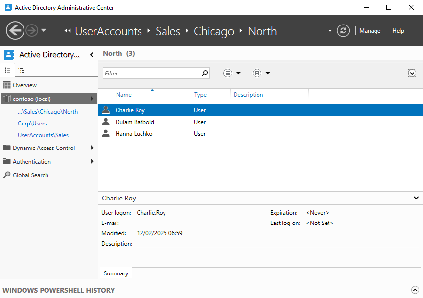
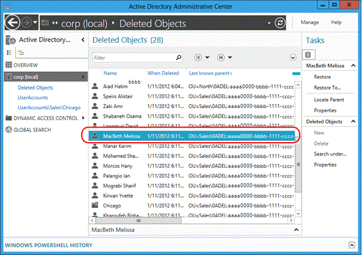
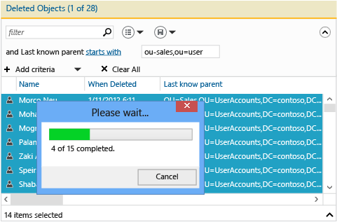
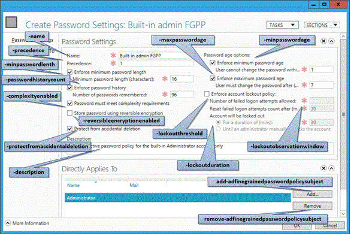
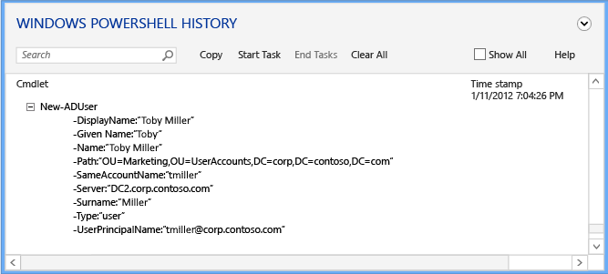

# Advanced AD DS Management Using Active Directory Administrative Center (Level 200)

>Applies To: Windows Server 2016, Windows Server 2012 R2, Windows Server 2012

This topic covers the updated Active Directory Administrative Center with its new Active Directory Recycle Bin, Fine-grained Password policy, and Windows PowerShell History Viewer in more detail, including architecture, examples for common tasks, and troubleshooting information. For an introduction, see [Introduction to Active Directory Administrative Center Enhancements &#40;Level 100&#41;](../../../ad-ds/get-started/adac/Introduction-to-Active-Directory-Administrative-Center-Enhancements--Level-100-.md).  
  
- [Active Directory Administrative Center Architecture](../../../ad-ds/get-started/adac/Advanced-AD-DS-Management-Using-Active-Directory-Administrative-Center--Level-200-.md#BKMK_Arch)  
- [Enabling and Managing the Active Directory Recycle Bin Using Active Directory Administrative Center](../../../ad-ds/get-started/adac/Advanced-AD-DS-Management-Using-Active-Directory-Administrative-Center--Level-200-.md#BKMK_EnableRecycleBin)  
- [Configuring and Managing Fine-Grained Password Policies Using Active Directory Administrative Center](../../../ad-ds/get-started/adac/Advanced-AD-DS-Management-Using-Active-Directory-Administrative-Center--Level-200-.md#BKMK_FGPP)  
- [Using the Active Directory Administrative Center Windows PowerShell History Viewer](../../../ad-ds/get-started/adac/Advanced-AD-DS-Management-Using-Active-Directory-Administrative-Center--Level-200-.md#BKMK_HistoryViewer)  
- [Troubleshooting AD DS Management](../../../ad-ds/get-started/adac/Advanced-AD-DS-Management-Using-Active-Directory-Administrative-Center--Level-200-.md#BKMK_Tshoot)  
  
## <a name="BKMK_Arch"></a>Active Directory Administrative Center Architecture  
  
### Active Directory Administrative Center Executables, DLLs  

The module and underlying architecture of Active Directory Administrative Center has not changed with the new recycle bin, FGPP, and history viewer capabilities.  
  
- Microsoft.ActiveDirectory.Management.UI.dll  
- Microsoft.ActiveDirectory.Management.UI.resources.dll  
- Microsoft.ActiveDirectory.Management.dll  
- Microsoft.ActiveDirectory.Management.resources.dll  
- ActiveDirectoryPowerShellResources.dll  
  
The underlying Windows PowerShell and layer of operations for the new Recycle Bin functionality are illustrated below:  
  
  
  
## <a name="BKMK_EnableRecycleBin"></a>Enabling and Managing the Active Directory Recycle Bin Using Active Directory Administrative Center  
  
### Capabilities  
  
- The Windows Server 2012 or newer Active Directory Administrative Center enables you to configure and manage the Active Directory Recycle Bin for any domain partition in a forest. There is no longer a requirement to use Windows PowerShell or Ldp.exe to enable the Active Directory Recycle Bin or restore objects in domain partitions.
- The Active Directory Administrative Center has advanced filtering criteria, making targeted restoration easier in large environments with many intentionally deleted objects.
  
### Limitations  
  
- Because the Active Directory Administrative Center can only manage domain partitions, it cannot restore deleted objects from the Configuration, Domain DNS, or Forest DNS partitions (you cannot delete objects from the Schema partition). To restore objects from non-domain partitions, use [Restore-ADObject](https://technet.microsoft.com/library/ee617262.aspx).  

- The Active Directory Administrative Center cannot restore sub-trees of objects in a single action. For example, if you delete an OU with nested OUs, users, groups, and computers, restoring the base OU does not restore the child objects.  
  
    > [!NOTE]  
    > The Active Directory Administrative Center batch restore operation does a "best effort" sort of the deleted objects *within the selection only* so parents are ordered before the children for the restore list. In simple test cases, sub-trees of objects may be restored in a single action. But corner cases, such as a selection that contains partial trees - trees with some of the deleted parent nodes missing - or error cases, such as skipping the child objects when parent restore fails, may not work as expected. For this reason, you should always restore sub-trees of objects as a separate action after you restore the parent objects.  
  
The Active Directory Recycle Bin requires a Windows Server 2008 R2 Forest Functional Level and you must be a member of the Enterprise Admins group. Once enabled, you cannot disable Active Directory Recycle Bin. Active Directory Recycle Bin increases the size of the Active Directory database (NTDS.DIT) on every domain controller in the forest. Disk space used by the recycle bin continues to increase over time as it preserves objects and all their attribute data.  
  
### Enabling Active Directory Recycle Bin using Active Directory Administrative Center

To enable the Active Directory Recycle Bin, open the **Active Directory Administrative Center** and click the name of your forest in the navigation pane. From the **Tasks** pane, click **Enable Recycle Bin**.  
  
  
  
The Active Directory Administrative Center shows the **Enable Recycle Bin Confirmation** dialog. This dialog warns you that enabling the recycle bin is irreversible. Click **OK** to enable the Active Directory Recycle Bin. The Active Directory Administrative Center shows another dialog to remind you that the Active Directory Recycle Bin is not fully functional until all domain controllers replicate the configuration change.  
  
> [!IMPORTANT]  
> The option to enable the Active Directory Recycle Bin is unavailable if:  
>
> - The forest functional level is less than Windows Server 2008 R2  
> - It is already enabled  

The equivalent Active Directory Windows PowerShell cmdlet is:  

```powershell
Enable-ADOptionalFeature  
```

For more information about using Windows PowerShell to enable the Active Directory Recycle Bin, see the [Active Directory Recycle Bin Step-by-Step Guide](https://docs.microsoft.com/windows-server/identity/ad-ds/get-started/adac/introduction-to-active-directory-administrative-center-enhancements--level-100-#active-directory-recycle-bin-step-by-step).  
  
### Managing Active Directory Recycle Bin using Active Directory Administrative Center

This section uses the example of an existing domain named **corp.contoso.com**. This domain organizes users into a parent OU named **UserAccounts**. The **UserAccounts** OU contains three child OUs named by department, which each contain further OUs, users, and groups.  
  
  
  
#### Storage and Filtering

The Active Directory Recycle Bin preserves all objects deleted in the forest. It saves these objects according to the **msDS-deletedObjectLifetime** attribute, which by default is set to match the **tombstoneLifetime** attribute of the forest. In any forest created using Windows Server 2003 SP1 or later, the value of **tombstoneLifetime** is set to 180 days by default. In any forest upgraded from Windows 2000 or installed with Windows Server 2003 (no service pack), the default tombstoneLifetime attribute is NOT SET and Windows therefore uses the internal default of 60 days. All of this is configurable.You can use the Active Directory Administrative Center to restore any objects deleted from the domain partitions of the forest. You must continue to use the cmdlet **Restore-ADObject** to restore deleted objects from other partitions, such as Configuration.Enabling the Active Directory Recycle Bin makes the **Deleted Objects** container visible under every domain partition in the Active Directory Administrative Center.  
  
  
  
The **Deleted Objects** container shows you all the restorable objects in that domain partition. Deleted objects older than **msDS-deletedObjectLifetime** are known as recycled objects. The Active Directory Administrative Center does not show recycled objects and you cannot restore these objects using Active Directory Administrative Center.  
  
For a deeper explanation of the recycle bin's architecture and processing rules, see [The AD Recycle Bin: Understanding, Implementing, Best Practices, and Troubleshooting](https://blogs.technet.com/b/askds/archive/2009/08/27/the-ad-recycle-bin-understanding-implementing-best-practices-and-troubleshooting.aspx).  
  
The Active Directory Administrative Center artificially limits the default number of objects returned from a container to 20,000 objects. You can raise this limit as high as 100,000 objects by clicking the **Manage** menu, then **Management List Options**.  
  
  
  
#### Restoration  
  
##### Filtering

Active Directory Administrative Center offers powerful criteria and filtering options that you should become familiar with before you need to use them in a real-life restoration. Domains intentionally delete many objects over their lifetime .With a likely deleted object lifetime of 180 days, you cannot simply restore all objects when an accident occurs.  
  
  
  
Rather than writing complex LDAP filters and converting UTC values into dates and times, use the basic and advanced **Filter** menu to list only the relevant objects. If you know the day of deletion, the names of objects, or any other key data, use that to your advantage when filtering. Toggle the advanced filter options by clicking the chevron to the right of the search box.  
  
The restore operation supports all the standard filter criteria options, the same as any other search. Of the built-in filters, the important ones for restoring objects are typically:  
  
- *ANR (ambiguous name resolution - not listed in the menu, but what is used when you type in the****Filter****box)*  
- Last modified between given dates  
- Object is user/inetorgperson/computer/group/organization unit  
- Name  
- When deleted  
- Last known parent  
- Type  
- Description  
- City  
- Country /region  
- Department  
- Employee ID  
- First name  
- Job title  
- Last name  
- SAMaccountname  
- State/Province  
- Telephone number  
- UPN  
- ZIP/Postal code  

You can add multiple criteria. For example, you can find all user objects deleted on September 24, 2012 from Chicago, Illinois with a job title of Manager.
  
You can also add, modify, or reorder the column headers to provide more detail when evaluating which objects to recover.  
  
  
  
For more information about Ambiguous Name Resolution, see [ANR Attributes](https://msdn.microsoft.com/library/ms675092(VS.85).aspx).  
  
##### Single Object

Restoring deleted objects has always been a single operation.  The Active Directory Administrative Center makes that operation easier. To restore a deleted object, such as a single user:  
  
1. Click the domain name in the navigation pane of the Active Directory Administrative Center.  
2. Double-click **Deleted Objects** in the management list.  
3. Right-click the object and then click **Restore**, or click **Restore** from the **Tasks** pane.  
  
The object restores to its original location.  
  
  
  
Click **Restore To...** to change the restore location. This is useful if the deleted object's parent container was also deleted but you do not want to restore the parent.  
  
  
  
##### Multiple Peer Objects

You can restore multiple peer-level objects, such as all the users in an OU. Hold down the CTRL key and click one or more deleted objects you want to restore. Click **Restore** from the Tasks pane. You can also select all displayed objects by holding down the CTRL and A keys, or a range of objects using SHIFT and clicking.  
  
  
  
##### Multiple Parent and Child Objects

It is critical to understand the restoration process for a multi-parent-child restoration because the Active Directory Administrative Center cannot restore a nested tree of deleted objects with a single action.  
  
1. Restore the top-most deleted object in a tree.  
2. Restore the immediate children of that parent object.  
3. Restore the immediate children of those parent objects.  
4. Repeat as necessary until all objects restore.  
  
You cannot restore a child object before restoring its parent. Attempting this restoration returns the following error:  
  
**The operation could not be performed because the object's parent is either uninstantiated or deleted.**  
  
The **Last Known Parent** attribute shows the parent relationship of each object. The **Last Known Parent** attribute changes from the deleted location to the restored location when you refresh the Active Directory Administrative Center after restoring a parent. Therefore, you can restore that child object when a parent object's location no longer shows the distinguished name of the deleted objects container.  
  
Consider the scenario where an administrator accidentally deletes the Sales OU, which contains child OUs and users.  
  
First, observe the value of the **Last Known Parent** attribute for all the deleted users and how it reads **OU=Sales\0ADEL:*<guid+deleted objects container distinguished name>***:  
  
  
  
Filter on the ambiguous name Sales to return the deleted OU, which you then restore:  
  
  
  
Refresh the Active Directory Administrative Center to see the deleted user object's Last Known Parent attribute change to the restored Sales OU distinguished name:  
  
  
  
Filter on all the Sales users. Hold down the CTRL and A keys to select all the deleted Sales users. Click **Restore** to move the objects from the **Deleted Objects** container to the Sales OU with their group memberships and attributes intact.  
  
  
  
If the **Sales** OU contained child OUs of its own, then you would restore the child OUs first before restoring their children, and so on.  
  
To restore all nested deleted objects by specifying a deleted parent container, see [Appendix B: Restore Multiple, Deleted Active Directory Objects (Sample Script)](https://technet.microsoft.com/library/dd379504(WS.10).aspx).  
  
The Active Directory Windows PowerShell cmdlet for restoring deleted objects is:  

```powershell
Restore-adobject  
```

The **Restore-ADObject** cmdlet functionality did not change between Windows Server 2008 R2 and Windows Server 2012.  
  
##### Server-side Filtering

It is possible that over time, the Deleted Objects container will accumulate over 20,000 (or even 100,000) objects in medium and large enterprises and have difficulty showing all objects. Since the filter mechanism in Active Directory Administrative Center relies on client-side filtering, it cannot show these additional objects. To work around this limitation, use the following steps to perform a server-side search:  
  
1. Right click the **Deleted Objects** container and click **Search under this node**.  
2. Click the chevron to expose the **+Add criteria** menu, select and add **Last modified between given dates**. The Last Modified time (the **whenChanged** attribute) is a close approximation of the deletion time; in most environments, they are identical. This query performs a server-side search.  
3. Locate the deleted objects to restore by using further display filtering, sorting, and so on in the results, and then restore them normally.  
  
## <a name="BKMK_FGPP"></a>Configuring and Managing Fine-Grained Password Policies Using Active Directory Administrative Center  
  
### Configuring Fine-Grained Password Policies

The Active Directory Administrative Center enables you to create and manage Fine-Grained Password Policy (FGPP) objects. Windows Server 2008 introduced the FGPP feature but Windows Server 2012 has the first graphical management interface for it. You apply Fine-Grained Password Policies at a domain level and it enables overriding the single domain password required by Windows Server 2003. By creating different FGPP with different settings, individual users or groups get differing password policies in a domain.  
  
For information about the Fine-Grained Password Policy, see [AD DS Fine-Grained Password and Account Lockout Policy Step-by-Step Guide (Windows Server 2008 R2)](https://technet.microsoft.com/library/cc770842(WS.10).aspx).  
  
In the Navigation pane, click Tree View, click your domain, click **System**, click **Password Settings Container**, and then in the Tasks pane, click **New** and **Password Settings**.  
  
  
  
### Managing Fine-Grained Password Policies

Creating a new FGPP or editing an existing one brings up the **Password Settings** editor. From here, you configure all desired password policies, as you would have in Windows Server 2008 or Windows Server 2008 R2, only now with a purpose-built editor.  
  
  
  
Fill out all required (red asterisk) fields and any optional fields, and then click **Add** to set the users or groups that receives this policy. FGPP overrides default domain policy settings for those specified security principals. In the figure above, an extremely restrictive policy applies only to the built-in Administrator account, to prevent compromise. The policy is far too complex for standard users to comply with, but is perfect for a high-risk account used only by IT professionals.  
  
You also set precedence and to which users and groups the policy applies within a given domain.  
  
  
  
The Active Directory Windows PowerShell cmdlets for Fine-Grained Password Policy are:  
  
```powershell
Add-ADFineGrainedPasswordPolicySubject  
Get-ADFineGrainedPasswordPolicy  
Get-ADFineGrainedPasswordPolicySubject  
New-ADFineGrainedPasswordPolicy  
Remove-ADFineGrainedPasswordPolicy  
Remove-ADFineGrainedPasswordPolicySubject  
Set-ADFineGrainedPasswordPolicy  
```

Fine-Grained Password Policy cmdlet functionality did not change between the Windows Server 2008 R2 and Windows Server 2012. As a convenience, the following diagram illustrates the associated arguments for cmdlets:  
  
  
  
The Active Directory Administrative Center also enables you to locate the resultant set of applied FGPP for a specific user. Right click any user and click **View resultant password settings...** to open the *Password Settings* page that applies to that user through implicit or explicit assignment:  
  
  
  
Examining the **Properties** of any user or group shows the **Directly Associated Password Settings**, which are the explicitly assigned FGPPs:  
  
  
  
Implicit FGPP assignment does not display here; for that, you must use the **View resultant password settings...** option.  
  
## <a name="BKMK_HistoryViewer"></a>Using the Active Directory Administrative Center Windows PowerShell History Viewer

The future of Windows management is Windows PowerShell. By layering graphical tools on top of a task automation framework, management of the most complex distributed systems becomes consistent and efficient. You need to understand how Windows PowerShell works in order to reach your full potential and maximize your computing investments.  
  
The Active Directory Administrative Center now provides a complete history of all the Windows PowerShell cmdlets it runs and their arguments and values. You can copy the cmdlet history elsewhere for study or modification and re-use. You can create Task notes to assist in isolating what your Active Directory Administrative Center commands resulted in Windows PowerShell. You can also filter the history to find points of interest.  
  
The Active Directory Administrative Center Windows PowerShell History Viewer's purpose is for you to learn through practical experience.  
  
  
  
Click the chevron (arrow) to show Windows PowerShell History Viewer.  
  
  
  
Then, create a user or modify a group's membership. The history viewer continually updates with a collapsed view of each cmdlet that the Active Directory Administrative Center ran with the arguments specified.  
  
Expand any line item of interest to see all values provided to the cmdlet's arguments:  
  
  
  
Click the **Start Task** menu to create a manual notation before you use Active Directory Administrative Center to create, modify, or delete an object. Type in what you were doing.  When done with your change, select **End Task**. The task note groups all of those actions performed into a collapsible note you can use for better understanding.  
  
For example, to see the Windows PowerShell commands used to change a user's password and remove him from a group:  
  
  
  
Selecting the Show All check box also shows the Get-* verb Windows PowerShell cmdlets that only retrieve data.  
  
  
  
The history viewer shows the literal commands run by the Active Directory Administrative Center and you might note that some cmdlets appear to run unnecessarily. For example, you can create a new user with:  

```powershell
new-aduser
```

and do not need to use:  

```powershell
set-adaccountpassword  
enable-adaccount  
set-aduser  
```

The Active Directory Administrative Center's design required minimal code usage and modularity. Therefore, instead of a set of functions that create new users and another set that modify existing users, it minimally does each function and then chains them together with the cmdlets. Keep this in mind when you are learning Active Directory Windows PowerShell. You can also use that as a learning technique, where you see how simply you can use Windows PowerShell to complete a single task.  
  
## <a name="BKMK_Tshoot"></a>Troubleshooting AD DS Management  
  
### Introduction to Troubleshooting

Because of its relative newness and lack of usage in existing customer environments, the Active Directory Administrative Center has limited troubleshooting options.  
  
### Troubleshooting Options  
  
#### Logging Options

The Active Directory Administrative Center now contains built-in logging, as part of a tracing config file. Create/modify the following file in the same folder as dsac.exe:  
  
**dsac.exe.config**
  
Create the following contents:  
  
```xml
<appSettings>  
  <add key="DsacLogLevel" value="Verbose" />  
</appSettings>  
<system.diagnostics>
 <trace autoflush="false" indentsize="4">
  <listeners>
   <add name="myListener"
    type="System.Diagnostics.TextWriterTraceListener"
    initializeData="dsac.trace.log" />
   <remove name="Default" />
  </listeners>
 </trace>
</system.diagnostics>
```

The verbosity levels for **DsacLogLevel** are **None**, **Error**, **Warning**, **Info**, and **Verbose**. The output file name is configurable and writes to the same folder as dsac.exe. The output can tell you more about how ADAC is operating, which domain controllers it contacted, what Windows PowerShell commands executed, what the responses were, and further details.  

For example, while using the INFO level, which returns all results except the trace-level verbosity:  
  
- DSAC.exe starts  
- Logging starts  
- Domain Controller requested to return initial domain information  

   ```
   [12:42:49][TID 3][Info] Command Id, Action, Command, Time, Elapsed Time ms (output), Number objects (output)  
   [12:42:49][TID 3][Info] 1, Invoke, Get-ADDomainController, 2012-04-16T12:42:49  
   [12:42:49][TID 3][Info] Get-ADDomainController-Discover:$null-DomainName:"CORP"-ForceDiscover:$null-Service:ADWS-Writable:$null  
   ```

- Domain controller DC1 returned from domain Corp  
- PS AD virtual drive loaded  

   ```
   [12:42:49][TID 3][Info] 1, Output, Get-ADDomainController, 2012-04-16T12:42:49, 1  
   [12:42:49][TID 3][Info] Found the domain controller 'DC1' in the domain 'CORP'.  
   [12:42:49][TID 3][Info] 2, Invoke, New-PSDrive, 2012-04-16T12:42:49  
   [12:42:49][TID 3][Info] New-PSDrive-Name:"ADDrive0"-PSProvider:"ActiveDirectory"-Root:""-Server:"dc1.corp.contoso.com"  
   [12:42:49][TID 3][Info] 2, Output, New-PSDrive, 2012-04-16T12:42:49, 1  
   [12:42:49][TID 3][Info] 3, Invoke, Get-ADRootDSE, 2012-04-16T12:42:49  
   ```
  
- Get domain Root DSE Information  

   ```
   [12:42:49][TID 3][Info] Get-ADRootDSE -Server:"dc1.corp.contoso.com"  
   [12:42:49][TID 3][Info] 3, Output, Get-ADRootDSE, 2012-04-16T12:42:49, 1  
   [12:42:49][TID 3][Info] 4, Invoke, Get-ADOptionalFeature, 2012-04-16T12:42:49  
   ```

- Get domain AD recycle bin information  

   ```
   [12:42:49][TID 3][Info] Get-ADOptionalFeature -LDAPFilter:"(msDS-OptionalFeatureFlags=1)" -Server:"dc1.corp.contoso.com"
   [12:42:49][TID 3][Info] 4, Output, Get-ADOptionalFeature, 2012-04-16T12:42:49, 1
   [12:42:49][TID 3][Info] 5, Invoke, Get-ADRootDSE, 2012-04-16T12:42:49
   [12:42:49][TID 3][Info] Get-ADRootDSE -Server:"dc1.corp.contoso.com"
   [12:42:49][TID 3][Info] 5, Output, Get-ADRootDSE, 2012-04-16T12:42:49, 1
   [12:42:49][TID 3][Info] 6, Invoke, Get-ADRootDSE, 2012-04-16T12:42:49
   [12:42:49][TID 3][Info] Get-ADRootDSE -Server:"dc1.corp.contoso.com"
   [12:42:49][TID 3][Info] 6, Output, Get-ADRootDSE, 2012-04-16T12:42:49, 1
   [12:42:49][TID 3][Info] 7, Invoke, Get-ADOptionalFeature, 2012-04-16T12:42:49
   [12:42:49][TID 3][Info] Get-ADOptionalFeature -LDAPFilter:"(msDS-OptionalFeatureFlags=1)" -Server:"dc1.corp.contoso.com"
   [12:42:50][TID 3][Info] 7, Output, Get-ADOptionalFeature, 2012-04-16T12:42:50, 1
   [12:42:50][TID 3][Info] 8, Invoke, Get-ADForest, 2012-04-16T12:42:50
   ```

- Get AD forest  

   ```  
   [12:42:50][TID 3][Info] Get-ADForest -Identity:"corp.contoso.com" -Server:"dc1.corp.contoso.com"
   [12:42:50][TID 3][Info] 8, Output, Get-ADForest, 2012-04-16T12:42:50, 1  
   [12:42:50][TID 3][Info] 9, Invoke, Get-ADObject, 2012-04-16T12:42:50  
   ```

- Get Schema information for supported encryption types, FGPP, certain user information  

   ```
   [12:42:50][TID 3][Info] Get-ADObject  
   -LDAPFilter:"(|(ldapdisplayname=msDS-PhoneticDisplayName)(ldapdisplayname=msDS-PhoneticCompanyName)(ldapdisplayname=msDS-PhoneticDepartment)(ldapdisplayname=msDS-PhoneticFirstName)(ldapdisplayname=msDS-PhoneticLastName)(ldapdisplayname=msDS-SupportedEncryptionTypes)(ldapdisplayname=msDS-PasswordSettingsPrecedence))"  
   -Properties:lDAPDisplayName  
   -ResultPageSize:"100"  
   -ResultSetSize:$null  
   -SearchBase:"CN=Schema,CN=Configuration,DC=corp,DC=contoso,DC=com"  
   -SearchScope:"OneLevel"  
   -Server:"dc1.corp.contoso.com"  
   [12:42:50][TID 3][Info] 9, Output, Get-ADObject, 2012-04-16T12:42:50, 7  
   [12:42:50][TID 3][Info] 10, Invoke, Get-ADObject, 2012-04-16T12:42:50  
   ```

- Get all information about the domain object to display to administrator who clicked on the domain head.  

   ```
   [12:42:50][TID 3][Info] Get-ADObject  
   -IncludeDeletedObjects:$false  
   -LDAPFilter:"(objectClass=*)"  
   -Properties:allowedChildClassesEffective,allowedChildClasses,lastKnownParent,sAMAccountType,systemFlags,userAccountControl,displayName,description,whenChanged,location,managedBy,memberOf,primaryGroupID,objectSid,msDS-User-Account-Control-Computed,sAMAccountName,lastLogonTimestamp,lastLogoff,mail,accountExpires,msDS-PhoneticCompanyName,msDS-PhoneticDepartment,msDS-PhoneticDisplayName,msDS-PhoneticFirstName,msDS-PhoneticLastName,pwdLastSet,operatingSystem,operatingSystemServicePack,operatingSystemVersion,telephoneNumber,physicalDeliveryOfficeName,department,company,manager,dNSHostName,groupType,c,l,employeeID,givenName,sn,title,st,postalCode,managedBy,userPrincipalName,isDeleted,msDS-PasswordSettingsPrecedence  
   -ResultPageSize:"100"  
   -ResultSetSize:"20201"  
   -SearchBase:"DC=corp,DC=contoso,DC=com"  
   -SearchScope:"Base"  
   -Server:"dc1.corp.contoso.com"  
   ```

Setting the Verbose level also shows the .NET stacks for each function, but these do not include enough data to be particularly useful except when troubleshooting the Dsac.exe suffering an access violation or crash. The two likely causes of this issue are:
  
- The ADWS service is not running on any accessible domain controllers.
- Network communications are blocked to the ADWS service from the computer running the Active Directory Administrative Center.

> [!IMPORTANT]  
> There is also an out-of-band version of the service called the [Active Directory Management Gateway](https://www.microsoft.com/download/en/details.aspx?displaylang=en&id=2852), which runs on Windows Server 2008 SP2 and Windows Server 2003 SP2.
>

The errors shown when no Active Directory Web Services instances are available are:  
  
|Error|Operation|
| --- | --- |  
|"Cannot connect to any domain. Refresh or try again when connection is available"|Shown at start of the Active Directory Administrative Center application|
|"Cannot find an available server in the *<NetBIOS domain name>* domain that is running the Active Directory Web Service (ADWS)"|Shown when trying to select a domain node in the Active Directory Administrative Center application|
  
To troubleshoot this issue, use these steps:  
  
1. Validate the Active Directory Web Services service is started on at least one domain controller in the domain (and preferably all domain controllers in the forest). Ensure that it is set to start automatically on all domain controllers as well.
2. From the computer running the Active Directory Administrative Center, validate that you can locate a server running ADWS by running these NLTest.exe commands:  

   ```
   nltest /dsgetdc:<domain NetBIOS name> /ws /force
   nltest /dsgetdc:<domain fully qualified DNS name> /ws /force
   ```

   If those tests fail even though the ADWS service is running, the issue is with name resolution or LDAP and not ADWS or Active Directory Administrative Center. This test fails with error "1355 0x54B ERROR_NO_SUCH_DOMAIN" if ADWS is not running on any domain controllers though, so double-check before reaching any conclusions.  
  
3. On the domain controller returned by NLTest, dump the listening port list with command:  

   ```
   Netstat -anob > ports.txt  
   ```

   Examine the ports.txt file and validate that the ADWS service is listening on port 9389. Example:  

   ```
   TCP    0.0.0.0:9389    0.0.0.0:0    LISTENING    1828  
   [Microsoft.ActiveDirectory.WebServices.exe]  

   TCP    [::]:9389       [::]:0       LISTENING    1828  
   [Microsoft.ActiveDirectory.WebServices.exe]  
   ```

   If listening, validate the Windows Firewall rules and ensure that they allow 9389 TCP inbound. By default, domain controllers enable firewall rule "Active Directory Web Services (TCP-in)". If not listening, validate again that the service is running on this server and restart it. Validate that no other process is already listening on port 9389.  
  
4. Install NetMon or another network capture utility on the computer running Active Directory Administrative Center and on the domain controller returned by NLTEST. Gather simultaneous network captures from both computers, where you start Active Directory Administrative Center and see the error before stopping the captures. Validate that the client is able to send to and receive from the domain controller on port TCP 9389. If packets are sent but never arrive, or arrive and the domain controller replies but they never reach the client, it is likely there is a firewall in between the computers on the network dropping packets on that port. This firewall may be software or hardware, and may be part of third party endpoint protection (antivirus) software.  
  
## See Also

[AD Recycle Bin, Fine-Grained Password Policy, and PowerShell History](../../../ad-ds/get-started/adac/Introduction-to-Active-Directory-Administrative-Center-Enhancements--Level-100-.md)  
