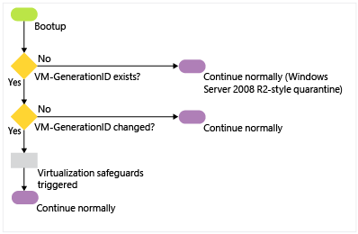
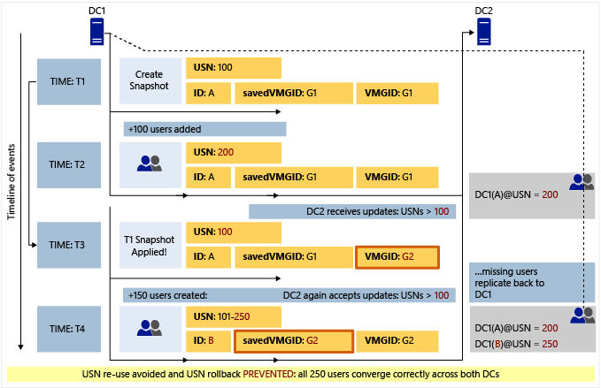

# Virtualized Domain Controller Architecture

>Applies To: Windows Server 2016, Windows Server 2012 R2, Windows Server 2012

This topic covers the architecture of virtualized domain controller cloning and safe restore. It shows the processes cloning and safe restore with flowcharts and then provides a detailed explanation of each step in the process.  
  
-   [Virtualized domain controller cloning architecture](../../../ad-ds/get-started/virtual-dc/Virtualized-Domain-Controller-Architecture.md#BKMK_CloneArch)  
  
-   [Virtualized domain controller safe restore architecture](../../../ad-ds/get-started/virtual-dc/Virtualized-Domain-Controller-Architecture.md#BKMK_SafeRestoreArch)  
  
## Virtualized domain controller cloning architecture  
  
### Overview  
Virtualized domain controller cloning relies on the hypervisor platform to expose an identifier called **VM-Generation ID** to detect creation of a virtual machine. AD DS initially stores the value of this identifier in its database (NTDS.DIT) during domain controller promotion. When the virtual machine boots up, the current value of the VM-Generation ID from the virtual machine is compared against the value in the database. If the two values are different, the domain controller resets the Invocation ID and discards the RID pool, thereby preventing USN re-use or the potential creation of duplicate security-principals. The domain controller then looks for a DCCloneConfig.xml file in the locations called out in Step 3 in [Cloning Detailed Processing](../../../ad-ds/get-started/virtual-dc/../../../ad-ds/get-started/virtual-dc/../../../ad-ds/get-started/virtual-dc/../../../ad-ds/get-started/virtual-dc/Virtualized-Domain-Controller-Architecture.md#BKMK_CloneProcessDetails). If it finds a DCCloneConfig.xml file, it concludes that it is being deployed as a clone, so it initiates cloning to provision itself as an additional domain controller by re-promoting using the existing NTDS.DIT and SYSVOL contents copied from source media.  
  
In a mixed environment where some hypervisors support VM-GenerationID and others do not, it is possible for a clone media to be accidentally deployed on a hypervisor that does not support VM-GenerationID. The presence of DCCloneConfig.xml file indicates administrative intent to clone a DC. Therefore, if a DCCloneConfig.xml file is found during boot but a VM-GenerationID is not provided from the host, the clone DC is booted into Directory Services Restore Mode (DSRM) to prevent any impact to the rest of the environment. The clone media can be subsequently moved to a hypervisor that supports VM-GenerationID and then cloning can be retried.  
  
If the clone media is deployed on a hypervisor that supports VM-GenerationID but a DCCloneConfig.xml file is not provided, as the DC detects a VM-GenerationID change between its DIT and the one from the new VM, it will trigger safeguards to prevent USN re-use and avoid duplicate SIDs. However, cloning will not be initiated, so the secondary DC will continue to run under the same identity as the source DC. This secondary DC should be removed from the network at the earliest possible time to avoid any inconsistencies in the environment. For more information about how to reclaim this secondary DC while ensuring that updates get replicated outbound, see Microsoft KB article [2742970](https://support.microsoft.com/kb/2742970).  
  
### Cloning Detailed Processing  
The following diagram shows the architecture for an initial cloning operation and for a cloning retry operation. These processes are explained in more detail later in this topic.  
  
**Initial Cloning Operation**  
  
  
  
**Cloning retry operation**  
  
  
  
The following steps explain the process in more detail:  
  
1.  An existing virtual machine domain controller boots up in a hypervisor that supports VM-Generation ID.  
  
    1.  This VM has no existing VM Generation-ID value set on its AD DS computer object after promotion.  
  
    2.  Even if it is null, the next computer creation will mean it still clones, as a new VM Generation-ID will not match.  
  
    3.  The VM Generation-ID is set after the next reboot of the DC, and does not replicate.  
  
2.  The virtual machine then reads the VM-Generation ID provided by the VMGenerationCounter driver. It compares the two VM-Generation IDs.  
  
    1.  If the IDs match, this is not a new virtual machine and cloning will not proceed. If a DCCloneConfig.xml file exists, the domain controller renames the file with a time-date stamp to prevent cloning. The server continues booting normally. This is how every reboot of any virtual domain controller operates in Windows Server 2012.  
  
    2.  If the two IDs do not match, this is a new virtual machine that contains an NTDS.DIT from a previous domain controller (or it is a restored snapshot). If a DCCloneConfig.xml file exists, the domain controller proceeds with cloning operations. If not, it continues with snapshot restoration operations. See [Virtualized domain controller safe restore architecture](../../../ad-ds/get-started/virtual-dc/../../../ad-ds/get-started/virtual-dc/../../../ad-ds/get-started/virtual-dc/../../../ad-ds/get-started/virtual-dc/Virtualized-Domain-Controller-Architecture.md#BKMK_SafeRestoreArch).  
  
    3.  If the hypervisor does not provide a VM-Generation ID for comparison but there is a DCCloneConfig.xml file, the guest renames the file and then boots into DSRM to protect the network from a duplicate domain controller. If there is no dccloneconfig.xml file, the guest boots normally (with the potential for a duplicate domain controller on the network). For more information about how to reclaim this duplicate domain controller, see Microsoft KB article [2742970](https://support.microsoft.com/kb/2742970).  
  
3.  The NTDS service checks the value of the VDCisCloning DWORD registry value name (under HKEY_Local_Machine\System\CurrentControlSet\Services\Ntds\Parameters).  
  
    1.  If it does not exist, this is a first attempt at cloning for this virtual machine. The guest implements the VDC object duplication safeguards of invalidating the local RID pool and setting a new replication invocation ID for the domain controller  
  
    2.  If it is already set to 0x1, this is a "retry" cloning attempt, where a previous cloning operation failed. The VDC object duplication safety measures are not taken as they had to have already run once before and would unnecessarily alter the guest multiple times.  
  
4.  The IsClone DWORD registry value name is written (under Hkey_Local_Machine\System\CurrentControlSet\Services\NTDS\Parameters)  
  
5.  The NTDS service changes the guest boot flag to start in DS Repair Mode for any further reboots.  
  
6.  The NTDS service attempts to read the DcCloneConfig.xml in one of the three accepted locations (DSA Working Directory, %windir%\NTDS, or removable read/write media, in order of drive letter, at the root of the drive).  
  
    1.  If the file does not exist in any valid location, the guest checks the IP address for duplication. If the IP address is not duplicated, the server boots up normally. If there is a duplicate IP address, the computer boots into DSRM to protect the network from a duplicate domain controller.  
  
    2.  If the file does exist in a valid location, the NTDS service validates its settings. If the file is blank (or any particular settings are blank) then NTDS configures automatic values for those settings.  
  
    3.  If the DcCloneConfig.xml exists but contains any invalid entries or is unreadable, cloning fails and the guest boots into Directory Services Restore Mode (DSRM).  
  
7.  The guest disables all DNS auto-registration to prevent accidental hijacking of the source computer name and IP addresses.  
  
8.  The guest stops the Netlogon service to prevent any advertising or answering of network AD DS requests from clients.  
  
9. NTDS validates that there are no services or programs installed that are not part of the DefaultDCCloneAllowList.xml or CustomDCCloneAllowList.xml  
  
    1.  If there are services or programs installed that are not in the default exclusion allow list or the custom exclusion allow list, cloning fails and the guest boots into DSRM to protect the network from a duplicate domain controller.  
  
    2.  If there are no incompatibilities, cloning continues.  
  
10. If automatic IP addressing will be used due to blank DCCloneConfig.xml network settings, the guest enables DHCP on the network adapters to gain an IP address lease, network routing, and name resolution information.  
  
11. The guest locates and contacts the domain controller running the PDC emulator FSMO role. This uses DNS and the DCLocator protocol. It makes an RPC connection and calls the method IDL_DRSAddCloneDC to clone the domain controller computer object.  
  
    1.  If the guest's source computer object holds domain head extended permission of "'Allow a DC to create a clone of itself" then cloning proceeds.  
  
    2.  If the guest's source computer object does not hold that extended permission, cloning fails and the guest boots into DSRM to protect the network from a duplicate domain controller.  
  
12. The AD DS computer object name is set to match the name specified in the DCCloneConfig.xml, if any, or else automatically generated on the PDCE. NTDS creates the correct NTDS setting object for the appropriate Active Directory logical site.  
  
    1.  If this is a PDC cloning, then the guest renames the local computer and reboots. After reboot, it goes through step 1 - 10 again, then goes to step 13.  
  
    2.  If this is a replica DC cloning, there is no reboot at this stage.  
  
13. The guest provides the promotion settings to the DS Role Server service, which commences promotion.  
  
14. The DS Role Server service stops all of the AD DS-related services (NTDS, NTFRS/DFSR, KDC, DNS).  
  
15. The guest forces NT5DS (Windows NTP) time synchronization with another domain controller (in a default Windows Time Service hierarchy, this means using the PDCE). The guest contacts the PDCE. All existing Kerberos tickets flush.  
  
16. The guest configures the DFSR or NTFRS services to run automatically. The guest deletes all existing DFSR and NTFRS database files (default: c:\windows\ntfrs and c:\system volume information\dfsr\\*<database_GUID>*), in order to force non-authoritative synchronization of SYSVOL when the service is next started. The guest does not delete the file contents of SYSVOL, to pre-seed the SYSVOL when the synchronization starts later.  
  
17. The guest is renamed. The DS Role Server service on the guest begins AD DS configuration (promotion), using the existing NTDS.DIT database file as a source, rather than the template database included in c:\windows\system32 like a promotion normally does.  
  
18. The guest contacts the RID Master FSMO role holder to get a new RID pool allocation.  
  
19. The promotion process creates a new invocation ID and recreates the NTDS Settings object for the cloned domain controller (irrespective of cloning, this is part of domain promotion when using an existing NTDS.DIT database).  
  
20. NTDS replicates in objects that are missing, newer, or have a higher version from a partner domain controller. The NTDS.DIT already contains objects from the time the source domain controller went offline, and those are used as possible in order to minimize replication traffic inbound. The global catalog partitions are populated.  
  
21. The DFSR or FRS service starts and because there is no database, SYSVOL non-authoritatively synchronizes inbound from a replication partner. This process re-uses pre-existing data in the SYSVOL folder, in order to minimize network replication traffic.  
  
22. The guest re-enables DNS client registration now that the computer is uniquely named and networked.  
  
23. The guest runs the SYSPREP modules specified by the DefaultDCCloneAllowList.xml <SysprepInformation> element in order to scrub out references to the previous computer name and SID.  
  
24. Cloning promotion is complete.  
  
    1.  The guest removes the DSRM boot flag so the next reboot will be normal.  
  
    2.  The guest renames the DCCloneConfig.xml with an appended date-time stamp, so that it is not read again at next boot up.  
  
    3.  The guest removes the VdcIsCloning DWORD registry value name under HKEY_Local_Machine\System\CurrentControlSet\Services\NTDS\Parameters.  
  
    4.  The guest sets the "VdcCloningDone" DWORD registry value name under HKEY_Local_Machine\System\CurrentControlSet\Services\NTDS\Parameters to 0x1. Windows does not use this value, but instead provides it as a marker for third parties.  
  
25. The guest updates the msDS-GenerationID attribute on its own cloned domain controller object to match the current guest VM-Generation ID.  
  
26. The guest restarts. It is now a normal, advertising domain controller.  
  
## Virtualized domain controller safe restore architecture  
  
### Overview  
AD DS relies on the hypervisor platform to expose an identifier called **VM-Generation ID** to detect the snapshot restore of a virtual machine. AD DS initially stores the value of this identifier in its database (NTDS.DIT) during domain controller promotion. When an administrator restores the virtual machine from a previous snapshot, the current value of the VM-Generation ID from the virtual machine is compared against the value in the database. If the two values are different, the domain controller resets the Invocation ID and discards the RID pool, thereby preventing USN re-use or the potential creation of duplicate security-principals. There are two scenarios where safe restore can occur:  
  
-   When a virtual domain controller is started after a snapshot has been restored while it was shut down  
  
-   When a snapshot is restored on a running virtual domain controller  
  
    If the virtualized domain controller in the snapshot is in a suspended state rather than shutdown, then you need to restart the AD DS service to trigger a new RID pool request. You can restart the AD DS service by using the Services snap-in or using Windows PowerShell (Restart-Service NTDS -force).  
  
The following sections explain safe restore in detail for each scenario.  
  
### Safe Restore Detailed Processing  
The following flowchart shows how safe restore occurs when a virtual domain controller is started after a snapshot has been restored while it was shut down.  
  
  
  
1.  When the virtual machine boots up after a snapshot restore, it will have new VM-Generation ID provided by the hypervisor host because of the snapshot restore.  
  
2.  The new VM-Generation ID from the virtual machine is compared to the VM-Generation ID in the database. Because the two IDs do not match, it employs virtualization safeguards (see step 3 in the previous section). After the restore finishes applying, the VM-GenerationID set on its AD DS computer object is updated to match the new ID provide by the hypervisor host.  
  
3.  The guest employs virtualization safeguards by:  
  
    1.  Invalidating the local RID pool.  
  
    2.  Setting a new invocation ID for the domain controller database.  
  
> [!NOTE]  
> This part of the safe restore overlaps with the cloning process. Although this process is about safe restore of a virtual domain controller after it boots up following a snapshot restore, the same steps happen during the cloning process.  
  
The following diagram shows how virtualization safeguards prevent divergence induced by USN rollback when a snapshot is restored on a running virtual domain controller.  
  
  
  
> [!NOTE]  
> The preceding illustration is simplified to explain the concepts.  
  
1.  At time T1, the hypervisor administrator takes a snapshot of virtual DC1. DC1 at this time has a USN value (**highestCommittedUsn** in practice) of 100, InvocationId (represented as ID in the preceding diagram) value of A (in practice this would be GUID). The savedVMGID value is the VM-GenerationID in the DIT file of the DC (stored against the computer object of the DC in an attribute named **msDS-GenerationId**). The VMGID is the current value of the VM-GenerationId available from the virtual machine driver. This value is supplied by the hypervisor.  
  
2.  At a later time T2, 100 users are added to this DC (consider users as an example of updates that could have been performed on this DC between time T1 and T2; these updates could actually be a mix of user creations, group creations, password updates, attribute updates, and so on). In this example, each update consumes one unique USN (though in practice a user creation may consume more than one USN). Before committing these updates, DC1 checks if the value of VM-GenerationID in its database (savedVMGID) is the same as the current value available from the driver (VMGID). They are same, as no rollback has happened yet, so the updates are committed and USN moves up to 200, indicating that the next update can use USN 201. There is no change in InvocationId, savedVMGID, or VMGID. These updates replicate out to DC2 at the next replication cycle. DC2 updates it high watermark (and **UptoDatenessVector**) represented here simply as DC1(A) @USN = 200. That is, DC2 is aware of all updates from DC1 in the context of InvocationId A through USN 200.  
  
3.  At time T3, the snapshot taken at time T1 is applied to DC1. DC1 has been rolled back, so its USN rolls back to 100, indicating it could use USNs from 101 to associate with subsequent updates. However, at this point, the value of VMGID would be different on hypervisors that support VM-GenerationID.  
  
4.  Subsequently, when DC1 performs any update, it checks whether the value of VM-GenerationId that it has in its database (savedVMGID) is the same as the value from the virtual machine driver (VMGID). In this case, it is not the same, so DC1 infers this as indicative of a rollback, and it triggers virtualization safeguards; in other words, it resets its InvocationId (ID = B) and discards the RID pool (not shown in the preceding diagram). It then saves the new value of VMGID in its database and commits those updates (USN 101 - 250) in the context of the new InvocationId B. At the next replication cycle, DC2 knows nothing from DC1 in the context of InvocationId B, so it requests everything from DC1 associated with InvocationID B. As a result, the updates performed on DC1 subsequent to the application of snapshot will safely converge. In addition, the set of updates that were performed on DC1 at T2 (which were lost on DC1 after the restore of the snapshot) would replicate back into DC1 at the next scheduled replication because they had replicated out to DC2 (as indicated by the dotted line back to DC1).  
  
After the guest employs virtualization safeguards, NTDS replicates Active Directory object differences inbound non-authoritatively from a partner domain controller. The up-to-dateness vector of the destination directory service is updated accordingly. Then the guest synchronizes SYSVOL:  
  
-   If using FRS, the guest stops the NTFRS service and sets D2 BURFLAGS registry value. It then starts the NTFRS service, which non-authoritatively replicates inbound, re-using existing unchanged SYSVOL data when possible.  
  
-   If using DFSR, the guest stops the DFSR service and deletes the DFSR database files (default location: %systemroot%\system volume information\dfsr\\*<database GUID>*). It then starts the DFSR service, which non-authoritatively replicates inbound, re-using existing unchanged SYSVOL data when possible.  
  
> [!NOTE]  
> -   If the hypervisor does not provide a VM-Generation ID for comparison, the hypervisor does not support virtualization safeguards and the guest will operate like a virtualized domain controller that runs Windows Server 2008 R2 or earlier. The guest implements USN rollback quarantine protection if there is an attempt to start replicating with USNs that have not advanced past the last highest USN seen by the partner DC. For more information about USN rollback quarantine protection, see [USN and USN Rollback](https://technet.microsoft.com/library/virtual_active_directory_domain_controller_virtualization_hyperv(WS.10).aspx)  
  

