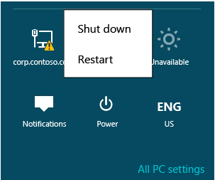

# Virtualized Domain Controller Deployment and Configuration

>Applies To: Windows Server 2016, Windows Server 2012 R2, Windows Server 2012

This topic covers:  
  
-   [Installation Considerations](../../../ad-ds/get-started/virtual-dc/Virtualized-Domain-Controller-Deployment-and-Configuration.md#BKMK_InstallConsiderations)  
  
    This includes platform requirements and other important constraints.  
  
-   [Virtualized Domain Controller Cloning](../../../ad-ds/get-started/virtual-dc/Virtualized-Domain-Controller-Deployment-and-Configuration.md#BKMK_VDCCloning)  
  
    This explains in detail the entire virtualized domain controller cloning process.  
  
-   [Virtualized Domain Controller Safe Restore](../../../ad-ds/get-started/virtual-dc/Virtualized-Domain-Controller-Deployment-and-Configuration.md#BKMK_VDCSafeRestore)  
  
    This explains in detail the validations that are made during virtualized domain controller safe restore.  
  
## <a name="BKMK_InstallConsiderations"></a>Installation Considerations  
There is no special role or feature installation for virtualized domain controllers; all domain controllers automatically contain cloning and safe restore capabilities. You cannot remove or disable these capabilities.  
  
Use of Windows Server 2012 domain controllers requires a Windows Server 2012 AD DS Schema version 56 or higher and forest functional level equal to Windows Server 2003 Native or higher.  
  
Both writable and read-only domain controllers support all aspects of virtualized DC, as do Global Catalogs and FSMO roles.  
  
> [!IMPORTANT]  
> The PDC Emulator FSMO role holder must be online when cloning begins.  
  
### <a name="BKMK_PlatformReqs"></a>Platform Requirements  
Virtualized Domain Controller cloning requires:  
  
-   PDC emulator FSMO role hosted on a Windows Server 2012 DC  
  
-   PDC emulator available during cloning operations  
  
Both cloning and safe restore require:  
  
-   Windows Server 2012 virtualized guests  
  
-   Virtualization host platform supports VM-Generation ID (VMGID)  
  
Review the table below for virtualization products and whether they support virtualized domain controllers and VM-Generation ID.  
  
|||  
|-|-|  
|**Virtualization Product**|**Supports virtualized domain controllers and VMGID**|  
|**Microsoft Windows Server 2012 server with Hyper-V Feature**|Yes|  
|**Microsoft Windows Server 2012 Hyper-V Server**|Yes|  
|**Microsoft Windows 8 with Hyper-V Client Feature**|Yes|  
|**Windows Server 2008 R2 and Windows Server 2008**|No|  
|**Non-Microsoft virtualization solutions**|Contact vendor|  
  
Even though Microsoft supports Windows 7 Virtual PC, Virtual PC 2007, Virtual PC 2004, and Virtual Server 2005, they cannot run 64-bit guests, nor do they support VM-GenerationID.  
  
For help with third party virtualization products and their support stance with virtualized domain controllers, contact that vendor directly.  
  
For more information, review Support policy for [Microsoft software running in non-Microsoft hardware virtualization software](https://support.microsoft.com/kb/897615).  
  
### Critical Caveats  
Virtualized domain controllers do *not* support safe restore of the following:  
  
-   VHD and VHDX files manually copied over existing VHD files  
  
-   VHD and VHDX files restored using file backup or full disk backup software  
  
> [!NOTE]  
> VHDX files are new to Windows Server 2012 Hyper-V.  
  
Neither of these operations is covered under VM-GenerationID semantics and therefore do not change the VM-Generation ID. Restoring domain controllers using these methods could either result in a USN rollback and either quarantine the domain controller or introduce lingering objects and the need for forest wide cleanup operations.  
  
> [!WARNING]  
> Virtualized domain controller safe restore is not a replacement for system state backups and the AD DS Recycle Bin.  
>   
> After restoring a snapshot, the deltas of previously un-replicated changes originating from that domain controller after the snapshot are permanently lost. Safe restore implements automated non-authoritative restoration to prevent accidental domain controller quarantine *only*.  
  
For more information about USN bubbles and lingering objects, see [Troubleshooting Active Directory operations that fail with error 8606: "Insufficient attributes were given to create an object"](https://support.microsoft.com/kb/2028495).  
  
## <a name="BKMK_VDCCloning"></a>Virtualized Domain Controller Cloning  
There are a number of stages and steps to cloning a virtualized domain controller, regardless of using graphical tools or Windows PowerShell. At a high level, the three stages are:  
  
**Prepare the environment**  
  
-   Step 1: Validate that the hypervisor supports VM-Generation ID and therefore, cloning  
  
-   Step 2: Verify the PDC emulator role is hosted by a domain controller that runs  Windows Server 2012  and that it is online and reachable by the cloned domain controller during cloning.  
  
**Prepare the source domain controller**  
  
-   Step 3: Authorize the source domain controller for cloning  
  
-   Step 4: Remove incompatible services or programs or add them to the CustomDCCloneAllowList.xml file.  
  
-   Step 5: Create DCCloneConfig.xml  
  
-   Step 6: Take the source domain controller offline  
  
**Create the cloned domain controller**  
  
-   Step 7: Copy or export the source VM and add the XML if not already copied  
  
-   Step 8: Create a new virtual machine from the copy  
  
-   Step 9: Start the new virtual machine to commence cloning  
  
There are no procedural differences in the operation when using graphical tools such as the Hyper-V Management Console or command-line tools such as Windows PowerShell, so the steps are presented only once with both interfaces. This topic provides Windows PowerShell samples for you to explore end-to-end automation of the cloning process; they are not required for any steps. There is no graphical management tool for virtualized domain controllers included in Windows Server 2012.  
  
There are several points in the procedure where you have choices for how to create the cloned computer and how you add the xml files; these steps are noted in the details below. The process is otherwise unalterable.  
  
The following diagram illustrates the virtualized domain controller cloning process, where the domain already exists.  
  
  
  
### Step 1 - Validate the Hypervisor  
Ensure the source domain controller is running on a supported hypervisor by reviewing vendor documentation. Virtualized domain controllers are hypervisor-independent and do not require Hyper-V.  
  
If the hypervisor is Microsoft Hyper-V, ensure it is running on  Windows Server 2012 . You can validate this using Device Management  
  
Open **Devmgmt.msc** and examine **System Devices** for installed Microsoft Hyper-V devices and drivers. The specific system device required for a virtualized domain controller is the **Microsoft Hyper-V Generation Counter** (driver: vmgencounter.sys).  
  
  
  
### Step 2 - Verify the PDCE FSMO role  
Before you attempt to clone a DC, you must validate that the domain controller hosting the Primary Domain Controller Emulator FSMO runs Windows Server 2012. The PDC emulator (PDCE) is required for several reasons:  
  
1.  The PDCE creates the special **Cloneable Domain Controllers** group and sets its permission on the root of the domain to allow a domain controller to clone itself.  
  
2.  The cloning domain controller contacts the PDCE directly using the DRSUAPI RPC protocol, in order to create computer objects for the clone DC.  
  
    > [!NOTE]  
    > Windows Server 2012 extends the existing Directory Replication Service (DRS) Remote Protocol (UUID **E3514235-4B06-11D1-AB04-00C04FC2DCD2**) to include a new RPC method **IDL_DRSAddCloneDC** (Opnum **28**). The **IDL_DRSAddCloneDC** method creates a new domain controller object by copying attributes from an existing domain controller object.  
    >   
    > The states of a domain controller are composed of computer, server, NTDS settings, FRS, DFSR, and connection objects maintained for each domain controller. When duplicating an object, this RPC method replaces all references to the original domain controller with corresponding objects of the new domain controller. The caller must have the control access right DS-Clone-Domain-Controller on the domain naming context.  
    >   
    > Use of this new method always requires direct access to the PDC emulator domain controller from the caller.  
    >   
    > Because this RPC method is new, your network analysis software requires updated parsers to include fields for the new Opnum 28 in the existing UUID E3514235-4B06-11D1-AB04-00C04FC2DCD2. Otherwise, you cannot parse this traffic.  
    >   
    > For more information, see [4.1.29 IDL_DRSAddCloneDC (Opnum 28)](https://msdn.microsoft.com/library/hh554213(v=prot.13).aspx).  
  
***This also means when using non-fully routed networks, virtualized domain controller cloning requires network segments with access to the PDCE***. It is acceptable to move a cloned domain controller to a different network after cloning - just like a physical domain controller - as long as you are careful to update the AD DS logical site information.  
  
> [!IMPORTANT]  
> When cloning a domain that contains only a single domain controller, you must ensure the source DC is back online before starting the clone copies. A production domain should always contain at least two domain controllers.  
  
#### Active Directory Users and Computers Method  
  
1.  Using the Dsa.msc snap-in, right click the domain and click **Operations Masters**. Note the domain controller named on the PDC tab and close the dialog.  
  
2.  Right-click that DC's computer object and click **Properties**, and then validate the Operating System info.  
  
#### Windows PowerShell Method  
You can combine the following Active Directory Windows PowerShell Module cmdlets to return the version of the PDC emulator:  
  
```  
Get-adddomaincontroller  
Get-adcomputer  
```  
  
If not provided the domain, these cmdlets assume the domain of the computer where run.  
  
The following command returns PDCE and Operating System info:  
  
```  
get-adcomputer(Get-ADDomainController -Discover -Service "PrimaryDC").name -property * | format-list dnshostname,operatingsystem,operatingsystemversion  
```  
  
This example below demonstrates specifying the domain name and filtering the returned properties before the Windows PowerShell pipeline:  
  
  
  
### Step 3 - Authorize a Source DC  
The source domain controller must have the control access right (CAR) **Allow a DC to create a clone of itself** on the domain NC head. By default, the well-known group **Cloneable Domain Controllers** has this permission and contains no members. The PDCE creates this group when that FSMO role transfers to a Windows Server 2012 domain controller.  
  
#### Active Directory Administrative Center Method  
  
1.  Start Dsac.exe and navigate to the source DC, then open its detail page.  
  
2.  In the **Member Of** section, add the **Cloneable Domain Controllers** group for that domain.  
  
#### Windows PowerShell Method  
You can combine the following Active Directory Windows PowerShell Module cmdlets **get-adcomputer** and **add-adgroupmember** to add a domain controller to the **Cloneable Domain Controllers** group:  
  
```  
Get-adcomputer <dc name> | %{add-adgroupmember "cloneable domain controllers" $_.samaccountname}  
```  
  
For instance, this adds server DC1 to the group, without the need to specify the distinguished name of the group member:  
  
  
  
#### Rebuilding Default Permissions  
If you remove this permission from the domain head, cloning fails. You can recreate the permission using the Active Directory Administrative Center or Windows PowerShell.  
  
##### Active Directory Administrative Center Method  
  
1.  Open **Active Directory Administrative Center**, right-click the domain head, click **Properties**, click the **Extensions** tab, click **Security**, and then click **Advanced**. Click **This Object Only**.  
  
2.  Click **Add**, under **Enter the object name to select**, type the group name **Cloneable Domain Controllers.**  
  
3.  Under Permissions, click **Allow a DC to create a clone of itself**, and then click **OK**.  
  
> [!NOTE]  
> You can also remove the default permission and add individual domain controllers. Doing so is likely to cause ongoing maintenance problems however, where new administrators are unaware of this customization. Changing the default setting does not increase security and is discouraged.  
  
##### Windows PowerShell Method  
Use the following commands in an administrator-elevated Windows PowerShell console prompt. These commands detect the domain name and add back in the default permissions:  
  
```  
import-module activedirectory  
cd ad:  
$domainNC = get-addomain  
$dcgroup = get-adgroup "Cloneable Domain Controllers"  
$sid1 = (get-adgroup $dcgroup).sid  
$acl = get-acl $domainNC  
$objectguid = new-object Guid 3e0f7e18-2c7a-4c10-ba82-4d926db99a3e  
$ace1 = new-object System.DirectoryServices.ActiveDirectoryAccessRule $sid1,"ExtendedRight","Allow",$objectguid  
$acl.AddAccessRule($ace1)  
set-acl -aclobject $acl $domainNC  
cd c:  
```  
  
Alternatively, run the sample [FixVDCPermissions.ps1](../../../ad-ds/reference/virtual-dc/Virtualized-Domain-Controller-Technical-Reference-Appendix.md#BKMK_FixPDCPerms) in a Windows PowerShell console, where the console starts as an elevated administrator on a domain controller in the affected domain. It automatically set the permissions. The sample is located in the appendix of this module.  
  
### Step 4 - Remove Incompatible applications or services (if not using CustomDCCloneAllowList.xml)  
Any programs or services previously returned by Get-ADDCCloningExcludedApplicationList - *and not added to the CustomDCCloneAllowList.xml* - must be removed prior to cloning. Uninstalling the application or service is the recommended method.  
  
> [!WARNING]  
> Any incompatible program or service not uninstalled or added to the CustomDCCloneAllowList.xml prevents cloning.  
  
Use the Get-AdComputerServiceAccount cmdlet to locate any standalone Managed Service Accounts (MSAs) in the domain and if this computer is using any of them. If any MSA is installed, use the Uninstall-ADServiceAccount cmdlet to remove the locally installed service account. Once you are done with taking the source domain controller offline in step 6, you can re-add the MSA using Install-ADServiceAccount when the server is back online. For more information, see [Uninstall-ADServiceAccount](https://technet.microsoft.com/library/hh852310).  
  
> [!IMPORTANT]  
> Standalone MSAs - first released in Windows Server 2008 R2 - were replaced in Windows Server 2012 with group MSAs. Group MSAs support cloning.  
  
### Step 5 - Create DCCloneConfig.xml  
The DcCloneConfig.xml file is required for cloning Domain controllers. Its contents allow you to specify unique details like the new computer name and IP address.  
  
The CustomDCCloneAllowList.xml file is optional unless you install applications or potentially incompatible Windows services on the source domain controller. The files require precise naming, formatting, and placement; otherwise, cloning fails.  
  
For that reason, you should always use the Windows PowerShell cmdlets to create the XML files and place them in the correct location.  
  
#### Generating with New-ADDCCloneConfigFile  
The Active Directory Windows PowerShell module contains a new cmdlet in Windows Server 2012:  
  
```  
New-ADDCCloneConfigFile  
```  
  
You run the cmdlet on the proposed source domain controller that you intend to clone. The cmdlet supports multiple arguments and when used, always tests the computer and environment where it is run unless you specify the -offline argument.  
  
||||  
|-|-|-|  
|**ActiveDirectory**<br /><br />**Cmdlet**|**Arguments**|**Explanation**|  
|**New-ADDCCloneConfigFile**|*<no argument specified>*|Creates a blank DcCloneConfig.xml file in the DSA Working Directory (default: %systemroot%\ntds)|  
||-CloneComputerName|Specifies the clone DC computer name. String data type.|  
||-Path|Specifies the folder to create the DcCloneConfig.xml. If not specified, writes to the DSA Working Directory (default: %systemroot%\ntds). String data type.|  
||-SiteName|Specifies the AD logical site name to join during cloned computer account creation. String data type.|  
||-IPv4Address|Specifies the static IPv4 address of the cloned computer. String data type.|  
||-IPv4SubnetMask|Specifies the static IPv4 subnet mask of the cloned computer. String data type.|  
||-IPv4DefaultGateway|Specifies the static IPv4 default gateway address of the cloned computer. String data type.|  
||-IPv4DNSResolver|Specifies the static IPv4 DNS entries of the cloned computer in a comma-separated list. Array data type. Up to four entries can be provided.|  
||-PreferredWINSServer|Specifies the static IPv4 address of the primary WINS server. String data type.|  
||-AlternateWINSServer|Specifies the static IPv4 address of the secondary WINS server. String data type.|  
||-IPv6DNSResolver|Specifies the static IPv6 DNS entries of the cloned computer in a comma-separated list. There is no way to set Ipv6 static information in virtualized domain controller cloning. Array data type.|  
||-Offline|Does not perform the validation tests and overwrites any existing dccloneconfig.xml. Has no parameters.|  
||*-Static*|Required if specifying static IP arguments IPv4SubnetMask, IPv4SubnetMask, or IPv4DefaultGateway. Has no parameters.|  
  
Tests performed when run in online mode:  
  
-   PDC Emulator is Windows Server 2012 or later  
  
-   Source domain controller is a member of Cloneable Domain Controllers group  
  
-   Source domain controller does not include any excluded applications or services  
  
-   Source domain controller does not already contain a DcCloneConfig.xml at the specified path  
  
  
  
### Step 6 - Take the Source Domain Controller Offline  
You cannot copy a running source DC; it must be shutdown gracefully. Do not clone a domain controller stopped by graceless power loss.  
  
#### Graphical Method  
Use the shutdown button within the running DC, or the Hyper-V Manager shutdown button.  
  
  
  
  
  
#### Windows PowerShell Method  
You can shut down a virtual machine using either of the following cmdlets:  
  
```  
Stop-computer  
Stop-vm  
```  
  
Stop-computer is a cmdlet that supports shutting down computers regardless of virtualization, and is analogous to the legacy Shutdown.exe utility. Stop-vm is a new cmdlet in the Windows Server 2012 Hyper-V Windows PowerShell module, and is equivalent to the power options in Hyper-V Manager. The latter is useful in lab environments where the domain controller often operates on a private virtualized network.  
  
  
  
  
  
### Step 7 - Copy Disks  
An administrative choice is required in the copying phase:  
  
-   Copy the disks manually, without Hyper-V  
  
-   Export the VM, using Hyper-V  
  
-   Export the merged disks, using Hyper-V  
  
All of a virtual machine's disks must be copied, not just the system drive. If the source domain controller uses differencing disks and you plan to move your cloned domain controller to another Hyper-V host, you must export.  
  
Copying disks manually is recommended if the source domain controller has only *one* drive. Export/Import is recommended for VMs with *more than one* drive or other complex virtualized hardware customizations like multiple NICs.  
  
If copying files manually, delete any snapshots prior to copying. If exporting the VM, delete snapshots prior to exporting or delete them from the new VM after importing.  
  
> [!WARNING]  
> Snapshots are differencing disks that can return a domain controller to previous state. If you were to clone a domain controller and then restore its pre-cloning snapshot, you would end up with duplicate domain controllers in the forest. There is no value in prior snapshots on a newly cloned domain controller.  
  
#### Manually Copying Disks  
  
##### Hyper-V Manager Method  
Use the Hyper-V Manager snap-in to determine which disks are associated with the source domain controller. Use the Inspect option to validate if the domain controller uses differencing disks (which requires that you copy the parent disk also)  
  
  
  
To delete snapshots, select a VM and delete the snapshot subtree.  
  
  
  
You can then manually copy the VHD or VHDX files using Windows Explorer, Xcopy.exe, or Robocopy.exe. No special steps are required. It is a best practice to change the file names even if moving to another folder.  
  
> [!NOTE]  
> If copying between host computers on a LAN (1-Gbit or greater), the **Xcopy.exe /J** option copies VHD/VHDX files considerably faster than any other tool, at the cost of much greater bandwidth usage.  
  
##### Windows PowerShell Method  
To determine the disks using Windows PowerShell, use the Hyper-V Modules:  
  
```  
Get-vmidecontroller  
Get-vmscsicontroller  
Get-vmfibrechannelhba  
Get-vmharddiskdrive  
```  
  
For example, you can return all IDE hard drives from a VM named **DC2** with the following sample:  
  
  
  
If the disk path points to an AVHD or AVHDX file, it is a snapshot. To delete the snapshots associated with a disk and merge in the real VHD or VHDX, use cmdlets:  
  
```  
Get-VMSnapshot  
Remove-VMSnapshot  
```  
  
For example, to delete all snapshots from a VM named DC2-SOURCECLONE:  
  
  
  
To copy the files using Windows PowerShell, use the following cmdlet:  
  
```  
Copy-Item  
```  
  
Combine with VM cmdlets in pipelines to aid automation. The pipeline is a channel used between multiple cmdlets to pass data. For example, to copy the drive of an offline source domain controller named DC2-SOURCECLONE to a new disk called c:\temp\copy.vhd without the need to know the exact path to its system drive:  
  
```  
Get-VMIdeController dc2-sourceclone | Get-VMHardDiskDrive | select-Object {copy-item -path $_.path -destination c:\temp\copy.vhd}  
```  
  
  
  
> [!IMPORTANT]  
> You cannot use passthru disks with cloning, as they do not use a virtual disk file but instead an actual hard disk.  
  
> [!NOTE]  
> For more information about more Windows PowerShell operations with pipelines, see [Piping and the Pipeline in Windows PowerShell](https://technet.microsoft.com/library/ee176927.aspx).  
  
#### Exporting the VM  
As an alternative to copying the disks, you can export the entire Hyper-V VM as a copy. Exporting automatically creates a folder named for the VM and containing all disks and configuration information.  
  
  
  
##### Hyper-V Manager Method  
To export a VM with Hyper-V Manager:  
  
1.  Right-click the source domain controller and click **Export**.  
  
2.  Select an existing folder as the export container.  
  
3.  Wait for the Status column to stop showing **Exporting**.  
  
##### Windows PowerShell Method  
To export a VM using the Hyper-V Windows PowerShell module, use cmdlet:  
  
```  
Export-vm  
```  
  
For example, to export a VM named DC2-SOURCECLONE to a folder named C:\VM:  
  
  
  
> [!NOTE]  
> Windows Server 2012 Hyper-V supports new export and import capabilities that are outside the scope of this training. Review TechNet for more information.  
  
#### Exporting merged disks, using Hyper-V  
The final option is to use the disk merge and conversion options within Hyper-V. These allow you to make a copy of an existing disk structure - even when including snapshot AVHD/AVHDX files - into a single new disk. Like the manual disk copy scenario, this is primarily intended for simpler virtual machines that only use a single drive, such as C:\\. Its lone advantage is that, unlike manually copying, it does not require you to first delete snapshots. This operation is necessarily slower than simply deleting the snapshots and copying disks.  
  
##### Hyper-V Manager Method  
To create a merged disk using Hyper-V Manager:  
  
1.  Click **Edit Disk**.  
  
2.  Browse for the lowest child disk. For example, if you are using a differencing disk, the child disk is the lowest child. If the virtual machine has a snapshot (or multiple ones), the currently selected snapshot is the lowest child disk.  
  
3.  Select the **Merge** option to create a single disk out of the entire parent-child structure.  
  
4.  Select a new virtual hard disk and provide a path. This reconciles the existing VHD/VHDX files into a single new portable unit that is not at risk of restoring previous snapshots.  
  
##### Windows PowerShell Method  
To create a merged disk from a complex set of parents using the Hyper-V Windows PowerShell module, use cmdlet:  
  
```  
Convert-vm  
```  
  
For example, to export the entire chain of a VM's disk snapshots (this time not including any differencing disks) and parent disk into a new single disk named DC4-CLONED.VHDX:  
  
  
  
#### <a name="BKMK_Offline"></a>Adding XML to the Offline System Disk  
If you did copy the Dccloneconfig.xml to the running source DC, you must copy the updated dccloneconfig.xml file to the offline copied/exported system disk now. Depending on installed applications detected with Get-ADDCCloningExcludedApplicationList earlier, you may also need to copy the CustomDCCloneAllowList.xml file to the disk.  
  
The following locations can contain the DcCloneConfig.xml file:  
  
1.  DSA Working Directory  
  
2.  %windir%\NTDS  
  
3.  Removable read/write media, in order of drive letter, at the root of the drive  
  
These paths are not configurable. After cloning begins, the cloning checks these locations in that specific order and uses the first DcCloneConfig.xml file found, regardless of the other folder's contents.  
  
The following locations can contain the CustomDCCloneAllowList.xml file:  
  
1.  HKey_Local_Machine\System\CurrentControlSet\Services\NTDS\Parameters  
  
    AllowListFolder (*REG_SZ*)  
  
2.  DSA Working Directory  
  
3.  %windir%\NTDS  
  
4.  Removable read/write media, in order of drive letter, at the root of the drive  
  
You can run New-ADDCCloneConfigFile with the **-offline** argument (also known as offline mode) to create the DcCloneConfig.xml file and place it in a correct location. The following examples show how to run New-ADDCCloneConfigFile in offline mode.  
  
To create a clone domain controller named CloneDC1 in offline mode, in a site called "REDMOND" with static IPv4 address, type:  
  
```  
New-ADDCCloneConfigFile -Offline -CloneComputerName CloneDC1 -SiteName REDMOND -IPv4Address "10.0.0.2" -IPv4DNSResolver "10.0.0.1" -IPv4SubnetMask "255.255.0.0" -IPv4DefaultGateway "10.0.0.1" -Static -Path F:\Windows\NTDS  
```  
  
To create a clone domain controller named Clone2 in offline mode with static IPv4 and static IPv6 settings, type:  
  
```  
New-ADDCCloneConfigFile -Offline -IPv4Address "10.0.0.2" -IPv4DNSResolver "10.0.0.1" -IPv4SubnetMask "255.255.0.0" -Static -IPv6DNSResolver "2002:4898:e0:31fc:d61:2b0a:c9c9:2ccc" -CloneComputerName "Clone2" -PreferredWINSServer "10.0.0.1" -AlternateWINSServer "10.0.0.3" -Path F:\Windows\NTDS  
```  
  
To create a clone domain controller in offline mode with static IPv4 and dynamic IPv6 settings and specify multiple DNS servers for the DNS resolver settings, type:  
  
```  
New-ADDCCloneConfigFile -Offline -IPv4Address "10.0.0.10" -IPv4SubnetMask "255.255.0.0" -IPv4DefaultGateway "10.0.0.1" -IPv4DNSResolver @( "10.0.0.1","10.0.0.2" ) -Static -IPv6DNSResolver "2002:4898:e0:31fc:d61:2b0a:c9c9:2ccc" -Path F:\Windows\NTDS   
```  
  
To create a clone domain controller named Clone1 in offline mode with dynamic IPv4 and static IPv6 settings, type:  
  
```  
New-ADDCCloneConfigFile -Offline -Static -IPv6DNSResolver "2002:4898:e0:31fc:d61:2b0a:c9c9:2ccc" -CloneComputerName "Clone1" -PreferredWINSServer "10.0.0.1" -AlternateWINSServer "10.0.0.3" -SiteName "REDMOND" -Path F:\Windows\NTDS  
```  
  
To create a clone domain controller in offline mode with dynamic IPv4 and dynamic IPv6 settings, type:  
  
```  
New-ADDCCloneConfigFile -Offline -IPv4DNSResolver "10.0.0.1" -IPv6DNSResolver "2002:4898:e0:31fc:d61:2b0a:c9c9:2ccc" -Path F:\Windows\NTDS  
  
```  
  
##### Windows Explorer Method  
Windows Server 2012 now offers a graphical option for mounting VHD and VHDX files. This requires installation of the Desktop Experience feature on Windows Server 2012.  
  
1.  Click the newly copied VHD/VHDX file that contains the source DC's system drive or DSA Working Directory location folder, and then click **Mount** from the **Disc Image Tools** menu.  
  
2.  In the now-mounted drive, copy the XML files to a valid location. You may be prompted for permissions to the folder.  
  
3.  Click the mounted drive and click **Eject** from the **Disk Tools** menu.  
  
  
  
  
  
  
  
##### Windows PowerShell Method  
Alternatively, you can mount the offline disk and copy the XML file using the Windows PowerShell cmdlets:  
  
```  
mount-vhd  
get-disk  
get-partition  
get-volume  
Add-PartitionAccessPath  
Copy-Item  
```  
  
This allows you complete control over the process. For instance, the drive can be mounted with a specific drive letter, the file copied, and the drive dismounted.  
  
```  
mount-vhd <disk path> -passthru -nodriveletter | get-disk | get -partition | get-volume | get-partition | where {$_.partition number -eq 2} | Add-PartitionAccessPath -accesspath <drive letter>  
  
copy-item <xml file path><destination path>\dccloneconfig.xml  
  
dismount-vhd <disk path>  
```  
  
For example:  
  
  
  
Alternatively, you can use the new **Mount-DiskImage** cmdlet to mount a VHD (or ISO) file.  
  
### Step 8 - Create the New Virtual Machine  
The final configuration step before starting the cloning process is creating a new VM that uses the disks from the copied source domain controller. Depending on the selection made in the copying disks phase, you have two options:  
  
1.  Associate a new VM with the copied disk  
  
2.  Import the exported VM  
  
#### Associating a New VM with Copied Disks  
If you copied the system disk manually, you must create a new virtual machine using the copied disk. The hypervisor automatically sets the VM-Generation ID when a new VM is created; no configuration changes are required in the VM or Hyper-V host.  
  
  
  
##### Hyper-V Manager Method  
  
1.  Create a new virtual machine.  
  
2.  Specify the VM name, memory, and network.  
  
3.  On the Connect Virtual Hard Disk page, specify the copied system disk.  
  
4.  Complete the wizard to create the VM.  
  
If there were multiple disks, network adapters, or other customizations, configure them before starting the domain controller. The "Export-Import" method of copying disks is recommended for complex VMs.  
  
##### Windows PowerShell Method  
You can use the Hyper-V Windows PowerShell module to automate VM creation in Windows Server 2012, using the following cmdlet:  
  
```  
New-VM  
```  
  
For example, here the DC4-CLONEDFROMDC2 VM is created, using 1GB of RAM, booting from the c:\vm\dc4-systemdrive-clonedfromdc2.vhd file, and using the 10.0 virtual network:  
  
  
  
#### Import VM  
If you previously exported your VM, you now need to import it back in as a copy. This uses the exported XML to recreate the computer using all the previous settings, drives, networks, and memory settings.  
  
If you intend to create additional copies from the same exported VM, make as many copies of the exported VM as necessary. Then use Import for each copy.  
  
> [!IMPORTANT]  
> It is important to use the **Copy** option, as export preserves all information from the source; importing the server with **Move** or **In Place** causes information collision if done on the same Hyper-V host server.  
  
##### Hyper-V Manager Method  
To import using the Hyper-V Manager snap-in:  
  
1.  Click **Import Virtual Machine**  
  
2.  On the **Locate Folder** page, select the exported VM definition file using the Browse button  
  
3.  On the **Select Virtual Machine** page, click the source computer.  
  
4.  On the **Choose Import Type** page, click **Copy the virtual machine (create a new unique ID)**, then click **Finish**.  
  
5.  Rename the imported VM if importing on the same Hyper-V host; it will have the same name as the exported source domain controller.  
  
  
  
  
  
  
  
Remember to remove any imported snapshots, using the Hyper-V Management snap-in:  
  
  
  
> [!WARNING]  
> Deleting any imported snapshots is critically important; if applied, they would return the cloned domain controller to the state of a previous - and possibly live - DC, leading to replication failure, duplicate IP information, and other disruptions.  
  
##### Windows PowerShell Method  
You can use the Hyper-V Windows PowerShell module to automate VM import in Windows Server 2012, using the following cmdlets:  
  
```  
Import-VM  
Rename-VM  
```  
  
For example, here the exported VM DC2-CLONED is imported using its automatically determined XML file, then renamed immediately to its new VM name DC5-CLONEDFROMDC2:  
  
  
  
Remember to remove any imported snapshots, using the following cmdlets:  
  
```  
Get-VMSnapshot  
Remove-VMSnapshot  
```  
  
For example:  
  
  
  
> [!WARNING]
> Ensure that, when importing the computer, static MAC addresses were not assigned to the source domain controller. If a source computer with a static MAC is cloned, those copied computers will not correctly send or receive any network traffic. Set a new unique static or dynamic MAC address if this is the case. You can see if a VM uses static MAC addresses with the command:  
> 
> **Get-VM -VMName**   
>  ***test-vm* | Get-VMNetworkAdapter | fl \\***  
  
### Step 9 - Clone the New Virtual Machine  
Optionally, before you begin cloning, restart the offline clone source domain controller. Ensure that the PDC emulator is online, regardless.  
  
To begin cloning, simply start the new virtual machine. The process initiates automatically and the domain controller reboots automatically after cloning is complete.  
  
> [!IMPORTANT]  
> Keeping domain controllers turned off for an extended period of time is not recommended and if the clone is joining the same site as its source DC, the initial intra and inter-site replication topology may take longer to build if the source domain controller is offline.  
  
If using Windows PowerShell to start a VM, the new Hyper-V Module cmdlet is:  
  
```  
Start-VM  
```  
  
For example:  
  
  
  
Once the computer restarts after cloning completes, it is a domain controller and you can logon on normally to confirm normal operation. If there are any errors, the server is set to start in Directory Services Restore Mode for investigation.  
  
## <a name="BKMK_VDCSafeRestore"></a>Virtualization safeguards  
Unlike virtualized domain controller cloning, Windows Server 2012 virtualization safeguards have no configuration steps. The feature works without intervention as long as you meet some simple conditions:  
  
-   The hypervisor supports VM-Generation ID  
  
-   There is a valid partner domain controller that a restored domain controller can replicate changes from non-authoritatively.  
  
### Validate the Hypervisor  
Ensure the source domain controller is running on a supported hypervisor by reviewing vendor documentation. Virtualized domain controllers are hypervisor-independent and do not require Hyper-V.  
  
Review the previous [Platform Requirements](../../../ad-ds/get-started/virtual-dc/../../../ad-ds/get-started/virtual-dc/../../../ad-ds/get-started/virtual-dc/../../../ad-ds/get-started/virtual-dc/Virtualized-Domain-Controller-Deployment-and-Configuration.md#BKMK_PlatformReqs) section for known VM-Generation ID support.  
  
If you are migrating VMs from a source hypervisor to a different target hypervisor, virtualization safeguards may or may not be triggered depending on whether the hypervisors support VM-Generation ID, as explained in the following table.  
  
|Source hypervisor|Target hypervisor|Result|  
|---------------------|---------------------|----------|  
|Supports VM-Generation ID|Does not support VM-Generation ID|Safeguards not triggered (if a DCCloneConfigFile.xml is present, DC will boot into DSRM)|  
|Does not support VM-Generation ID|Supports VM-Generation ID|Safeguards triggered|  
|Supports VM-Generation ID|Supports VM-Generation ID|Safeguards not triggered because VM definition has not changed, which means so VM-Generation ID remains the same|  
  
### Validate the Replication Topology  
Virtualization safeguards initiate non-authoritative inbound replication for the delta of Active Directory replication as well as non-authoritative resynchronization of all SYSVOL contents. This ensures the domain controller returns from a snapshot with full functionality and is eventually consistent with the rest of the environment.  
  
With this new capability come several requirements and limitations:  
  
-   A restored domain controller must be able to contact a writable DC  
  
-   All domain controllers in a domain must not be restored simultaneously  
  
-   Any changes originating from a restored domain controller that have not yet replicated outbound since the snapshot was taken are lost forever  
  
While the troubleshooting section covers these scenarios, details below ensure you do not create a topology that could cause problems.  
  
#### Writable Domain Controller Availability  
If restored, a domain controller must have connectivity to a writable domain controller; a read-only domain controller cannot send the delta of updates. The topology is likely correct for this already, as a writable domain controller always needed a writable partner. However, if all writable domain controllers are restoring simultaneously, none of them can find a valid source. The same goes if the writable domain controllers are offline for maintenance or otherwise unreachable through the network.  
  
#### Simultaneous Restore  
Do not restore all domain controllers in a single domain simultaneously. If all snapshots restore at once, Active Directory replication works normally but SYSVOL replication halts. The restore architecture of FRS and DFSR require setting their replica instance to non-authoritative sync mode. If all domain controllers restore at once, and each domain controller marks itself non-authoritative for SYSVOL, they all will then try to synchronize group policies and scripts from an authoritative partner; at that point, though, all partners are also non-authoritative.  
  
> [!IMPORTANT]  
> If all domain controllers are restored at once, use the following articles to set one domain controller - typically the PDC emulator - as authoritative, so that the other domain controllers can return to normal operation:  
>   
> [Using the BurFlags registry key to reinitialize File Replication Service replica sets](https://support.microsoft.com/kb/290762)  
>   
> [How to force an authoritative and non-authoritative synchronization for DFSR-replicated SYSVOL (like "D4/D2" for FRS)](https://support.microsoft.com/kb/2218556)  
  
> [!WARNING]  
> Do not run all domain controllers in a forest or domain on the same hypervisor host. That introduces a single point of failure that cripples AD DS, Exchange, SQL, and other enterprise operations each time the hypervisor goes offline. This is no different from using only one domain controller for an entire domain or forest. Multiple domain controllers on multiple platforms help provide redundancy and fault tolerance.  
  
#### Post-Snapshot Replication  
Do not restore snapshots until all locally originating changes made since snapshot creation have replicated outbound. Any originating changes are lost forever if other domain controllers did not already receive them through replication.  
  
Use Repadmin.exe to show any un-replicated outbound changes between a domain controller and its partners:  
  
1.  Return the DC's partner names and DSA Object GUIDs with:  
  
    ```  
    Repadmin.exe /showrepl <DC Name of the partner> /repsto  
    ```  
  
2.  Return the pending inbound replication of the partner domain controller to the domain controller to be restored:  
  
    ```  
    Repadmin.exe /showchanges < Name of partner DC><DSA Object GUID of the domain controller being restored><naming context to compare>  
    ```  
  
Alternatively, just to see the count of un-replicated changes:  
  
```  
Repadmin.exe /showchanges <Name of partner DC><DSA Object GUID of the domain controller being restored><naming context to compare> /statistics  
```  
  
For example (with output modified for readability and important entries ***italicized***), here you look at the replication partnerships of DC4:  
  
```  
C:\>repadmin.exe /showrepl dc4.corp.contoso.com /repsto  
  
Default-First-Site-Name\DC4  
DSA Options: IS_GC  
Site Options: (none)  
DSA object GUID: 5d083398-4bd3-48a4-a80d-fb2ebafb984f  
DSA invocationID: 730fafec-b6d4-4911-88f2-5b64e48fc2f1  
  
==== OUTBOUND NEIGHBORS FOR CHANGE NOTIFICATIONS ============  
  
DC=corp,DC=contoso,DC=com  
    Default-First-Site-Name\DC3 via RPC  
        DSA object GUID: f62978a8-fcf7-40b5-ac00-40aa9c4f5ad3  
        Last attempt @ 2011-11-11 15:04:12 was successful.  
    Default-First-Site-Name\DC2 via RPC  
        DSA object GUID: 3019137e-d223-4b62-baaa-e241a0c46a11  
        Last attempt @ 2011-11-11 15:04:15 was successful.  
```  
  
Now you know that it is replicating with DC2 and DC3. You then show the list of changes that DC2 states it still does not have from DC4, and see that there is one new group:  
  
```  
C:\>repadmin /showchanges dc2.corp.contoso.com 5d083398-4bd3-48a4-a80d-fb2ebafb984f dc=corp,dc=contoso,dc=com  
  
==== SOURCE DSA: (null) ====  
Objects returned: 1  
(0) add CN=newgroup4,CN=Users,DC=corp,DC=contoso,DC=com  
    1> parentGUID: 55fc995a-04f4-4774-b076-d6a48ac1af99  
    1> objectGUID: 96b848a2-df1d-433c-a645-956cfbf44086  
    2> objectClass: top; group  
    1> instanceType: 0x4 = ( WRITE )  
    1> whenCreated: 11/11/2011 3:03:57 PM Eastern Standard Time  
```  
  
You would also test the other partner to ensure that it had not already replicated.  
  
Alternatively, if you did not care which objects had not replicated and only cared that any objects were outstanding, you can use the **/statistics** option:  
  
```  
C:\>repadmin /showchanges dc2.corp.contoso.com 5d083398-4bd3-48a4-a80d-fb2ebafb984f dc=corp,dc=contoso,dc=com /statistics  
  
***********************************************  
********* Grand total *************************  
Packets:              1  
Objects:              1Object Additions:     1Object Modifications: 0Object Deletions:     0Object Moves:         0Attributes:           12Values:               13  
```  
  
> [!IMPORTANT]  
> Test all writable partners if you see any failures or outstanding replication. As long as at least one is converged, it is generally safe to restore the snapshot, as transitive replication eventually reconciles the other servers.  
>   
> Be sure to note any errors in replication shown by /showchanges and do not proceed until they are fixed.  
  
### Windows PowerShell Snapshot Cmdlets  
The following Windows PowerShell Hyper-V module cmdlets provide snapshot capabilities in Windows Server 2012:  
  
```  
Checkpoint-VM  
Export-VMSnapshot  
Get-VMSnapshot  
Remove-VMSnapshot  
Rename-VMSnapshot  
Restore-VMSnapshot  
```  
  


