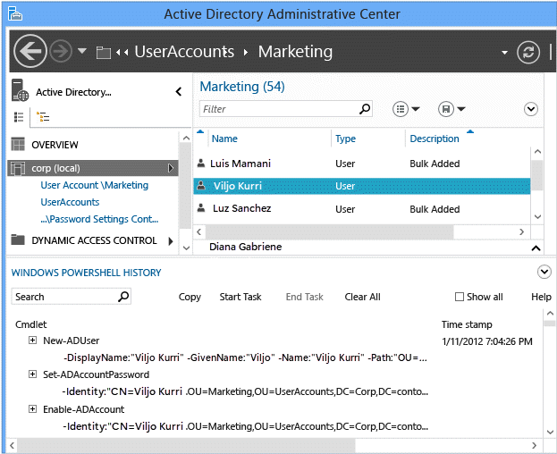

# AD DS Simplified Administration

>Applies To: Windows Server 2016, Windows Server 2012 R2, Windows Server 2012

This topic explains the capabilities and benefits of Windows Server 2012 domain controller deployment and administration, and the differences between previous operating system DC deployment and the new Windows Server 2012 implementation.  
  
Windows Server 2012 introduced the next generation of Active Directory Domain Services Simplified Administration, and was the most radical domain re-envisioning since Windows 2000 Server. AD DS Simplified Administration takes lessons learned from twelve years of Active Directory and makes a more supportable, more flexible, more intuitive administrative experience for architects and administrators. This meant creating new versions of existing technologies as well as extending the capabilities of components released in Windows Server 2008 R2.  
  
AD DS Simplified Administration is a reimagining of domain deployment.  
  
- AD DS role deployment is now part of the new Server Manager architecture and allows remote installation  
- The AD DS deployment and configuration engine is now Windows PowerShell, even when using the new AD DS Configuration Wizard  
- Schema extension, forest preparation, and domain preparation are automatically part of domain controller promotion and no longer require separate tasks on special servers such as the Schema Master  
- Promotion now includes prerequisite checking that validates forest and domain readiness for the new domain controller, lowering the chance of failed promotions  
- Active Directory module for Windows PowerShell now includes cmdlets for replication topology management, Dynamic Access Control, and other operations  
- The Windows Server 2012 forest functional level does not implement new features and domain functional level is required only for a subset of new Kerberos features, relieving administrators of the frequent need for a homogenous domain controller environment  
- Full support added for Virtualized Domain Controllers, to include automated deployment and rollback protection  
   - For more information about virtualized domain controllers, see [Introduction to Active Directory Domain Services &#40;AD DS&#41; Virtualization &#40;Level 100&#41;](../../ad-ds/Introduction-to-Active-Directory-Domain-Services-AD-DS-Virtualization-Level-100.md).

In addition, there are many administrative and maintenance improvements:  

- The Active Directory Administrative Center includes a graphical Active Directory Recycle Bin, Fine-Grained Password Policy management, and Windows PowerShell history viewer
- The new Server Manager has AD DS-specific interfaces into performance monitoring, best practice analysis, critical services, and the event logs  
- Group Managed Service Accounts support multiple computers using the same security principals  
- Improvements in Relative Identifier (RID) issuance and monitoring for better manageability in mature Active Directory domains  

AD DS profits from other new features included in Windows Server 2012, such as:  

- NIC teaming and Datacenter Bridging  
- DNS Security and faster AD-integrated zone availability after boot  
- Hyper-V reliability and scalability improvements  
- BitLocker Network Unlock  
- Additional Windows PowerShell component administration modules  

## ADPREP Integration

Active Directory forest schema extension and domain preparation now integrate into the domain controller configuration process. If you promote a new domain controller into an existing forest, the process detects upgrade status and the schema extension and domain preparation phases occur automatically. The user installing the first Windows Server 2012 domain controller must still be an Enterprise Admin and Schema Admin or provide valid alternate credentials.  
  
Adprep.exe remains on the DVD for separate forest and domain preparation. The version of the tool included with Windows Server 2012 is backwards compatible to Windows Server 2008 x64 and Windows Server 2008 R2. Adprep.exe also supports remote forestprep and domainprep, just like the ADDSDeployment-based domain controller configuration tools.  
  
For information about Adprep and previous operating system forest preparation, see [Running Adprep (Windows Server 2008 R2)](https://technet.microsoft.com/library/dd464018(WS.10).aspx).  

## Server Manager AD DS Integration

  
  
Server Manager acts as a hub for server management tasks. Its dashboard-style appearance periodically refreshes views of installed roles and remote server groups. Server Manager provides centralized management of local and remote servers, without the need for console access.  
  
Active Directory Domain Services is one of those hub roles; by running Server Manager on a domain controller or the Remote Server Administration Tools on a Windows 8, you see important recent issues on domain controllers in your forest.  
  
These views include:  
  
- Server availability  
- Performance monitor alerts for high CPU and memory usage  
- The status of Windows services specific to AD DS  
- Recent Directory Services-related warning and error entries in the event log  
- Best Practice analysis of a domain controller against a set of Microsoft-recommended rules  

## Active Directory Administrative Center Recycle Bin

  
  
Windows Server 2008 R2 introduced the Active Directory Recycle Bin, which recovers deleted Active Directory objects without restoring from backup, restarting the AD DS service, or rebooting domain controllers.  
  
Windows Server 2012 enhances the existing Windows PowerShell-based restore capabilities with a new graphical interface in the Active Directory Administrative Center. This allows administrators to enable the Recycle Bin and locate or restore deleted objects in the domain contexts of the forest, all without directly running Windows PowerShell cmdlets. The Active Directory Administrative Center and Active Directory Recycle Bin still use Windows PowerShell under the covers, so previous scripts and procedures are still valuable.  
  
For information about the Active Directory [Recycle Bin, see Active Directory Recycle Bin Step-by-Step Guide (Windows Server 2008 R2)](https://technet.microsoft.com/library/dd392261(WS.10).aspx).  
  
## Active Directory Administrative Center Fine-Grained Password Policy

  
  
Windows Server 2008 introduced the Fine-Grained Password policy, which allows administrators to configure multiple password and account lockout policies per domain. This allows domains a flexible solution to enforce more or less restrictive password rules, based on users and groups. It had no managerial interface and required administrators to configure it using Ldp.exe or Adsiedit.msc. Windows Server 2008 R2 introduced the Active Directory module for Windows PowerShell, which granted administrators a command-line interface to FGPP.  
  
Windows Server 2012 brings a graphical interface to Fine-Grained Password Policy. The Active Directory Administrative Center is the home of this new dialog, which brings simplified FGPP management to all administrators.  
  
For information about the Fine-Grained Password Policy, see [AD DS Fine-Grained Password and Account Lockout Policy Step-by-Step Guide (Windows Server 2008 R2)](https://technet.microsoft.com/library/cc770842(WS.10).aspx).  
  
## Active Directory Administrative Center Windows PowerShell History Viewer

  
  
Windows Server 2008 R2 introduced the Active Directory Administrative Center, which superseded the older Active Directory Users and Computers snap-in created in Windows 2000. The Active Directory Administrative Center creates a graphical administrative interface to the then-new Active Directory module for Windows PowerShell.  
  
While the Active Directory module contains over a hundred cmdlets, the learning curve for an administrator can be steep. Since Windows PowerShell integrates heavily into the strategy of Windows administration, the Active Directory Administrative Center now includes a viewer that enables you to see the cmdlet execution in the graphical interface. You can search, copy, clear history, and add notes with a simple interface. The intent is for an administrator to use the graphical interface to create and modify objects, and then review them in the history viewer to learn more about Windows PowerShell scripting and modify the examples.  

## AD Replication Windows PowerShell

  
  
Windows Server 2012 adds additional Active Directory replication cmdlets to the Active Directory Windows PowerShell module. These allow configuration of new or existing sites, subnets, connections, site links, and bridges. They also return Active Directory replication metadata, replication status, queuing, and up-to-dateness version vector information. The introduction of the replication cmdlets - combined with the deployment and other existing AD DS cmdlets - makes it possible to administer a forest using Windows PowerShell alone. This creates new opportunities for administrators wishing to provision and manage Windows Server 2012 without a graphical interface, which then reduces the operating system's attack surface and servicing requirements. This is especially important when deploying servers into high security networks such as Secret Internet Protocol Router (SIPR) and corporate DMZs.  
  
For more information about AD DS site topology and replication, see the [Windows Server Technical Reference](https://technet.microsoft.com/library/cc739127(WS.10).aspx).  

## RID Management and Issuance Improvements

Windows 2000 Active Directory introduced the RID Master, which issues pools of relative identifiers to domain controllers, in order to create security identifiers (SIDs) of security trustees like users, groups, and computers.  By default, this global RID space is limited to 230 (or 1,073,741,823) total SIDs created in a domain. SIDs cannot return to the pool or reissue. Over time, a large domain may begin to run low on RIDs, or accidents may lead to unnecessary RID depletion and eventual exhaustion.  
  
Windows Server 2012 addresses a number of RID issuance and management issues uncovered by customers and Microsoft Customer Support as AD DS matured since the creation of the first Active Directory domains in 1999. These include:  

- Periodic RID consumption warnings are written to the event log  
- Events log when an administrator invalidates a RID pool  
- A maximum cap on the RID policy RID Block Size is now enforced  
- Artificial RID ceilings are now enforced and logged when the global RID space is low, allowing an administrator to take action before the global space is exhausted
- The global RID space can now be increased by one bit, doubling the size to 231 (2,147,483,648 SIDs)  

For more information about RIDs and the RID Master, review [How Security Identifiers Work](https://technet.microsoft.com/library/cc778824(WS.10).aspx).  
  
## AD DS Role Deployment and Management Architecture

Server Manager and ADDSDeployment Windows PowerShell rely on the following core assemblies for functionality when deploying or managing the AD DS role:  

- Microsoft.ADroles.Aspects.dll  
- Microsoft.ADroles.Instrumentation.dll  
- Microsoft.ADRoles.ServerManager.Common.dll  
- Microsoft.ADRoles.UI.Common.dll  
- Microsoft.DirectoryServices.Deployment.Types.dll  
- Microsoft.DirectoryServices.ServerManager.dll  
- Addsdeployment.psm1  
- Addsdeployment.psd1  

Both rely on Windows PowerShell and its remote invoke-command for remote role installation and configuration.  

  

Windows Server 2012 also refactors a number of previous promotion operations out of LSASS.EXE, as part of:  

- DS Role Server Service (DsRoleSvc)  
- DSRoleSvc.dll (loaded by DsRoleSvc service)  

This service must be present and running in order to promote, demote, or clone virtual domain controllers. AD DS role installation adds this service and sets a start type of Manual, by default. Do not disable this service.  

## ADPrep and Prerequisite Checking Architecture

Adprep no longer requires running on the schema master. It can be run remotely from a computer that runs Windows Server 2008 x64 or later.  
  
> [!NOTE]  
> Adprep uses LDAP to import Schxx.ldf files and does not automatically reconnect if the connection to the schema master is lost during import. As part of the import process, the schema master is set in a specific mode and automatic reconnection is disabled because if LDAP reconnects after the connection is lost, the re-established connection would not be in the specific mode. In that case, the schema would not be updated correctly.  
  
Prerequisite checking ensures that certain conditions are true. These conditions are required for successful AD DS installation. If some required conditions are not true, they can be resolved before continuing the installation. It also detects that a forest or domain are not yet prepared, so that the Adprep deployment code runs automatically.  

### ADPrep Executables, DLLs, LDFs, files

- ADprep.dll  
- Ldifde.dll  
- Csvde.dll  
- Sch14.ldf - Sch56.ldf  
- Schupgrade.cat  
- *dcpromo.csv  

The AD Preparation code formerly housed in ADprep.exe is refactored into adprep.dll. This allows both ADPrep.exe and the ADDSDeployment Windows PowerShell module to use the library for the same tasks and have the same capabilities. Adprep.exe is included with the installation media but automated processes do not call it directly - only an Administrator runs it manually. It can only run on Windows Server 2008 x64 and later operating systems. Ldifde.exe and csvde.exe also have refactored versions as DLLs that are loaded by the preparation process. Schema extension still uses the signature-verified LDF files, like in previous operating system versions.  
  
  
  
> [!IMPORTANT]  
> There is no 32-bit Adprep32.exe tool for Windows Server 2012. You must have at least one Windows Server 2008 x64, Windows Server 2008 R2, or Windows Server 2012 computer, running as a domain controller, member server, or in a workgroup, to prepare the forest and domain. Adprep.exe does not run on Windows Server 2003 x64.  
  
## Prerequisite Checking

The prerequisite checking system built into ADDSDeployment Windows PowerShell managed code works in different modes, based on the operation. The tables below describe each test, when it is used, and an explanation of how and what it validates. These tables may be useful if there are issues where the validation fails and the error is not sufficient to troubleshoot the problem.  
  
These tests log in the **DirectoryServices-Deployment** operational event log channel under the Task Category **Core**, always as Event ID **103**.  
  
### Prerequisite Windows PowerShell

There are ADDSDeployment Windows PowerShell cmdlets for all of the domain controller deployment cmdlets. They have approximately the same arguments as their associated cmdlets.  

- Test-ADDSDomainControllerInstallation  
- Test-ADDSDomainControllerUninstallation  
- Test-ADDSDomainInstallation  
- Test-ADDSForestInstallation  
- Test-ADDSReadOnlyDomainControllerAccountCreation  

There is no need to run these cmdlets, ordinarily; they already automatically execute with the deployment cmdlets by default.  

#### Prerequisite Tests

||||  
|-|-|-|  
|Test Name|Protocols  used|Explanation and notes|  
|VerifyAdminTrusted  ForDelegationProvider|LDAP|Validates that you have the "Enable computer and user accounts to be trusted for delegation" (SeEnableDelegationPrivilege) privilege on the existing partner domain controller. This requires access to your constructed tokenGroups attribute.  Not used when contacting Windows Server 2003 domain controllers. You must manually confirm this privilege prior to promotion|  
|VerifyADPrep  Prerequisites (forest)|LDAP|Discovers and contacts the Schema Master using the rootDSE namingContexts attribute and Schema naming context fsmoRoleOwner attribute. Determines which preparatory operations (forestprep, domainprep, or rodcprep) are required for AD DS installation. Validates the schema objectVersion is expected and if it requires further extension.|  
|VerifyADPrep  Prerequisites (domain and RODC)|LDAP|Discovers and contacts the Infrastructure Master using the rootDSE namingContexts attribute and the Infrastructure container fsmoRoleOwner attribute. In the case of an RODC installation, this test discovers the domain naming master and make sure it is online.|  
|CheckGroup  Membership|LDAP,  RPC over SMB (LSARPC)|Validate the user is a member of Domain Admins or Enterprise Admins group, depending on the operation (DA for adding or demoting a domain controller, EA for adding or removing a domain)|  
|CheckForestPrep  GroupMembership|LDAP,  RPC over SMB (LSARPC)|Validate the user is a member of Schema Admins and Enterprise Admins groups and has the Manage Audit and Security Event Logs (SesScurityPrivilege) privilege on the existing domain controllers|  
|CheckDomainPrep  GroupMembership|LDAP,  RPC over SMB (LSARPC)|Validate the user is a member of Domain Admins group and has the Manage Audit and Security Event Logs (SesScurityPrivilege) privilege on the existing domain controllers|  
|CheckRODCPrep  GroupMembership|LDAP,  RPC over SMB (LSARPC)|Validate the user is a member of Enterprise Admins group and has the Manage Audit and Security Event Logs (SesScurityPrivilege) privilege on the existing domain controllers|  
|VerifyInitSync  AfterReboot|LDAP|Validate that the Schema Master has replicated at least once since it restarted by setting a dummy value on rootDSE attribute becomeSchemaMaster|  
|VerifySFUHotFix  Applied|LDAP|Validate the existing forest schema does not contain known problem SFU2 extension for the UID attribute  with OID 1.2.840.113556.1.4.7000.187.102  ([https://support.microsoft.com/kb/821732](https://support.microsoft.com/kb/821732))|  
|VerifyExchange  SchemaFixed|LDAP, WMI, DCOM, RPC|Validate the existing forest schema does not still contain problem Exchange 2000 extensions ms-Exch-Assistant-Name, ms-Exch-LabeledURI, and ms-Exch-House-Identifier ([https://support.microsoft.com/kb/314649](https://support.microsoft.com/kb/314649))|  
|VerifyWin2KSchema  Consistency|LDAP|Validate the existing forest schema has consistent (not incorrectly modified by a third party) core attributes and classes.|  
|DCPromo|DRSR over RPC,  LDAP,  DNS  RPC over SMB (SAMR)|Validate the command-line syntax passed to the promotion code and test promotion. Validate the forest or domain does not already exist if creating new.|  
|VerifyOutbound  ReplicationEnabled|LDAP, DRSR over SMB, RPC over SMB (LSARPC)|Validate the existing domain controller specified as the replication partner has outbound replication enabled by checking the NTDS Settings object's options attribute for NTDSDSA_OPT_DISABLE_OUTBOUND_REPL (0x00000004)|  
|VerifyMachineAdmin  Password|DRSR over RPC,  LDAP,  DNS  RPC over SMB (SAMR)|Validate the safe mode password set for DSRM meets domain complexity requirements.|  
|VerifySafeModePassword|*N/A*|Validate the local Administrator password set meets computer security policy complexity requirements.|  
