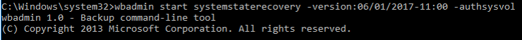

# Performing a nonauthoritative restore of Active Directory Domain Services 

>Applies To: Windows Server 2016, Windows Server 2012 and 2012 R2, Windows Server 2008 and 2008 R2

To perform a nonauthoritative restore, complete the following procedure.  
  
The following procedures use the Wbadmin.exe to perform a nonauthoritative restore of Active Directory or Active Directory Domain Services (AD DS). If you are using a different backup solution or if you intend to complete the authoritative restore of SYSVOL later in the forest recovery process, you can perform an authoritative restore of SYSVOL by using these alternative methods:  
  
- If you are using File Replication Service (FRS) to replicate SYSVOL, follow the steps in [article 290762](https://go.microsoft.com/fwlink/?LinkId=148443) in the Microsoft Knowledge Base, using the **BurFlags** registry key to reinitialize FRS replica sets, or if necessary, article 315457 [315457](https://support.microsoft.com/kb/315457)to rebuild the SYSVOL tree. To determine if SYSVOL is replicated by FRS, see [Determining Whether a Domain Controller's SYSVOL Folder is Replicated by DFSR or FRS](https://msdn.microsoft.com/library/windows/desktop/cc507518.aspx#determining_whether_a_domain_controller_s_sysvol_folder_is_replicated_by_dfsr_or_frs).  
- If you are using Distributed File System (DFS) Replication to replicate SYSVOL, see [Perform an authoritative synchronization of DFSR-replicated SYSVOL](AD-Forest-Recovery-Authoritative-Recovery-SYSVOL.md).  

## Performing a nonauthoritative restore

Use the following procedure to perform a nonauthoritative restore of AD DS and an authoritative restore of SYSVOL at the same time by using wbadmin.exe on a DC that runs Windows Server 2012, Windows Server 2008 R2, or Windows Server 2008. The backup must explicitly include system state data; a full server backup that is used for full server recovery will not work. For more information about creating a system state backup, see [Backing up the System State data](AD-Forest-Recovery-Backing-up-System-State.md).  
  
### To perform a nonauthoritative restore of AD DS and authoritative restore of SYSVOL using wbadmin.exe  
  
- Include the **-authsysvol** switch in your recovery command, as shown in the following example:  

   ```  
   wbadmin start systemstaterecovery <otheroptions> -authsysvol  
   ```  

   For example:  

   ```  
   wbadmin start systemstaterecovery -version:11/20/2012-13:00 -authsysvol  
   ```  
  


## Next Steps

- [AD Forest Recovery Guide](AD-Forest-Recovery-Guide.md)
- [AD Forest Recovery - Procedures](AD-Forest-Recovery-Procedures.md)
