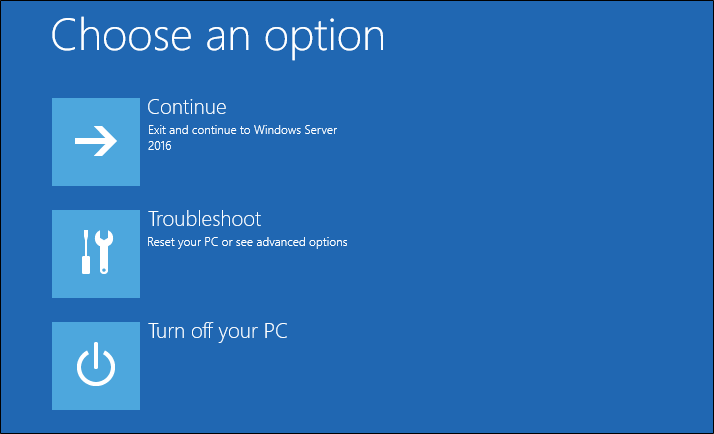
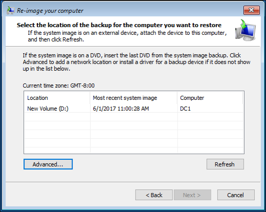

# AD Forest Recovery - Performing a full server recovery 

>Applies To: Windows Server 2016, Windows Server 2012 and 2012 R2, Windows Server 2008 and 2008 R2

Use the following procedure to perform a full server recovery for Windows Server 2016, 2012 R2, or 2012. 

## Active Directory Full Server Recovery

A full server recovery is necessary if you are restoring to different hardware or a different operating system instance. Keep in mind the following:

- The number drives on the target server needs to be equal to the number in the backup and they need to be the same size or greater.
- The target server needs to be started from the operating system DVD in order to access the **Repair your computer** option. 
- If the target DC is running in a VM on Hyper-V and the backup is stored on a network location, you must install a legacy network adapter. 
- After you perform a full server recovery, you need to separately perform an authoritative restore of SYSVOL, as described in [AD Forest Recovery - Performing an authoritative synchronization of DFSR-replicated SYSVOL](AD-Forest-Recovery-Authoritative-Recovery-SYSVOL.md).

Depending on your scenario, use one of the following procedures to perform a full restore. 
  
## Perform a full server restore with a local backup with the latest image
  
1. Start Windows Setup, specify the Language, Time and currency format, and keyboard options and click **Next**. 
2. Click **Repair your computer**.
   
3. Click **Troubleshoot**.</br>
   
4. Click **System Image Recovery**.</br>
   
5. Click **Windows Server 2016**. 
   
6. If you are restoring the most recent local backup, click **Use the latest available system image (recommended)** and click **Next**.
   
7. You will now be given an option to:
   -  Format and repartition disks
   -  Install drivers
   -  De-selecting the **Advanced** features of automatically restarting and checking for disk errors. These are enabled by default.
   
8. Click **Next**.
9. Click **Finish**. You will be prompted asking if you are sure you want to continue. Click **Yes**. 
    
10. Once this completes perform an authoritative restore of SYSVOL, as described in [AD Forest Recovery - Performing an authoritative synchronization of DFSR-replicated SYSVOL](AD-Forest-Recovery-Authoritative-Recovery-SYSVOL.md).

## Perform a full server restore with any image local or remote

1. Start Windows Setup, specify the Language, Time and currency format, and keyboard options and click **Next**. 
2. Click **Repair your computer**.</br>
3. Click **Troubleshoot**, click **System Image Recovery**, and click **Windows Server 2016**. 
4. If you are restoring the most recent local backup, click **Select a system image** and click **Next**.
5. Now you can select the location of the backup that you want to restore. If the image is local you can select it from the list. 
6. If the image is on a network share, select **Advanced**. You can also select **Advanced** if you need to install a driver.
   
7. If you are restoring from the network after clicking **Advanced** select **Search for a system image on the network**. You may be prompted to restore network connectivity. Select Ok. </br>
   
8. Type the UNC path to the backup share location (for example, \\\server1\backups) and click **OK**. You can also type the IP address of the target server, such as \\\192.168.1.3\backups. 
   
9. Type credentials necessary to access the share and click OK. 
10. Now **Select the date and time of system image to restore** and click **Next**.
11. You will now be given an option to:
    - Format and repartition disks
    - Install drivers
    - De-selecting the **Advanced** features of automatically restarting and checking for disk errors. These are enabled by default.
12. Click **Next**.
13. Click **Finish**. You will be prompted asking if you are sure you want to continue. Click **Yes**.  
14. Once this completes perform an authoritative restore of SYSVOL, as described in [AD Forest Recovery - Performing an authoritative synchronization of DFSR-replicated SYSVOL](AD-Forest-Recovery-Authoritative-Recovery-SYSVOL.md).

## Enabling the network adapter for a network backup

If you need to enable a network adapter from the command prompt to restore from a network share, use the following steps.

1. Start Windows Setup, specify the Language, Time and currency format, and keyboard options and click **Next**. 
2. Click **Repair your computer**. I
3. Click **Troubleshoot**, click **Command Prompt**. 
4. Type the following command and press ENTER:  

   ```  
   wpeinit  
   ```

5. To confirm the name of the network adapter, type:  

   ```  
   show interfaces  
   ```  

   Type the following commands and press ENTER after each command:  

   ```  
   netsh  
   ```  

   ```  
   interface  
   ```  
  
   ```  
   tcp  
   ```  

   ```  
   ipv4  
   ```  
  
   ```  
   set address "Name of Network Adapter" static IPv4 Address SubnetMask IPv4 Gateway Address 1  
   ```  

   For example:  
  
   ```  
   set address "Local Area Connection" static 192.168.1.2 255.0.0.0 192.168.1.1 1  
   ```  

   Type `quit` to return to a command prompt. Type `ipconfig /all` to verify the network adapter has an IP address and try to ping the IP address of the server that hosts the backup share to confirm connectivity. Close the command prompt when you are done. 

6. Now that the network adapter is working, select the steps above to complete the restore.

## Next Steps

- [AD Forest Recovery Guide](AD-Forest-Recovery-Guide.md)
- [AD Forest Recovery - Procedures](AD-Forest-Recovery-Procedures.md)
