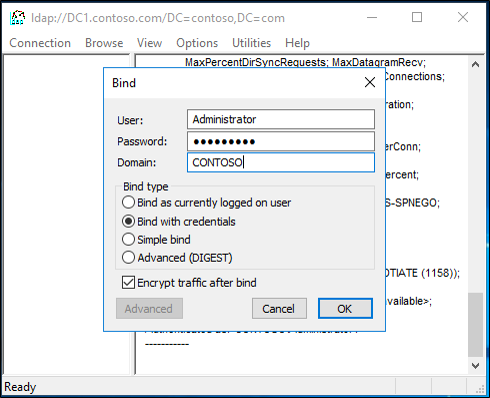

# AD Forest Recovery - Raising the value of available RID pools 

>Applies To: Windows Server 2016, Windows Server 2012 and 2012 R2, Windows Server 2008 and 2008 R2

Use the following procedure to raise the value of the relative ID (RID) pools that the RID operations master will allocate after that DC is restored. By raising the value of the available RID pools, you can ensure that no DC allocates a RID for a security principal that was created after the backup that was used to restore the domain. 

## About Active Directory RID Pools and rIDAvailablePool

Each domain has an object **CN=RID Manager$,CN=System,DC**=<*domain_name*>. This object has an attribute named **rIDAvailablePool**. This attribute value maintains the global RID space for an entire domain. The value is a large integer with upper and lower parts. The upper part defines the number of security principals that can be allocated for each domain (0x3FFFFFFF or just over 1 billion). The lower part is the number of RIDs that have been allocated in the domain. 
  
> [!NOTE]
> In Windows Server 2016 and 2012, the number of security principals that can be allocated is increased to just over 2 billion. For more information, see [Managing RID issuance](https://technet.microsoft.com/library/jj574229.aspx). 
  
- Sample Value: 4611686014132422708  
- Low Part: 2100 (beginning of the next RID pool to be allocated)  
- Upper Part: 1073741823 (total number of RIDs that can be created in a domain)  
  
When you increase the value of the large integer, you increase the value of the low part. For example, if you add 100,000 to the sample value of 4611686014132422708 for a sum of 4611686014132522708, the new low part is 102100. This indicates that the next RID pool that will be allocated by the RID master will begin with 102100 instead of 2100. 
  
### To raise the value of available RID pools using adsiedit and the calculator

1. Open Server Manager, click **Tools** and click **ADSI Edit**.
2. Right-click, select **Connect to** and connect do the Default Naming Context and click **OK**.
    
3. Browse to the following distinguished name path: **CN=RID Manager$,CN=System,DC=<domain name>**.
    
3. Right-click and select the properties of CN=RID Manager$. 
4. Select the attribute **rIDAvailablePool**, click **Edit**, and then copy the large integer value to the clipboard.
     
5. Start calculator, and from the **View** menu, select **Scientific Mode**. 
6. Add 100,000 to the current value.
    
7. Using ctrl-c, or the **Copy** command from the **Edit** menu, copy the value to the clipboard. 
8. In the edit dialog of adsiedit, paste this new value. 
    
9. Click **OK** in the dialog, and **Apply** in the property sheet to update the **rIDAvailablePool** attribute. 
  
### To raise the value of available RID pools using LDP  
  
1. At the command prompt, type the following command, and then press ENTER:  
   **ldp**  
2. Click **Connection**, click **Connect**, type the name of RID manager, and then click **OK**. 
   
3. Click **Connection**, click **Bind**, select **Bind with credentials** and type your administrative credentials, and then click **OK**. 
   
4. Click **View**, click **Tree** and then type the following distinguished name path:  CN=RID Manager$,CN=System,DC=*domain name*  
   
5. Click **Browse**, and then click **Modify**. 
6. Add 100,000 to the current **rIDAvailablePool** value, and then type the sum into **Values**. 
7. In **Dn**, type `cn=RID Manager$,cn=System,dc=`*<domain name\>*. 
8. In **Edit Entry Attribute**, type `rIDAvailablePool`. 
9. Select **Replace** as the operation, and then click **Enter**.
    
10. Click **Run** to run the operation. Click **Close**.
11. To validate the change, click **View**, click **Tree**, and then type the following distinguished name path:   CN=RID Manager$,CN=System,DC=*domain name*.   Check the **rIDAvailablePool** attribute. 
   

## Next Steps

- [AD Forest Recovery Guide](AD-Forest-Recovery-Guide.md)
- [AD Forest Recovery - Procedures](AD-Forest-Recovery-Procedures.md)
