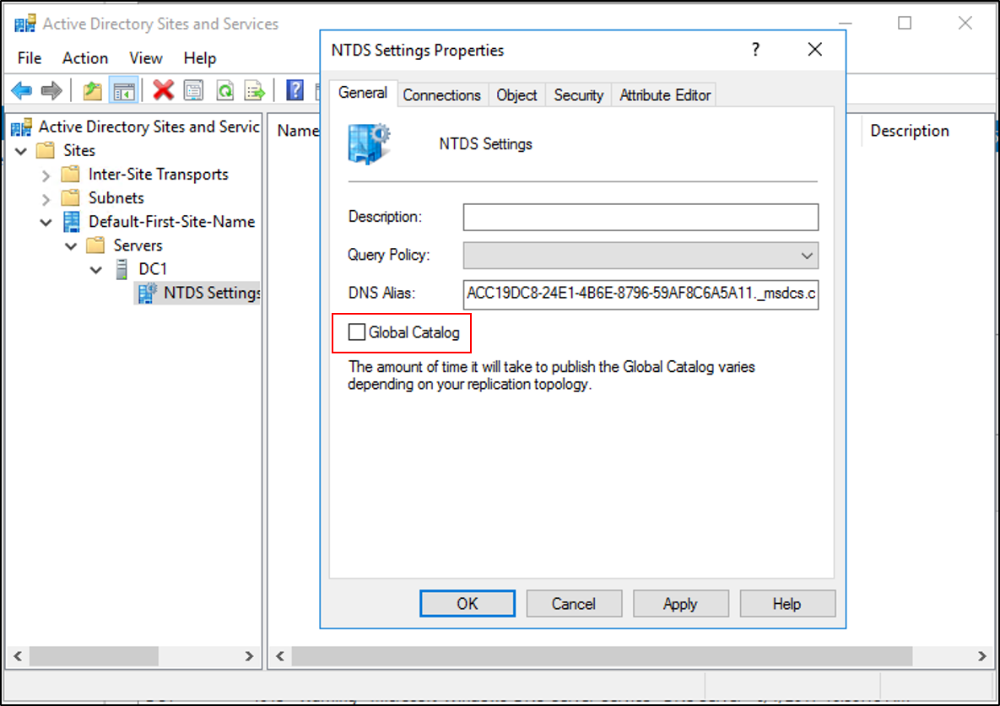

# AD Forest Recovery - Removing the global catalog  

>Applies To: Windows Server 2016, Windows Server 2012 and 2012 R2, Windows Server 2008 and 2008 R2

 Use the following procedure to remove the global catalog from a DC. 
  
 Restoring a global catalog server from backup could result in the global catalog holding newer data for one of its partial replicas than the corresponding domain that is authoritative for that partial replica. In such a case, the newer data will not be removed from the global catalog and might even replicate to other global catalog servers. As a result, even if you did restore a DC that was a global catalog server, either inadvertently or because that was the solitary backup you trusted, you should remove the global catalog soon after the restore operation is complete. When the global catalog is removed, the computer removes all its partial replicas. 
  
## To remove the global catalog using Active Directory Sites and Services  
 
1. Open Server Manager, click **Tools** and click **Active Directory Sites and Services**. 
2. In the console tree, expand the **Sites** container, and then select the appropriate site that contains the target server. 
3. Expand the **Servers** container, and then expand the *server* object for the DC from which you want to remove the global catalog. 
4. Right-click **NTDS Settings**, and then click **Properties**. 
5. Clear the **Global Catalog** check box. 
   
6. Click **Apply**.
  
## To remove the global catalog using Repadmin  
  
Open an elevated command prompt, type the following command, and press ENTER:  

   ```
   repadmin.exe /options DC_NAME –IS_GC  
   ```  

## Next Steps

- [AD Forest Recovery Guide](AD-Forest-Recovery-Guide.md)
- [AD Forest Recovery - Procedures](AD-Forest-Recovery-Procedures.md)
