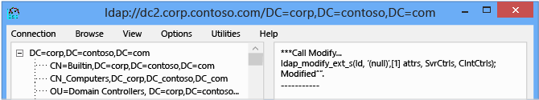

# Managing RID Issuance

>Applies To: Windows Server 2016, Windows Server 2012 R2, Windows Server 2012

This topic explains the change to the RID master FSMO role, including the new issuance and monitoring functionality in the RID master and how to analyze and troubleshoot RID issuance.  
  
-   [Managing RID Issuance](../../ad-ds/manage/Managing-RID-Issuance.md#BKMK_Manage)  
  
-   [Troubleshooting RID Issuance](../../ad-ds/manage/Managing-RID-Issuance.md#BKMK_Tshoot)  
  
More information is available at the [AskDS Blog](http://blogs.technet.com/b/askds/archive/2012/08/10/managing-rid-issuance-in-windows-server-2012.aspx).  
  
## <a name="BKMK_Manage"></a>Managing RID Issuance  
By default, a domain has capacity for roughly one billion security principals, such as users, groups, and computers. Naturally, there are no domains with that many actively used objects. However, Microsoft Customer Support has found cases where:  
  
-   Provisioning software or administrative scripts accidentally bulk created users, groups, and computers.  
  
-   Many unused security and distribution groups were created by delegated users  
  
-   Many domain controllers were demoted, restored, or metadata cleaned  
  
-   Forest recoveries were performed  
  
-   The InvalidateRidPool operation was performed frequently  
  
-   The RID Block Size registry value was increased incorrectly  
  
All of these situations use up RIDs unnecessarily, often by mistake. Over many years, a few environments ran out of RIDs and this forced them to migrate to a new domain or perform forest recoveries.  
  
Windows Server 2012 addresses issues with RID allocation that have only become problematic with the age and ubiquity of Active Directory. These include better event logging, more appropriate limits, and the ability to - in an emergency - to double the overall size of the global RID space for a domain.  
  
### Periodic Consumption Warnings  
Windows Server 2012 adds global RID space event tracking that provides early warning when major milestones are crossed. The model computes the ten (10) percent used mark in the global pool and logs an event when reached. Then it computes the next ten percent used of the remaining and the event cycle continues. As the global RID space is exhausted, events will accelerate as ten percent hits faster in a decreasing pool (but event log dampening will prevent more than one entry per hour). The System event log on every domain controller writes Directory-Services-SAM warning event 16658.  
  
Assuming a default 30-bit global RID space, the first event logs when allocating the pool containing the 107,374,182<sup>nd</sup> RID. The event rate accelerates naturally until the last checkpoint of 100,000, with 110 events generated in total. The behavior is similar for an unlocked 31-bit global RID space: starting at 214,748,365 and completing in 117 events.  
  
> [!IMPORTANT]  
> This event is not expected; investigate the user, computer, and group creation processes immediately in the domain. Creating more than 100 million AD DS objects is quite out of the ordinary.  
  
  
  
### RID Pool Invalidation Events  
There are new event alerts that a local DC RID pool was discarded. These are Informational and could be expected, especially due to the new VDC functionality. See the event list below for details on the event.  
  
### <a name="BKMK_RIDBlockMaxSize"></a>RID Block Size Limit  
Ordinarily, a domain controller requests RID allocations in blocks of 500 RIDs at one time. You can override this default using the following registry REG_DWORD value on a domain controller:  
  
```  
HKEY_LOCAL_MACHINE\SYSTEM\CurrentControlSet\Services\NTDS\RID Values  
RID Block Size  
  
```  
  
Prior to Windows Server 2012, there was no maximum value enforced in that registry key, except the implicit DWORD maximum (which has a value of 0xffffffff or 4294967295). This value is considerably larger than the total global RID space. Administrators sometimes inappropriately or accidentally configured RID Block Size with values that exhausted the global RID at a massive rate.  
  
In Windows Server 2012, you cannot set this registry value higher than 15,000 decimal (0x3A98 hexadecimal). This prevents massive unintended RID allocation.  
  
If you set the value *higher* than 15,000, the value is treated as 15,000 and the domain controller logs event 16653 in the Directory Services event log at every reboot until the value is corrected.  
  
### <a name="BKMK_GlobalRidSpaceUnlock"></a>Global RID Space Size Unlock  
Prior to Windows Server 2012, the global RID space was limited to 2<sup>30</sup> (or 1,073,741,823) total RIDs. Once reached, only a domain migration or forest recovery to an older timeframe allowed new SIDs creation - disaster recovery, by any measure. Starting in Windows Server 2012, the 2<sup>31</sup> bit can be unlocked in order to increase the global pool to 2,147,483,648 RIDs.  
  
AD DS stores this setting in a special hidden attribute named **SidCompatibilityVersion** on the RootDSE context of all domain controllers. This attribute is not readable using ADSIEdit, LDP, or other tools. To see an increase in the global RID space, examine the System event log for warning event 16655 from Directory-Services-SAM or use the following Dcdiag command:  
  
```  
Dcdiag.exe /TEST:RidManager /v | find /i "Available RID Pool for the Domain"  
  
```  
  
If you increase the global RID pool, the available pool will change to 2,147,483,647 instead of the default 1,073,741,823. For example:  
  
  
  
> [!WARNING]  
> This unlock is intended *only* to prevent running out of RIDS and is to be used *only* in conjunction with RID Ceiling Enforcement (see next section). Do not "preemptively" set this in environments that have millions of remaining RIDs and low growth, as application compatibility issues potentially exist with SIDs generated from the unlocked RID pool.  
>   
> This unlock operation cannot be reverted or removed, except by a complete forest recovery to earlier backups.  
  
#### Important Caveats  
Windows Server 2003 and Windows Server 2008 Domain Controllers cannot issue RIDs when the global RID pool 31<sup>st</sup> bit is unlocked. Windows Server 2008 R2 domain controllers *can* use 31<sup>st</sup> bit RIDs *but only if* they have hotfix [KB 2642658](https://support.microsoft.com/kb/2642658) installed. Unsupported and unpatched domain controllers treat the global RID pool as exhausted when unlocked.  
  
This feature is not enforced by any domain functional level; take great care that only Windows Server 2012 or updated Windows Server 2008 R2 domain controllers exist in the domain.  
  
#### Implementing Unlocked Global RID space  
To unlock the RID pool to the 31<sup>st</sup> bit after receiving the RID ceiling alert (see below) perform the following steps:  
  
1.  Ensure that the RID Master role is running on a Windows Server 2012 domain controller. If not, transfer it to a Windows Server 2012 domain controller.  
  
2.  Run LDP.exe  
  
3.  Click the **Connection** menu and click **Connect** for the Windows Server 2012 RID Master on port 389, and then click **Bind** as a domain administrator.  
  
4.  Click the **Browse** menu and click **Modify**.  
  
5.  Ensure that **DN** is blank.  
  
6.  In **Edit Entry Attribute**, type:  
  
    ```  
    SidCompatibilityVersion  
    ```  
  
7.  In **Values**, type:  
  
    ```  
    1  
    ```  
  
8.  Ensure that **Add** is selected in **Operation** and click **Enter**. This updates the **Entry List**.  
  
9. Select the **Synchronous** and **Extended** options, then click **Run**.  
  
      
  
10. If successful, the LDP output window shows:  
  
    ```  
    ***Call Modify...  
     ldap_modify_ext_s(Id, '(null)',[1] attrs, SvrCtrls, ClntCtrls);  
    modified "".  
  
    ```  
  
      
  
11. Confirm the global RID pool increased by examining the System Event Log on that domain controller for Directory-Services-SAM Informational event 16655.  
  
### RID Ceiling Enforcement  
To afford a measure of protection and elevate administrative awareness, Windows Server 2012 introduces an artificial ceiling on the global RID range at ten (10) percent remaining RIDs in the global space. When within one (1) percent of the artificial ceiling, domain controllers requesting RID pools write Directory-Services-SAM warning event 16656 to their System event log. When reaching the ten percent ceiling on the RID Master FSMO, it writes Directory-Services-SAM event 16657 to its System event log and will not allocate any further RID pools until overriding the ceiling. This forces you to assess the state of the RID master in the domain and address potential runaway RID allocation; this also protects domains from exhausting the entire RID space.  
  
This ceiling is hard-coded at ten percent remaining of the available RID space. That is, the ceiling activates when the RID master allocates a pool that includes the RID corresponding to ninety (90) percent of the global RID space.  
  
-   For default domains, the first trigger point is 2<sup>30</sup>-1 * 0.90 = 966,367,640 (or 107,374,183 RIDs remaining).  
  
-   For domains with an unlocked 31-bit RID space, the trigger point is 2<sup>31</sup>-1 * 0.90 = 1,932,735,282 RIDs (or 214,748,365 RIDs remaining).  
  
When triggered, the RID master sets Active Directory attribute **msDS-RIDPoolAllocationEnabled** (common name **ms-DS-RID-Pool-Allocation-Enabled**) to FALSE on the object:  
  
CN=RID Manager$,CN=System,DC=*<domain>*  
  
This writes the 16657 event and prevents further RID block issuance to all domain controllers. Domain controllers continue to consume any outstanding RID pools already issued to them.  
  
To remove the block and allow RID pool allocation to continue, set that value to TRUE. On the next RID allocation performed by the RID master, the attribute will return to its default NOT SET value. After that, there are no further ceilings and eventually, the global RID space runs out, requiring forest recovery or domain migration.  
  
#### Removing the Ceiling Block  
To remove the block once reaching the artificial ceiling, perform the following steps:  
  
1.  Ensure that the RID Master role is running on a Windows Server 2012 domain controller. If not, transfer it to a Windows Server 2012 domain controller.  
  
2.  Run LDP.exe.  
  
3.  Click the **Connection** menu and click *Connect* for the Windows Server 2012 RID Master on port 389, and then click **Bind** as a domain administrator.  
  
4.  Click the **View** menu and click **Tree**, then for the **Base DN** select the RID Master's own domain naming context. Click **Ok**.  
  
5.  In the navigation pane, drill down into the **CN=System** container and click the **CN=RID Manager$** object. Right click it and click **Modify**.  
  
6.  In Edit Entry Attribute, type:  
  
    ```  
    MsDS-RidPoolAllocationEnabled  
    ```  
  
7.  In **Values**, type (in upper case):  
  
    ```  
    TRUE  
    ```  
  
8.  Select **Replace** in **Operation** and click **Enter**. This updates the **Entry List**.  
  
9. Enable the **Synchronous** and **Extended** options, then click **Run**:  
  
      
  
10. If successful, the LDP output window shows:  
  
    ```  
    ***Call Modify...  
    ldap_modify_ext_s(ld, 'CN=RID Manager$,CN=System,DC=<domain>',[1] attrs, SvrCtrls, ClntCtrls);  
    Modified "CN=RID Manager$,CN=System,DC=<domain>".  
  
    ```  
  
      
  
### Other RID Fixes  
Previous Windows Server operating systems had a RID pool leak when missing rIDSetReferences attribute. To resolve this problem on domain controllers that run Windows Server 2008 R2, install the hotfix from [KB 2618669](https://support.microsoft.com/kb/2618669).  
  
### Unfixed RID Issues  
There has historically been a RID leak on account creation failure; when creating an account, failure still uses up a RID. The common example is to create a user with a password that does not meet complexity.  
  
### RID Fixes for earlier versions of Windows Server  
All of the fixes and changes above have Windows Server 2008 R2 hotfixes released. There are currently no Windows Server 2008 hotfixes planned or in progress.  
  
## <a name="BKMK_Tshoot"></a>Troubleshooting RID Issuance  
  
### Introduction to Troubleshooting  
RID issuance troubleshooting requires a logical and linear method. Unless you are monitoring your event logs carefully for RID-triggered warnings and errors, your first indications of a problem are likely to be failed account creations. The key to troubleshooting RID issuance is to understand when the symptom is expected or not; many RID issuance issues may affect only one domain controller and have nothing to do with component improvements. This simple diagram below helps make those decisions more clear:  
  
  
  
### Troubleshooting Options  
  
#### Logging Options  
All logging in RID issuance occurs in the System Event log, under source Directory-Services-SAM. Logging is enabled and configured for maximum verbosity, by default. If no entries are logged for the new component changes in Windows Server 2012, treat the issue as a classic (aka legacy, pre-Windows Server 2012) RID issuance problem seen in Windows 2008 R2 or older operating systems.  
  
#### Utilities and Commands for Troubleshooting  
To troubleshoot issues not explained by the aforementioned logs - especially older RID issuance issues - use the following list of tools as a starting point:  
  
-   Dcdiag.exe  
  
-   Repadmin.exe  
  
-   Network Monitor 3.4  
  
### General Methodology for Troubleshooting Domain Controller Configuration  
  
1.  Is the error caused by a simple permissions or domain controller availability issue?  
  
    1.  Are you trying to create a security principal without the necessary permissions? Examine the output for access denied errors.  
  
    2.  Is a domain controller available? Examine the returned error or LDAP or domain controller availability messages.  
  
2.  Does the error returned specifically mention RIDs, and is specific enough to use as guidance? If so, follow the guidance.  
  
3.  Does the error returned specifically mention RIDs but is otherwise non-specific? For example, "Windows cannot create the object because the Directory Service was unable to allocate a relative identifier."  
  
    1.  Examine the System Event log on the domain controller for "legacy" (pre-Windows Server 2012) RID events detailed in [RID Pool Request](https://technet.microsoft.com/library/ee406152(WS.10).aspx) (16642, 16643, 16644, 16645, 16656).  
  
    2.  Examine the System Event on the domain controller and the RID Master for new block-indicating events detailed below in this topic (16655, 16656, 16657).  
  
    3.  Validate Active Directory replication health with Repadmin.exe and RID Master availability with **Dcdiag.exe /test:ridmanager /v**. Enable double-sided network captures between the domain controller and the RID Master if these tests are inconclusive.  
  
### Troubleshooting Specific Problems  
The following new messages log in the System event log on Windows Server 2012 domain controllers. Automated AD health tracking systems, such as System Center Operations Manager, should monitor for these events; all are notable, and some are indicators of critical domain issues.  
  
|||  
|-|-|  
|Event ID|16653|  
|Source|Directory-Services-SAM|  
|Severity|Warning|  
|Message|A pool size for account-identifiers (RIDs) that was configured by an Administrator is greater than the supported maximum. The maximum value of %1 will be used when the domain controller is the RID master.<br /><br />For more information, see [RID Block Size Limit](../../ad-ds/manage/../../ad-ds/manage/../../ad-ds/manage/../../ad-ds/manage/Managing-RID-Issuance.md#BKMK_RIDBlockMaxSize).|  
|Notes and resolution|The maximum value for the RID Block Size is now 15000 decimal (3A98 hexadecimal). A domain controller cannot request more than 15,000 RIDs. This event logs at every boot until the value is set to a value at or below this maximum.|  
  
|||  
|-|-|  
|Event ID|16654|  
|Source|Directory-Services-SAM|  
|Severity|Informational|  
|Message|A pool of account-identifiers (RIDs) has been invalidated. This may occur in the following expected cases:<br /><br />1. A domain controller is restored from backup.<br /><br />2. A domain controller running on a virtual machine is restored from snapshot.<br /><br />3. An administrator has manually invalidated the pool.<br /><br />See https://go.microsoft.com/fwlink/?LinkId=226247 for more information.|  
|Notes and resolution|If this event is unexpected, contact all domain administrators and determine which of them performed the action. The Directory Services event log also contains further information on when one of these steps was performed.|  
  
|||  
|-|-|  
|Event ID|16655|  
|Source|Directory-Services-SAM|  
|Severity|Informational|  
|Message|The global maximum for account-identifiers (RIDs) has been increased to %1.|  
|Notes and resolution|If this event is unexpected, contact all domain administrators and determine which of them performed the action. This event notes the increase of the overall RID pool size beyond the default of 2<sup>30</sup>and will not happen automatically; only by administrative action.|  
  
|||  
|-|-|  
|Event ID|16656|  
|Source|Directory-Services-SAM|  
|Severity|Warning|  
|Message|The global maximum for account-identifiers (RIDs) has been increased to %1.|  
|Notes and resolution|Action required! An account-identifier (RID) pool was allocated to this domain controller. The pool value indicates this domain has consumed a considerable portion of the total available account-identifiers.<br /><br />A protection mechanism will be activated when the domain reaches the following threshold of total available account-identifiers remaining: %1.  The protection mechanism will prevent account creation until you manually re-enable account-identifier allocation on the RID master domain controller.<br /><br />See https://go.microsoft.com/fwlink/?LinkId=228610 for more information.|  
  
|||  
|-|-|  
|Event ID|16657|  
|Source|Directory-Services-SAM|  
|Severity|Error|  
|Message|Action required! This domain has consumed a considerable portion of the total available account-identifiers (RIDs). A protection mechanism has been activated because the total available account-identifiers remaining is less than: X% [artificial ceiling argument].<br /><br />The protection mechanism prevents account creation until you manually re-enable account-identifier allocation on the RID master domain controller.<br /><br />It is extremely important that certain diagnostics are performed prior to re-enabling account creation to ensure this domain is not consuming account-identifiers at an abnormally high rate. Any issues identified should be resolved prior to re-enabling account creation.<br /><br />Failure to diagnose and fix any underlying issue causing an abnormally high rate of account-identifier consumption can lead to account-identifier exhaustion in the domain after which account creation will be permanently disabled in this domain.<br /><br />See https://go.microsoft.com/fwlink/?LinkId=228610 for more information.|  
|Notes and resolution|Contact all domain administrators and inform them that no further security principals can be created in this domain until this protection is overridden. For more information about how to override the protection and possibly increase the overall RID pool, see [Global RID Space Size Unlock](../../ad-ds/manage/../../ad-ds/manage/../../ad-ds/manage/../../ad-ds/manage/Managing-RID-Issuance.md#BKMK_GlobalRidSpaceUnlock).|  
  
|||  
|-|-|  
|Event ID|16658|  
|Source|Directory-Services-SAM|  
|Severity|Warning|  
|Message|This event is a periodic update on the remaining total quantity of available account-identifiers (RIDs). The number of remaining account-identifiers is approximately: %1.<br /><br />Account-identifiers are used as accounts are created, when they are exhausted no new accounts may be created in the domain.<br /><br />See https://go.microsoft.com/fwlink/?LinkId=228745 for more information.|  
|Notes and resolution|Contact all domain administrators and inform them that RID consumption has crossed a major milestone; determine if this is expected behavior or not by reviewing security trustee creation patterns. To ever see this event would be highly unusual, as it means that at least ~100 million RIDS have been allocated.|  
  
## See Also  
[Managing RID Issuance in Windows Server 2012](http://blogs.technet.com/b/askds/archive/2012/08/10/managing-rid-issuance-in-windows-server-2012.aspx)  
  


