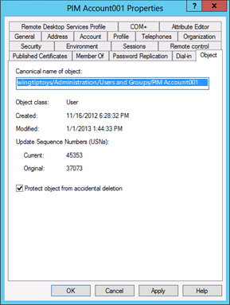

# Appendix I: Creating Management Accounts for Protected Accounts and Groups in Active Directory

>Applies To: Windows Server 2016, Windows Server 2012 R2, Windows Server 2012

One of the challenges in implementing an Active Directory model that does not rely on permanent membership in highly privileged groups is that there must be a mechanism to populate these groups when temporary membership in the groups is required. Some privileged identity management solutions require that the software's service accounts are granted permanent membership in groups such as DA or Administrators in each domain in the forest. However, it is technically not necessary for Privileged Identity Management (PIM) solutions to run their services in such highly privileged contexts.  
  
This appendix provides information that you can use for natively implemented or third-party PIM solutions to create accounts that have limited privileges and can be stringently controlled, but can be used to populate privileged groups in Active Directory when temporary elevation is required. If you are implementing PIM as a native solution, these accounts may be used by administrative staff to perform the temporary group population, and if you're implementing PIM via third-party software, you might be able to adapt these accounts to function as service accounts.  
  
> [!NOTE]  
> The procedures described in this appendix provide one approach to the management of highly privileged groups in Active Directory. You can adapt these procedures to suit your needs, add additional restrictions, or omit some of the restrictions that are described here.  
  
## Creating Management Accounts for Protected Accounts and Groups in Active Directory

Creating accounts that can be used to manage the membership of privileged groups without requiring the management accounts to be granted excessive rights and permissions consists of four general activities that are described in the step-by-step instructions that follow:  
  
1.  First, you should create a group that will manage the accounts, because these accounts should be managed by a limited set of trusted users. If you do not already have an OU structure that accommodates segregating privileged and protected accounts and systems from the general population in the domain, you should create one. Although specific instructions are not provided in this appendix, screenshots show an example of such an OU hierarchy.  
  
2.  Create the management accounts. These accounts should be created as "regular" user accounts and granted no user rights beyond those that are already granted to users by default.  
  
3.  Implement restrictions on the management accounts that make them usable only for the specialized purpose for which they were created, in addition to controlling who can enable and use the accounts (the group you created in the first step).  
  
4.  Configure permissions on the AdminSDHolder object in each domain to allow the management accounts to change the membership of the privileged groups in the domain.  
  
You should thoroughly test all of these procedures and modify them as needed for your environment before implementing them in a production environment. You should also verify that all settings work as expected (some testing procedures are provided in this appendix), and you should test a disaster recovery scenario in which the management accounts are not available to be used to populate protected groups for recovery purposes. For more information about backing up and restoring Active Directory, see the [AD DS Backup and Recovery Step-by-Step Guide](https://technet.microsoft.com/library/cc771290(v=ws.10).aspx).  
  
> [!NOTE]  
> By implementing the steps described in this appendix, you will create accounts that will be able to manage the membership of all protected groups in each domain, not only the highest-privilege Active Directory groups like EAs, DAs and BAs. For more information about protected groups in Active Directory, see [Appendix C: Protected Accounts and Groups in Active Directory](../../../ad-ds/plan/security-best-practices/Appendix-C--Protected-Accounts-and-Groups-in-Active-Directory.md).  
  
### Step-by-Step Instructions for Creating Management Accounts for Protected Groups  
  
#### Creating a Group to Enable and Disable Management Accounts

Management accounts should have their passwords reset at each use and should be disabled when activities requiring them are complete. Although you might also consider implementing smart card logon requirements for these accounts, it is an optional configuration and these instructions assume that the management accounts will be configured with a user name and long, complex password as minimum controls. In this step, you will create a group that has permissions to reset password on the management accounts and to enable and disable the accounts.  
  
To create a group to enable and disable management accounts, perform the following steps:  
  
1.  In the OU structure where you will be housing the management accounts, right-click the OU where you want to create the group, click **New** and click **Group**.  
  
      
  
2.  In the **New Object - Group** dialog box, enter a name for the group. If you plan to use this group to "activate" all management accounts in your forest, make it a universal security group. If you have a single-domain forest or if you plan to create a group in each domain, you can create a global security group. Click **OK** to create the group.  
  
      
  
3.  Right-click the group you just created, click **Properties**, and click the **Object** tab. In the group's **Object property** dialog box, select **Protect object from accidental deletion**, which will not only prevent otherwise-authorized users from deleting the group, but also from moving it to another OU unless the attribute is first deselected.  
  
      
  
    > [!NOTE]  
    > If you have already configured permissions on the group's parent OUs to restrict administration to a limited set of users, you may not need to perform the following steps. They are provided here so that even if you have not yet implemented limited administrative control over the OU structure in which you've created this group, you can secure the group against modification by unauthorized users.  
  
4.  Click the **Members** tab, and add the accounts for members of your team who will be responsible for enabling management accounts or populating protected groups when necessary.  
  
      
  
5.  If you have not already done so, in the **Active Directory Users and Computers** console, click **View** and select **Advanced Features**. Right-click the group you just created, click **Properties**, and click the **Security** tab. On the **Security** tab, click **Advanced**.  
  
      
  
6.  In the **Advanced Security Settings for [Group]** dialog box, click **Disable Inheritance**. When prompted, click **Convert inherited permissions into explicit permissions on this object**, and click **OK** to return to the group's **Security** dialog box.  
  
      
  
7.  On the **Security** tab, remove groups that should not be permitted to access this group. For example, if you do not want Authenticated Users to be able to read the group's name and general properties, you can remove that ACE. You can also remove ACEs, such as those for account operators and pre-Windows 2000 Server compatible access. You should, however, leave a minimum set of object permissions in place. Leave the following ACEs intact:  
  
    -   SELF  
  
    -   SYSTEM  
  
    -   Domain Admins  
  
    -   Enterprise Admins  
  
    -   Administrators  
  
    -   Windows Authorization Access Group (if applicable)  
  
    -   ENTERPRISE DOMAIN CONTROLLERS  
  
    Although it may seem counterintuitive to allow the highest privileged groups in Active Directory to manage this group, your goal in implementing these settings is not to prevent members of those groups from making authorized changes. Rather, the goal is to ensure that when you have occasion to require very high levels of privilege, authorized changes will succeed. It is for this reason that changing default privileged group nesting, rights, and permissions are discouraged throughout this document. By leaving default structures intact and emptying the membership of the highest privilege groups in the directory, you can create a more secure environment that still functions as expected.  
  
      
  
    > [!NOTE]  
    > If you have not already configured audit policies for the objects in the OU structure where you created this group, you should configure auditing to log changes this group.  
  
8.  You have completed configuration of the group that will be used to "check out" management accounts when they are needed and "check in" the accounts when their activities have been completed.  
  
#### Creating the Management Accounts

You should create at least one account that will be used to manage the membership of privileged groups in your Active Directory installation, and preferably a second account to serve as a backup. Whether you choose to create the management accounts in a single domain in the forest and grant them management capabilities for all domains' protected groups, or whether you choose to implement management accounts in each domain in the forest, the procedures are effectively the same.  
  
> [!NOTE]  
> The steps in this document assume that you have not yet implemented role-based access controls and privileged identity management for Active Directory. Therefore, some procedures must be performed by a user whose account is a member of the Domain Admins group for the domain in question.  
>   
> When you are using an account with DA privileges, you can log on to a domain controller to perform the configuration activities. Steps that do not require DA privileges can be performed by less-privileged accounts that are logged on to administrative workstations. Screen shots that show dialog boxes bordered in the lighter blue color represent activities that can be performed on a domain controller. Screen shots that show dialog boxes in the darker blue color represent activities that can be performed on administrative workstations with accounts that have limited privileges.  
  
To create the management accounts, perform the following steps:  
  
1. Log on to a domain controller with an account that is a member of the domain's DA group.  

2. Launch **Active Directory Users and Computers** and navigate to the OU where you will be creating the management account.  

3. Right-click the OU and click **New** and click **User**.  

4. In the **New Object - User** dialog box, enter your desired naming information for the account and click **Next**.  

     
  
5. Provide an initial password for the user account, clear **User must change password at next logon**, select **User cannot change password** and **Account is disabled**, and click **Next**.  

     

6. Verify that the account details are correct and click **Finish**.  

7. Right-click the user object you just created and click **Properties**.  

8. Click the **Account** tab.  

9. In the **Account Options** field, select the **Account is sensitive and cannot be delegated** flag, select the **This account supports Kerberos AES 128 bit encryption** and/or the **This account supports Kerberos AES 256 encryption** flag, and click **OK**.  

     

   > [!NOTE]  
   > Because this account, like other accounts, will have a limited, but powerful function, the account should only be used on secure administrative hosts. For all secure administrative hosts in your environment, you should consider implementing the Group Policy setting **Network Security: Configure Encryption types allowed for Kerberos** to allow only the most secure encryption types you can implement for secure hosts.  
   >
   > Although implementing more secure encryption types for the hosts does not mitigate credential theft attacks, the appropriate use and configuration of the secure hosts does. Setting stronger encryption types for hosts that are only used by privileged accounts simply reduces the overall attack surface of the computers.  
   >
   > For more information about configuring encryption types on systems and accounts, see [Windows Configurations for Kerberos Supported Encryption Type](http://blogs.msdn.com/b/openspecification/archive/2011/05/31/windows-configurations-for-kerberos-supported-encryption-type.aspx).  
   >
   > These settings are supported only on computers running Windows Server 2012, Windows Server 2008 R2, Windows 8, or Windows 7.  
  
10. On the **Object** tab, select **Protect object from accidental deletion**. This will not only prevent the object from being deleted (even by authorized users), but will prevent it from being moved to a different OU in your AD DS hierarchy, unless the check box is first cleared by a user with permission to change the attribute.  

      

11. Click the **Remote control** tab.  

12. Clear the **Enable remote control** flag. It should never be necessary for support staff to connect to this account's sessions to implement fixes.  

      

    > [!NOTE]  
    > Every object in Active Directory should have a designated IT owner and a designated business owner, as described in [Planning for Compromise](../../../ad-ds/plan/security-best-practices/Planning-for-Compromise.md). If you are tracking ownership of AD DS objects in Active Directory (as opposed to an external database), you should enter appropriate ownership information in this object's properties.  
    >
    > In this case, the business owner is most likely an IT division, andthere is no prohibition on business owners also being IT owners. The point of establishing ownership of objects is to allow you to identify contacts when changes need to be made to the objects, perhaps years from their initial creation.  

13. Click on the **Organization** tab.  

14. Enter any information that is required in your AD DS object standards.  

      

15. Click on the **Dial-in** tab.  

16. In the **Network Access Permission** field, select **Deny access**.This account should never need to connect over a remote connection.  

      

    > [!NOTE]  
    > It is unlikely that this account will be used to log on to read-only domain controllers (RODCs) in your environment. However, should circumstance ever require the account to log on to an RODC, you should add this account to the Denied RODC Password Replication Group so that its password is not cached on the RODC.  
    >
    > Although the account's password should be reset after each use and the account should be disabled, implementing this setting does not have a deleterious effect on the account, and it might help in situations in which an administrator forgets to reset the account's password and disable it.  

17. Click the **Member Of** tab.  

18. Click **Add**.  

19. Type **Denied RODC Password Replication Group** in the **Select Users, Contacts, Computers** dialog box and click **Check Names**. When the name of the group is underlined in the object picker, click **OK** and verify that the account is now a member of the two groups displayed in the following screenshot. Do not add the account to any protected groups.  

20. Click **OK**.  

      

21. Click the **Security** tab and click **Advanced**.  

22. In the **Advanced Security Settings** dialog box, click **Disable inheritance** and copy the inherited permissions as explicit permissions, and click **Add**.  

      

23. In the **Permission Entry for [Account]** dialog box, click **Select a principal** and add the group you created in the previous procedure. Scroll to the bottom of the dialog box and click **Clear all** to remove all default permissions.  

      

24. Scroll to the top of the **Permission Entry** dialog box. Ensure that the **Type** drop-down list is set to **Allow**, and in the **Applies to** drop-down list, select **This object only**.  

25. In the **Permissions** field, select **Read all properties**, **Read permissions**, and **Reset password**.  

      

26. In the **Properties** field, select **Read userAccountControl** and **Write userAccountControl**.  

27. Click **OK**, **OK** again in the **Advanced Security Settings** dialog box.  

      

    > [!NOTE]  
    > The **userAccountControl** attribute controls multiple account configuration options. You cannot grant permission to change only some of the configuration options when you grant write permission to the attribute.  

28. In the **Group or user names** field of the **Security** tab, remove any groups that should not be permitted to access or manage the account. Do not remove any groups that have been configured with Deny ACEs, such as the Everyone group and the SELF computed account (that ACE was set when the **user cannot change password** flag was enabled during creation of the account. Also do not remove the group you just added, the SYSTEM account, or groups such as EA, DA, BA, or the Windows Authorization Access Group.  

      

29. Click **Advanced** and verify that the Advanced Security Settings dialog box looks similar to the following screenshot.  

30. Click **OK**, and **OK** again to close the account's property dialog box.  

      

31. Setup of the first management account is now complete. You will test the account in a later procedure.  

##### Creating Additional Management Accounts

You can create additional management accounts by repeating the previous steps, by copying the account you just created, or by creating a script to create accounts with your desired configuration settings. Note, however, that if you copy the account you just created, many of the customized settings and ACLs will not be copied to the new account and you will have to repeat most of the configuration steps.  
  
You can instead create a group to which you delegate rights to populate and unpopulate protected groups, but you will need to secure the group and the accounts you place in it. Because there should be very few accounts in your directory that are granted the ability to manage the membership of protected groups, creating individual accounts might be the simplest approach.  
  
Regardless of how you choose to create a group into which you place the management accounts, you should ensure that each account is secured as described earlier. You should also consider implementing GPO restrictions similar to those described in [Appendix D: Securing Built-In Administrator Accounts in Active Directory](../../../ad-ds/plan/security-best-practices/Appendix-D--Securing-Built-In-Administrator-Accounts-in-Active-Directory.md).  
  
##### Auditing Management Accounts

You should configure auditing on the account to log, at minimum, all writes to the account. This will allow you to not only identify successful enabling of the account and resetting of its password during authorized uses, but to also identify attempts by unauthorized users to manipulate the account. Failed writes on the account should be captured in your Security Information and Event Monitoring (SIEM) system (if applicable), and should trigger alerts that provide notification to the staff responsible for investigating potential compromises.  
  
SIEM solutions take event information from involved security sources (for example, event logs, application data, network streams, antimalware products, and intrusion detection sources), collate the data, and try to make intelligent views and proactive actions. There are many commercial SIEM solutions, and many enterprises create private implementations. A well designed and appropriately implemented SIEM can significantly enhance security monitoring and incident response capabilities. However, capabilities and accuracy vary tremendously between solutions. SIEMs are beyond the scope of this paper, but the specific event recommendations contained should be considered by any SIEM implementer.  
  
For more information about recommended audit configuration settings for domain controllers, see [Monitoring Active Directory for Signs of Compromise](../../../ad-ds/plan/security-best-practices/Monitoring-Active-Directory-for-Signs-of-Compromise.md). Domain controller-specific configuration settings are provided in [Monitoring Active Directory for Signs of Compromise](../../../ad-ds/plan/security-best-practices/Monitoring-Active-Directory-for-Signs-of-Compromise.md).  
  
#### Enabling Management Accounts to Modify the Membership of Protected Groups

In this procedure, you will configure permissions on the domain's AdminSDHolder object to allow the newly created management accounts to modify the membership of protected groups in the domain. This procedure cannot be performed via a graphical user interface (GUI).  
  
As discussed in [Appendix C: Protected Accounts and Groups in Active Directory](../../../ad-ds/plan/security-best-practices/Appendix-C--Protected-Accounts-and-Groups-in-Active-Directory.md), the ACL on a domain's AdminSDHolder object is effectively "copied" to protected objects when the SDProp task runs. Protected groups and accounts do not inherit their permissions from the AdminSDHolder object; their permissions are explicitly set to match those on the AdminSDHolder object. Therefore, when you modify permissions on the AdminSDHolder object, you must modify them for attributes that are appropriate to the type of the protected object you are targeting.  
  
In this case, you will be granting the newly created management accounts to allow them to read and write the members attribute on group objects. However, the AdminSDHolder object is not a group object and group attributes are not exposed in the graphical ACL editor. It is for this reason that you will implement the permissions changes via the Dsacls command-line utility. To grant the (disabled) management accounts permissions to modify the membership of protected groups, perform the following steps:  
  
1. Log on to a domain controller, preferably the domain controller holding the PDC Emulator (PDCE) role, with the credentials of a user account that has been made a member of the DA group in the domain.  
  
     
  
2. Open an elevated command prompt by right-clicking **Command Prompt** and click **Run as administrator**.  
  
     
  
3. When prompted to approve the elevation, click **Yes**.  
  
     
  
   > [!NOTE]  
   > For more information about elevation and user account control (UAC) in Windows, see [UAC Processes and Interactions](https://technet.microsoft.com/library/dd835561(v=WS.10).aspx) on the TechNet website.  
  
4. At the Command Prompt, type (substituting your domain-specific information) **Dsacls [distinguished name of the AdminSDHolder object in your domain] /G [management account UPN]:RPWP;member**.  
  
     
  
   The previous command (which is not case-sensitive) works as follows:  
  
   - Dsacls sets or displays ACEs on directory objects  
  
   - CN=AdminSDHolder,CN=System,DC=TailSpinToys,DC=msft identifies the object to be modified  
  
   - /G indicates that a grant ACE is being configured  
  
   - PIM001@tailspintoys.msft is the User Principal Name (UPN) of the security principal to which the ACEs will be granted  
  
   - RPWP grants read property and write property permissions  
  
   - Member is the name of the property (attribute) on which the permissions will be set  
  
   For more information about use of **Dsacls**, type Dsacls without any parameters at a command prompt.  
  
   If you have created multiple management accounts for the domain, you should run the Dsacls command for each account. When you have completed the ACL configuration on the AdminSDHolder object, you should force SDProp to run, or wait until its scheduled run completes. For information about forcing SDProp to run, see "Running SDProp Manually" in [Appendix C: Protected Accounts and Groups in Active Directory](../../../ad-ds/plan/security-best-practices/Appendix-C--Protected-Accounts-and-Groups-in-Active-Directory.md).  
  
   When SDProp has run, you can verify that the changes you made to the AdminSDHolder object have been applied to protected groups in the domain. You cannot verify this by viewing the ACL on the AdminSDHolder object for the reasons previously described, but you can verify that the permissions have been applied by viewing the ACLs on protected groups.  
  
5. In **Active Directory Users and Computers**, verify that you have enabled **Advanced Features**. To do so, click **View**, locate the **Domain Admins** group, right-click the group and click **Properties**.  
  
6. Click the **Security** tab and click **Advanced** to open the **Advanced Security Settings for Domain Admins** dialog box.  
  
     
  
7. Select **Allow ACE for the management account** and click **Edit**. Verify that the account has been granted only **Read Members** and **Write Members** permissions on the DA group, and click **OK**.  
  
8. Click **OK** in the **Advanced Security Settings** dialog box, and click **OK** again to close the property dialog box for the DA group.  
  
     
  
9. You can repeat the previous steps for other protected groups in the domain; the permissions should be the same for all protected groups. You have now completed creation and configuration of the management accounts for the protected groups in this domain.  
  
    > [!NOTE]  
    > Any account that has permission to write membership of a group in Active Directory can also add itself to the group. This behavior is by design and cannot be disabled. For this reason, you should always keep management accounts disabled when not in use, and should closely monitor the accounts when they're disabled and when they're in use.  
  
#### Verifying Group and Account Configuration Settings

Now that you have created and configured management accounts that can modify the membership of protected groups in the domain (which includes the most highly privileged EA, DA, and BA groups), you should verify that the accounts and their management group have been created properly. Verification consists of these general tasks:  
  
1.  Test the group that can enable and disable management accounts to verify that members of the group can enable and disable the accounts and reset their passwords, but cannot perform other administrative activities on the management accounts.  
  
2.  Test the management accounts to verify that they can add and remove members to protected groups in the domain, but cannot change any other properties of protected accounts and groups.  
  
##### Test the Group that Will Enable and Disable Management Accounts
  
1.  To test enabling a management account and resetting its password, log on to a secure administrative workstation with an account that is a member of the group you created in [Appendix I: Creating Management Accounts for Protected Accounts and Groups in Active Directory](../../../ad-ds/manage/component-updates/Appendix-I--Creating-Management-Accounts-for-Protected-Accounts-and-Groups-in-Active-Directory.md).  
  
      
  
2.  Open **Active Directory Users and Computers**, right-click the management account, and click **Enable Account**.  
  
      
  
3.  A dialog box should display, confirming that the account has been enabled.  
  
      
  
4.  Next, reset the password on the management account. To do so, right-click the account again and click **Reset Password**.  
  
      
  
5.  Type a new password for the account in the **New password** and **Confirm password** fields, and click **OK**.  
  
      
  
6.  A dialog box should appear, confirming that the password for the account has been reset.  
  
      
  
7.  Now attempt to modify additional properties of the management account. Right-click the account and click **Properties**, and click the **Remote control** tab.  
  
8.  Select **Enable remote control** and click **Apply**. The operation should fail and an **Access Denied** error message should display.  
  
      
  
9. Click the **Account** tab for the account and attempt to change the account's name, logon hours, or logon workstations. All should fail, and account options that are not controlled by the **userAccountControl** attribute should be grayed out and unavailable for modification.  
  
      
  
10. Attempt to add the management group to a protected group such as the DA group. When you click **OK**, a message should appear, informing you that you do not have permissions to modify the group.  
  
      
  
11. Perform additional tests as required to verify that you cannot configure anything on the management account except **userAccountControl** settings and password resets.  
  
    > [!NOTE]  
    > The **userAccountControl** attribute controls multiple account configuration options. You cannot grant permission to change only some of the configuration options when you grant write permission to the attribute.  
  
##### Test the Management Accounts

Now that you have enabled one or more accounts that can change the membership of protected groups, you can test the accounts to ensure that they can modify protected group membership, but cannot perform other modifications on protected accounts and groups.  
  
1.  Log on to a secure administrative host as the first management account.  
  
      
  
2.  Launch **Active Directory Users and Computers** and locate the **Domain Admins group**.  
  
3.  Right-click the **Domain Admins** group and click **Properties**.  
  
      
  
4.  In the **Domain Admins Properties**, click the **Members** tab and **click** Add. Enter the name of an account that will be given temporary Domain Admins privileges and click **Check Names**. When the name of the account is underlined, click **OK** to return to the **Members** tab.  
  
      
  
5.  On the **Members** tab for the **Domain Admins Properties** dialog box, click **Apply**. After clicking **Apply**, the account should stay a member of the DA group and you should receive no error messages.  
  
      
  
6.  Click the **Managed By** tab in the **Domain Admins Properties** dialog box and verify that you cannot enter text in any fields and all buttons are grayed out.  
  
      
  
7.  Click the **General** tab in the **Domain Admins Properties** dialog box and verify that you cannot modify any of the information about that tab.  
  
      
  
8.  Repeat these steps for additional protected groups as needed. When you have finished, log on to a secure administrative host with an account that is a member of the group you created to enable and disable the management accounts. Then reset the password on the management account you just tested and disable the account. You have completed setup of the management accounts and the group that will be responsible for enabling and disabling the accounts.  
