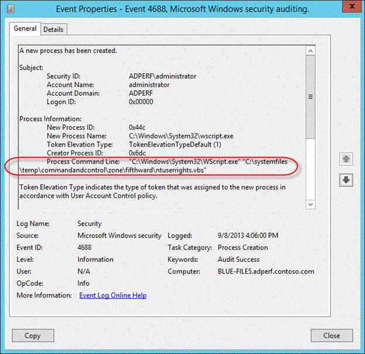
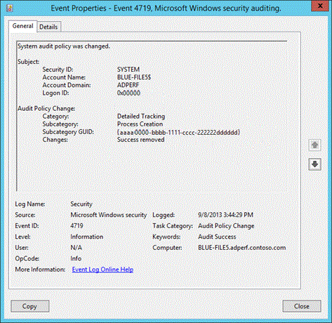

# Command line process auditing

>Applies To: Windows Server 2016, Windows Server 2012 R2

**Author**: Justin Turner, Senior Support Escalation Engineer with the Windows group  
  
> [!NOTE]  
> This content is written by a Microsoft customer support engineer, and is intended for experienced administrators and systems architects who are looking for deeper technical explanations of features and solutions in Windows Server 2012 R2 than topics on TechNet usually provide. However, it has not undergone the same editing passes, so some of the language may seem less polished than what is typically found on TechNet.  
  
## Overview  
  
-   The pre-existing process creation audit event ID 4688 will now include audit information for command line processes.  
  
-   It will also log SHA1/2 hash of the executable in the Applocker event log  
  
    -   Application and Services Logs\Microsoft\Windows\AppLocker  
  
-   You enable via GPO, but it is disabled by default  
  
    -   "Include command line in process creation events"  
  
  
  
**Figure  SEQ Figure \\\* ARABIC 16 Event 4688**  
  
Review the updated event ID 4688 in  REF _Ref366427278 \h Figure 16.  Prior to this update none of the information for **Process Command Line** gets logged.  Because of this additional logging we can now see that not only was the wscript.exe process started, but that it was also used to execute a VB script.  
  
## Configuration  
To see the effects of this update, you will need to enable two policy settings.  
  
### You must have Audit Process Creation auditing enabled to see event ID 4688.  
To enable the Audit Process Creation policy, edit the following group policy:  
  
**Policy location:** Computer Configuration > Policies > Windows Settings > Security Settings > Advanced Audit Configuration > Detailed Tracking  
  
**Policy Name:** Audit Process Creation  
  
**Supported on:** Windows 7 and above  
  
**Description/Help:**  
  
This security policy setting determines whether the operating system generates audit events when a process is created (starts) and the name of the program or user that created it.  
  
These audit events can help you understand how a computer is being used and to track user activity.  
  
Event volume: Low to medium, depending on system usage  
  
**Default:** Not configured  
  
### In order to see the additions to event ID 4688, you must enable the new policy setting: Include command line in process creation events  
**Table  SEQ Table \\\* ARABIC 19 Command line process policy setting**  
  
|Policy Configuration|Details|  
|------------------------|-----------|  
|**Path**|Administrative Templates\System\Audit Process Creation|  
|**Setting**|**Include command line in process creation events**|  
|**Default setting**|Not Configured (not enabled)|  
|**Supported on:**|?|  
|**Description**|This policy setting determines what information is logged in security audit events when a new process has been created.<br /><br />This setting only applies when the Audit Process Creation policy is enabled. If you enable this policy setting the command line information for every process will be logged in plain text in the security event log as part of the Audit Process Creation event 4688, "a new process has been created," on the workstations and servers on which this policy setting is applied.<br /><br />If you disable or do not configure this policy setting, the process's command line information will not be included in Audit Process Creation events.<br /><br />Default: Not configured<br /><br />Note: When this policy setting is enabled, any user with access to read the security events will be able to read the command line arguments for any successfully created process. Command line arguments can contain sensitive or private information such as passwords or user data.|  
  
  
  
When you use Advanced Audit Policy Configuration settings, you need to confirm that these settings are not overwritten by basic audit policy settings.  Event 4719 is logged when the settings are overwritten.  
  
  
  
The following procedure shows how to prevent conflicts by blocking the application of any basic audit policy settings.  
  
### To ensure that Advanced Audit Policy Configuration settings are not overwritten  
  
  
1.  Open the Group Policy Management console  
  
2.  Right-click Default Domain Policy, and then click Edit.  
  
3.  Double-click Computer Configuration, double-click Policies, and then double-click Windows Settings.  
  
4.  Double-click Security Settings, double-click Local Policies, and then click Security Options.  
  
5.  Double-click Audit: Force audit policy subcategory settings (Windows Vista or later) to override audit policy category settings, and then click Define this policy setting.  
  
6.  Click Enabled, and then click OK.  
  
## Additional Resources  
[Audit Process Creation](https://technet.microsoft.com/library/dd941613(v=WS.10).aspx)  
  
[Advanced Security Audit Policy Step-by-Step Guide](https://technet.microsoft.com/library/dd408940(v=WS.10).aspx)  
  
[AppLocker: Frequently Asked Questions](https://technet.microsoft.com/library/ee619725(v=ws.10).aspx)  
  
## Try This: Explore command line process auditing  
  
1.  Enable **Audit Process Creation** events and ensure the Advance Audit Policy configuration is not overwritten  
  
2.  Create a script that will generate some events of interest and execute the script.  Observe the events.  The script used to generate the event in the lesson looked like this:  
  
    ```  
    mkdir c:\systemfiles\temp\commandandcontrol\zone\fifthward  
    copy \\192.168.1.254\c$\hidden c:\systemfiles\temp\hidden\commandandcontrol\zone\fifthward  
    start C:\systemfiles\temp\hidden\commandandcontrol\zone\fifthward\ntuserrights.vbs  
    del c:\systemfiles\temp\*.* /Q  
    ```  
  
3.  Enable the command line process auditing  
  
4.  Execute the same script as before and observe the events  
  


