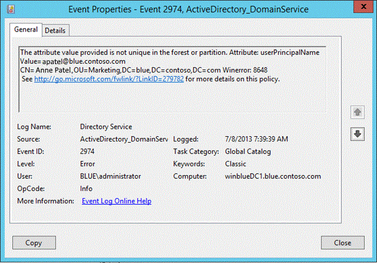
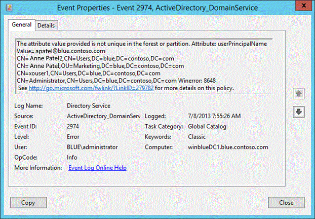
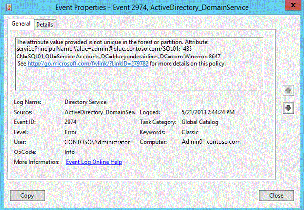

# SPN and UPN uniqueness

>Applies To: Windows Server 2016, Windows Server 2012 R2, Windows Server 2012

**Author**: Justin Turner, Senior Support Escalation Engineer with the Windows group  
  
> [!NOTE]  
> This content is written by a Microsoft customer support engineer, and is intended for experienced administrators and systems architects who are looking for deeper technical explanations of features and solutions in Windows Server 2012 R2 than topics on TechNet usually provide. However, it has not undergone the same editing passes, so some of the language may seem less polished than what is typically found on TechNet.  
  
## Overview  
Domain Controllers running Windows Server 2012 R2 block the creation of duplicate service principal names (SPN) and user principal names (UPN). This includes if the restoration or reanimation of a deleted object or the renaming of an object would result in a duplicate.  
  
### Background  
Duplicate Service Principal Names (SPN) commonly occur and result in authentication failures and may lead to excessive LSASS CPU utilization. There is no in-box method to block the addition of a duplicate SPN or UPN. *  
  
Duplicate UPN values break synchronization between on-premises AD and Office 365.  
  
*Setspn.exe is commonly used to create new SPNs, and functionally was built into the version released with Windows Server 2008 that adds a check for duplicates.  
  
**Table  SEQ Table \\\* ARABIC 1: UPN and SPN uniqueness**  
  
|Feature|Comment|  
|-----------|-----------|  
|UPN uniqueness|Duplicate UPNs break synchronization of on-premises AD accounts with Windows Azure AD-based services such as Office 365.|  
|SPN uniqueness|Kerberos requires SPNs for mutual authentication.  Duplicate SPNs result in authentication failures.|  
  
For more information about uniqueness requirements for UPNs and SPNs, see [Uniqueness Constraints](https://msdn.microsoft.com/library/dn392337.aspx).  
  
## Symptoms  
Error codes 8467 or 8468 or their hex, symbolic or string equivalents are logged in various on-screen dialogues and in event ID 2974 in the Directory Services event log. The attempt to create a duplicate UPN or SPN is blocked only under the following circumstances:  
  
-   The write is processed by a Windows Server 2012 R2 DC  
  
**Table  SEQ Table \\\* ARABIC 2: UPN and SPN uniqueness error codes**  
  
|Decimal|Hex|Symbolic|String|  
|-----------|-------|------------|----------|  
|8467|21C7|ERROR_DS_SPN_VALUE_NOT_UNIQUE_IN_FOREST|The operation failed because SPN value provided for addition/modification is not unique forest-wide.|  
|8648|21C8|ERROR_DS_UPN_VALUE_NOT_UNIQUE_IN_FOREST|The operation failed because UPN value provided for addition/modification is not unique forest-wide.|  
  
## New user creation fails if UPN is not unique  
  
### DSA.msc  
The user logon name you have chosen is already in use in this enterprise. Choose another logon name, and then try again.  
  
  
  
Modify an existing account:  
  
The specified user logon name already exists in the enterprise. Specify a new one, either by changing the prefix or selecting a different suffix from the list.  
  
  
  
### Active Directory Administrative Center (DSAC.exe)  
An attempt to create a new user in Active Directory Administrative Center with a UPN that already exists will yield the following error.  
  
  
  
**Figure  SEQ Figure \\\* ARABIC 1 error displayed in AD Administrative Center when new user creation fails due to duplicate UPN**  
  
### Event 2974 Source: ActiveDirectory_DomainService  
  
  
**Figure  SEQ Figure \\\* ARABIC 2 Event ID 2974 with error 8648**  
  
The event 2974 lists the value that was blocked and a list of one or more objects (up to 10) that already contain that value.  In the following figure, you can see that UPN attribute value **<em>dhunt@blue.contoso.com</em>** already exists on four other objects.  Since this is a new feature in Windows Server 2012 R2, accidental creation of duplicate UPN and SPNs in a mixed environment will still occur when down-level DCs process the write attempt.  
  
  
  
**Figure  SEQ Figure \\\* ARABIC 3 Event 2974 showing all objects containing the duplicate UPN**  
  
> [!TIP]  
> Review event ID 2974s regularly to:  
>   
> -   identify attempts to create duplicate UPN or SPNs  
> -   identify objects that already contain duplicates  
  
8648 = "The operation failed because UPN value provided for addition/modification is not unique forest-wide."  
  
### SetSPN:  
Setspn.exe has had duplicate SPN detection built-in to it since the Windows Server 2008 release when using the **"-S"** option.  You can bypass the duplicate SPN detection by using the **"-A"** option however.  Creation of a duplicate SPN is blocked when targeting a Windows Server 2012 R2 DC using SetSPN with the -A option.  The error message displayed is the same as the one displayed when using the -S option: "Duplicate SPN found, aborting operation!"  
  
### ADSIEDIT:  
  
```  
Operation failed. Error code: 0x21c8  
The operation failed because UPN value provided for addition/modification is not unique forest-wide.  
000021C8: AtrErr: DSID-03200BBA, #1: 0: 000021C8: DSID-03200BBA, problem 1005 (CONSTRAINT_ATT_TYPE), data 0, Att 90290 (userPrincipalName)  
```  
  
  
  
**Figure  SEQ Figure \\\* ARABIC 4  Error message displayed in ADSIEdit when addition of duplicate UPN is blocked**  
  
### Windows PowerShell  
Windows Server 2012 R2:  
  
  
  
PS running from Server 2012 targeting a Windows Server 2012 R2 DC:  
  
  
  
DSAC.exe running on Windows Server 2012 targeting a Windows Server 2012 R2 DC:  
  
  
  
**Figure  SEQ Figure \\\* ARABIC 5 DSAC user creation error on non-Windows Server 2012 R2 while targeting Windows Server 2012 R2 DC**  
  
  
  
**Figure  SEQ Figure \\\* ARABIC 6 DSAC user modification error on non-Windows Server 2012 R2 while targeting Windows Server 2012 R2 DC**  
  
### Restore of an object that would result in a duplicate UPN fails:  
  
  
  
  
No event is logged when an object fails to restore because of a duplicate UPN / SPN.  
  
The UPN of the object must be unique in order for it to be restored.  
  
1.  Identify the UPN that exists on the object in the Recycle Bin  
  
2.  Identify all objects that have the same value  
  
3.  Remove the duplicate UPN(s)  
  
### Identify the conflicting UPN on the deleted objectUsing repadmin.exe  
  
```  
Repadmin /showattr DCName "DN of deleted objects container" /subtree /filter:"(msDS-LastKnownRDN=<NAME>)" /deleted /atts:userprincipalname  
```  
  
```  
repadmin /showattr DCName "CN=Deleted Objects,DC=blue,DC=contoso,DC=com" /subtree /filter:"(msDS-LastKnownRDN=Dianne Hunt2)" /deleted /atts:userprincipalname  
  
C:\>repadmin /showattr winbluedc1 "cn=deleted objects,dc=blue,dc=contoso,dc=com" /subtree /filter:"(msds-lastknownrdn=Dianne Hunt2)" /deleted /atts:userprincipalname  
DN: CN=Dianne Hunt2\0ADEL:dd3ab8a4-3005-4f2f-814f-d6fc54a1a1c0,CN=Deleted Object  
s,DC=blue,DC=contoso,DC=com  
    1> userPrincipalName: dhunt@blue.contoso.com  
```  
  
### To identify all objects with the same UPN:Using Repadmin.exe  
  
```  
repadmin /showattr WinBlueDC1 "DC=blue,DC=contoso,DC=com" /subtree /filter:"(userPrincipalName=dhunt@blue.contoso.com)" /deleted /atts:DN  
  
C:\>repadmin /showattr winbluedc1 "dc=blue,dc=contoso,dc=com" /subtree /filter:"(userPrincipalName=dhunt@blue.contoso.com)" /deleted /atts:DN  
DN: CN=Administrator,CN=Users,DC=blue,DC=contoso,DC=com  
DN: CN=xouser1,CN=Users,DC=blue,DC=contoso,DC=com  
DN: CN=xouser10,CN=Users,DC=blue,DC=contoso,DC=com  
DN: CN=xouser100,CN=Users,DC=blue,DC=contoso,DC=com  
DN: CN=Dianne Hunt,OU=Marketing,DC=blue,DC=contoso,DC=com  
DN: CN=Dianne Hunt2\0ADEL:dd3ab8a4-3005-4f2f-814f-d6fc54a1a1c0,CN=Deleted Objects,DC=blue,DC=contoso,DC=com  
```  
  
> [!TIP]  
> The previously undocumented **/deleted** parameter in repadmin.exe is used to include deleted objects in the result set  
  
### Using Global Search  
  
-   Open Active Directory Administrative Center and navigate to **Global Search**  
  
-   Select the **Convert to LDAP** radio button  
  
-   Type **(userPrincipalName=*ConflictingUPN*)**  
  
    -   Replace ***ConflictingUPN*** with the actual UPN that is in conflict  
  
-   Select **Apply**  
  
  
  
### Using Windows PowerShell  
  
```  
Get-ADObject -LdapFilter "(userPrincipalName=dhunt@blue.contoso.com)" -IncludeDeletedObjects -SearchBase "DC=blue,DC=Contoso,DC=com" -SearchScope Subtree -Server winbluedc1.blue.contoso.com  
```  
  
  
  
If the object needs to be restored, you will need remove the duplicate UPNs from the other objects.  For only one object, it is simple enough to use ADSIEdit to remove the duplicate.  If there are multiple objects with duplicates, then Windows PowerShell might be the better tool to use.  
  
To null out the UserPrincipalName attribute using Windows PowerShell:  
  
  
  
> [!NOTE]  
> The userPrincipalName attribute is single-valued attribute, so this procedure will only remove the duplicate UPN.  
  
### Duplicate SPN  
  
  
**Figure  SEQ Figure \\\* ARABIC 8 Error message displayed in ADSIEdit when addition of duplicate SPN is blocked**  
  
Logged in the Directory Services event log is an **ActiveDirectory_DomainService** event ID **2974**.  
  
```  
Operation failed. Error code: 0x21c7  
The operation failed   
The attribute value provided is not unique in the forest or partition. Attribute:  
servicePrincipalName Value=<SPN>  
<Object DN> Winerror: 8467  
```  
  
  
  
**Figure  SEQ Figure \\\* ARABIC 9 Error logged when creation of duplicate SPN is blocked**  
  
### Workflow  
  
-   **If DC == GC**  
  
    -   No offbox call required, query can be satisfied locally  
  
    -   ***UPN case***  
  
        -   Query local forest-wide UPN index for supplied UPN (*userPrincipalName; a global index*)  
  
            -   If entries returned == 0 -> write proceeds  
  
            -   If entries returned !=0 -> write fails  
  
                -   Event logged  
  
                -   Also returns extended error:  
  
                    -   **8648:**  
  
                        *ERROR_DS_UPN_VALUE_NOT_UNIQUE_IN_FOREST*  
  
    -   ***SPN case***  
  
        -   Query local forest-wide SPN index for supplied SPN (*servicePrincipalName; a global index*)  
  
            -   If entries returned == 0 ->           write proceeds  
  
            -   If entries returned !=0 ->             write fails  
  
                -   Event logged  
  
                -   Also returns extended error:  
  
                    -   **8647:**  
  
                        **ERROR_DS_SPN_VALUE_NOT_UNIQUE_IN_FOREST**  
  
-   **If DC != GC**  
  
    -   Offbox call **desirable** but not critical, i.e. this is a best-effort uniqueness check  
  
        -   Check proceeds against local DIT only if GC cannot be located  
  
        -   Event logged to indicate such  
  
    -   ***UPN case***  
  
        -   Submit LDAP query against closest GC ? query GC's forest-wide UPN index for supplied UPN (*userPrincipalName; a global index*)  
  
            -   If entries returned == 0 ->           write proceeds  
  
            -   If entries returned !=0 ->             write fails  
  
                -   Event logged  
  
                -   Also returns extended error:  
  
                    -   **8648:**  
  
                        *ERROR_DS_UPN_VALUE_NOT_UNIQUE_IN_FOREST*  
  
    -   ***SPN case***  
  
        -   Submit LDAP query against closest GC ? query GC's forest-wide SPN index for supplied SPN (*servicePrincipalName; a global index*)  
  
            -   If entries returned == 0 -> write proceeds  
  
            -   If entries returned !=0 -> write fails  
  
                -   Event logged  
  
                -   Also returns extended error:  
  
                    -   **8647:**  
  
                        *ERROR_DS_SPN_VALUE_NOT_UNIQUE_IN_FOREST*  
  
When deleted objects are re-animated, SPN or UPN values present are checked for uniqueness. If a duplicate is found, the request fails.  
  
-   For certain attribute changes like DNS Host Name, SAM Account Name etc, when the modification is made, SPNs are updated accordingly. In the process, the obsolete SPNs are deleted and new SPNs are constructed and added to the database. The requisite attribute modifications against which this path is triggered are:  
  
    -   ATT_DNS_HOST_NAME  
  
    -   ATT_MS_DS_ADDITIONAL_DNS_HOST_NAME  
  
    -   ATT_SAM_ACCOUNT_NAME  
  
    -   ATT_MS_DS_ADDITIONAL_SAM_ACCOUNT_NAME  
  
    -   ATT_SERVER_REFERENCE_BL  
  
    -   ATT_USER_ACCOUNT_CONTROL  
  
If any of the new SPN value is a duplicate, we fail the modification. Of the above list, the important attributes are ATT_DNS_HOST_NAME (Machine name) and ATT_SAM_ACCOUNT_NAME (SAM Account Name).  
  
### Try This: Exploring SPN and UPN uniqueness  
This is the first of several "**Try This**" activities in the module.  There is not a separate lab guide for this module.  The **Try This** activities are essentially free-form activities that allow you explore the lesson material in the lab environment.  You have the option of following the prompt or going off script and come up with your own activity.  
  
> [!NOTE]  
> -   This is the first of several "**Try This**" activities.  
> -   There is not a separate lab guide for this module.  
> -   The **Try This** activities are essentially free-form activities that allow you explore the lesson material in the lab environment.  
> -   You have the option of following the prompt or going off script and come up with your own activity.  
> -   While not all sections have a **Try This** prompt, you are still encouraged to explore the lesson content in the lab where appropriate.  
  
Experiment with SPN and UPN uniqueness.  Follow these prompts, or complete your own.  
  
1.  Create new users with UPN  
  
2.  Create accounts with SPNs  
  
3.  Either create a new user with a UPN already previously defined or change an existing account's UPN.  Do the same for a SPN on another account  
  
    1.  Populate an existing user account with a UPN already in use  
  
        1.  Using PowerShell, ADSIEDIT, or Active Directory Administrative Center (DSAC.exe)  
  
    2.  Populate an existing account with an SPN already in use  
  
        1.  Using Windows PowerShell, ADSIEDIT, or SetSPN  
  
4.  Observe the errors  
  
**Optionally**  
  
1.  Verify with the classroom instructor that it is ok to enable the *[AD Recycle Bin](https://technet.microsoft.com/library/jj574144.aspx#BKMK_EnableRecycleBin)* in Active Directory Administrative Center.  If so, move on to the next step.  
  
2.  Populate the UPN on a user account  
  
3.  Delete the account  
  
4.  Populate a different account with the same UPN as the deleted account  
  
5.  Attempt to use the Recycle Bin GUI to restore the account  
  
6.  Imagine you have just been presented with the error you see in the previous step.  (and don't have a history of the steps you just performed)Your goal is to complete the restore of the account.  See the workbook for example steps.  
  


