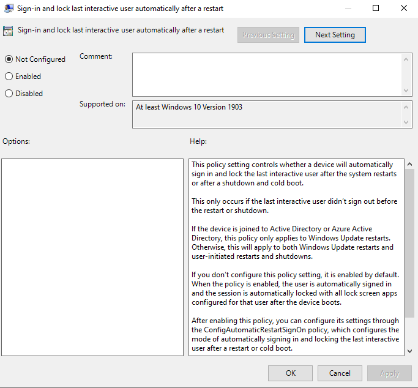
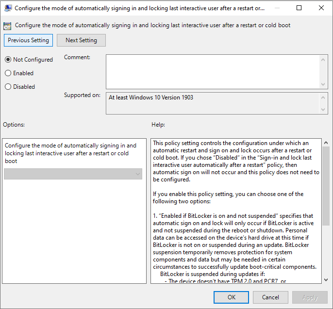

# Winlogon automatic restart sign-on (ARSO)

During a Windows Update, there are user specific processes that must happen for the update to be complete. These processes require the user to be logged in to their device. On the first login after an update has been initiated, users must wait until these user specific processes are complete before they can start using their device.

## How does it work?

When Windows Update initiates an automatic reboot, ARSO extracts the currently logged in user's derived credentials, persists it to disk, and configures Autologon for the user. Windows Update running as system with TCB privilege will initiate the RPC call to do this.

After the final Windows Update reboot, the user will automatically be logged in via the Autologon mechanism, and the user's session is rehydrated with the persisted secrets. Additionally, the device is locked to protect the user's session. The locking will be initiated via Winlogon whereas the credential management is done by the Local Security Authority (LSA). Upon a successful ARSO configuration and login, the saved credentials are immediately deleted from disk.

By automatically logging in and locking the user on the console, Windows Update can complete the user specific processes before the user returns to the device. In this way, the user can immediately start using their device.

ARSO treats unmanaged and managed devices differently. For unmanaged devices, device encryption is used but not required for the user to get ARSO. For managed devices, TPM 2.0, SecureBoot, and BitLocker are required for ARSO configuration. IT admins can override this requirement via Group Policy. ARSO for managed devices is currently only available for devices that are joined to Azure Active Directory.

|   | Windows Update| shutdown -g -t 0  | User-initiated reboots | APIs with SHUTDOWN_ARSO / EWX_ARSO flags |
| --- | :---: | :---: | :---: | :---: |
| Managed Devices | :heavy_check_mark:  | :heavy_check_mark: |   | :heavy_check_mark: |
| Unmanaged Devices | :heavy_check_mark: | :heavy_check_mark: | :heavy_check_mark: | :heavy_check_mark: |

> [!NOTE]
> After a Windows Update induced reboot, the last interactive user is automatically logged in and the session is locked. This gives the ability for a user's lock screen apps to still run despite the Windows Update reboot.

## Policy #1

### Sign-in and lock last interactive user automatically after a restart

In Windows 10, ARSO is disabled for Server SKUs and opt out for Client SKUs.

**Group policy location:** Computer Configuration > Administrative Templates > Windows Components > Windows Logon Options

**Intune policy:**

- Platform: Windows 10 and later
- Profile type: Administrative Templates
- Path: \Windows Components\Windows Logon Options

**Supported on:** At least Windows 10 Version 1903

**Description:**

This policy setting controls whether a device will automatically sign in and lock the last interactive user after the system restarts or after a shutdown and cold boot.

This only occurs if the last interactive user didn't sign out before the restart or shutdown.

If the device is joined to Active Directory or Azure Active Directory, this policy only applies to Windows Update restarts. Otherwise, this will apply to both Windows Update restarts and user-initiated restarts and shutdowns.

If you don't configure this policy setting, it is enabled by default. When the policy is enabled, the user is automatically signed in and the session is automatically locked with all lock screen apps configured for that user after the device boots.

After enabling this policy, you can configure its settings through the ConfigAutomaticRestartSignOn policy, which configures the mode of automatically signing in and locking the last interactive user after a restart or cold boot.

If you disable this policy setting, the device does not configure automatic sign in. The user's lock screen apps are not restarted after the system restarts.

**Registry editor:**

| Value Name | Type | Data |
| --- | --- | --- |
| DisableAutomaticRestartSignOn | DWORD | 0 (Enable ARSO) |
|   |   | 1 (Disable ARSO) |

**Policy registry location:** HKLM\SOFTWARE\Microsoft\Windows\CurrentVersion\Policies\System

**Type:** DWORD

## Policy #2

### Configure the mode of automatically signing in and locking last interactive user after a restart or cold boot

**Group policy location:** Computer Configuration > Administrative Templates > Windows Components > Windows Logon Options

**Intune policy:**

- Platform: Windows 10 and later
- Profile type: Administrative Templates
- Path: \Windows Components\Windows Logon Options

**Supported on:** At least Windows 10 Version 1903

**Description:**

This policy setting controls the configuration under which an automatic restart and sign on and lock occurs after a restart or cold boot. If you chose “Disabled” in the “Sign-in and lock last interactive user automatically after a restart” policy, then automatic sign on will not occur and this policy does not need to be configured.

If you enable this policy setting, you can choose one of the following two options:

1. “Enabled if BitLocker is on and not suspended” specifies that automatic sign on and lock will only occur if BitLocker is active and not suspended during the reboot or shutdown. Personal data can be accessed on the device's hard drive at this time if BitLocker is not on or suspended during an update. BitLocker suspension temporarily removes protection for system components and data but may be needed in certain circumstances to successfully update boot-critical components.
   - BitLocker is suspended during updates if:
      - The device doesn't have TPM 2.0 and PCR7, or
      - The device doesn't use a TPM-only protector
2. “Always Enabled” specifies that automatic sign on will happen even if BitLocker is off or suspended during reboot or shutdown. When BitLocker is not enabled, personal data is accessible on the hard drive. Automatic restart and sign on should only be run under this condition if you are confident that the configured device is in a secure physical location.

If you disable or don't configure this setting, automatic sign on will default to the “Enabled if BitLocker is on and not suspended” behavior.

**Registry editor**

| Value Name | Type | Data |
| --- | --- | --- |
| AutomaticRestartSignOnConfig | DWORD | 0 (Enable ARSO if secure) |
|   |   | 1 (Enable ARSO always) |

**Policy registry location:** HKLM\SOFTWARE\Microsoft\Windows\CurrentVersion\Policies\System

**Type:** DWORD

## Troubleshooting

When WinLogon automatically locks, WinLogon's state trace will be stored in the WinLogon event log.

The status of an Autologon configuration attempt is logged

- If it is successful
   - records it as such
- If it is a failure:
   - records what the failure was
- When BitLocker's state changes:
   - the removal of credentials will be logged
   - These will be stored in the LSA Operational log.

### Reasons why autologon might fail

There are several cases in which a user automatic login cannot be achieved.  This section is intended to capture the known scenarios in which this can occur.

### User must change password at next login

User login can enter a blocked state when password change at next login is required.  This can be detected prior to restart in most cases, but not all (for example, password expiry can be reached between shutdown and next login.

### User account disabled

An existing user session can be maintained even if disabled.  Restart for an account that is disabled can be detected locally in most cases in advance, depending on gp it may not be for domain accounts (some domain cached login scenarios work even if account is disabled on DC).

### Logon hours and parental controls

The Logon Hours and parental controls can prohibit a new user session from being created.  If a restart were to occur during this window, the user would not be permitted to login.  There is additional policy that causes lock or logout as a compliance action. The status of an Autologon configuration attempt is logged.

## Security details

### Credentials stored

|   | Password hash | Credential key | Ticket-granting ticket | Primary refresh token |
| --- | :---: | :---: | :---: | :---: |
| Local account | :heavy_check_mark: | :heavy_check_mark: |   |   |
| MSA account | :heavy_check_mark: | :heavy_check_mark: |   |   |
| Azure AD joined account | :heavy_check_mark: | :heavy_check_mark: | :heavy_check_mark: (if hybrid) | :heavy_check_mark: |
| Domain joined account | :heavy_check_mark: | :heavy_check_mark: | :heavy_check_mark: | :heavy_check_mark: (if hybrid) |

### Credential Guard interaction

If a device has Credential Guard enabled, a user's derived secrets are encrypted with a key specific to the current boot session. Therefore, ARSO is not currently supported on devices with Credential Guard enabled.

## Additional resources

Autologon is a feature that has been present in Windows for several releases. It is a documented feature of Windows that even has tools such as Autologon for Windows [http:/technet.microsoft.com/sysinternals/bb963905.aspx](https://technet.microsoft.com/sysinternals/bb963905.aspx). It allows a single user of the device to sign in automatically without entering credentials. The credentials are configured and stored in registry as an encrypted LSA secret. This could be problematic for many child cases where account lockdown may occur between bed time and wake-up, particularly if the maintenance window is commonly during this time.
