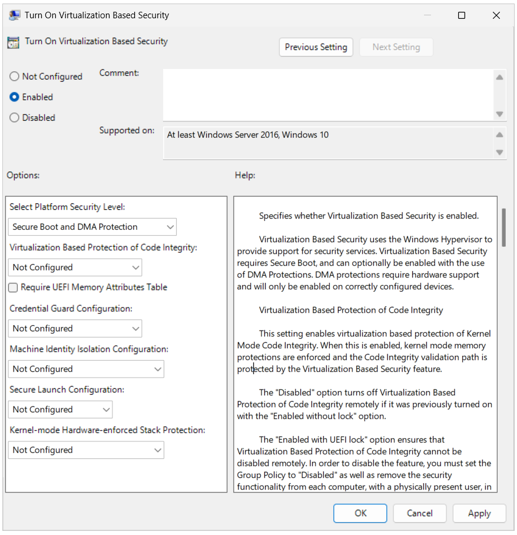

# Credential Guard protected machine accounts

> [!IMPORTANT]
> Starting with the April Windows security update ([KB5055523](https://aka.ms/WinServer2025/5055523)), Credential Guard protected machine accounts is temporarily disabled in Windows Server 2025 and Windows 11, version 24H2. This feature has been disabled due to an issue with machine password rotation using Kerberos. The feature remains disabled until a permanent fix is available. To learn more about the machine password rotation issue, see the [Windows Server 2025 known issues and notifications](/windows/release-health/status-windows-server-2025?context=%2Fwindows-server%2Fcontext%2Fwindows-server-get-started) article.

Recent Windows features, such as the Flexible Authentication Secure Tunneling (FAST) Kerberos extension, also known as Kerberos Armoring, became increasingly dependent on machine accounts to enhance security. The machine account is used to add entropy to the client's secret key and both gMSA and dMSA service accounts now rely on machine accounts and grant them access to service accounts. However, this reliance on machine accounts created a vulnerability in service account security, as machine accounts can be easily extracted from the registry and used to access highly secured service accounts.

In order to strengthen service account security, the opt-in feature of machine accounts in Credential Guard is now available in Windows Server 2025 devices that have Credential Guard enabled. It's crucial to take measures to address this issue. This feature relocates the storage of machine account credentials from the registry to Credential Guard, which provides a separate trusted execution environment for the machine account password. Security is improved by ensuring that:

- The password can't be accessed by unprivileged users, administrators, or drivers.
- The security of machine accounts is enhanced, which hardens the overall security of service accounts in Active Directory (AD).

## Machine Identity Isolation

Enabling machine identity isolation allows for virtualization-based protection of AD machine accounts. When enabled, the machine account credentials of the device will be relocated into Credential Guard. As a result, all future machine account authentications, such as logging into a domain-joined device, will be routed through Credential Guard. However, if Credential Guard fails to start after a device reboot, it results in the inability to complete domain authentication, potentially requiring intervention from a local administrator account to recover.

### Machine Identity Isolation Configuration

To enable the **Machine Identity Isolation Configuration** setting, open **Group Policy** and navigate to the following path, and select **Enabled**:

- **Computer Configuration\Administrative Templates\System\Device Guard\Turn On Virtualization Based Security**

The available options for this specific setting are:

- **Disabled**: Turns off Machine Identity Isolation. If this policy was previously set to *Enabled in audit mode*, no further action is needed. If this policy was previously set to *Enabled in enforcement mode*, the device must be unjoined and rejoined to the domain, as it's unable to authenticate otherwise.

  > [!NOTE]
  >
  > - If local cached logon is enabled when this setting is disabled, local logon will still work while the cache is fresh, but domain authentication will break.
  >
  > - Only the local administrator account can be used to unjoin and rejoin the machine.

- **Enabled in audit mode**: This option creates a new secret in Credential Guard and copies it into the Local Security Authority (LSA). The old LSA secret is then deleted. When auditing, attempts to authenticate the machine identity will first try to use the copy in Credential Guard. If that fails, authentication falls back to using the original machine identity from LSA.

  > [!NOTE]
  > If the policy was previously set to enforcement mode, the device must be manually unjoined and rejoined.

- **Enabled in enforcement mode**: This option moves the machine account secret into Credential Guard and deletes it from LSA. This makes the machine account secret inaccessible except as utilized by Credential Guard for machine authentication.
- **Not Configured**: Leaves the policy setting undefined. Group Policy doesn't write the policy setting to the registry and has no impact on computers or users. If there's a current setting in the registry, it won't be modified.

## See also

- [Credential Guard overview](/windows/security/identity-protection/credential-guard)

