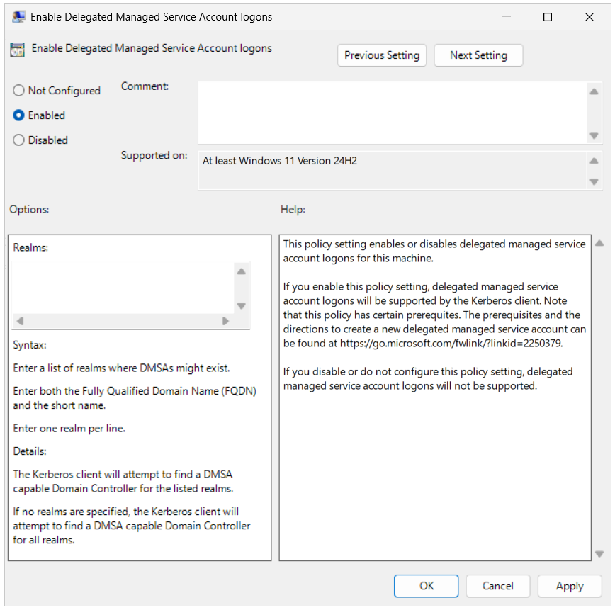

# Delegated Managed Service Accounts overview

A new account type known as delegated Managed Service Account (dMSA) is introduced in Windows Server 2025 that allows migration from a traditional service account to a machine account with managed and fully randomized keys, while disabling original service account passwords. Authentication for dMSA is linked to the device identity, which means that only specified machine identities mapped in Active Directory (AD) can access the account. Using dMSA helps to prevent harvesting credentials using a compromised account (kerberoasting), which is a common issue with traditional service accounts.

## dMSA and gMSA comparison

dMSAs and gMSAs are two types of managed service accounts that are used to run services and applications in Windows Server. A dMSA is managed by an administrator and is used to run a service or application on a specific server. A gMSA is managed by AD and is used to run a service or application on multiple servers. Both offer improved security and simplified password management. dMSA differs by:

- Utilizing gMSA concepts to limit scope of usage using [Credential Guard](/windows/security/identity-protection/credential-guard) (CG) to bind machine authentication.
- CG can be used to enhance security in dMSA by automatically rotating passwords and binding all service account tickets. Legacy accounts are then disabled to further improve security.
- Although gMSAs are secured with machine generated and autorotated passwords, the passwords are still not machine bound and can be stolen.

## Functionality of dMSA

dMSA allows users to create them as a standalone account, or to replace an existing standard service account. When a dMSA supersedes an existing account, authentication to that existing account using its password is blocked. The request is redirected to the [Local Security Authority](/windows/win32/secauthn/lsa-authentication) (LSA) to authenticate using dMSA, which has access to everything the previous account could access in AD.

During migration, dMSA automatically learns the devices on which the service account to be used which is then used to move from all existing service accounts.

dMSA uses a randomized secret (derived from the machine account credential) that is held by the Domain Controller (DC) to encrypt tickets. The secret can be further protected by enabling CG. While the secrets used by dMSA are updated periodically on an epoch like a gMSA, the key difference is that dMSA's secret can't be retrieved or found anywhere other than on the DC.

## Migration flow for dMSA

A quick concept of the migration flow process for a dMSA involves the following steps:

1. The CG policy can be configured to protect the machines identity.
1. An administrator starts and completes migration of the service account.
1. The service account refreshes the Ticket Granting Server (TGT).
1. The service account adds the machine identity to allow principals.
1. The original service account becomes disabled.

Take note of the following when migrating dMSAs:

- You can't migrate from a managed service account or a gMSA to a dMSA.
- Wait at least two ticket lifetimes (equivalent to 14 days) after modifying the Security Descriptor (SD) before completing the dMSA migration. Keeping a service in the **start** state for four ticket lifetimes (28 days) is recommended. Delay the migration if your DCs are partitioned or replication is broken during onboarding.
- Pay attention to sites where replication delays are longer than the default ticket renewal time of **10 hours**. The **groupMSAMembership** attribute is checked and updated at every ticket renewal, and every time the original service account logs on during the "start migration" state, which adds the machine account to the **groupMSAMembership** of the dMSA.
  - Example, two sites utilize the same service account and each replication cycle takes more than 10 hours per ticket lifetime. In this scenario, a group membership is lost during the initial replication cycles.
- Migration requires access to a Read-Write Domain Controller (RWDC) to query and modify the SD.
- Unconstrained delegation stops working once the migration is complete if the old service account was using it. If you're using a dMSA protected by CG, unconstrained delegation stops working. To learn more, see [Considerations and known issues when using Credential Guard](/windows/security/identity-protection/credential-guard/considerations-known-issues).

> [!WARNING]
> If you're going to migrate to a dMSA, all machines using the service account need to be updated to support dMSA. If this isn't true, machines that don't support dMSA fails authentication with the existing service account once the account becomes disabled during migration.

## Account attributes for dMSA

This section describes how the attributes for dMSA changes in the AD schema. These attributes can be viewed using the **Active Directory Users and Computers** snap-in or running **ADSI Edit** on the DC.

> [!NOTE]
> The numerical attributes set for the account indicate:
>
> - **1** - Account migration has begun.
> - **2** - Account migration has completed.

Running `Start-ADServiceAccountMigration` performs the following changes:

- The service account is granted _Generic Read_ to all properties on the dMSA
- The service account is granted _Write_ property to **msDS-groupMSAMembership**
- **msDS-DelegatedMSAState** is changed to 1
- **msDS-ManagedAccountPrecededByLink** is set to the service account
- **msDS-SupersededAccountState** is changed to 1
- **msDS-SupersededManagedServiceAccountLink** is set to the dMSA

Running `Complete-ADServiceAccountMigration` performs the following changes:

- The service account is removed from _Generic Read_ to all properties on the dMSA
- The service account is removed from _Write_ property on the **msDS-GroupMSAMembership** attribute
- **msDS-DelegatedMSAState** is set to 2
- The Service Principal Names (SPNs) are copied over from the service account to the dMSA account
- **msDS-AllowedToDelegateTo** is copied over if applicable
- **msDS-AllowedToActOnBehalfOfOtherIdentity** the security descriptor is copied over if applicable
- The assigned AuthN policy, **msDS-AssignedAuthnPolicy**, of the service account are copied over
- dMSA is added to any AuthN policy silos that the service account was a member of
- The trusted "Auth for Delegation" User Account Control (UAC) bit is copied over if it was set on the service account
- **msDS-SupersededServiceAccountState** is set to 2
- The service account is disabled via the UAC disable bit
- The SPNs are removed from the account

## dMSA realms

Realms serve as logical groupings that define authentication boundaries, commonly used when integrating different versions of AD across domains or forests. They're especially important in mixed domain environments where some domains may not fully support all features of dMSA. By specifying realms, dMSA can ensure proper communication and authentication flow between domains.

Administrators can use realms to specify which domains or directory components can authenticate and access the dMSA account. This ensures that even older child domains, which may not natively support dMSA features, can interact with the accounts while maintaining security boundaries. Realms facilitate seamless transitions and feature coexistence in mixed environments, ensuring compatibility between domains while maintaining strong security when enabled.

For example, if you have a primary domain called `corp.contoso.com` running on Windows Server 2025 and an older child domain called `legacy.corp.contoso.com` running Windows Server 2022, you can specify the realm as `legacy.corp.contoso.com`.

To edit this group policy setting for your environment, navigate to the following path:

**Computer Configuration\Administrative Templates\System\Kerberos\Enable Delegated Managed Service Account logons**

## See also

[Setting up Delegated Managed Service Accounts](delegated-managed-service-accounts-set-up-dmsa.md)

