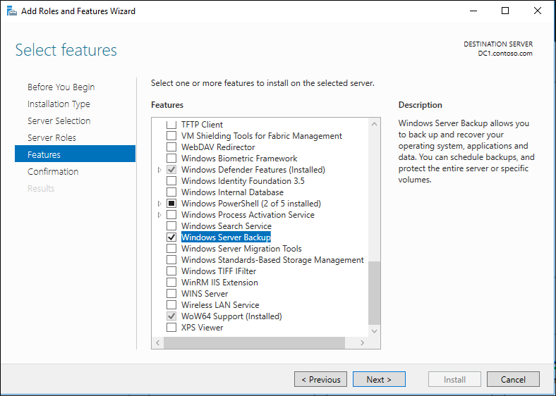
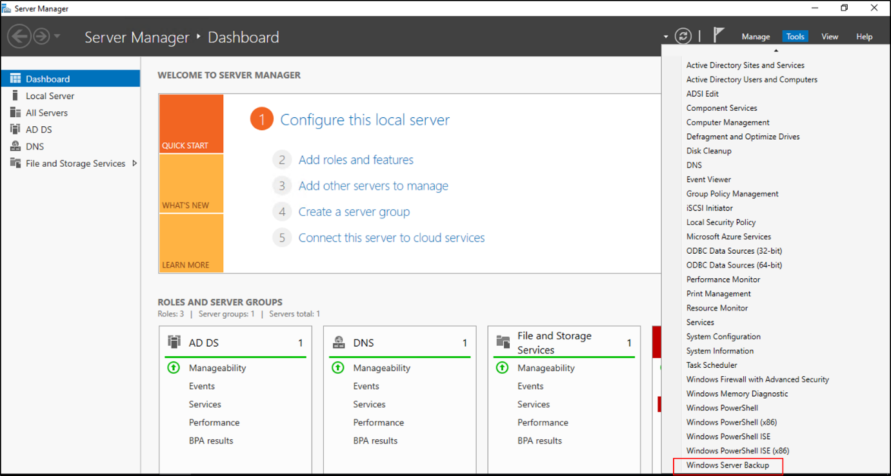
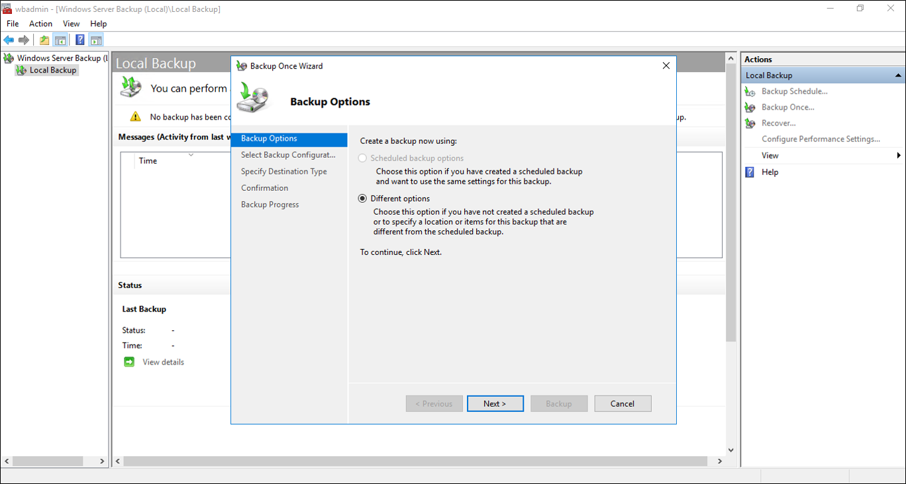
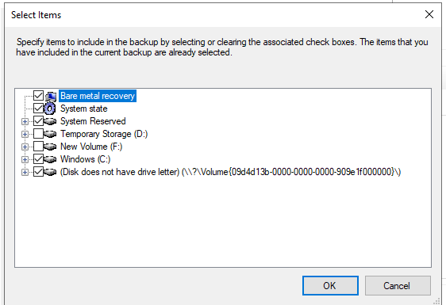
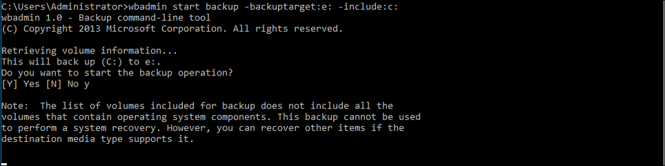

# Active Directory Forest Recovery - Backing up a full server

> Applies to: Windows Server 2022, Windows Server 2019, Windows Server 2016, Windows Server 2012 R2 and 2012

A Bare Metal Recovery (BMR)backup is recommended to prepare for a forest recovery because it can be restored to different hardware or a different operating system instance. Using Windows Server Backup you can perform a Bare-Metal Recovery (BMR)backup of your server.

## Windows Server Backup

Windows Server Backup is not installed by default. In Windows Server 2012 R2, Windows Server 2016 and newer, install it by following the steps below.

> [!NOTE]
> Please be aware that the steps may vary slightly between Windows Server 2012 R2 and Windows Server 2016+.

## Install Windows Server Backup

1. Open **Server Manager** and click **Add roles and features**.
2. On the **Add Roles and Features Wizard** click **Next**.
3. On the **Installation Type** screen, leave the default **Role-based or feature-based installation** and click **Next**.
4. On the **Server Selection** screen, click **Next**.
5. On the **Server Roles** screen click **Next**.
6. On the **Features** screen, select **Windows Server Backup** and click **Next**

    

7. Click **Install**.
8. Once the installation is complete, click **Close**.

## Perform a backup with Windows Server Backup

1. Open **Server Manager**, click **Tools**, and then click **Windows Server Backup**.

    

2. If you are prompted, in the **User Account Control** dialog box, provide Backup Operator credentials, and then click **OK**.
3. Click **Local Backup**.
4. On the **Action** menu, click **Backup once**.
5. In the Backup Once Wizard, on the **Backup options** page, click **Different options**, and then click **Next**.

    

6. On the **Select backup configuration** page, click **Full server (recommended)**, and then click **Next**.  Or when you select “Custom”, make sure to select “Bare metal recovery” and the items is selects automatically:  

    

7. On the **Specify destination type** page, click **Local drives** or **Remote
    shared folder**, and then click **Next**.
8. On the **Select Backup Destination** page, choose the backup location. If you selected local drive choose a local drive or if you selected remote share choose a network share.
9. On the confirmation screen, click **Backup**.
    
10. Once this has completed click **Close**.
11. Close Windows Server Backup.

> [!NOTE]
> If you get an error stating that no backup storage location is available, you will need to either exclude one of the volumes that has been selected or add a new volume or remote share. If you get a warning stating that the selected volume is also included in the list of items to backup, determine whether or not to remove and click **OK**.

## Use `wbadmin.exe` to backup a Windows Server

`Wbadmin.exe` is a command-line utility that enables you to back up and restore your operating system, volumes, files, folders, and applications from a command prompt.

## Perform a full server backup using `wbadmin.exe`

- Open an elevated command prompt, type the following command and press ENTER:

    Bare-Metal Backup:

    wbadmin start backup -allCritical -backuptarget:\<Drive_letter_to
    store_backup\>:

    Full Server Backup:wbadmin start backup -backuptarget:\<Drive_letter_to
    store_backup\>: -include:\<Drive_letter_to_include\>:

    

## Next steps

[!INCLUDE [ad-forest-recovery-guide-links](includes/ad-forest-recovery-guide-links.md)]