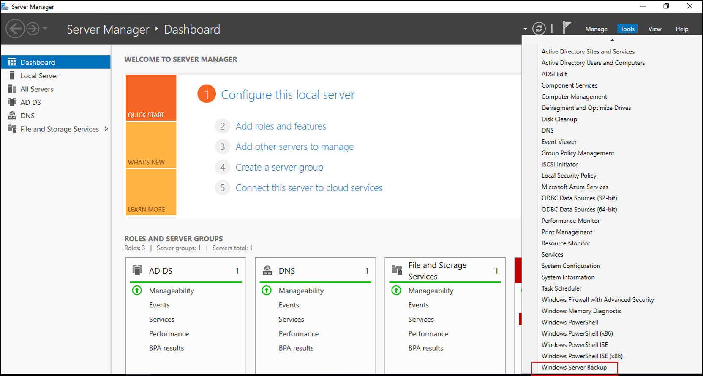
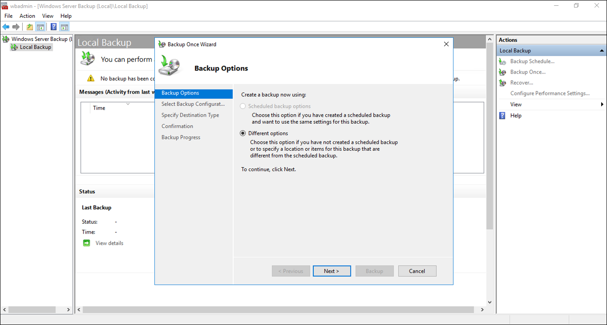
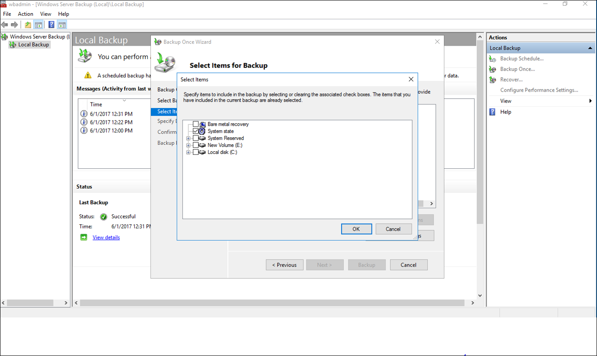
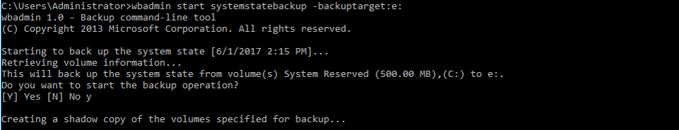

# AD Forest Recovery - Backing up the System State data

>Applies to: Windows Server 2022, Windows Server 2019, Windows Server 2016, Windows Server 2012 and 2012 R2, Windows Server 2008 and 2008 R2

Use the following procedure to perform a system state backup on a DC by using Windows Server Backup or wbadmin.exe.

## To perform a system state backup using Windows Server Backup

1. Open **Server Manager**, select **Tools**, and then select **Windows Server Backup**.
   - In Windows Server 2008 R2 and Windows Server 2008, select **Start**, point to **Administrative Tools**, and then select **Windows Server Backup**.

   

2. If you're prompted, in the **User Account Control** dialog box, provide Backup Operator credentials, and then select **OK**.
3. Select **Local Backup**.
4. On the **Action** menu, select **Backup once**.
5. In the Backup Once Wizard, on the **Backup options** page, select **Different options**, and then select **Next**.

   

6. On the **Select backup configuration** page, select **Custom)**, and then select **Next**.
7. On the **Select Items for Backup** screen, select **Add Items** and select **System State** and select **Ok**.
   - In Windows Server 2008 R2 and Windows Server 2008, select the volumes to include in the backup. If you select the **Enable system recovery** check box, all critical volumes are selected.

   

8. On the **Specify destination type** page, select **Local drives** or **Remote shared folder**, and then select **Next**.  If you're backing up to a remote shared folder, do the following:
   - Type the path to the shared folder.
   - Under **Access Control**, select **Do not inherit** or **Inherit** to determine access to the backup, and then select **Next**.
   - In the **Provide user credentials for Backup** dialog box, provide the user name and password for a user who has write access to the shared folder, and then select **OK**.

9. For Windows Server 2008 R2 and Windows Server 2008, on the **Specify advanced option** page, select **VSS copy backup** and then select **Next**.
10. On the **Select Backup Destination** page, choose the backup location.  If you selected local drive choose a local drive or if you selected remote share choose a network share.
11. On the confirmation screen, select **Backup**.
12. Once this has completed select **Close**.
13. Close Windows Server Backup.

## To perform a system state backup using Wbadmin.exe

Open an elevated command prompt, type the following command and press ENTER:

   ```
   wbadmin start systemstatebackup -backuptarget:<targetDrive>:
   ```

   

## Next Steps

- [AD Forest Recovery Guide](AD-Forest-Recovery-Guide.md)
- [AD Forest Recovery - Procedures](AD-Forest-Recovery-Procedures.md)
