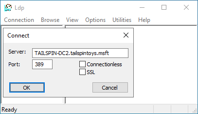
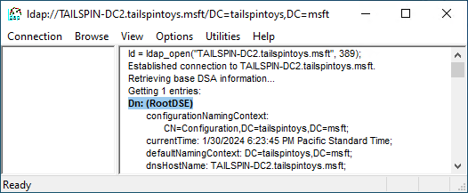
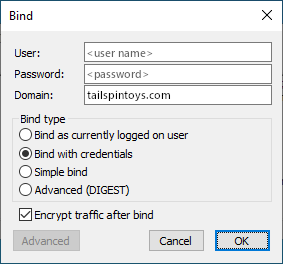
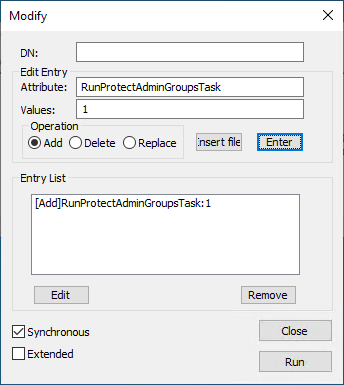

# Appendix C: Protected Accounts and Groups in Active Directory

## Appendix C: Protected Accounts and Groups in Active Directory

Within Active Directory, a default set of highly privileged accounts and groups are considered protected accounts and groups. With most objects in Active Directory, users delegated permissions to manage Active Directory objects can change permissions on the objects, including altering permissions to allow themselves to modify membership of special groups.

Protected accounts and groups are special objects where permissions are set and enforced via an automatic process that ensures the permissions on the objects remain consistent. These permissions remain even if you move the objects to different locations in Active Directory. If a protected object's permissions are modified, existing processes ensure that permissions are returned to their defaults quickly.

### Protected Groups

The following security accounts and groups are protected in Active Directory Domain Services:

- Account Operators
- Administrator
- Administrators
- Backup Operators
- Domain Admins
- Domain Controllers
- Enterprise Admins
- Enterprise Key Admins
- Key Admins
- Krbtgt
- Print Operators
- Read-only Domain Controllers
- Replicator
- Schema Admins
- Server Operators

#### AdminSDHolder

The purpose of the AdminSDHolder object is to provide "template" permissions for the protected accounts and groups in the domain. AdminSDHolder is automatically created as an object in the System container of every Active Directory domain. Its path is: **CN=AdminSDHolder,CN=System,DC=<domain_component>,DC=<domain_component>?.**

While the Administrators group owns most objects in an Active Directory domain, the Domain Admins group owns the AdminSDHolder object. By default, Enterprise Admins can make changes to any domain's AdminSDHolder object, as can the domain's Domain Admins and Administrators groups. Additionally, although the default owner of AdminSDHolder is the domain's Domain Admins group, members of Administrators or Enterprise Admins can take ownership of the object.

> [!NOTE]
> If the user object has been removed from a Protected Group, the SDProp process will no longer evaluate this account for new updates on the AdminSDHolder permissions. Therefore it is recommended to set the adminCount attribute back to 0, then re-enable inheritance to complete the ‘de-admining’ process.
#### SDProp

SDProp is a process that runs every 60 minutes (by default) on the domain controller that holds the domain's PDC Emulator (PDCE). SDProp compares the permissions on the domain's AdminSDHolder object with the permissions on the protected accounts and groups in the domain. If the permissions on any of the protected accounts and groups do not match the permissions on the AdminSDHolder object, SDProp resets the permissions on the protected accounts and groups to match those configured for the domain's AdminSDHolder object.

Permissions inheritance is disabled on protected groups and accounts. Even if the accounts and groups are moved to different locations in the directory, they will not inherit permissions from their new parent objects. Inheritance is disabled on the AdminSDHolder object so that permission changes to the parent objects do not change the permissions of AdminSDHolder.

##### Changing SDProp Interval

Normally, you should not need to change the interval at which SDProp runs, except for testing purposes. If you need to change the SDProp interval, on the PDCE for the domain, use regedit to add or modify the AdminSDProtectFrequency DWORD value in HKLM\SYSTEM\CurrentControlSet\Services\NTDS\Parameters.

The range of values is in seconds from 60 to 7200 (one minute to two hours). To remove changes, delete AdminSDProtectFrequency key. Deleting the key causes SDProp to revert back to the 60 minute interval. You generally should not reduce this interval in production domains as it can increase LSASS processing overhead on the domain controller. The impact of this increase is dependent on the number of protected objects in the domain.

##### Running SDProp Manually

A better approach to testing AdminSDHolder changes is to run SDProp manually, which causes the task to run immediately but does not affect scheduled execution. You can force SDProp to run by using Ldp.exe or by running an LDAP modification script. To run SDProp manually, perform the following steps:

1. Launch **Ldp.exe**.

2. In the **Ldp** dialog box, click **Connection**, and click **Connect**.

3. In the **Connect** dialog box, type the name of the domain controller for the domain that holds the PDC Emulator (PDCE) role and click **OK**.

   

4. To verify the connection, check that **Dn: (RootDSE)** is present similar to the following screenshot. Next click **Connection** and click **Bind**.

   

5. In the **Bind** dialog box, type the credentials of a user account that has permission to modify the rootDSE object. (If you are logged on as that user, you can select **Bind as currently logged on user**.) Click **OK**.

   

6. Once the bind operation completes, click **Browse**, and click **Modify**.

7. In the **Modify** dialog box, leave the **DN** field blank. In the **Edit Entry Attribute** field, type **RunProtectAdminGroupsTask**, and in the **Values** field, type **1**. Click **Enter** to populate the entry list as shown here.

   

8. In the populated **Modify** dialog box, click **Run**, and verify that the changes you made to the AdminSDHolder object have appeared on that object.
