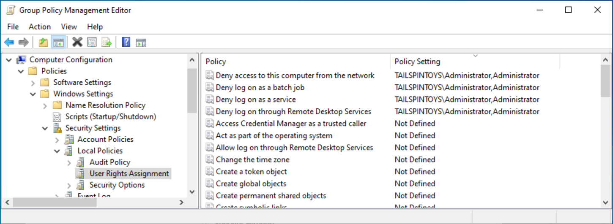

# Appendix D: Securing Built-in Administrator Accounts in Active Directory

>Applies to: Windows Server 2022, Windows Server 2019, Windows Server 2016, Windows Server 2012 R2, Windows Server 2012

## Appendix D: Securing Built-in Administrator Accounts in Active Directory

In each domain in Active Directory, an Administrator account is created as part of the creation of the domain. This account is by default a member of the Domain Admins and Administrators groups in the domain. If the domain is the forest root domain, the account is also a member of the Enterprise Admins group.

Use of a domain's Administrator account should be reserved only for initial build activities, and possibly, disaster-recovery scenarios. To ensure that an Administrator account can be used to effect repairs in the event that no other accounts can be used, you should not change the default membership of the Administrator account in any domain in the forest. Instead, you should secure the Administrator account in each domain in the forest as described in the following section and detailed in the step-by-step instructions that follow.

> [!NOTE]
> This guide used to recommend disabling the account. This was removed as the forest recovery white paper makes use of the default administrator account. The reason is, this is the only account that allows logon without a Global Catalog Server.

#### Controls for Built-in Administrator Accounts
For the Built-in Administrator account in each domain in your forest, you should configure the following settings:

-   Enable the **Account is sensitive and cannot be delegated** flag on the account.

-   Enable the **Smart card is required for interactive logon** flag on the account.

- Configure GPOs to restrict the Administrator account's use on domain-joined systems:

    - In one or more GPOs that you create and link to workstation and member server OUs in each domain, add each domain's Administrator account to the following user rights in **Computer Configuration\Policies\Windows Settings\Security Settings\Local Policies\User Rights Assignments**:

        - Deny access to this computer from the network

        - Deny log on as a batch job

        - Deny log on as a service

        - Deny log on through Remote Desktop Services

> [!NOTE]
> When you add accounts to this setting, you must specify whether you are configuring local Administrator accounts or domain Administrator accounts. For example, to add the TAILSPINTOYS domain's Administrator account to these deny rights, you must type the account as TAILSPINTOYS\Administrator, or browse to the Administrator account for the TAILSPINTOYS domain. If you type "Administrator" in these user rights settings in the Group Policy Object Editor, you will restrict the local Administrator account on each computer to which the GPO is applied.
>
> We recommend restricting local Administrator accounts on member servers and workstations in the same manner as domain-based Administrator accounts. Therefore, you should generally add the Administrator account for each domain in the forest and the Administrator account for the local computers to these user rights settings. The following screenshot shows an example of configuring these user rights to block local Administrator accounts and a domain's Administrator account from performing logons that should not be needed for these accounts.

- Configure GPOs to restrict Administrator accounts on domain controllers
  - In each domain in the forest, the Default Domain Controllers GPO or a policy linked to the domain controllers OU should be modified to add each domain's Administrator account to the following user rights in **Computer Configuration\Policies\Windows Settings\Security Settings\Local Policies\User Rights Assignments**:
  
    - Deny access to this computer from the network

    - Deny log on as a batch job
    
    - Deny log on as a service
    
    - Deny log on through Remote Desktop Services

> [!NOTE]
> These settings will ensure that the domain's Built-in Administrator account cannot be used to connect to a domain controller, although the account can log on locally to domain controllers. Because this account should only be used in disaster-recovery scenarios, it is anticipated that physical access to at least one domain controller will be available, or that other accounts with permissions to access domain controllers remotely can be used.

-  Configure Auditing of Administrator Accounts

    When each domain's Administrator account is secure, you should configure auditing to monitor for usage of, or changes to the account. If the account is signed in to, its password is reset, or any other modifications are made to the account, alerts should be sent to the users or teams responsible for administration of Active Directory, in addition to incident response teams in your organization.

#### Step-by-Step Instructions to Secure Built-in Administrator Accounts in Active Directory

1. In **Server Manager**, select **Tools**, and select **Active Directory Users and Computers**.

2. To prevent attacks that leverage delegation to use the account's credentials on other systems, perform the following steps:

    1. Right-select the **Administrator** account and select **Properties**.

    2. Select the **Account** tab.

    3. Under **Account options**, select **Account is sensitive and cannot be delegated** flag as indicated in the following screenshot, and select **OK**.

        

3. To enable the **Smart card is required for interactive logon** flag on the account, perform the following steps:

    1. Right-select the **Administrator** account and select **Properties**.

    2. Select the **Account** tab.

    3. Under **Account** options, select the **Smart card is required for interactive logon** flag as indicated in the following screenshot, and select **OK**.

        

##### Configuring GPOs to Restrict Administrator Accounts at the Domain-Level

> [!WARNING]
> This GPO should never be linked at the domain-level because it can make the built-in Administrator account unusable, even in disaster recovery scenarios.

1. In **Server Manager**, select **Tools**, and select **Group Policy Management**.

2. In the console tree, expand \<Forest>\Domains&#92;\<Domain>, and then **Group Policy Objects** (where \<Forest> is the name of the forest and \<Domain> is the name of the domain where you want to create the Group Policy).

3. In the console tree, right-select **Group Policy Objects**, and select **New**.

4. In the **New GPO** dialog box, type \<GPO Name>, and select **OK** (where \<GPO Name> is the name of this GPO). 

5. In the details pane, right-select \<GPO Name>, and select **Edit**.

6. Navigate to **Computer Configuration\Policies\Windows Settings\Security Settings\Local Policies**, and select **User Rights Assignment**.

7. Configure the user rights to prevent the Administrator account from accessing members servers and workstations over the network by performing the following steps:

    1. Double-select **Deny access to this computer from the network** and select **Define these policy settings**.

    2. Select **Add User or Group** and select **Browse**.

    3. Type **Administrator**, select **Check Names**, and select **OK**. Verify that the account is displayed in \<DomainName>\Username format as indicated in the following screenshot.

        

    4. Select **OK**, and **OK** again.

8. Configure the user rights to prevent the Administrator account from logging on as a batch job by performing the following steps:

    1. Double-select **Deny log on as a batch job** and select **Define these policy settings**.

    2. Select **Add User or Group** and select **Browse**.

    3. Type **Administrator**, select **Check Names**, and select **OK**. Verify that the account is displayed in \<DomainName>\Username format as indicated in the following screenshot.

        

    4. Select **OK**, and **OK** again.

9. Configure the user rights to prevent the Administrator account from logging on as a service by performing the following steps:

    1. Double-select **Deny log on as a service** and select **Define these policy settings**.

    2. Select **Add User or Group** and select **Browse**.

    3. Type **Administrator**, select **Check Names**, and select **OK**. Verify that the account is displayed in \<DomainName>\Username format as indicated in the following screenshot.

        

    4. Select **OK**, and **OK** again.

10. Configure the user rights to prevent the Administrator account from accessing member servers and workstations via Remote Desktop Services by performing the following steps:

    1. Double-select **Deny log on through Remote Desktop Services** and select **Define these policy settings**.

    2. Select **Add User or Group** and select **Browse**.

    3. Type **Administrator**, select **Check Names**, and select **OK**. Verify that the account is displayed in \<DomainName>\Username format as indicated in the following screenshot.

        

    4. Select **OK**, and **OK** again.

11. To exit **Group Policy Management Editor**, select **File**, and select **Exit**.

12. In **Group Policy Management**, link the GPO to the member server and workstation OUs by performing the following steps:

    1. Navigate to the \<Forest>\Domains&#92;\<Domain> (where \<Forest> is the name of the forest and \<Domain> is the name of the domain where you want to set the Group Policy).

    2. Right-select the OU that the GPO will be applied to and select **Link an existing GPO**.

    3. Select the GPO that you created and select **OK**.

    4. Create links to all other OUs that contain workstations.

    5. Create links to all other OUs that contain member servers.

> [!IMPORTANT]
> When you add the Administrator account to these settings, you specify whether you are configuring a local Administrator account or a domain Administrator account by how you label the accounts. For example, to add the TAILSPINTOYS domain's Administrator account to these deny rights, you would browse to the Administrator account for the TAILSPINTOYS domain, which would appear as TAILSPINTOYS\Administrator. If you type "Administrator" in these user rights settings in the Group Policy Object Editor, you will restrict the local Administrator account on each computer to which the GPO is applied, as described earlier.

#### Verification Steps

The verification steps outlined here are specific to Windows 8 and Windows Server 2012.

##### Verify "Smart card is required for interactive logon" Account Option

1. From any member server or workstation affected by the GPO changes, attempt to log on interactively to the domain by using the domain's built-in Administrator account. After attempting to log on, a dialog box will appear informing you that you require a smart card to sign in.

##### Verify "Deny access to this computer from the network" GPO Settings

Attempt to access a member server or workstation over the network that affected by the GPO changes from a member server or workstation that is not affected by the GPO changes. To verify the GPO settings, attempt to map the system drive by using the **NET USE** command by performing the following steps:

1. Log on to the domain using the domain's Built-in Administrator account.

2. Right select on the **Start** hint and choose **Windows PowerShell (Admin)**.

3. When prompted to approve the elevation, select **Yes**.

4. In the **PowerShell** window, type **net use \\\\\<Server Name\>\c$**, where \<Server Name\> is the name of the member server or workstation you are attempting to access over the network.

5. You should receive a message that the user has not been granted the requested logon type.

##### Verify "Deny log on as a batch job" GPO Settings

From any member server or workstation affected by the GPO changes, log on locally.

###### Create a Batch File

1. Select the **Start** hint and type **Notepad**. 

2. On the list of results, select **Notepad**.

3. In **Notepad**, type **dir c:**.

4. Select **File** and Select **Save As**.

5. In the **Filename** field, type **\<Filename>.bat** (where \<Filename> is the name of the new batch file).

###### Schedule a Task

1. Select the **Start** hint, type **task scheduler**, and select **Task Scheduler**.

2. On **Task Scheduler**, select **Action**, and select **Create Task**.

3. In the **Create Task** dialog box, type **\<Task Name>** (where **\<Task Name>** is the name of the new task).

4. Select the **Actions** tab, and select **New**.

5. Under **Action:**, select **Start a program**.

6. Under **Program/script:**, select **Browse**, locate and select the batch file created in the "Create a Batch File" section, and select **Open**.

7. Select **OK**.

8. Select the **General** tab.

9. Under **Security** options, select **Change User or Group**.

10. Type the name of the Administrator account at the domain-level, select **Check Names**, and select **OK**.

11. Select **Run whether the user is logged on or not** and **Do not store password**. The task will only have access to local computer resources.

12. Select **OK**.

13. A dialog box should appear, requesting user account credentials to run the task.

14. After entering the credentials, select **OK**.

15. You will be presented with a dialog box informing you that the task requires an account with Log on as a batch job rights.

##### Verify "Deny log on as a service" GPO Settings

1. From any member server or workstation affected by the GPO changes, log on locally.

2. Select the **Start** hint, type **services**, and select **Services**.

3. Locate and double-select **Print Spooler**.

4. Select the **Log On** tab.

5. Under **Log on as:**, select **This account**.

6. Select **Browse**, type the name of the Administrator account at the domain-level, select **Check Names**, and select **OK**.

7. Under **Password:** and **Confirm password:**, type the Administrator account's password, and select **OK**.

8. Select **OK** three more times.

9. Right-select the **Print Spooler service** and select **Restart**.

10. When the service is restarted, a dialog box will inform you that the Print Spooler service could not be started.

##### Revert Changes to the Printer Spooler Service

1. From any member server or workstation affected by the GPO changes, log on locally.

2. Select the **Start** hint, type **services**, and select **Services**.

3. Locate and double-select **Print Spooler**.

4. Select the **Log On** tab.

5. Under **Log on as:**, select the **Local System** account, and select **OK**.

##### Verify "Deny log on through Remote Desktop Services" GPO Settings

1. Select **Start** and then type **remote desktop connection**, and select **Remote Desktop Connection**.

2. In the **Computer** field, type the name of the computer that you want to connect to, and select **Connect**. (You can also type the IP address instead of the computer name.)

3. When prompted, provide credentials for the name of the Administrator account at the domain-level.

4. The Remote Desktop Connection is denied.
