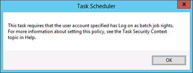

# Appendix H: Securing Local Administrator Accounts and Groups

>Applies To: Windows Server 2016, Windows Server 2012 R2, Windows Server 2012

## Appendix H: Securing Local Administrator Accounts and Groups  
On all versions of Windows currently in mainstream support, the local Administrator account is disabled by default, which makes the account unusable for pass-the-hash and other credential theft attacks. However, in environments that contain legacy operating systems or in which local Administrator accounts have been enabled, these accounts can be used as previously described to propagate compromise across member servers and workstations. Each local Administrator account and group should be secured as described in the step-by-step instructions that follow.  

For detailed information about considerations in securing Built-in Administrator (BA) groups, see [Implementing Least-Privilege Administrative Models](../../../ad-ds/plan/security-best-practices/Implementing-Least-Privilege-Administrative-Models.md).  

#### Controls for Local Administrator Accounts  
For the local Administrator account in each domain in your forest, you should configure the following settings:  

-   Configure GPOs to restrict the domain's Administrator account's use on domain-joined systems  
    -   In one or more GPOs that you create and link to workstation and member server OUs in each domain, add the Administrator account to the following user rights in **Computer Configuration\Policies\Windows Settings\Security Settings\Local Policies\User Rights Assignments**:  

        -   Deny access to this computer from the network  

        -   Deny log on as a batch job  

        -   Deny log on as a service  

        -   Deny log on through Remote Desktop Services  

#### Step-by-Step Instructions to Secure Local Administrators Groups  

###### Configuring GPOs to Restrict Administrator Account on Domain-Joined Systems  

1.  In **Server Manager**, click **Tools**, and click **Group Policy Management**.  

2.  In the console tree, expand <Forest>\Domains\\<Domain>, and then **Group Policy Objects** (where <Forest> is the name of the forest and <Domain> is the name of the domain where you want to set the Group Policy).  

3.  In the console tree, right-click **Group Policy Objects**, and click **New**.  

      

4.  In the **New GPO** dialog box, type **<GPO Name>**, and click **OK** (where <GPO Name> is the name of this GPO).  

      

5.  In the details pane, right-click **<GPO Name>**, and click **Edit**.  

6.  Navigate to **Computer Configuration\Policies\Windows Settings\Security Settings\Local Policies**, and click **User Rights Assignment**.  

      

7.  Configure the user rights to prevent the local Administrator account from accessing members servers and workstations over the network by doing the following:  

    1.  Double-click **Deny access to this computer from the network** and select **Define these policy settings**.  

    2.  Click **Add User or Group**, type the user name of the local Administrator account, and click **OK**. This user name will be **Administrator**, the default when Windows is installed.  

          

    3.  Click OK.  

        > [!IMPORTANT]  
        > When you add the Administrator account to these settings, you specify whether you are configuring a local Administrator account or a domain Administrator account by how you label the accounts. For example, to add the TAILSPINTOYS domain's Administrator account to these deny rights, you would browse to the Administrator account for the TAILSPINTOYS domain, which would appear as TAILSPINTOYS\Administrator. If you type **Administrator** in these user rights settings in the Group Policy Object Editor, you will restrict the local Administrator account on each computer to which the GPO is applied, as described earlier.  

8.  Configure the user rights to prevent the local Administrator account from logging on as a batch job by doing the following:  

    1.  Double-click **Deny log on as a batch job** and select **Define these policy settings**.  

    2.  Click **Add User or Group**, type the user name of the local Administrator account, and click **OK**. This user name will be **Administrator**, the default when Windows is installed.  

          

    3.  Click **OK**.  

        > [!IMPORTANT]  
        > When you add the Administrator account to these settings, you specify whether you are configuring local Administrator account or domain Administrator account by how you label the accounts. For example, to add the TAILSPINTOYS domain's Administrator account to these deny rights, you would browse to the Administrator account for the TAILSPINTOYS domain, which would appear as TAILSPINTOYS\Administrator. If you type **Administrator** in these user rights settings in the Group Policy Object Editor, you will restrict the local Administrator account on each computer to which the GPO is applied, as described earlier.  

9. Configure the user rights to prevent the local Administrator account from logging on as a service by doing the following:  

    1.  Double-click **Deny log on as a service** and select **Define these policy settings**.  

    2.  Click **Add User or Group**, type the user name of the local Administrator account, and click **OK**. This user name will be **Administrator**, the default when Windows is installed.  

          

    3.  Click **OK**.  

        > [!IMPORTANT]  
        > When you add the Administrator account to these settings, you specify whether you are configuring local Administrator account or domain Administrator account by how you label the accounts. For example, to add the TAILSPINTOYS domain's Administrator account to these deny rights, you would browse to the Administrator account for the TAILSPINTOYS domain, which would appear as TAILSPINTOYS\Administrator. If you type **Administrator** in these user rights settings in the Group Policy Object Editor, you will restrict the local Administrator account on each computer to which the GPO is applied, as described earlier.  

10. Configure the user rights to prevent the local Administrator account from accessing member servers and workstations via Remote Desktop Services by doing the following:  

    1.  Double-click **Deny log on through Remote Desktop Services** and select **Define these policy settings**.  

    2.  Click **Add User or Group**, type the user name of the local Administrator account, and click **OK**. This user name will be **Administrator**, the default when Windows is installed.  

          

    3.  Click **OK**.  

        > [!IMPORTANT]  
        > When you add the Administrator account to these settings, you specify whether you are configuring local Administrator account or domain Administrator account by how you label the accounts. For example, to add the TAILSPINTOYS domain's Administrator account to these deny rights, you would browse to the Administrator account for the TAILSPINTOYS domain, which would appear as TAILSPINTOYS\Administrator. If you type **Administrator** in these user rights settings in the Group Policy Object Editor, you will restrict the local Administrator account on each computer to which the GPO is applied, as described earlier.  

11. To exit **Group Policy Management Editor**, click **File**, and click **Exit**.  

12. In **Group Policy Management**, link the GPO to the member server and workstation OUs by doing the following:  

    1.  Navigate to the <Forest>\Domains\\<Domain> (where <Forest> is the name of the forest and <Domain> is the name of the domain where you want to set the Group Policy).  

    2.  Right-click the OU that the GPO will be applied to and click **Link an existing GPO**.  

          

    3.  Select the GPO that you created and click **OK**.  

          

    4.  Create links to all other OUs that contain workstations.  

    5.  Create links to all other OUs that contain member servers.  

#### Verification Steps  

##### Verify "Deny access to this computer from the network" GPO Settings  

From any member server or workstation that is not affected by the GPO changes (such as a jump server), attempt to access a member server or workstation over the network that is affected by the GPO changes. To verify the GPO settings, attempt to map the system drive by using the **NET USE** command.  

1.  Log on locally to any member server or workstation that is not affected by the GPO changes.  

2.  With the mouse, move the pointer into the upper-right or lower-right corner of the screen. When the **Charms** bar appears, click **Search**.  

3.  In the **Search** box, type **command prompt**, right-click **Command Prompt**, and then click **Run as administrator** to open an elevated command prompt.  

4.  When prompted to approve the elevation, click **Yes**.  

      

5.  In the **Command Prompt** window, type **net use \\\\<Server Name>\c$ /user:<Server Name>\Administrator**, where <Server Name> is the name of the member server or workstation you're attempting to access over the network.  

    > [!NOTE]  
    > The local Administrator credentials must be from the same system you're attempting to access over the network.  

6.  The following screenshot shows the error message that should appear.  

      

##### Verify "Deny log on as a batch job" GPO Settings  
From any member server or workstation affected by the GPO changes, log on locally.  

###### Create a Batch File  

1.  With the mouse, move the pointer into the upper-right or lower-right corner of the screen. When the **Charms** bar appears, click **Search**.  

2.  In the **Search** box, type **notepad**, and click **Notepad**.  

3.  In **Notepad**, type **dir c:**.  

4.  Click **File**, and click **Save As**.  

5.  In the **File name** box, type **<Filename>.bat** (where <Filename> is the name of the new batch file).  

###### Schedule a Task  

1.  With the mouse, move the pointer into the upper-right or lower-right corner of the screen. When the **Charms** bar appears, click **Search**.  

2.  In the **Search** box, type task scheduler, and click **Task Scheduler**.  

    > [!NOTE]  
    > On computers running Windows 8, in the **Search** box, type **schedule tasks**, and click **Schedule tasks**.  

3.  Click **Action**, and click **Create Task**.  

4.  In the **Create Task** dialog box, type **<Task Name>** (where <Task Name> is the name of the new task).  

5.  Click the **Actions** tab, and click **New**.  

6.  In the **Action** field, click **Start a program**.  

7.  In the **Program/script** field, click **Browse**, locate and select the batch file created in the **Create a Batch File** section, and click **Open**.  

8.  Click **OK**.  

9. Click the **General** tab.  

10. In the **Security options** field, click **Change User or Group**.  

11. Type the name of the system's local Administrator account, click **Check Names**, and click **OK**.  

12. Select **Run whether the user is logged on or not** and **Do not store password**. The task will only have access to local computer resources.  

13. Click **OK**.  

14. A dialog box should appear, requesting user account credentials to run the task.  

15. After entering the credentials, click **OK**.  

16. A dialog box similar to the following should appear.  

      

###### Verify "Deny log on as a service" GPO Settings  

1.  From any member server or workstation affected by the GPO changes, log on locally.  

2.  With the mouse, move the pointer into the upper-right or lower-right corner of the screen. When the **Charms** bar appears, click **Search**.  

3.  In the **Search** box, type **services**, and click **Services**.  

4.  Locate and double-click **Print Spooler**.  

5.  Click the **Log On** tab.  

6.  In **Log on as** field, click **This account**.  

7.  Click **Browse**, type the system's local Administrator account, click **Check Names**, and click **OK**.  

8.  In the **Password** and **Confirm password** fields, type the selected account's password, and click **OK**.  

9. Click **OK** three more times.  

10. Right-click **Print Spooler** and click **Restart**.  

11. When the service is restarted, a dialog box similar to the following should appear.  

      

###### Revert Changes to the Printer Spooler Service  

1.  From any member server or workstation affected by the GPO changes, log on locally.  

2.  With the mouse, move the pointer into the upper-right or lower-right corner of the screen. When the **Charms** bar appears, click **Search**.  

3.  In the **Search** box, type **services**, and click **Services**.  

4.  Locate and double-click **Print Spooler**.  

5.  Click the **Log On** tab.  

6.  In the **Log on as**: field, select **Local Systemaccount**, and click **OK**.  

###### Verify "Deny log on through Remote Desktop Services" GPO Settings  

1.  With the mouse, move the pointer into the upper-right or lower-right corner of the screen. When the **Charms** bar appears, click **Search**.  

2.  In the **Search** box, type **remote desktop connection**, and click **Remote Desktop Connection**.  

3.  In the **Computer** field, type the name of the computer that you want to connect to, and click **Connect**. (You can also type the IP address instead of the computer name.)  

4.  When prompted, provide credentials for the system's local **Administrator** account.  

5.  A dialog box similar to the following should appear.  

      
