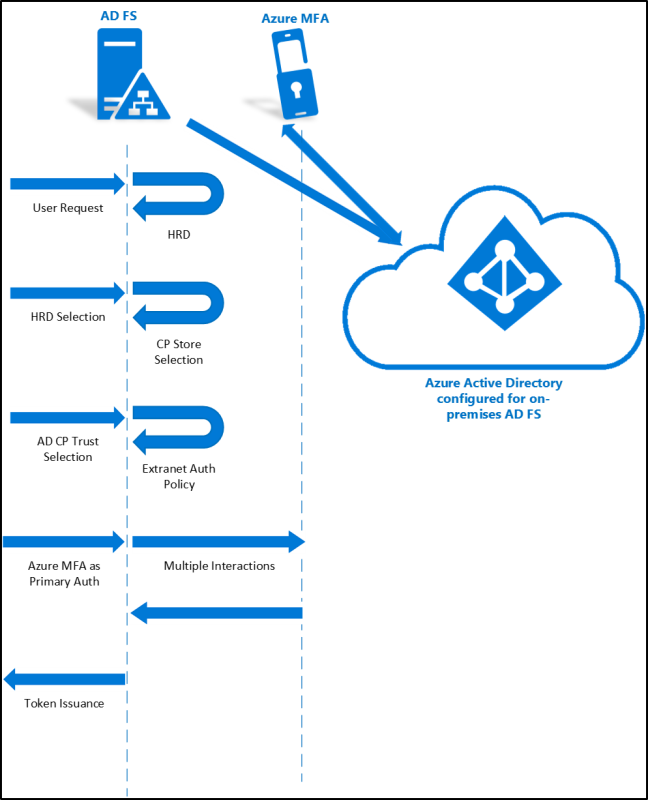
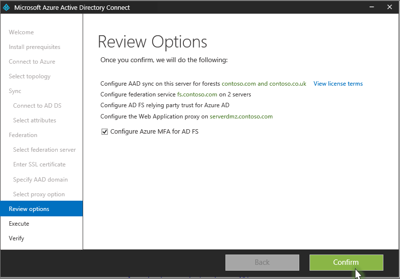

# AD FS and Azure Multi-Factor Authentication

>Applies To: Windows Server 2016

AD FS in Windows Server 2016 introduces and builds upon the multi-factor authentication capabilities that were introduced with Windows Server 2012 R2.   By introducing a built-in Azure MFA adapter, setup and configuration for using Azure MFA as the primary authentication provider has never been simpler.

## Why use AD FS with Azure MFA
Currently there are some limitations with using strong authentication with AD FS.  With AD FS in Windows Server 2016, these are addressed and organizations can take advantage of usuing Azure MFA with their AD FS implementation.  Organizations can take advantage of the following:

-   An AD FS farm can easily be configured to use multi-factor authentication with Azure MFA without excessive configuration or additional infrastructure.

-   The built-in MFA experience is easy to install with Windows Server 2016

-   Azure MFA can be configured as the primary authentication provider allowing for an alternative authentication mechanism for intranet or extranet.

## How it works
In order for Azure MFA to be used as the primary authentication provider, the authentication provider will be treated just like the other built in providers.  That is, just like forms or certificate authentication.  The only difference will be that the provider will be implemented as an external auth provider via an interface that is exposed only to the Azure MFA provider for implementation.

The following image shows the data flow between AD FS in Windows Server 2016 and Azure MFA.

## Before you get started
The following is a list of information that you should be aware of prior to trying to use Azure MFA as the primary authentication provider.

-   In order to setup Azure MFA as a primary authentication method you need to have Azure Active Directory.

-   Setting up Azure MFA as the primary authentication method is done using Azure AD Connect.  You must use one of the following methods  below to setup and configure it

-   This feature is not available in mixed mode.  You the entire AD FS farm must be aWindows Server 2016

## Using Azure AD Connect to setup Azure MFA as primary authentication provider
Because using Azure MFA as your primary authentication provider is a hybrid scenario, you can configure and setup it up using the Azure AD Connect wizard.  Depending on whether you are just setting it up or already have Azure AD Connect in place you can still use it to setup and configure AD FS to use Azure MFA.  Use the procedures below

### Setting up Azure MFA with Azure AD Connect - New Installation of Azure AD Connect and AD FS
If this is a new installation, simplyIf this is a new installation, simply follow the instructions for setting up Azure AD Connect and AD FS federation that can be found [here](https://azure.microsoft.com/en-us/documentation/articles/active-directory-aadconnect-get-started-custom/).   When you get to the Review Options screen, make sure that Configure Azure MFA for AD FS is checked and click Confirm.   Azure MFA as the primary authentication provider will be setup automatically.When you get to the Review Options screen, make sure that **Configure Azure MFA for AD FS** is checked and click **Confirm**.   Azure MFA as the primary authentication provider will be setup automatically.

### Setting up Azure MFA with Azure AD Connect - New Installation of Azure AD Connect and Existing AD FS
If you have already setup AD FS and are now going to install Azure AD Connect, you need to just follow the instructions for setting up Azure AD Connect and AD FS federation that can be found [here](https://azure.microsoft.com/en-us/documentation/articles/active-directory-aadconnect-get-started-custom/) and be sure to select an existing AD FS server farm.   When you get to the Review Options screen, make sure that **Configure Azure MFA for AD FS** is checked and click **Confirm.** Azure MFA as the primary authentication provider will be setup automatically.  .

### Setting up Azure MFA with Azure AD Connect - Existing Azure AD Connect and Existing AD FS
If you have already installed Azure AD Connect and AD FS then you can simply run the Azure AD Connect wizard again and on the Additional Tasks select **Configure Azure MFA for my AD FS farm** and follow then finish running through the wizard.

## Setting up Azure MFA with Server Manager in Windows Server 2016

