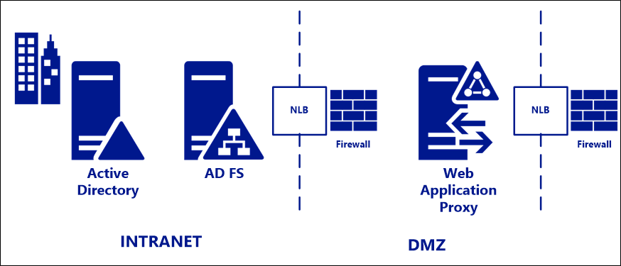

# Best practices for securing Active Directory Federation Services

This document provides best practices for the secure planning and deployment of Active Directory Federation Services (AD FS) and Web Application Proxy.  It contains information about the default behaviors of these components and recommendations for additional security configurations for an organization with specific use cases and security requirements.

This document applies to AD FS and WAP in Windows Server 2012 R2 and Windows Server 2016 (preview).  These recommendations can be used whether the infrastructure is deployed in an on premises network or in a cloud hosted environment such as Microsoft Azure.

## Standard deployment topology
For deployment in on-premises environments, we recommend a standard deployment topology consisting of one or more AD FS servers on the internal corporate network, with one or more Web Application Proxy (WAP) servers in a DMZ or extranet network.  At each layer, AD FS and WAP, a hardware or software load balancer is placed in front of the server farm and handles traffic routing.  Firewalls are placed as required in front of the external IP address of the load balancer in front of each (FS and proxy) farm.

>[!NOTE]
> AD FS requires a full writable Domain Controller to function as opposed to a Read-Only Domain Controller. If a planned topology includes a Read-Only Domain controller, the Read-Only domain controller can be used for authentication but LDAP claims processing will require a connection to the writable domain controller.

## Ports required
The below diagram depicts the firewall ports that must be enabled between and amongst the components of the AD FS and WAP deployment.  If the deployment does not include Azure AD / Office 365, the sync requirements can be disregarded.

>Note that port 49443 is only required if user certificate authentication is used, which is optional for Azure AD and Office 365.

>[!NOTE]
> Port 808 (Windows Server 2012R2) or port 1501 (Windows Server 2016+) is the Net.TCP port AD FS uses for the local WCF endpoint to transfer configuration data to the service process and Powershell. This port can be seen by running Get-AdfsProperties | select NetTcpPort. This is a local port that will not need to be opened in the firewall but will be displayed in a port scan. 

### Azure AD Connect and Federation Servers/WAP
This table describes the ports and protocols that are required for communication between the Azure AD Connect server and Federation/WAP servers.  

Protocol |Ports |Description
--------- | --------- |---------
HTTP|80 (TCP/UDP)|Used to download CRLs (Certificate Revocation Lists) to verify SSL certificates.
HTTPS|443(TCP/UDP)|Used to synchronize with Azure AD.
WinRM|5985| WinRM Listener

### WAP and Federation Servers
This table describes the ports and protocols that are required for communication between the Federation servers and WAP servers.

Protocol |Ports |Description
--------- | --------- |---------
HTTPS|443(TCP/UDP)|Used for authentication.

### WAP and Users
This table describes the ports and protocols that are required for communication between users and the WAP servers.

Protocol |Ports |Description
--------- | --------- |--------- |
HTTPS|443(TCP/UDP)|Used for device authentication.
TCP|49443 (TCP)|Used for certificate authentication.

For additional information on required ports and protocols required for hybrid deployments see the document [here](https://docs.microsoft.com/azure/active-directory/hybrid/reference-connect-ports).

For detailed information about ports and protocols required for an Azure AD and Office 365 deployment, see the document [here](https://support.office.com/article/Office-365-URLs-and-IP-address-ranges-8548a211-3fe7-47cb-abb1-355ea5aa88a2?ui=en-US&rs=en-US&ad=US).

### Endpoints enabled

When AD FS and WAP are installed, a default set of AD FS endpoints are enabled on the federation service and on the proxy.  These defaults were chosen based on the most commonly required and used scenarios and it is not necessary to change them.  

### [Optional] Min set of endpoints proxy enabled for Azure AD / Office 365
Organizations deploying AD FS and WAP only for Azure AD and Office 365 scenarios can limit even further the number of AD FS endpoints enabled on the proxy to achieve a more minimal attack surface.
Below is the list of endpoints that must be enabled on the proxy in these scenarios:

|Endpoint|Purpose
|-----|-----
|/adfs/ls|Browser based authentication flows and current versions of Microsoft Office use this endpoint for Azure AD and Office 365 authentication
|/adfs/services/trust/2005/usernamemixed|Used for Exchange Online with Office clients older than Office 2013 May 2015 update.  Later clients use the passive \adfs\ls endpoint.
|/adfs/services/trust/13/usernamemixed|Used for Exchange Online with Office clients older than Office 2013 May 2015 update.  Later clients use the passive \adfs\ls endpoint.
|/adfs/oauth2|This one is used for any modern apps (on prem or in cloud) you have configured to authenticate directly to AD FS (i.e. not through AAD)
|/adfs/services/trust/mex|Used for Exchange Online with Office clients older than Office 2013 May 2015 update.  Later clients use the passive \adfs\ls endpoint.
|/adfs/ls/federationmetadata/2007-06/federationmetadata.xml	|Requirement for any passive flows; and used by Office 365 / Azure AD to check AD FS certificates

AD FS endpoints can be disabled on the proxy using the following PowerShell cmdlet:
    
    PS:\>Set-AdfsEndpoint -TargetAddressPath <address path> -Proxy $false

For example:
    
    PS:\>Set-AdfsEndpoint -TargetAddressPath /adfs/services/trust/13/certificatemixed -Proxy $false
    

### Extended protection for authentication
Extended protection for authentication is a feature that mitigates against man in the middle (MITM) attacks and is enabled by default with AD FS.

#### To verify the settings, you can do the following:
The setting can be verified using the below PowerShell commandlet.  
    
   `PS:\>Get-ADFSProperties`

The property is `ExtendedProtectionTokenCheck`.  The default setting is Allow, so that the security benefits can be achieved without the compatibility concerns with browsers that do not support the capability.  

### Congestion control to protect the federation service
The federation service proxy (part of the WAP) provides congestion control to protect the AD FS service from a flood of requests.  The Web Application Proxy will reject external client authentication requests if the federation server is overloaded as detected by the latency between the Web Application Proxy and the federation server.  This feature is configured by default with a recommended latency threshold level.

#### To verify the settings, you can do the following:
1.	On your Web Application Proxy computer, start an elevated command window.
2.	Navigate to the ADFS directory, at %WINDIR%\adfs\config.
3.	Change the congestion control settings from its default values to ‘<congestionControl latencyThresholdInMSec="8000" minCongestionWindowSize="64" enabled="true" />'.
4.	Save and close the file.
5.	Restart the AD FS service by running ‘net stop adfssrv' and then ‘net start adfssrv'.
For your reference, guidance on this capability can be found [here](https://msdn.microsoft.com/library/azure/dn528859.aspx ).

### Standard HTTP request checks at the proxy
The proxy also performs the following standard checks against all traffic:

- The FS-P itself authenticates to AD FS via a short lived certificate.  In a scenario of suspected compromise of dmz servers, AD FS can “revoke proxy trust” so that it no longer trusts any incoming requests from potentially compromised proxies. Revoking the proxy trust revokes each proxy's own certificate so that it cannot successfully authenticate for any purpose to the AD FS server
- The FS-P terminates all connections and creates a new HTTP connection to the AD FS service on the internal network. This provides a session-level buffer between external devices and the AD FS service. The external device never connects directly to the AD FS service.
- The FS-P performs HTTP request validation that specifically filters out HTTP headers that are not required by AD FS service.

## Recommended security configurations
Ensure all AD FS and WAP servers receive the most current updates
The most important security recommendation for your AD FS infrastructure is to ensure you have a means in place to keep your AD FS and WAP servers current with all security updates, as well as those optional updates specified as important for AD FS on this page.

The recommended way for Azure AD customers to monitor and keep current their infrastructure is via Azure AD Connect Health for AD FS, a feature of Azure AD Premium.  Azure AD Connect Health includes monitors and alerts that trigger if an AD FS or WAP machine is missing one of the important updates specifically for AD FS and WAP.

Information on installing Azure AD Connect Health for AD FS can be found [here](https://azure.microsoft.com/documentation/articles/active-directory-aadconnect-health-agent-install/).

## Additional security configurations
The following additional capabilities can be configured optionally to provide additional protections to those offered in the default deployment.

### Extranet “soft” lockout protection for accounts
With the extranet lockout feature in Windows Server 2012 R2, an AD FS administrator can set a maximum allowed number of failed authentication requests (ExtranetLockoutThreshold) and an ‘observation window's time period (ExtranetObservationWindow). When this maximum number (ExtranetLockoutThreshold) of authentication requests is reached, AD FS stops trying to authenticate the supplied account credentials against AD FS for the set time period (ExtranetObservationWindow). This action protects this account from an AD account lockout, in other words, it protects this account from losing access to corporate resources that rely on AD FS for authentication of the user. These settings apply to all domains that the AD FS service can authenticate.

You can use the following Windows PowerShell command to set the AD FS extranet lockout (example): 

    PS:\>Set-AdfsProperties -EnableExtranetLockout $true -ExtranetLockoutThreshold 15 -ExtranetObservationWindow ( new-timespan -Minutes 30 )

For reference, the public documentation of this feature is [here](https://technet.microsoft.com/library/dn486806.aspx ). 

### Disable WS-Trust Windows endpoints on the proxy i.e. from extranet

WS-Trust Windows endpoints (*/adfs/services/trust/2005/windowstransport* and */adfs/services/trust/13/windowstransport*) are meant only to be intranet facing endpoints that use WIA binding on HTTPS. Exposing them to extranet could allow requests against these endpoints to bypass lockout protections. These endpoints should be disabled on the proxy (i.e. disabled from extranet) to protect AD account lockout by using following PowerShell commands. There is no known end user impact by disabling these endpoints on the proxy.

    PS:\>Set-AdfsEndpoint -TargetAddressPath /adfs/services/trust/2005/windowstransport -Proxy $false
    PS:\>Set-AdfsEndpoint -TargetAddressPath /adfs/services/trust/13/windowstransport -Proxy $false
    
### Differentiate access policies for intranet and extranet access
AD FS has the ability to differentiate access policies for requests that originate in the local, corporate network vs requests that come in from the internet via the proxy.  This can be done per application or globally.  For high business value applications or applications with sensitive or personally identifiable information, consider requiring multi factor authentication.  This can be done via the AD FS management snap-in.  

### Require Multi factor authentication (MFA)
AD FS can be configured to require strong authentication (such as multi factor authentication) specifically for requests coming in via the proxy, for individual applications, and for conditional access to both Azure AD / Office 365 and on premises resources.  Supported methods of MFA include both Microsoft Azure MFA and third party providers.  The user is prompted to provide the additional information (such as an SMS text containing a one time code), and AD FS works with the provider specific plug-in to allow access.  

Supported external MFA providers include those listed in [this](https://technet.microsoft.com/library/dn758113.aspx) page, as well as HDI Global.

### Hardware Security Module (HSM)
In its default configuration, the keys AD FS uses to sign tokens never leave the federation servers on the intranet.  They are never present in the DMZ or on the proxy machines.  Optionally to provide additional protection, these keys can be protected in a hardware security module attached to AD FS.  Microsoft does not produce an HSM product, however there are several on the market that support AD FS.  In order to implement this recommendation, follow the vendor guidance to create the X509 certs for signing and encryption, then use the AD FS installation powershell commandlets, specifying your custom certificates as follows:

    PS:\>Install-AdfsFarm -CertificateThumbprint <String> -DecryptionCertificateThumbprint <String> -FederationServiceName <String> -ServiceAccountCredential <PSCredential> -SigningCertificateThumbprint <String>

where:

- `CertificateThumbprint` is your SSL certificate
- `SigningCertificateThumbprint` is your signing certificate (with HSM protected key)
- `DecryptionCertificateThumbprint` is your encryption certificate (with HSM protected key)

