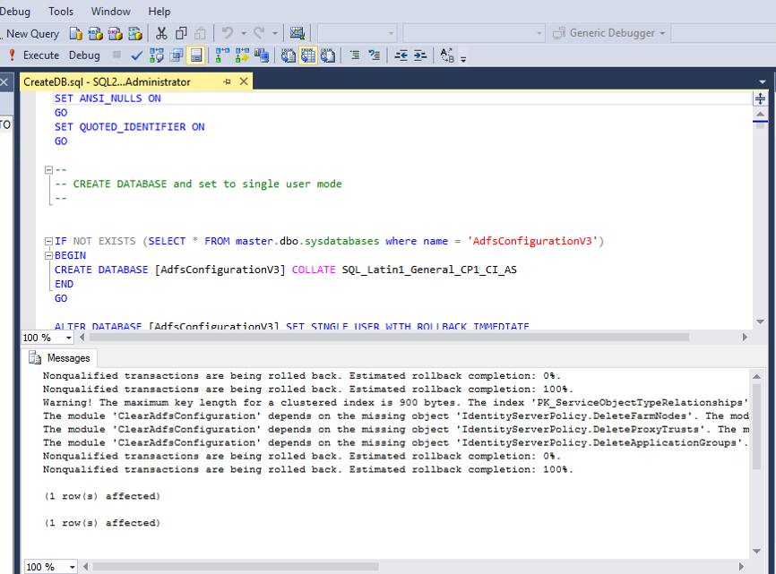
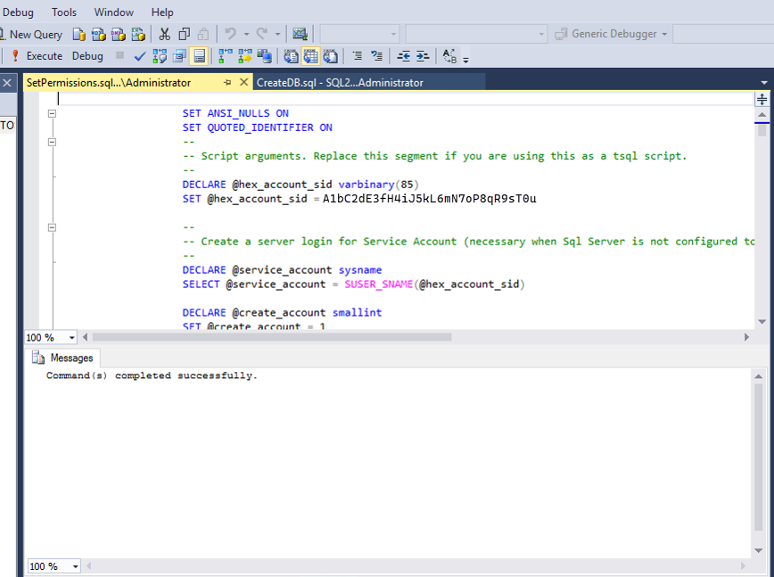
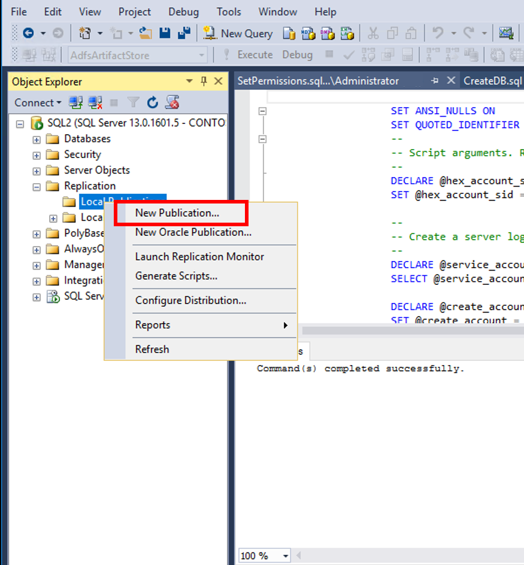

# Setup Geographic Redundancy with SQL Server Replication

> [!IMPORTANT]  
> If you want to create an AD FS farm and use SQL Server to store your configuration data, you can use SQL Server 2008 or higher.
  
If you are using SQL Server as your AD FS configuration database, you can set up geo\-redundancy for your AD FS farm using SQL Server replication. Geo\-redundancy replicates data between two geographically distant sites so that applications can switch from one site to another. This way, in case of the failure of one site, you can still have all the configuration data available at the second site. For more information, see the “SQL Server geographic redundancy section” in [Federation Server Farm Using SQL Server](../design/Federation-Server-Farm-Using-SQL-Server.md).  
  
## Prerequisites  
Install and configure a SQL server farm. For more information, see [https://technet.microsoft.com/evalcenter/hh225126.aspx](https://technet.microsoft.com/evalcenter/hh225126.aspx). On the initial SQL Server, make sure that the SQL Server Agent service is running and set to automatic start.  
  
## Create the second \(replica\) SQL Server for geo\-redundancy  
  
1. Install SQL Server \(for more information, see [https://technet.microsoft.com/evalcenter/hh225126.aspx](https://technet.microsoft.com/evalcenter/hh225126.aspx). Copy the resulting CreateDB.sql and SetPermissions.sql script files to the replica SQL server.  
  
2. Ensure SQL Server Agent service is running and set to automatic start  
  
3. Run **Export\-AdfsDeploymentSQLScript** on the primary AD FS node to create CreateDB.sql and SetPermissions.sql files.  For example:`PS:\>Export-AdfsDeploymentSQLScript -DestinationFolder . –ServiceAccountName CONTOSO\gmsa1$`.  
   
  
4. Copy the scripts to your secondary server.  Open the CreateDB.sql script in **SQL Management Studio** and click **Execute**.
   

5. Open the SetPermissions.sql script in **SQL Management Studio** and click **Execute**.
    

   

> [!NOTE]
> You can also use the following from the command line. 
> 
>    `c:\>sqlcmd –i CreateDB.sql`  
> 
>    `c:\>sqlcmd –i SetPermissions.sql` 
> 
> ## Create publisher settings on the initial SQL Server  
  
1. From the SQL Server Management studio, under **Replication**, right click **Local Publications** and choose **New Publication...**
       

2. On the New Publication Wizard screen click **Next**. 
      
  
3. On **Distributor** page, choose local server as distributor and click **Next**.  
        

4. On the **Snapshot** folder page, enter \\\SQL1\repldata in place of default folder. \(NOTE: You may have to create this share yourself\).  
        
  
5. Choose **AdfsConfigurationV3** as the publication database and click **Next**.  
     
  
6. On **Publication Type**, choose **Merge publication** and click **Next**.  
     
  
7. On **Subscriber Types**, choose **SQL Server 2008 or later** and click **Next**.  
      

8. On the **Articles** page select **Tables** node to select all tables, then **un\-check SyncProperties** table \(this one should not be replicated\) 
         
  
9. On the **Articles** page, select **User Defined Functions** node to select all User Defined Functions and click **Next**..  
         

10. On the **Article issues** page click **Next**.  
         

11. On the **Filter Table Rows** page, click **Next**.  
         
12. On the **Snapshot Agent** page, choose defaults of Immediate and 14 days, click **Next**.  
         
    You may need to create a domain account for the SQL agent. Use the steps in [Configure SQL login for the domain account CONTOSO\\sqlagent](Set-up-Geographic-Redundancy-with-SQL-Server-Replication.md#sqlagent) to create SQL login for this new AD user and assign specific permissions.  
  
13. On the **Agent Security** page, click **Security Settings** and enter the username\/password of a domain account \(not a GMSA\) created for the SQL agent and click **OK**.  Click **Next**.  
        

14. On the **Wizard Actions** page, click **Next**.   
      

15. On the **Complete the Wizard** page, enter a name for your publication and click **Finish**. 
        

16. Once the publication is created you should see the status of success.  Click **Close**.
        

17. Back in SQL Server Management Studio, right-click the new Publication and click **Launch Replication Monitor**.  
       
  
## Create subscription settings on the replica SQL Server  
Make sure that you created the publisher settings on the initial SQL Server as described above and then complete the following procedure:  
  
1. On the replica SQL Server, from SQL Server Management studio, under **Replication**, right click **Local Subscriptions** and choose **New Subscription...**. 
       

2. On the **New Subscription Wizard** page, click **Next**.
        
  
3. On the **Publication** page, select the publisher from the drop-down.  Expand **AdfsConfigurationV3** and select the name of the publication created above and click **Next**.  
      
  
4. On the **Merge Agent Location** page, select **Run each agent at its Subscriber \(pull subscriptions\)** \(the default\) and click **Next**.  
      This, along with Subscription Type below, determines the conflict resolution logic. \(For more information, see [Detect and Resolve Merge Replication Conflicts](https://technet.microsoft.com/library/ms151191.aspx).  
 
5. On the **Subscribers** page, select **AdfsConfigurationV3** as the subscriber database and click **Next**.  
      
  
6. On the **Merge Agent Security** page, click **...** and enter the username and password of a domain account \(not a GMSA\) created for the SQL agent by using the ellipses box and click **Next**.
      
  
7. On **Synchronization Schedule**, choose **Run Continuously** and click **Next**. 
      
 
8. On **Initialize Subscriptions**, click **Next**.  
      
  
9. On **Subscription Type**, choose **Client** and click **Next**.  
  
   Implications of this are documented [here](https://technet.microsoft.com/library/ms151191.aspx) and [here](https://technet.microsoft.com/library/ms151170.aspx).  Essentially, we take the simple “first to publisher wins” conflict resolution and we do not need to republish to other subscribers.  
     
   
10. On the **Wizard Actions** page, ensure **Create the subscription** is checked and click **Next**. 
      

11. On the **Complete the Wizard** page, click **Finish**. 
      

12. Once the subscription has finished the creation process, you should see success. Click **Close**. 
      
  
## Verify the process of initialization and replication  
  
1.  On the primary SQL server, right\-click the **Replication** node and click **Launch Replication Monitor**.  
  
2.  In **Replication Monitor**, click the publication.  
  
3.  On the **All Subscriptions** tab, right click and **View Details**.  
  
    You should be able to see many entries under **Actions** for the initial replication.  
  
4.  Additionally, you can look under the **SQL Server Agent\\Jobs** node to see the job\(s\) scheduled to execute the operations of the publication\/subscription.  Only local jobs are shown, so make sure to check on the publisher and the subscriber for troubleshooting.  Right\-click a job and select **View History** to view execution history and results.  
  
## Configure SQL login for the domain account CONTOSO\\sqlagent  
  
1.  Create a new login on the primary and replica SQL Server called CONTOSO\\sqlagent \(the name of the new domain user created and configured on the **Agent Security** page in the procedures above.\)  
  
2.  In SQL Server, right\-click the login you created, and select Properties, then under the **User Mapping** tab, map this login to **AdfsConfiguration** and **AdfsArtifact** databases with public and db\_genevaservice roles. Also map this login to distribution database and add db\_owner role for both distribution and adfsconfiguration tables.  Do this as applicable on both primary and replica SQL server. For more information, see [Replication Agent Security Model](https://technet.microsoft.com/library/ms151868.aspx).  
  
3.  Give the corresponding domain account read and write permissions on the share configured as distributor.  Make sure that you set read and write permissions both on the share permissions and the local file permissions.  
  
## Configure AD FS node\(s\) to point to the SQL Server replica farm  
Now that you have set up geo redundancy, the AD FS farm nodes can be configured to point to your replica SQL Server farm using the standard AD FS “join” farm capabilities, either from the AD FS Configuration Wizard UI or using Windows PowerShell.  
  
If you use the AD FS Configuration Wizard UI, select **Add a federation server to a federation server farm**. **Do NOT** select **Create the first federation server in a federation server farm**.  
  
If you use Windows PowerShell, run **Add\-AdfsFarmNode**. **Do NOT** run **Install\-AdfsFarm**.  
  
When prompted, provide the host and instance name of the replica SQL Server, **NOT** the initial SQL server.  
