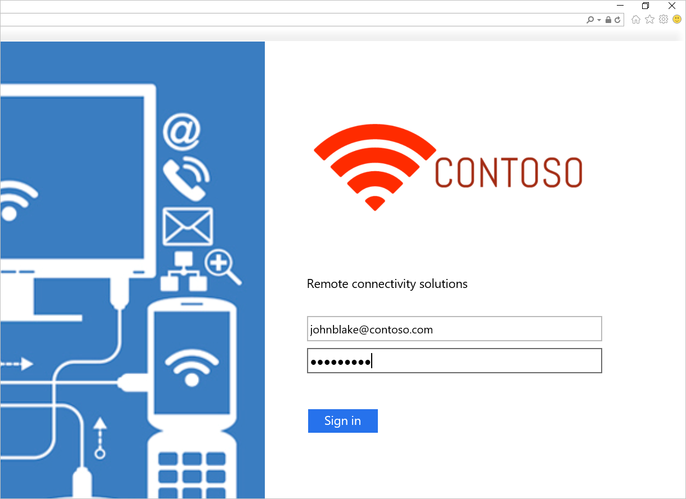

# Deploy Active Directory Federation Services in Azure

Active Directory Federation Services (AD FS) provides simplified, secured identity federation and web single sign-on (SSO) capabilities. Federation with Microsoft Entra ID or Microsoft 365 lets users authenticate using on-premises credentials and access all cloud resources. As a result, it becomes important to have a highly available AD FS infrastructure to ensure access to resources both on-premises and in the cloud.

Deploying AD FS in Azure can help achieve the high availability required with minimal efforts. There are several advantages of deploying AD FS in Azure:

- **High Availability** - With the power of Azure availability sets, you ensure a highly available infrastructure.
- **Easy to Scale** – Need more performance? Easily migrate to more powerful machines with just a few selections in Azure.
- **Cross-Geo Redundancy** – With Azure geo redundancy, you can be assured that your infrastructure is highly available across the globe.
- **Easy to Manage** – With highly simplified management options in Azure portal, managing your infrastructure is easy and hassle-free.

## Design principles

This diagram shows the recommended basic topology to start deploying your AD FS infrastructure in Azure.

The following are principles behind the various components of the topology:

- **DC/AD FS servers**: If you have fewer than 1,000 users, you can install AD FS role on your domain controllers (DCs). If you don't want any performance effect on the DCs, or if you have more than 1,000 users, deploy AD FS on separate servers.
- **WAP server** – It's necessary to deploy web application proxy servers so that users can reach the AD FS when they aren't on the company network.
- **DMZ**: The web application proxy servers are placed in the DMZ and only TCP/443 access is allowed between the DMZ and the internal subnet.
- **Load balancers**: To ensure high availability of AD FS and web application proxy servers, we recommend using an internal load balancer for AD FS servers and Azure Load Balancer for web application proxy servers.
- **Availability sets**: To provide redundancy to your AD FS deployment, we recommend that you group two or more virtual machines (VMs) in an availability set for similar workloads. This configuration ensures that during either a planned or unplanned maintenance event, at least one VM is available.
- **Storage accounts**: We recommend you have two storage accounts. Having a single storage account can lead to creating a single point of failure. If you have only one storage account, it can cause the deployment to become unavailable in the unlikely event where the storage account fails. Two storage accounts help associate one storage account for each fault line.
- **Network segregation**: Web application proxy servers should be deployed in a separate DMZ network. You can divide one virtual network into two subnets and then deploy the web application proxy servers in an isolated subnet. You can configure the network security group settings for each subnet and allow only required communication between the two subnets. More details are given per the following deployment scenario.

## Steps to deploy AD FS in Azure

This section outlines the steps to deploy an AD FS infrastructure in Azure.

### Deploy the network

As outlined previously, you can either create two subnets in a single virtual network or create two different virtual networks. This article focuses on deploying a single virtual network and dividing it into two subnets. This approach is currently easier as two separate virtual networks would require a virtual network to virtual network gateway for communications.

#### Create a virtual network

1. Sign in to the [Azure portal](https://portal.azure.com/) with your Azure account.
1. In the portal, search for and select **Virtual networks**.
1. On the **Virtual networks** page, select **Create**.
1. In **Create virtual network**, enter or select this information in the **Basics** tab:

    | Setting | Value |
    | ------- | ----- |
    | **Project details** |   |
    | Subscription | Select your subscription. |
    | Resource group | Select your resource group. Or select **Create new** to create one. |
    | **Instance details** |   |
    | Virtual network name | Enter a name for your virtual network. |
    | Region | Choose a region. |

1. Select **Next**.
   :::image type="content" source="./media/how-to-connect-fed-azure-adfs/create-vnet.png" alt-text="Screenshot showing the basics tab for the Create virtual network page.":::
1. In the **Security** tab, enable any security service you might want and select **Next**.
1. On the **IP addresses** tab, a default subnet is already created and ready for VMs to be added. For this example, select **default** to edit the subnet.
    1. On the **Edit subnet** page, rename the subnet to **INT**.
    1. Enter **IP address** and **Subnet size** information as necessary to define an **IP address space**.
    1. For **Network security group**, select **Create new**.
    1. For this example, enter the name **NSG_INT** and select **OK**, then select **Save**. You've created your first subnet.
   :::image type="content" source="./media/how-to-connect-fed-azure-adfs/create-subnet-with-int-nsg.png" alt-text="Screenshot showing how to edit a subnet and add an internal network security group.":::
    1. To create your second subnet, select **+ Add a subnet**.
    1. On the **Add a subnet** page, enter **DMZ** for the second subnet name and enter information as necessary to define an **IP address space**.
    1. For **Network security group**, select **Create new**.
    1. Enter the name **NSG_DMZ**, select **OK**, then select **Add**.
   :::image type="content" source="./media/how-to-connect-fed-azure-adfs/create-subnet-with-dmz-nsg.png" alt-text="Screenshot showing how to add a new subnet that includes a network security group.":::
1. Select **Review + create**, and if everything looks okay, select **Create**.

You now have a virtual network that includes two subnets, each with an associated network security group.

:::image type="content" source="./media/how-to-connect-fed-azure-adfs/subnets-with-nsgs.png" alt-text="Screenshot showing the new subnets and their network security groups.":::

#### Secure the virtual network

A Network security group (NSG) contains a list of Access Control List (ACL) rules that allow or deny network traffic to your VM instances in a Virtual Network. NSGs can be associated with either subnets or individual VM instances within that subnet. When an NSG is associated with a subnet, the ACL rules apply to all the VM instances in that subnet.

The NSGs associated with your subnets automatically include some default inbound and outbound rules. You can't delete default security rules, but you can override them with rules that have a higher priority. And, you can add more inbound and outbound rules according to the level of security you want.

Now, add a couple of rules to each of our two security groups. For the first example, let's add an inbound security rule to the **NSG_INT** security group.

1. On your virtual network's **Subnets** page, select **NSG_INT**.
1. On the left, select **Inbound security rules**, then select **+ Add**.
1. In **Add inbound security rule**, enter or select this information:

    | Setting | Value |
    | ------- | ----- |
    | Source | **10.0.1.0/24**. |
    | Source port ranges | Leave (or select) asterisk. An asterisk (*) allows traffic on any port. For this example, choose asterisk for all of the rules you create.|
    | Destination | **10.0.0.0/24**. |
    | Service | Select **HTTPS**.   The settings for **Destination port ranges** and **Protocol** are automatically filled based on the specified **Service**.|
    | Action | Choose **Allow**. |
    | Priority | **1010**.   Rules are processed in priority order; the lower the number, the higher the priority. |
    | Name | **AllowHTTPSFromDMZ**. |
    | Description | Allow the HTTPS communication from DMZ. |

1. After you've made your choices, select **Add**.

   :::image type="content" source="./media/how-to-connect-fed-azure-adfs/nsg-add-rules.png" alt-text="Screenshot showing how to add an inbound security rule.":::
   The new inbound security rule is now added to the top of the list of rules for **NSG_INT**.

1. Repeat these steps with the values shown in the following table. In addition to the new rule you created, you must add the following extra rules in the priority order listed to help secure your internal and DMZ subnet.

    | NSG | Type of rule | Source | Destination | Service | Action | Priority | Name | Description |
    |:--- |:--- |:---:|:---:|:---:|:---:|:---:|:---:|:---:|
    | NSG_INT | Outbound | Any | Service Tag/Internet | Custom (80/Any) | Deny | 100 | DenyInternetOutbound | No access to internet. |
    | NSG_DMZ | Inbound | Any | Any | Custom (Asterisk (*)/Any) | Allow | 1010 | AllowHTTPSFromInternet | Allow HTTPS from internet to the DMZ. |
    | NSG_DMZ | Outbound | Any | Service Tag/Internet | Custom (80/Any) | Deny | 100 | DenyInternetOutbound | Anything except HTTPS to internet is blocked. |

    After you've entered the values for each new rule, select **Add** and proceed to the next until two new security rules are added for each NSG.

After configuration, the **NSG** pages look like this example:

:::image type="content" source="./media/how-to-connect-fed-azure-adfs/nsgs-with-security-rules.png" alt-text="Screenshot showing your NSGs after you added security rules.":::

> [!NOTE]
> If client user certificate authentication (clientTLS authentication using X.509 user certificates) is required, then AD FS requires TCP port 49443 to be enabled for inbound access.

#### Create connection to on-premises

You need a connection to on-premises to deploy the DC in Azure. Azure offers various options to connect your on-premises infrastructure to your Azure infrastructure.

- Point-to-site
- Virtual Network site-to-site
- ExpressRoute

We recommend you use ExpressRoute. ExpressRoute lets you create private connections between Azure datacenters and infrastructure that's on your premises or in a colocation environment. ExpressRoute connections don't go over the public internet. They offer more reliability, faster speeds, lower latencies and higher security than typical connections over the internet.

While we recommend you use ExpressRoute, you can choose any connection method best suited for your organization. To learn more about ExpressRoute and the various connectivity options using ExpressRoute, read [ExpressRoute technical overview](/azure/expressroute/expressroute-introduction).

### Create storage accounts

To maintain high availability and avoid dependence on a single storage account, create two storage accounts. Divide the machines in each availability set into two groups, and then assign each group a separate storage account.

To create your two storage accounts, search for and select **Storage accounts** in the Azure portal and choose **+ Create**

1. In **Create a storage account**, enter or select this information in the **Basics** tab:

    | Setting | Value |
    | ------- | ----- |
    | **Project details** |   |
    | Subscription | Select your subscription. |
    | Resource group | Select your resource group. Or select **Create new** to create one. |
    | **Instance details** |   |
    | Storage account name | Enter a name for your storage account. For this example, enter **contososac1**. |
    | Region | Select your region. |
    | Performance | Select **Premium** for the performance level. |
    | Premium account type | Select the type of storage account you need: block blobs, file shares, or page blobs. |
    | Redundancy | Select **Locally-redundant storage (LRS)**. |

1. Continue through the remaining tabs. When ready, select **Create** on the **Review** tab.

   :::image type="content" source="./media/how-to-connect-fed-azure-adfs/create-storage-account.png" alt-text="Screenshot showing how to create storage accounts.":::

1. Repeat the previous steps to create a second storage account with the name **contososac2**.

### Create availability sets

For each role (DC/AD FS and WAP), create availability sets that contain at least two machines each. This configuration helps achieve higher availability for each role. While creating the availability sets, you must decide on the following domains:

- **Fault Domains**: VMs in the same fault domain share the same power source and physical network switch. We recommend a minimum of two fault domains. The default value is 2 and you can leave it as-is for this deployment.
- **Update domains**: Machines belonging to the same update domain are restarted together during an update. We recommend a minimum of two update domains. The default value is 5, and you can leave it as is for this deployment.

To create availability sets, search for and select **Availability sets** in the Azure portal and choose **+ Create**

1. In **Create availability set**, enter or select this information in the **Basics** tab:

    | Setting | Value |
    | ------- | ----- |
    | **Project details** |   |
    | Subscription | Select your subscription. |
    | Resource group | Select your resource group. Or select **Create new** to create one. |
    | **Instance details** |   |
    | Name | Enter a name for your availability set. For this example, enter **contosodcset**. |
    | Region | Select your region. |
    | Fault domains | **2** |
    | Update domains | **5** |
    | Use managed disks | For this example, select **No (Classic)**. |

   :::image type="content" source="./media/how-to-connect-fed-azure-adfs/create-availability-set.png" alt-text="Screenshot showing how to create availability sets.":::

1. After you've made all your choices, select **Review + Create** and if everything looks good, select **Create**.

1. Repeat the previous steps to create a second availability set with the name **contososac2**.

<!--{{{NOTE}}}The original documentation has a table below the screenshot and lists a column for "Role" with the following values for each availability set: contosodcset with a role of DC/AD FS and contosowapset with a role of WAP. I don't see an equivalent behavior in the new UI.-->

### Deploy virtual machines

The next step is to deploy VMs that host the different roles in your infrastructure. We recommend a minimum of two machines in each availability set. So for this example, we create four VMs for the basic deployment.

To create VMs, search for and select **Virtual machines** in the Azure portal.

1. On the **Virtual machines** page, select **+ Create**, then choose **Azure virtual machine**.
1. In **Create a virtual machine**, enter or select this information in the **Basics** tab:

    | Setting | Value |
    | ------- | ----- |
    | **Project details** |   |
    | Subscription | Select your subscription. |
    | Resource group | Select your resource group. Or select **Create new** to create one. |
    | **Instance details** |   |
    | Virtual machine name | Enter a name for your VM. For the first machine, enter **contosodc1**. |
    | Region | Select your region. |
    | Availability options | Select **Availability set**. |
    | Availability set | Select **contosodcset**. |
    | Security type | Select **Standard**. |
    | Image | Select your image. Then select **Configure VM generation** and select Gen 1. For this example, you need to use a Gen 1 image. |
    | **Administrator account** |   |
    | Authentication type | Select **SSH public key**. |
    | Username | Enter a user name. |
    | Key pair name | Enter a key pair name. |

   For anything not specified, you can leave the defaults, and when ready, select **Next : Disks**.
    :::image type="content" source="./media/how-to-connect-fed-azure-adfs/create-vm-basics-tab.png" alt-text="Screenshot showing the first steps in how to create a virtual machine.":::

1. On the **Disks** tab under **Advanced**, deselect **Use managed disks** and then select the **contososac1** storage account that you created previously. When ready, select **Next : Networking**.
    :::image type="content" source="./media/how-to-connect-fed-azure-adfs/create-vm-disks-tab.png" alt-text="Screenshot showing the Disks tab for how to create a virtual machine.":::
1. In the **Networking** tab, enter or select this information:

    | Setting | Value |
    | ------- | ----- |
    | Virtual network | Select your virtual network that contains the subnets you created previously. |
    | Subnet | For this first VM, select your **INT** subnet. |
    | NIC network security group | Select **None**. |

   For anything not specified, you can leave the defaults.
    :::image type="content" source="./media/how-to-connect-fed-azure-adfs/create-vm-networking-tab.png" alt-text="Screenshot showing the Networking tab for how to create a virtual machine.":::

After you've made all your choices, select **Review + Create** and if everything looks good, select **Create**.

Repeat these steps using the information in this table to create the three remaining VMs:

| Virtual machine name | Subnet | Availability options | Availability set | Storage account |
|:---:|:---:|:---:|:---:|:---:|
| contosodc2 | INT | Availability set | contosodcset | contososac2 |
| contosowap1 | DMZ | Availability set | contosowapset | contososac1 |
| contosowap2 | DMZ | Availability set | contosowapset | contososac2 |

As you might have noticed, no NSG is specified since Azure lets you use NSG at the subnet level. Then you can control machine network traffic by using the individual NSG associated with either the subnet or the NIC object. For more information, see [What is a network security group (NSG)](/azure/virtual-network/tutorial-filter-network-traffic).

If you're managing the DNS, we recommend you use a static IP address. You can use Azure DNS and refer to the new machines by their Azure FQDNs in the DNS records for your domain. For more information, see [Change a private IP address to static](/azure/virtual-network/ip-services/virtual-networks-static-private-ip-arm-pportal#change-private-ip-address-to-static).

Your **Virtual machines** page should show all four VMs after the deployment completes.

### Configure the DC / AD FS servers

To authenticate any incoming request, AD FS needs to contact the DC. To save the costly trip from Azure to on-premises DC for authentication, we recommend you deploy a replica of the DC in Azure. In order to attain high availability, it's better to create an availability set of at least two DCs.

| Domain controller | Role | Storage account |
|:---:|:---:|:---:|
| contosodc1 |Replica |contososac1 |
| contosodc2 |Replica |contososac2 |

- Promote the two servers as replica DCs with DNS
- Configure the AD FS servers by installing the AD FS role using the server manager.

### Create and deploy the internal load balancer (ILB)

To create and deploy an ILB, search for and select **Load Balancers** in the Azure portal and choose **+ Create**.

1. In **Create load balancer**, enter or select this information in the **Basics** tab:

    | Setting | Value |
    | ------- | ----- |
    | **Project details** |   |
    | Subscription | Select your subscription. |
    | Resource group | Select your resource group. Or select **Create new** to create one. |
    | **Instance details** |   |
    | Name | Enter a name for your load balancer. |
    | Region | Select your region. |
    | Type | Since this load balancer is placed in front of the AD FS servers and is meant for internal network connections only, select **Internal**. |

    Leave **SKU** and **Tier** as their defaults and then select **Next : Frontend IP Configuration**
    :::image type="content" source="./media/how-to-connect-fed-azure-adfs/add-load-balancer-basics.png" alt-text="Screenshot showing the Basics tab for how to create a load balancer.":::
1. Select **+ Add a frontend IP configuration**, then enter or select this information in the **Add frontend IP configuration** page.

    | Setting | Value |
    | ------- | ----- |
    | Name | Enter a frontend IP configuration name. |
    | Virtual network | Select the virtual network where you're deploying your AD FS. |
    | Subnet | Choose the internal subnet **INT**. |
    | Assignment | Choose **Static**. |
    | IP address | Enter your IP address. |

    Leave **Availability zone** as the default and then select **Add**.
    :::image type="content" source="./media/how-to-connect-fed-azure-adfs/add-load-balancer-frontend-config.png" alt-text="Screenshot showing how to add a frontend IP configuration when you create a load balancer.":::
1. Select **Next : Backend Pools**, then select **+ Add a backend pool**.
1. On the **Add backend pool** page, enter a **Name** and then in the **IP configurations** area, select **+ Add**.
1. On the **Add backend pool** page, select a VM to align with the backend pool, select **Add**, then select **Save**.
   :::image type="content" source="./media/how-to-connect-fed-azure-adfs/add-load-balancer-backend-pool.png" alt-text="Screenshot showing how to add a backend pool when you create a load balancer.":::
1. Select **Next : Inbound Rules**.
1. On the **Inbound Rules** tab, select **Add a load balancing rule**, then enter or select this information in the **Add load balancing rule** page.

    | Setting | Value |
    | ------- | ----- |
    | Name | Enter a name for the rule. |
    | Frontend IP address | Select the frontend IP address you created in an earlier step. |
    | Backend pool | Select the backend pool you created in an earlier step. |
    | Protocol | Select **TCP**. |
    | Port | Enter **443**. |
    | Backend port | Enter **443**. |
    | Health probe | Select **Create new** and then enter these values to create a health probe:   **Name**: Name of the health probe  **Protocol**: HTTP  **Port**: 80 (HTTP)  **Path**: /adfs/probe  **Interval**: 5 (default value) – The interval at which ILB probes the machines in the backend pool  Select **Save**.|

1. Select **Save** to save the inbound rule.
   :::image type="content" source="./media/how-to-connect-fed-azure-adfs/add-inbound-rules.png" alt-text="Screenshot showing how to add load balancing rules.":::

1. Select **Review + Create** and if everything looks good, select **Create**.

After you select **Create** and the ILB deploys, you can see it in the list of load balancers.

:::image type="content" source="./media/how-to-connect-fed-azure-adfs/list-of-load-balancers.png" alt-text="Screenshot showing the new load balancer you just created.":::

#### Update the DNS server with ILB

Using your internal DNS server, create an A record for the ILB. The A record should be for the federation service with the IP address pointing to the IP address of the ILB. For example, if the ILB IP address is 10.3.0.8 and the federation service installed is fs.contoso.com, create an A record for fs.contoso.com pointing to 10.3.0.8.

This setting ensures that all data transmitted to fs.contoso.com ends up at the ILB and is appropriately routed.

> [!WARNING]
> If you're using the Windows Internal Database (WID) for your AD FS database, set this value instead to temporarily point to your primary AD FS server or else the web application proxy fails enrollment. After you have successfully enrolled all web application proxy servers, change this DNS entry to point to the load balancer.

> [!NOTE]
> If your deployment is also using IPv6, create a corresponding AAAA record.

#### Configure the web application proxy servers to reach AD FS servers

To ensure that web application proxy servers are able to reach the AD FS servers behind the ILB, create a record in the %systemroot%\system32\drivers\etc\hosts file for the ILB. The distinguished name (DN) should be the federation service name, such as fs.contoso.com. And the IP entry should be the ILB's IP address (10.3.0.8, as shown in the example).

> [!WARNING]
> If you're using the Windows Internal Database (WID) for your AD FS database, set this value instead to temporarily point to your primary AD FS server or else the web application proxy fails enrollment. After you've successfully enrolled all web application proxy servers, change this DNS entry to point to the load balancer.

#### Install the web application proxy role

After you ensure that web application proxy servers are able to reach the AD FS servers behind ILB, you can next install the web application proxy servers. Web application proxy servers don't need to be joined to the domain. Install the web application proxy roles on the two web application proxy servers by selecting the **Remote Access** role. The server manager guides you to complete the WAP installation.

For more information on how to deploy WAP, see [Install and Configure the web application proxy Server](/previous-versions/windows/it-pro/windows-server-2012-R2-and-2012/dn383662(v=ws.11)).

### Create and deploy the internet-facing (public) load balancer

1. In the Azure portal, select **Load balancers** and then choose **Create**.
1. In **Create load balancer**,enter or select this information in the **Basics** tab:

    | Setting | Value |
    | ------- | ----- |
    | **Project details** |   |
    | Subscription | Select your subscription. |
    | Resource group | Select your resource group. Or select **Create new** to create one. |
    | **Instance details** |   |
    | Name | Enter a name for your load balancer. |
    | Region | Select your region. |
    | Type | Since this load balancer requires a public IP address, select **Public**. |

    Leave **SKU** and **Tier** as their defaults and then select **Next : Frontend IP Configuration**

    :::image type="content" source="./media/how-to-connect-fed-azure-adfs/create-load-balancer-public.png" alt-text="Screenshot showing how to add public-facing load balancing rules.":::

1. Select **+ Add a frontend IP configuration**, then enter or select this information in the **Add frontend IP configuration** page.

    | Setting | Value |
    | ------- | ----- |
    | Name | Enter a frontend IP configuration name. |
    | IP type | Select **IP address**. |
    | Public IP address | Select a **Public IP address** from the drop-down list, or create a new one as needed, then select **Add**. |

    :::image type="content" source="./media/how-to-connect-fed-azure-adfs/create-load-balancer-public-add-ip-config.png" alt-text="Screenshot showing how to add a frontend IP configuration when you create a public load balancer.":::

1. Select **Next : Backend Pools**, then select **+ Add a backend pool**.
1. On the **Add backend pool** page, enter a **Name** and then in the **IP configurations** area, select **+ Add**.
1. On the **Add backend pool** page, select a VM to align with the backend pool, select **Add**, then select **Save**.
   :::image type="content" source="./media/how-to-connect-fed-azure-adfs/add-load-balancer-backend-pool.png" alt-text="Screenshot showing how to add a backend pool when you create a public load balancer.":::
1. Select **Next : Inbound Rules**, select **Add a load balancing rule**, then enter or select this information in the **Add load balancing rule** page.

    | Setting | Value |
    | ------- | ----- |
    | Name | Enter a name for the rule. |
    | Frontend IP address | Select the frontend IP address you created in an earlier step. |
    | Backend pool | Select the backend pool you created in an earlier step. |
    | Protocol | Select **TCP**. |
    | Port | Enter **443**. |
    | Backend port | Enter **443**. |
    | Health probe | Select **Create new** and then enter these values to create a health probe:   **Name**: Name of the health probe  **Protocol**: HTTP  **Port**: 80 (HTTP)  **Path**: /adfs/probe  **Interval**: 5 (default value) – The interval at which ILB probes the machines in the backend pool  Select **Save**.|

1. Select **Save** to save the inbound rule.
   :::image type="content" source="./media/how-to-connect-fed-azure-adfs/add-inbound-rules.png" alt-text="Screenshot showing how to create an inbound rule.":::

1. Select **Review + Create** and if everything looks good, select **Create**.

After you select **Create** and the public ILB deploys, you can see it in the list of load balancers.

:::image type="content" source="./media/how-to-connect-fed-azure-adfs/list-of-load-balancers-public.png" alt-text="Screenshot showing how to save an inbound rule.":::

#### Assign a DNS label to the public IP

Use the **Search resources** feature and search for **Public IP addresses**. Use the following steps to configure the DNS label for the public IP.

1. Select your resource, under **Settings**, select **Configuration**.
1. Under **Provide a DNS label (optional)**, add an entry in the text field (like fs.contoso.com) that resolves to the DNS label of the external load balancer (like contosofs.westus.cloudapp.azure.com).
1. Select **Save** to complete assigning a DNS label.

### Test the AD FS sign-in

The easiest way to test AD FS is by using the IdpInitiatedSignon.aspx page. To do that, you must enable the IdpInitiatedSignOn on the AD FS properties. Use the following steps to verify your AD FS setup.

1. In PowerShell, run the following cmdlet on the AD FS server to set it to enabled.
   `Set-AdfsProperties -EnableIdPInitiatedSignonPage $true`
1. From any external machine, access `https:\//adfs-server.contoso.com/adfs/ls/IdpInitiatedSignon.aspx`.
1. You should see the following AD FS page:

On successful sign-in, it provides you with a success message as shown here:

## Template for deploying AD FS in Azure

The template deploys a six-machine setup, two each for Domain Controllers, AD FS, and WAP.

[AD FS in Azure Deployment Template](https://github.com/paulomarquesc/adfs-6vms-regular-template-based)

You can use an existing virtual network or create a new virtual network while deploying this template. This table lists the various parameters available for customizing the deployment including a description of how to use the parameters in the deployment process.

| Parameter | Description |
|:--- |:--- |
| *Location* |The region to deploy the resources into, for example, East US |
| *StorageAccountType* |The type of the Storage Account that's created |
| *VirtualNetworkUsage* |Indicates if a new virtual network gets created or to use an existing one |
| *VirtualNetworkName* |The name of the virtual network to create, mandatory on both existing or new virtual network usage |
| *VirtualNetworkResourceGroupName* |Specifies the name of the resource group where the existing virtual network resides. When you use an existing virtual network, this option is a mandatory parameter so the deployment can find the ID of the existing virtual network. |
| *VirtualNetworkAddressRange* |The address range of the new virtual network, mandatory if creating a new virtual network |
| *InternalSubnetName* |The name of the internal subnet, mandatory on both virtual network usage options, new or existing |
| *InternalSubnetAddressRange* |The address range of the internal subnet, which contains the Domain Controllers and AD FS servers, mandatory if creating a new virtual network |
| *DMZSubnetAddressRange* |The address range of the DMZ subnet, which contains the Windows application proxy servers, mandatory if creating a new virtual network |
| *DMZSubnetName* |The name of the internal subnet, mandatory on both virtual network usage options (new or existing) |
| *ADDC01NICIPAddress* |The internal IP address of the first Domain Controller, this IP address is statically assigned to the DC and must be a valid ip address within the Internal subnet |
| *ADDC02NICIPAddress* |The internal IP address of the second Domain Controller, this IP address is statically assigned to the DC and must be a valid IP address within the Internal subnet |
| *ADFS01NICIPAddress* |The internal IP address of the first AD FS server, this IP address is statically assigned to the AD FS server and must be a valid IP address within the Internal subnet |
| *ADFS02NICIPAddress* |The internal IP address of the second AD FS server, this IP address is statically assigned to the AD FS server and must be a valid IP address within the Internal subnet |
| *WAP01NICIPAddress* |The internal IP address of the first WAP server, this IP address is statically assigned to the WAP server and must be a valid IP address within the DMZ subnet |
| *WAP02NICIPAddress* |The internal IP address of the second WAP server, this IP address is statically assigned to the WAP server and must be a valid IP address within the DMZ subnet |
| *ADFSLoadBalancerPrivateIPAddress* |The internal IP address of the AD FS load balancer, this IP address is statically assigned to the load balancer and must be a valid IP address within the Internal subnet |
| *ADDCVMNamePrefix* |VM name prefix for Domain Controllers |
| *ADFSVMNamePrefix* |VM name prefix for AD FS servers |
| *WAPVMNamePrefix* |VM name prefix for WAP servers |
| *ADDCVMSize* |The VM size of the Domain Controllers |
| *ADFSVMSize* |The VM size of the AD FS servers |
| *WAPVMSize* |The VM size of the WAP servers |
| *AdminUserName* |The name of the local Administrator of the VMs |
| *AdminPassword* |The password for the local Administrator account of the VMs |

## Related links

- [Availability sets](/azure/virtual-machines/availability-set-overview)
- [Azure Load Balancer](/azure/load-balancer/load-balancer-overview)
- [Internal Load Balancer](/azure/load-balancer/quickstart-load-balancer-standard-internal-powershell)
- [Internet-facing load balancer](/azure/load-balancer/quickstart-load-balancer-standard-public-powershell)
- [Storage Accounts](/azure/storage/common/storage-account-overview)
- [Azure Virtual Networks](/azure/virtual-network/virtual-networks-overview)
- [AD FS and web application proxy Links](/archive/blogs/tangent_thoughts/qrg-quick-reference-guide-active-directory-federation-services)

## Next steps

- [Integrate your on-premises identities with Microsoft Entra ID](/azure/active-directory/hybrid/whatis-hybrid-identity)
- [Configure and managing your AD FS using Microsoft Entra Connect](/azure/active-directory/hybrid/how-to-connect-fed-whatis)
- [High availability cross-geographic AD FS deployment in Azure with Azure Traffic Manager](active-directory-adfs-in-azure-with-azure-traffic-manager.md)
