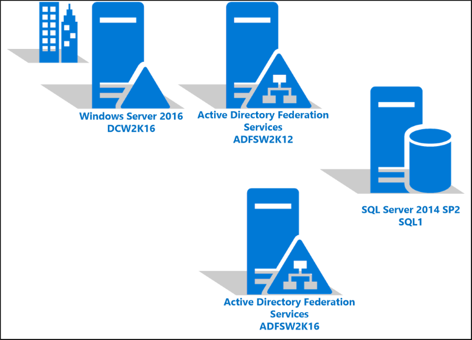
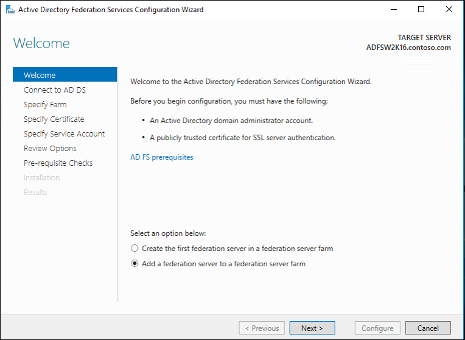
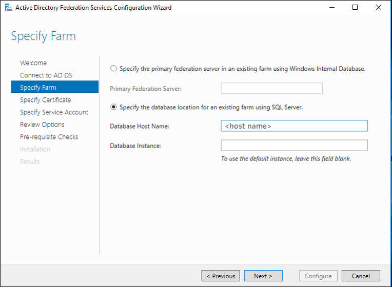
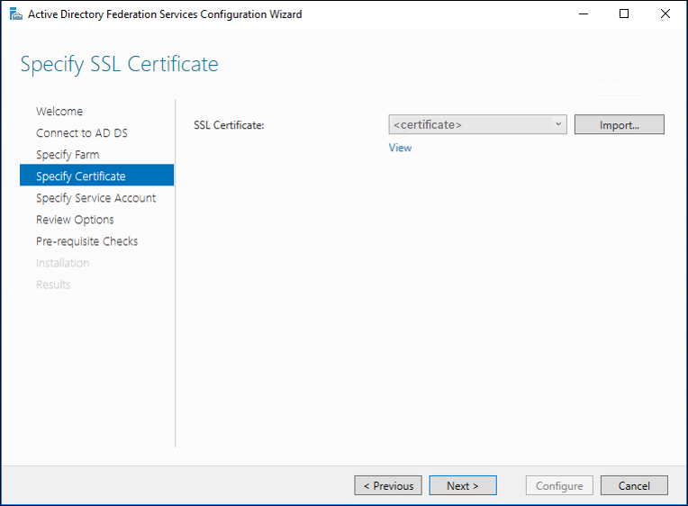
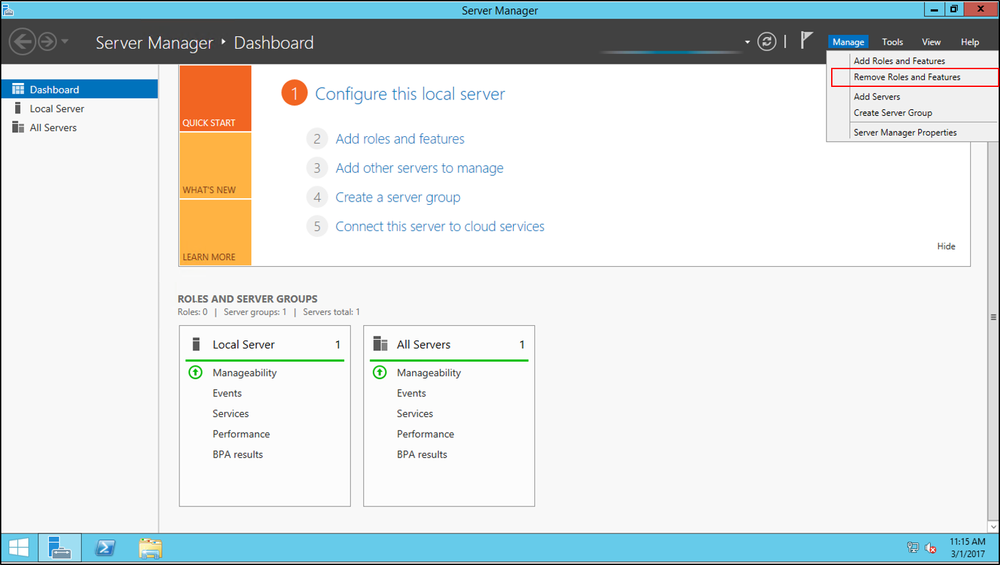
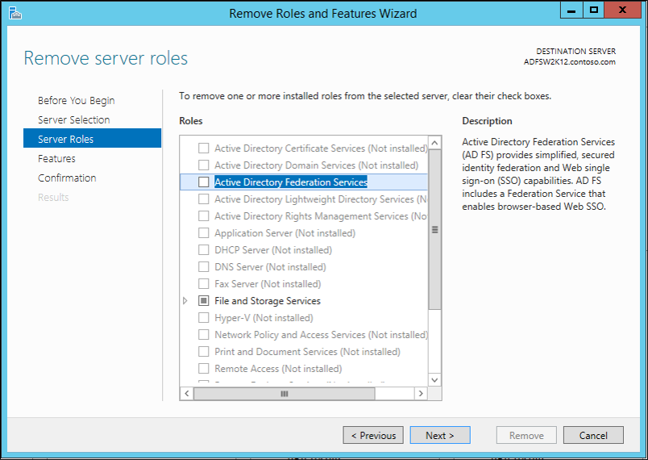
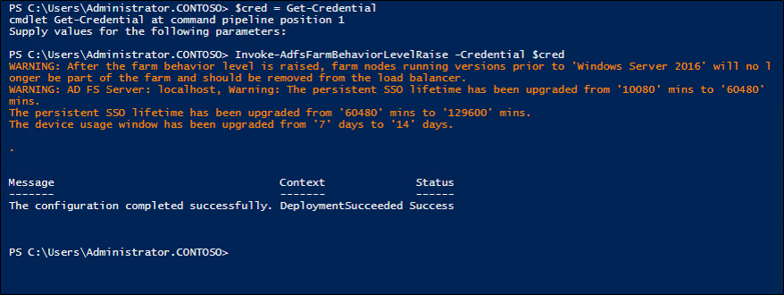
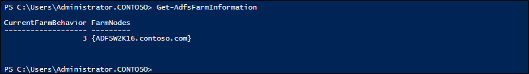

# Upgrading to AD FS in Windows Server 2016 with SQL Server


> [!NOTE]  
> Only begin an upgrade with a definitive time frame planned for completion. It is not recommended to keep AD FS in a mixed mode state for an extended period of time, as leaving AD FS in a mixed mode state may cause issues with the farm.


## Moving from a Windows Server 2012 R2 AD FS farm to a Windows Server 2016 AD FS farm  
The following document will describe how to upgrade your AD FS Windows Server 2012 R2 farm to AD FS in Windows Server 2016 when you are using a SQL Server for the AD FS database.  

### Upgrading AD FS to Windows Server 2016 FBL  
New in AD FS for Windows Server 2016 is the farm behavior level feature (FBL).   This features is farm wide and determines the features that the AD FS farm can use.   By default, the FBL in a Windows Server 2012 R2 AD FS farm is at the Windows Server 2012 R2 FBL.  

A Windows Server 2016 AD FS server can be added to a Windows Server 2012 R2 farm and it will operate at the same FBL as a Windows Server 2012 R2.  When you have a Windows Server 2016 AD FS server operating in this fashion, your farm is said to be "mixed".  However, you will not be able to take advantage of the new Windows Server 2016 features until the FBL is raised to Windows Server 2016.  With a mixed farm:  

-   Administrators can add new, Windows Server 2016 federation servers to an existing Windows Server 2012 R2 farm.  As a result, the farm is in "mixed mode" and operates the Windows Server 2012 R2  farm behavior level.  To ensure consistent behavior across the farm, new Windows Server 2016 features cannot be configured or used in this mode.  

-   Once all Windows Server 2012 R2 federation servers have been removed from the mixed mode farm, and in the case of a WID farm, one of the new Windows Serve 2016 federation servers has been promoted to the role of primary node, the administrator can then raise the FBL from Windows Server 2012 R2 to Windows Server 2016.  As a result, any new AD FS Windows Server 2016 features can then be configured and used.  

-   As a result of the mixed farm feature, AD FS Windows Server 2012 R2 organizations looking to upgrade to Windows Server 2016 will not have to deploy an entirely new farm, export and import configuration data.  Instead, they can add Windows Server 2016 nodes to an existing farm while it is online and only incur the relatively brief downtime involved in the FBL raise.  

Be aware that while in mixed farm mode, the AD FS farm is not capable of any new features or functionality introduced in AD FS in Windows Server 2016.  This means organizations that want to try out new features cannot do this until the FBL is raised.  So if your organization is looking to test the new features prior to rasing the FBL, you will need to deploy a separate farm to do this.  

The remainder of the is document provides the steps for adding a Windows Server 2016 federation server to a Windows Server 2012 R2 environment and then raising the FBL to Windows Server 2016.  These steps were performed in a test environment outlined by the architectural diagram below.  

> [!NOTE]  
> Before you can move to AD FS in Windows Server 2016 FBL, you must remove all of the Windows 2012 R2 nodes.  You cannot just upgrade a Windows Server 2012 R2 OS to Windows Server 2016 and have it become a 2016 node.  You will need to remove it and replace it with a new 2016 node.  

To following architectural diagram shows the setup that was used to validate and record the steps below.




#### Join the Windows 2016 AD FS Server to the AD FS farm

1.  Using Server Manager install the Active Directory Federation Services Role on the Windows Server 2016  

2.  Using the AD FS Configuration wizard, join the new Windows Server 2016 server to the existing AD FS farm.  On the **Welcome** screen click **Next**.
   
3.  On the **Connect to Active Directory Domain Services** screen, s**pecify an administrator account** with permissions to perform the federation services configuration and click **Next**.
4.  On the **Specify Farm** screen, enter the name of the SQL server and instance and then click **Next**.

5.  On the **Specify SSL Certificate** screen, specify the certificate and click **Next**.

6.  On the **Specify Service Account** screen, specify the service account and click **Next**.
7.  On the **Review Options** screen, review the options and click **Next**.
8.  On the **Pre-requisites Checks** screen, ensure that all of the pre-requisite checks have passed and click **Configure**.
9.  On the **Results** screen, ensure that server was successfully configured and click **Close**.


#### Remove the Windows Server 2012 R2 AD FS server

>[!NOTE]
>You do not need to set the primary AD FS server using Set-AdfsSyncProperties -Role when using SQL as the database.  This is because all of the nodes are considered primary in this configuration.

1.  On the Windows Server 2012 R2 AD FS server in Server Manager use **Remove Roles and Features** under **Manage**.

2.  On the **Before you Begin** screen, click **Next**.
3.  On the **Server Selection** Screen, click **Next**.
4.  On the **Server Roles** screen, remove the check next to **Active Directory Federation Services** and click **Next**.

5.  On the **Features** Screen, click **Next**.
6.  On the **Confirmation** Screen, click **Remove**.
7.  Once this completes, restart the server.

#### Raise the Farm Behavior Level (FBL)
Prior to this step you need to ensure that forestprep and domainprep have been run on your Active Directory environment and that Active Directory has the Windows Server 2016 schema.  This document started with a Windows 2016 domain controller and did not require running these because they were run when AD was installed.

>[!NOTE]
>Before starting the process below, ensure Windows Server 2016 is current by running Windows Update from Settings.  Continue this process until no further updates are needed.

1. Now on the Windows Server 2016 Server open PowerShell and run the following: **$cred = Get-Credential** and hit enter.
2. Enter credentials that have admin privileges on the SQL Server.
3. Now in PowerShell, enter the following: **Invoke-AdfsFarmBehaviorLevelRaise -Credential $cred**
2. When prompted, type **Y**.  This will begin raising the level.  Once this completes you have successfully raised the FBL.  

3. Now, if you go to AD FS Management, you will see the new nodes that have been added for AD FS in Windows Server 2016  
4. Likewise, you can use the PowerShell cmdlt:  Get-AdfsFarmInformation to show you the current FBL.  


#### Upgrade the Configuration Version of existing WAP servers
1. On each Web Application Proxy, re-configure the WAP by executing the following PowerShell command in an elevated window:  
    ```powershell
    $trustcred = Get-Credential -Message "Enter Domain Administrator credentials"
    Install-WebApplicationProxy -CertificateThumbprint {SSLCert} -fsname fsname -FederationServiceTrustCredential $trustcred  
    ```
2. Remove old servers from the cluster and keep only the WAP servers running the latest server version, which were reconfigured above, by running the following Powershell commandlet.
    ```powershell
    Set-WebApplicationProxyConfiguration -ConnectedServersName WAPServerName1, WAPServerName2
    ```
3. Check the WAP configuration by running the Get-WebApplicationProxyConfiguration commmandlet. The ConnectedServersName will reflect the server run from the prior command.
    ```powershell
    Get-WebApplicationProxyConfiguration
    ```
4. To upgrade the ConfigurationVersion of the WAP servers, run the following Powershell command.
    ```powershell
    Set-WebApplicationProxyConfiguration -UpgradeConfigurationVersion
    ```
5. Verify the ConfigurationVersion has been upgraded with the Get-WebApplicationProxyConfiguration Powershell command.
