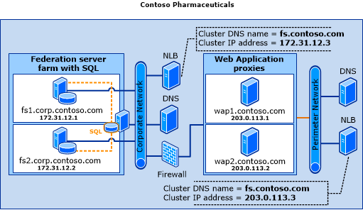

# Federation Server Farm Using SQL Server

This topology for Active Directory Federation Services \(AD FS\) differs from the federation server farm using Windows Internal Database \(WID\) deployment topology in that it does not replicate the data to each federation server in the farm. Instead, all federation servers in the farm can read and write data into a common database that is stored on a server running Microsoft SQL Server that is located in the corporate network.  
  
> [!IMPORTANT]  
> If you want to create an AD FS farm and use SQL Server to store your configuration data, you can use SQL Server 2008 and newer versions, including SQL Server 2012, and SQL Server 2014.  
  
## Deployment considerations  
This section describes various considerations about the intended audience, benefits, and limitations that are associated with this deployment topology.  
  
### Who should use this topology?  
  
-   Large organizations with more than 100 trust relationships that need to provide both their internal users and external users with single sign\-on \(SSO\) access to federated application or services  
  
-   Organizations that already use SQL Server and want to take advantage of their existing tools and expertise  
  
### What are the benefits of using this topology?  
  
-   Support for larger numbers of trust relationships \(more than 100\)  
  
-   Support for token replay detection \(a security feature\) and artifact resolution \(part of the Security Assertion Markup Language \(SAML\) 2.0 protocol\)  
  
-   Support for the full benefits of SQL Server, such as database mirroring, failover clustering, reporting, and management tools  
  
### What are the limitations of using this topology?  
  
-   This topology does not provide database redundancy by default. Although a federation server farm with WID topology automatically replicates the WID database on each federation server in the farm, the federation server farm with SQL Server topology contains only one copy of the database  
  
> [!NOTE]  
> SQL Server supports many different data and application redundancy options including failover clustering, database mirroring, and several different types of SQL Server replication.  
  
The Microsoft Information Technology \(IT\) department uses SQL Server database mirroring in high\-safety \(synchronous\) mode and failover clustering to provide high\-availability support for the SQL Server instance. SQL Server transactional \(peer\-to\-peer\) and merge replication have not been tested by the AD FS product team at Microsoft. For more information about SQL Server, see [High Availability Solutions Overview](https://go.microsoft.com/fwlink/?LinkId=179853) or [Selecting the Appropriate Type of Replication](https://go.microsoft.com/fwlink/?LinkId=214648).  
  
### Supported SQL Server Versions  
The following SQL server versions are supported with AD FS in Windows Server 2012 R2:  
  
-   SQL Server 2008 \/ R2  
  
-   SQL Server 2012  
  
-   SQL Server 2014  
  
## Server placement and network layout recommendations  
Similar to the federation server farm with WID topology, all of the federation servers in the farm are configured to use one cluster Domain Name System \(DNS\) name \(which represents the Federation Service name\) and one cluster IP address as part of the Network Load Balancing \(NLB\) cluster configuration. This helps the NLB host allocate client requests to the individual federation servers. Federation server proxies can be used to proxy client requests to the federation server farm.  
  
The following illustration shows how the fictional Contoso Pharmaceuticals company deployed its federation server farm with SQL Server topology in the corporate network. It also shows how that company configured the perimeter network with access to a DNS server, an additional NLB host that uses the same cluster DNS name \(fs.contoso.com\) that is used on the corporate network NLB cluster, and with two web application proxies \(wap1 and wap2\).  
  
  
  
For more information about how to configure your networking environment for use with federation servers or web application proxies, see “Name Resolution Requirements” section in [AD FS Requirements](AD-FS-Requirements.md) and [Plan the Web Application Proxy Infrastructure (WAP)](https://technet.microsoft.com/library/dn383648.aspx).  
  
## High Availability Options for SQL Server Farms  
In Windows Server 2012 R2, AD FS there are two new options to support high availability in AD FS farms using SQL Server.  
  
-   Support for SQL Server AlwaysOn Availability Groups  
  
-   Support for geographically distributed high availability using SQL Server merge replication  
  
This section describes each of these options, what problems they respectively solve, and some key considerations for deciding which options to deploy.  
  
> [!NOTE]  
> AD FS farms that use Windows Internal Database \(WID\) provide basic data redundancy with read\/write access on the primary federation server node and read\-only access on secondary nodes.  This can be used in a geographically local or a geographically distributed topology.  
>   
> When using WID be aware of the following limitations:  
>   
> -   A WID farm has a limit of 30 federation servers if you have 100 or fewer relying party trusts.  
> -   A WID farm does not support token replay detection or artifact resolution \(part of the Security Assertion Markup Language \(SAML\) protocol\).  
  
The following table provides a summary for using a WID farm.  
  
||||  
|-|-|-|  
||1 \- 100 RP Trusts|More than 100 RP Trusts|  
|1 \- 30 AD FS Nodes|WID Supported|Not supported using WID \- SQL Required|  
|More than 30 AD FS Nodes|Not supported using WID \- SQL Required|Not supported using WID \- SQL Required|  
  
### AlwaysOn Availability Groups  
**Overview**  
  
AlwaysOn Availability groups were introduced in SQL Server 2012 and provide a new way to create a high availability SQL Server instance.  AlwaysOn Availability groups combine elements of clustering and database mirroring for redundancy and failover at both the SQL instance layer and the database layer.  Unlike previous high availability options, AlwaysOn Availability groups do not require a common storage \(or storage area network\) at the database layer.  
  
An availability group is comprised of a primary replica \(a set of read\-write primary databases\) and one to four availability replicas \(sets of corresponding secondary databases\).  The availability group supports a single read\-write copy \(the primary replica\), and one to four read\-only availability replicas.  Each availability replica must reside on a different node of a single Windows Server Failover Clustering \(WSFC\) cluster.  For more information on AlwaysOn Availability groups see [Overview of AlwaysOn Availability Groups \(SQL Server\)](https://technet.microsoft.com/library/ff877884.aspx).  
  
From the perspective of the nodes of an AD FS SQL Server farm, the AlwaysOn Availability group replaces the single SQL Server instance as the policy \/ artifact database.  The availability group listener is what the client \(the AD FS security token service\) uses to connect to SQL.  
  
The following diagram shows an AD FS SQL Server Farm with AlwaysOn Availability group.  
  
  
  
> [!NOTE]  
> AlwaysOn Availability groups require that the SQL Server instances reside on Windows Server Failover Clustering \(WSFC\) nodes.  
  
> [!NOTE]  
> Only one availability replica can act as an automatic failover target, the other three will rely on manual failovers.  
  
**Key Deployment Considerations**  
  
If you plan to use AlwaysOn Availability groups in combination with SQL Server merge replication, please take note of the issues described under “Key Deployment Considerations for using AD FS with SQL Server Merge Replication” below.  In particular, when an AlwaysOn availability group containing a database that is a replication subscriber fails over, the replication subscription fails. To resume replication, a replication administrator must manually reconfigure the subscriber.  See the SQL Server description of specific issue at [Replication Subscribers and AlwaysOn Availability Groups \(SQL Server\)](https://technet.microsoft.com/library/hh882436.aspx) and overall support statements for AlwaysOn Availability groups with replication options at [Replication, Change Tracking, Change Data Capture, and AlwaysOn Availability Groups \(SQL Server\)](https://technet.microsoft.com/library/hh403414.aspx).  
  
**Configuring AD FS to use an AlwaysOn Availability group**  
  
Configuring an AD FS farm with AlwaysOn Availability groups requires a slight modification to the AD FS deployment procedure:  
  
1.  The databases you wish to back up must be created before the AlwaysOn Availability groups can be configured.  AD FS creates its databases as part of the setup and initial configuration of the first federation service node of a new AD FS SQL Server farm.  As part of the AD FS configuration, you must specify an SQL connection string, so you will have to configure the first AD FS farm node to connect to a SQL instance directly \(this is only temporary\).   For specific guidance on configuring an AD FS farm, including configuring an AD FS farm node with a SQL server connection string, see [Configure a Federation Server](../../ad-fs/deployment/Configure-a-Federation-Server.md).  
  
2.  Once the AD FS databases have been created, assign them to AlwaysOn Availability groups and create the common TCPIP listener using SQL Server tools and process at [Creation and Configuration of Availability Groups \(SQL Server\)](https://technet.microsoft.com/library/ff878265.aspx).  
  
3.  Finally, use PowerShell to edit the AD FS properties to update the SQL connection string to use the DNS address of the AlwaysOn Availability group’s listener.  
  
    Example PSH commands to update the SQL connection string for the AD FS configuration database:  
  
    ```  
    PS:\>$temp= Get-WmiObject -namespace root/ADFS -class SecurityTokenService  
    PS:\>$temp.ConfigurationdatabaseConnectionstring=”data source=<SQLCluster\SQLInstance>; initial catalog=adfsconfiguration;integrated security=true”  
    PS:\>$temp.put()  
  
    ```  
  
4.  Example PSH commands to update the SQL connection string for the AD FS artifact resolution service database:  
  
    ```  
    PS:\> Set-AdfsProperties –artifactdbconnection ”Data source=<SQLCluster\SQLInstance >;Initial Catalog=AdfsArtifactStore;Integrated Security=True”  
    ```  
  
### SQL Server Merge Replication  
Also introduced in SQL Server 2012, merge replication allows for AD FS policy data redundancy with the following characteristics:  
  
-   Read and write capability on all nodes \(not just the primary\)  
  
-   Smaller amounts of data replicated asynchronously to avoid introducing latency to the system  
  
The following diagram shows a geographically redundant AD FS SQL Server farms with merge replication \(1 publisher, 2 subscribers\):  
  
  
  
**Key Deployment Considerations for using AD FS with SQL Server Merge Replication \(note numbers in the diagram above\)**  
  
-   The distributor database is not supported for use with AlwaysOn Availability Groups or database mirroring.  See SQL Server support statements for AlwaysOn Availability groups with replication options at [Replication, Change Tracking, Change Data Capture, and AlwaysOn Availability Groups \(SQL Server\)](https://technet.microsoft.com/library/hh403414.aspx).  
  
-   When an AlwaysOn availability group containing a database that is a replication subscriber fails over, the replication subscription fails. To resume replication, a replication administrator must manually reconfigure the subscriber.  See the SQL Server description of specific issue at [Replication Subscribers and AlwaysOn Availability Groups \(SQL Server\)](https://technet.microsoft.com/library/hh882436.aspx) and overall support statements for AlwaysOn Availability groups with replication options [Replication, Change Tracking, Change Data Capture, and AlwaysOn Availability Groups \(SQL Server\)](https://technet.microsoft.com/library/hh403414.aspx).  
  
For more detailed instructions on how to configure AD FS to use a SQL Server merge replication, see [Setup Geographic Redundancy with SQL Server Replication](https://technet.microsoft.com/library/dn632406.aspx).  
  
## See Also  
[Plan Your AD FS Deployment Topology](Plan-Your-AD-FS-Deployment-Topology.md)  
[AD FS Design Guide in Windows Server 2012 R2](AD-FS-Design-Guide-in-Windows-Server-2012-R2.md)  
  

