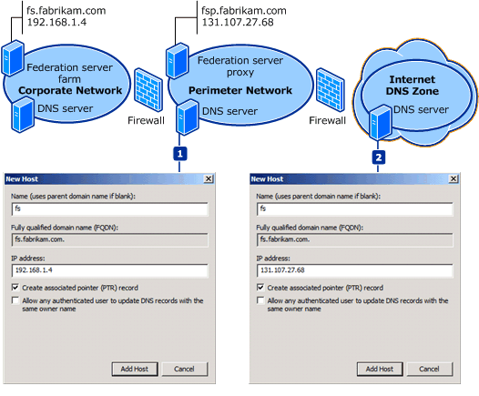

# Name Resolution Requirements for Federation Server Proxies

When client computers on the Internet attempt to access an application that is secured by Active Directory Federation Services \(AD FS\), they must first authenticate to the federation server. In most cases, the federation server is usually not directly accessible from the Internet. Therefore, Internet client computers must be redirected to the federation server proxy instead. You can accomplish successful redirection by adding the appropriate Domain Name System \(DNS\) records to your DNS zone or zones that face the Internet.  
  
The method that you use to redirect Internet clients to the federation server proxy depends on how you configure the DNS zone in your perimeter network or how you configure a DNS zone that you control on the Internet. Federation server proxies are intended for use in a perimeter network. They redirect Internet client requests to federation servers successfully only when DNS has been configured properly in all the Internet\-facing zones that you control. Therefore, the configuration of your Internet\-facing zones—whether you have a DNS zone serving only the perimeter network or a DNS zone serving both the perimeter network and Internet clients—is important.  
  
This topic describes the steps that you can take to configure name resolution when you place a federation server proxy in your perimeter network. To determine which steps to follow, first determine which of the following DNS scenarios most closely matches the DNS infrastructure in the perimeter network of your organization. Then, follow the steps for that scenario.  
  
## DNS zone serving only the perimeter network  
In this scenario, your organization has one or two DNS zones in the perimeter network, and your organization does not control any DNS zones on the Internet. Successful name resolution for a federation server proxy in the DNS zone that serves only the perimeter network scenario depends on the following conditions:  
  
-   The federation server proxy must have a setting in the hosts file to resolve the fully qualified domain name \(FQDN\) of the federation server endpoint URL to an IP address of a federation server or a federation server cluster.  
  
-   DNS in the perimeter network of the account partner must be configured so that the FQDN of the federation server endpoint URL resolves to the IP address of the federation server proxy.  
  
The following illustration and corresponding steps show how each of these conditions is achieved for a given example. In this illustration, Microsoft Network Load Balancing \(NLB\) technology provides a single, cluster FQDN and a single, cluster IP address for an existing federation server farm.  
  
  
  
For more information about configuring a cluster IP address or a cluster FQDN using NLB, see [Specifying the Cluster Parameters](https://go.microsoft.com/fwlink/?LinkId=75282).  
  
### 1. Configure the hosts file on the federation server proxy  
Because DNS in the perimeter network is configured to resolve all requests for fs.fabrikam.com to the account federation server proxy, the account partner federation server proxy has an entry in its local hosts file to resolve fs.fabrikam.com to the IP address of the actual account federation server \(or cluster DNS name for the federation server farm\) that is connected to the corporate network. This makes it possible for the account federation server proxy to resolve the host name fs.fabrikam.com to the account federation server rather than to itself—as would occur if it attempted to look up fs.fabrikam.com using perimeter DNS—so that the federation server proxy can communicate with the federation server.  
  
### 2. Configure perimeter DNS  
Because there is only a single AD FS host name that client computers are directed to—whether they are on an intranet or on the Internet—client computers on the Internet that use the perimeter DNS server must resolve the FQDN for the account federation server \(fs.fabrikam.com\) to the IP address of the account federation server proxy on the perimeter network. So that it can forward clients on to the account federation server proxy when they attempt to resolve fs.fabrikam.com, perimeter DNS contains a limited corp.fabrikam.com DNS zone with a single host \(A\) resource record for fs \(fs.fabrikam.com\) and the IP address of the account federation server proxy on the perimeter network.  
  
For more information about how to modify the hosts file of the federation server proxy and configure DNS in the perimeter network, see [Configure Name Resolution for a Federation Server Proxy in a DNS Zone That Serves Only the Perimeter Network](../../ad-fs/deployment/Configure-Name-Resolution-for-a-Federation-Server-Proxy-in-a-DNS-Zone-That-Serves-Only-the-Perimeter-Network.md).  
  
## DNS zone serving both the perimeter network and Internet clients  
In this scenario, your organization controls the DNS zone in the perimeter network and at least one DNS zone on the Internet. Successful name resolution for a federation server proxy in this scenario depends on the following conditions:  
  
-   DNS in the Internet zone of the account partner must be configured so that the FQDN of the federation server host name resolves to the IP address of the federation server proxy in the perimeter network.  
  
-   DNS in the perimeter network of the account partner must be configured so that the FQDN of the federation server host name resolves to the IP address of the federation server in the corporate network.  
  
The following illustration and corresponding steps show how each of these conditions is achieved for a given example.  
  
  
  
### 1. Configure perimeter DNS  
For this scenario, because it is assumed that you will configure the Internet DNS zone that you control to resolve requests that are made for a specific endpoint URL \(that is, fs.fabrikam.com\) to the federation server proxy in the perimeter network, you must also configure the zone in the perimeter DNS to forward these requests to the federation server in the corporate network.  
  
So that clients can be forwarded to the account federation server when they attempt to resolve fs.fabrikam.com, perimeter DNS is configured with a single host \(A\) resource record for fs \(fs.fabrikam.com\) and the IP address of the account federation server on the corporate network. This makes it possible for the account federation server proxy to resolve the host name fs.fabrikam.com to the account federation server rather than to itself—as would occur if it attempted to look up fs.fabrikam.com using Internet DNS—so that the federation server proxy can communicate with the federation server.  
  
### 2. Configure Internet DNS  
For name resolution to be successful in this scenario, all requests from client computers on the Internet to fs.fabrikam.com must be resolved by the Internet DNS zone that you control. Consequently, you must configure your Internet DNS zone to forward client requests for fs.fabrikam.com to the IP address of the account federation server proxy in the perimeter network.  
  
For more information about how to modify the perimeter network and Internet DNS zones, see [Configure Name Resolution for a Federation Server Proxy in a DNS Zone That Serves Both the Perimeter Network and Internet Clients](../../ad-fs/deployment/Configure-Name-Resolution-for-a-Federation-Server-Proxy-in-a-DNS-Zone-That-Serves-Both-the-Perimeter-Network-and-Internet-Clients.md).  
  
## See Also
[AD FS Design Guide in Windows Server 2012](AD-FS-Design-Guide-in-Windows-Server-2012.md)
