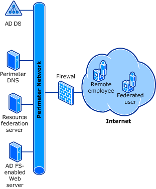

# Provide Users in Another Organization Access to Your Claims-Aware Applications and Services

When you are an administrator in the resource partner organization in Active Directory Federation Services \(AD FS\) and you have a deployment goal to provide federated access for users in another organization \(the account partner organization\) to a claims\-aware application or a Web\-based service that is located in your organization \(the resource partner organization\):  
  
-   Federated users both in your organization and in organizations who have configured a federation trust to your organization \(account partner organizations\) can access the AD FS secured application or service that is hosted by your organization. For more information, see [Federated Web SSO Design](Federated-Web-SSO-Design.md).  
  
    For example, Fabrikam may want its corporate network employees to have federated access to Web services that are hosted in Contoso.  
  
-   Federated users who have no direct association with a trusted organization \(such as individual customers\), who are logged on to an attribute store that is hosted in your perimeter network, can access multiple AD FS\-secured applications, which are also hosted in your perimeter network, by logging on one time from client computers that are located on the Internet. In other words, when you host customer accounts to enable access to applications or services in your perimeter network, customers that you host in an attribute store can access one or more applications or services in the perimeter network simply by logging on once. For more information, see [Web SSO Design](Web-SSO-Design.md).  
  
    For example, Fabrikam may want its customers to have single\-sign\-on \(SSO\) access to multiple applications or services that are hosted in its perimeter network.  
  
The following components are required for this deployment goal:  
  
-   **Active Directory Domain Services \(AD DS\):** The resource partner federation server must be joined to an Active Directory domain.  
  
-   **Perimeter DNS:** Domain Name System \(DNS\) should contain a simple host \(A\) resource record so that client computers can locate the resource partner federation server and the Web server. The DNS server may host other DNS records that are also required in the perimeter network. For more information, see [Name Resolution Requirements for Federation Servers](Name-Resolution-Requirements-for-Federation-Servers.md).  
  
-   **Resource partner federation server:** The resource partner federation server validates AD FS tokens that the account partners send. Account partner discovery is performed through this federation server. For more information, see [Review the Role of the Federation Server in the Resource Partner](Review-the-Role-of-the-Federation-Server-in-the-Resource-Partner.md).  
  
-   **Web server:** The Web server can host either a Web application or a Web service. The Web server confirms that it receives valid AD FS tokens from federated users before it allows access to the protected Web application or Web service.  
  
    By using Windows Identity Foundation \(WIF\), you can develop your Web application or service so that it accepts federated user logon requests that are made with any standard logon method, such as user name and password.  
  
After reviewing the information in the linked topics, you can begin deploying this goal by following the steps in [Checklist: Implementing a Federated Web SSO Design](../../ad-fs/deployment/Checklist--Implementing-a-Federated-Web-SSO-Design.md) and [Checklist: Implementing a Web SSO Design](../../ad-fs/deployment/Checklist--Implementing-a-Web-SSO-Design.md).  
  
The following illustration shows each of the required components for this AD FS deployment goal.  
  
  
  
## See Also
[AD FS Design Guide in Windows Server 2012](AD-FS-Design-Guide-in-Windows-Server-2012.md)
