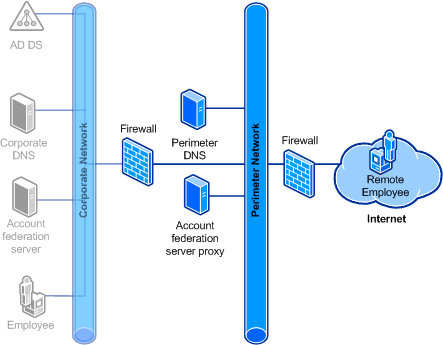

# Provide Your Active Directory Users Access to the Applications and Services of Other Organizations

This Active Directory Federation Services \(AD FS\) deployment goal builds on the goal in [Provide Your Active Directory Users Access to Your Claims-Aware Applications and Services](Provide-Your-Active-Directory-Users-Access-to-Your-Claims-Aware-Applications-and-Services.md).  
  
When you are an administrator in the account partner organization and you have a deployment goal to provide federated access for employees to hosted resources in another organization:  
  
-   Employees who are logged on to an Active Directory domain in the corporate network can use single\-sign\-on \(SSO\) functionality to access multiple Web\-based applications or services, which are secured by AD FS, when the applications or services are in a different organization. For more information, see [Federated Web SSO Design](Federated-Web-SSO-Design.md).  
  
    For example, Fabrikam may want corporate network employees to have federated access to Web services that are hosted in Contoso.  
  
-   Remote employees who are logged on to an Active Directory domain can obtain AD FS tokens from the federation server in your organization to gain federated access to AD FS–secured Web\-based applications or services that are hosted in another organization.  
  
    For example, Fabrikam may want its remote employees to have federated access to AD FS–secured services that are hosted in Contoso, without requiring the Fabrikam employees to be on the Fabrikam corporate network.  
  
In addition to the foundational components that are described in [Provide Your Active Directory Users Access to Your Claims-Aware Applications and Services](Provide-Your-Active-Directory-Users-Access-to-Your-Claims-Aware-Applications-and-Services.md) and that are shaded in the following illustration, the following components are required for this deployment goal:  
  
-   **Account partner federation server proxy:** Employees that access the federated service or application from the Internet can use this AD FS component to perform authentication. By default, this component performs forms authentication, but it can also perform basic authentication. You can also configure this component to perform Secure Sockets Layer \(SSL\) client authentication if employees at your organization have certificates to present. For more information, see [Where to Place a Federation Server Proxy](Where-to-Place-a-Federation-Server-Proxy.md).  
  
-   **Perimeter DNS:** This implementation of Domain Name System \(DNS\) provides the host names for the perimeter network. For more information about how to configure perimeter DNS for a federation server proxy, see [Name Resolution Requirements for Federation Server Proxies](Name-Resolution-Requirements-for-Federation-Server-Proxies.md).  
  
-   **Remote employee:** The remote employee accesses a Web\-based application \(through a supported Web browser\) or a Web\-based service \(through an application\), using valid credentials from the corporate network, while the employee is offsite using the Internet. The employee's client computer in the remote location communicates directly with the federation server proxy to generate a token and authenticate to the application or service.  
  
After reviewing the information in the linked topics, you can begin deploying this goal by following the steps in [Checklist: Implementing a Federated Web SSO Design](../../ad-fs/deployment/Checklist--Implementing-a-Federated-Web-SSO-Design.md).  
  
The following illustration shows each of the required components for this AD FS deployment goal.  
  
  
  
## See Also
[AD FS Design Guide in Windows Server 2012](AD-FS-Design-Guide-in-Windows-Server-2012.md)
