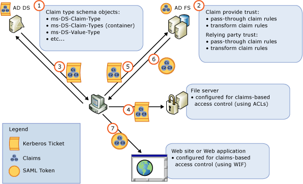

# Using AD DS Claims with AD FS
  
  
You can enable richer access control for federated applications by using Active Directory Domain Services \(AD DS\)\-issued user and device claims together with Active Directory Federation Services \(AD FS\).  
  
## About Dynamic Access Control  
In Windows Server® 2012, the Dynamic Access Control feature enables organizations to grant access to files based on user claims \(which are sourced by user account attributes\) and device claims \(which are sourced by computer account attributes\) that are issued by Active Directory Domain Services \(AD DS\). AD DS issued claims are integrated into Windows integrated authentication through the Kerberos authentication protocol.  
  
For more information about Dynamic Access Control, see [Dynamic Access Control Content Roadmap](../../solution-guides/Dynamic-Access-Control--Scenario-Overview.md#BKMK_APP).  
  
### What’s New in AD FS?  
As an extension to the Dynamic Access Control scenario, AD FS in  Windows Server 2012  can now:  
  
-   Access computer account attributes in addition to user account attributes from within AD DS. In previous versions of AD FS, the Federation Service could not access computer account attributes at all from AD DS.  
  
-   Consume AD DS issued user or device claims that reside in a Kerberos authentication ticket. In previous versions of AD FS, the claims engine was able to read user and group security IDs \(SIDs\) from Kerberos but was not able to read any claims information contained within a Kerberos ticket.  
  
-   Transform AD DS issued user or device claims into SAML tokens that relying applications can use to perform richer access control.  
  
## Benefits of Using AD DS Claims with AD FS  
These AD DS issued claims can be inserted into Kerberos authentication tickets and used with AD FS to provide the following benefits:  
  
-   Organizations that require richer access control policies can enable claims\-based access to applications and resources by using AD DS issued claims that are based on the attribute values stored in AD DS for a given user or computer account. This can help administrators to reduce additional overhead associated with creating and managing:  
  
    -   AD DS security groups that would otherwise be used for controlling access to applications and resources that are accessible via Windows Integrated authentication.  
  
    -   Forest trusts that would otherwise be used for controlling access to Business\-to\-Business \(B2B\) \/ Internet accessible applications and resources.  
  
-   Organizations can now prevent unauthorized access to network resources from client computers based on whether a specific computer account attribute value stored in AD DS \(for example, a computer’s DNS name\) matches the access control policy of the resource \(for example, a file server that has been ACLd with claims\) or the relying party policy \(for example, a claims\-aware Web application\). This can help administrators to set finer access control policies for resources or applications that are:  
  
    -   Only accessible via Windows Integrated authentication.  
  
    -   Internet accessible via AD FS authentication mechanisms. AD FS can be used to transform AD DS issued device claims into AD FS claims that can be encapsulated into SAML tokens which can be consumed by an Internet accessible resource or relying party application.  
  
## Differences Between AD DS and AD FS Issued Claims  
There are two differentiating factors that are important to understand about claims that are issued from AD DS vs. AD FS. These differences include:  
  
-   AD DS can only issue claims that are encapsulated in Kerberos tickets, not SAML tokens. For more information about how AD DS issues claims, see [Dynamic Access Control Content Roadmap](../../solution-guides/Dynamic-Access-Control--Scenario-Overview.md#BKMK_APP).  
  
-   AD FS can only issue claims that are encapsulated in SAML tokens, not Kerberos tickets. For more information about how AD FS issues claims, see [The Role of the Claims Engine](../../ad-fs/technical-reference/The-Role-of-the-Claims-Engine.md).  
  
## How AD DS Issued Claims Work with AD FS  
AD DS issued claims can be used with AD FS to access both user and device claims directly from the user’s authentication context, rather than making a separate LDAP call to Active Directory. The following illustration and corresponding steps discusses how this process works in more detail to enable claims\-based access control for the Dynamic Access Control scenario.  
  
  
  
1.  An AD DS administrator uses the Active Directory Administrative Center console or PowerShell cmdlets to enables specific claim type objects in the AD DS schema.  
  
2.  An AD FS administrator uses the AD FS Management console to create and configure the claims provider and relying party trusts with either pass\-through or transform claim rules.  
  
3.  A Windows client attempts to access the network. As part of the Kerberos authentication process, the client presents its user and computer ticket\-granting ticket \(TGT\) which does not yet contain any claims, to the domain controller. The domain controller then looks in AD DS for enabled claim types, and includes any resulting claims in the returned Kerberos ticket.  
  
4.  When the user\/client attempts to access a file resource that is ACLd to require the claims, they can access the resource because the compound ID that was surfaced from Kerberos has these claims.  
  
5.  When the same client attempts to access a Web site or Web application that is configured for AD FS authentication, the user is redirected to an AD FS federation server that is configured for Windows integrated authentication. The client sends a request to the domain controller using Kerberos. The domain controller issues a Kerberos ticket containing the requested claims which the client can then present to the federation server.  
  
6.  Based on the way the claims rules have been configured on the claims provider and relying party trusts that the administrator configured previously, AD FS reads the claims from the Kerberos ticket and includes them in a SAML token that it issues for the client.  
  
7.  The client receives the SAML token containing the correct claims and is then redirected to the website.  
  
For more information about how to create the claim rules required for AD DS issued claims to work with AD FS, see [Create a Rule to Transform an Incoming Claim](../../ad-fs/operations/Create-a-Rule-to-Transform-an-Incoming-Claim.md).  
  
## See Also
[AD FS Design Guide in Windows Server 2012](AD-FS-Design-Guide-in-Windows-Server-2012.md)
