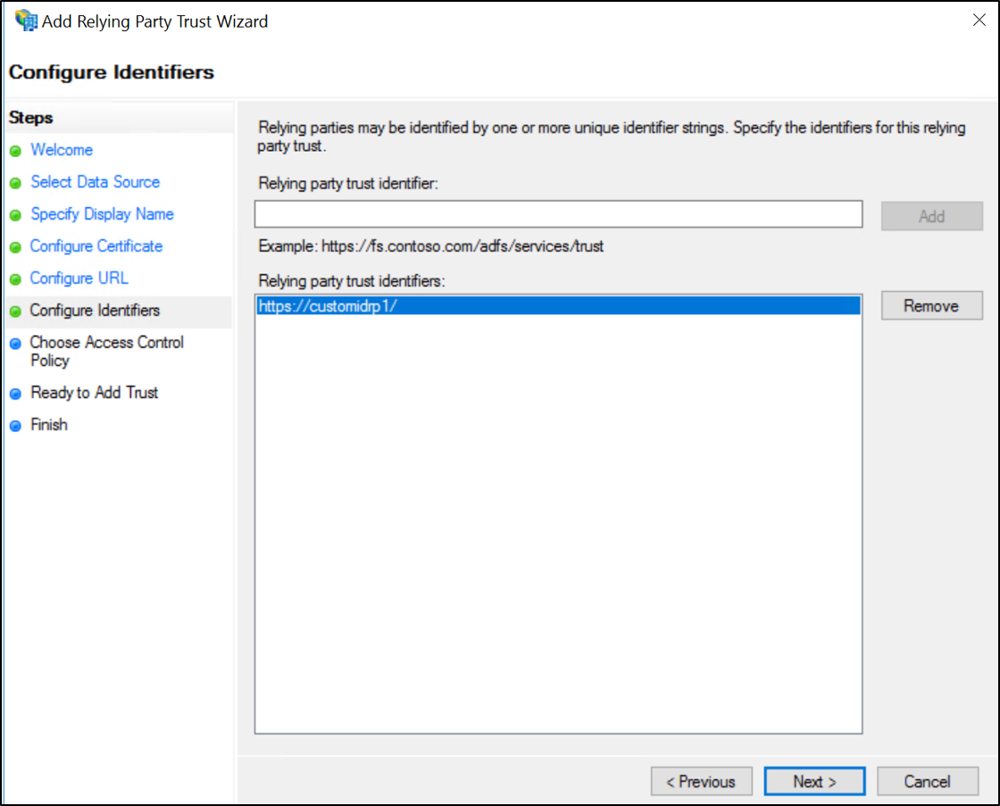
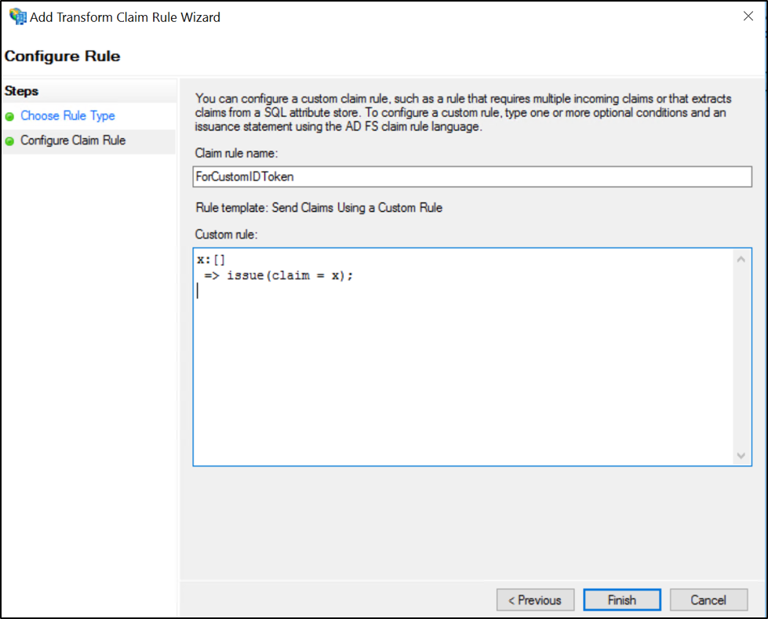

# Customize claims to be emitted in id_token when using OpenID Connect or OAuth with AD FS 2016

## Overview
The article [here](enabling-openId-connect-with-ad-fs.md) shows how to build an app that uses AD FS for OpenID Connect sign on. However, by default there are only a fixed set of claims available in the id_token. AD FS 2016 has the capability to customize the id_token in OpenID Connect scenarios.

## When are custom ID token used?
In certain scenarios it is possible that the client application does not have a resource that it is trying to access. Therefore, it doesn’t really need an access token. In such cases, the client application essentially needs only an ID token but with some additional claims to help in the functionality.

## What are the restrictions on getting custom claims in ID token?

### Scenario 1


1.	response_mode is set as form_post
2.	Only public clients can get custom claims in ID token
3.	Relying Party Identifier should be same as client identifier

### Scenario 2


With [KB4019472](https://support.microsoft.com/help/4019472/windows-10-update-kb4019472) installed on your AD FS servers
1.	response_mode is set as form_post
2.	Assign scope allatclaims to the client – RP pair.
You can assign the scope by using the Grant-ADFSApplicationPermission cmdlet as indicated in the example below:

``` powershell
Grant-AdfsApplicationPermission -ClientRoleIdentifier "https://my/privateclient" -ServerRoleIdentifier "https://rp/fedpassive" -ScopeNames "allatclaims","openid"
```

## Creating an OAuth application to handle custom claims in ID token
Use the article [here](Enabling-OpenId-Connect-with-AD-FS-2016.md) to create an application app that uses AD FS for OpenID Connect sign on. Then follow the steps below to configure the application in AD FS for receiving ID token with custom claims.

### Create the Application Group in AD FS 2016

1.  Create an application group based on the new template, shown below, called CustomTokenClient.


2. This template creates a confidential client. Note the identifier and specify the return URI as the SSL URL of the VS project.


3.  In the next step, select **Generate a shared secret** to create client credentials and copy the client credentials generated.


4. Click **Next** and proceed to complete the wizard.


### Create the Relying Party
In order to add custom claims in ID token, you need to create a RP whose claims will be added in the ID token. Use the Add Relying Party Trust wizard to create a new relying party as shown below:
 


After relying party is created, right click on the relying party entry and select **Edit claim issuance policy** to add claims issuance rules. Add the required custom claims for ID token as shown below:



### Assign “allatclaims” scope to the pair of client and relying party
Using PowerShell on AD FS server, assign the new allatclaims scope as given in the example below (change the clientID and server:

``` powershell
Grant-AdfsApplicationPermission -ClientRoleIdentifier "5db77ce4-cedf-4319-85f7-cc230b7022e0" -ServerRoleIdentifier "https://customidrp1/" -ScopeNames "allatclaims","openid"
```

>[!NOTE]
>Change the ClientRoleIdentifier and ServerRoleIdentifier according to your application settings

## Test the custom claims in ID token

Then, using the same bit of code you have always used to access claims, you can see the additional claims that will become part of the id_token.
For example, in a .NET MVC sample app, open one of the controller files and enter code like the below:


``` code
    [Authorize]
    public ActionResult About()
    {

        ClaimsPrincipal cp = ClaimsPrincipal.Current;

        string userName = cp.FindFirst(ClaimTypes.GivenName).Value;
        ViewBag.Message = String.Format("Hello {0}!", userName);
        return View();

    }

```

>[!NOTE]
>Please be aware that the resource parameter is required in the Oauth2 request.
>
>Bad example:
>
>**https&#58;//sts.contoso.com/adfs/oauth2/authorize?response_type=id_token&scope=openid&redirect_uri=https&#58;//myportal/auth&nonce=b3ceb943fc756d927777&client_id=6db3ec2a-075a-4c72-9b22-ca7ab60cb4e7&state=42c2c156aef47e8d0870&resource=6db3ec2a-075a-4c72-9b22-ca7ab60cb4e7**
>
>Good example:
>
>**https&#58;//sts.contoso.com/adfs/oauth2/authorize?response_type=id_token&scope=openid&redirect_uri=https&#58;//myportal/auth&nonce=b3ceb943fc756d927777&client_id=6db3ec2a-075a-4c72-9b22-ca7ab60cb4e7&state=42c2c156aef47e8d0870&resource=https&#58;//customidrp1/**
>
>If the resource parameter is not in the request you may recieve an error or a token without any custom claims.

## Next Steps
[AD FS Development](../../ad-fs/AD-FS-Development.md)  