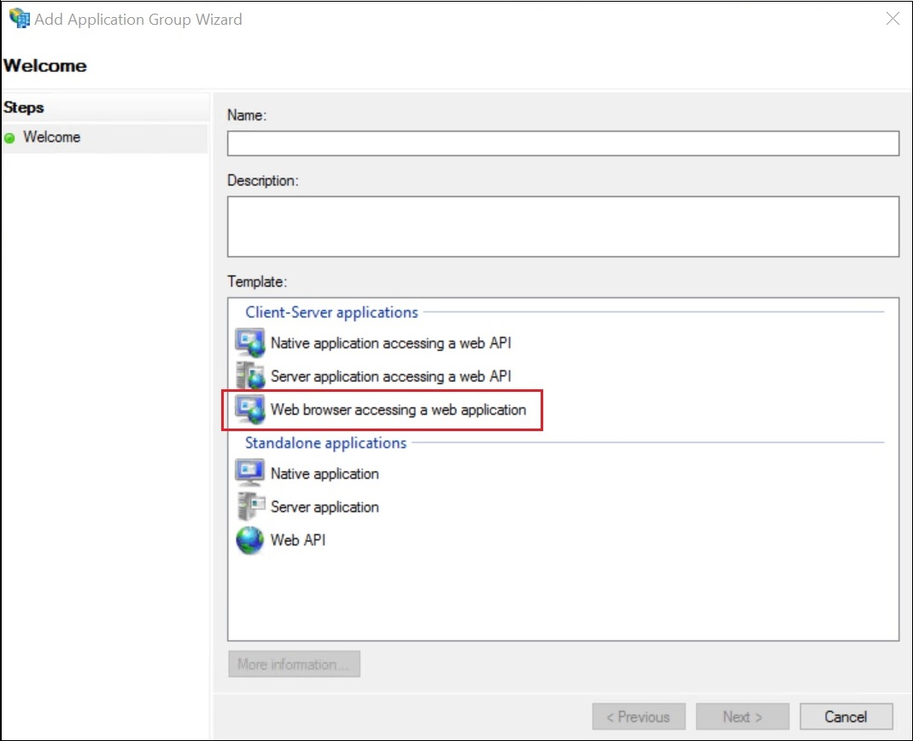
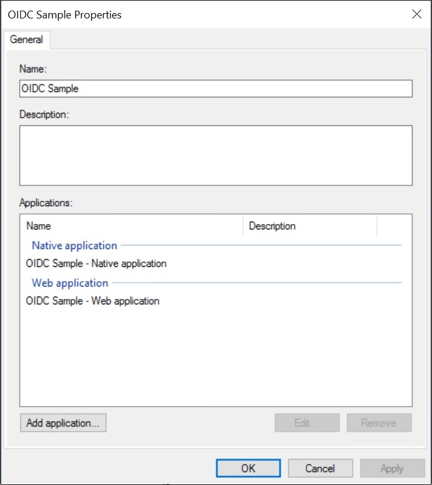
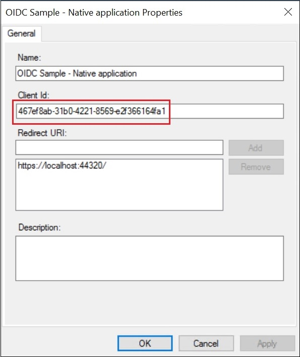
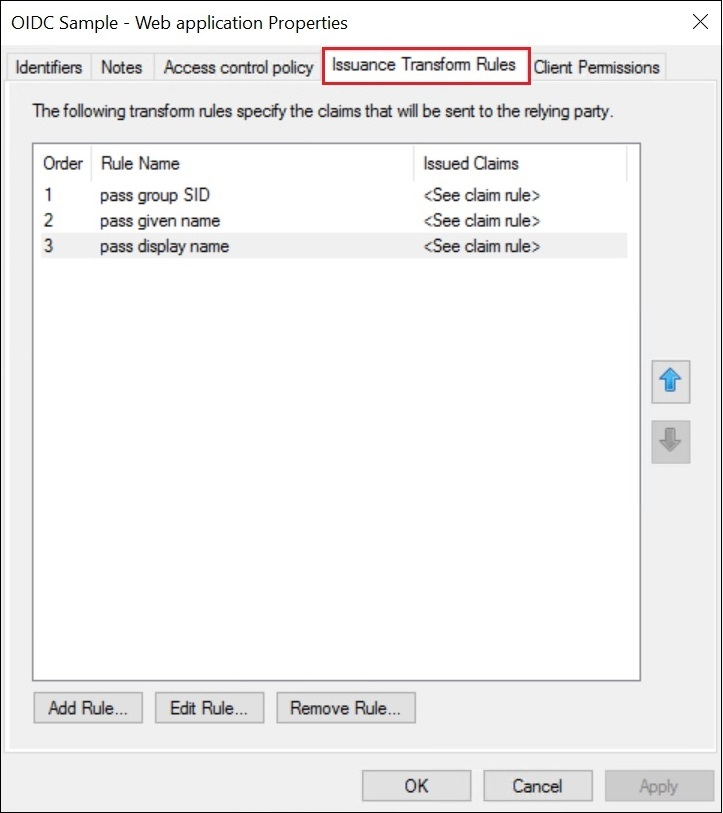

# Customizing Id_Token Claims with OpenId Connect in AD FS 2016

>Applies To: Windows Server 2016

The article [here](https://technet.microsoft.com/en-us/windows-server-docs/identity/ad-fs/development/enabling-openid-connect-with-ad-fs-2016) shows how to build an app that uses AD FS for OpenID Connect sign on.  However, by default there are only a fixed set of claims available in the id_token.
AD FS 2016 RTM has the capability to customize the id_token in OpenID Connect scenarios.

## Create the Application Group in AD FS 2016  
Create an application group based on the new template, shown below, called Web browser accessing a web application.

  

Behind the scenes, this template creates a native client and new app type called Web application, which is just a Web API with an Identifier (RPID) that matches the native client�s client ID.  This means the Web application is simultaneously client and resource, so you can assign issuance transform rules as you would with a Web API.

  

  

  

Using the Issuance transform rules tab on the Web application properties, create claim rules in the same way you would on a Web API or a Saml-P or Ws-Federation Relying Party Trust to pass, transform, and issue claims.

Then, using the same bit of code you have always used to access claims, you can see the additional claims that will become part of the id_token.

For example, in a .NET MVC sample app, open one of the controller files and enter code like the below:

        [Authorize]
        public ActionResult About()
        {

            ClaimsPrincipal cp = ClaimsPrincipal.Current;

            string userName = cp.FindFirst(ClaimTypes.GivenName).Value;
            ViewBag.Message = String.Format("Hello {0}!", userName);
            return View();

        }
