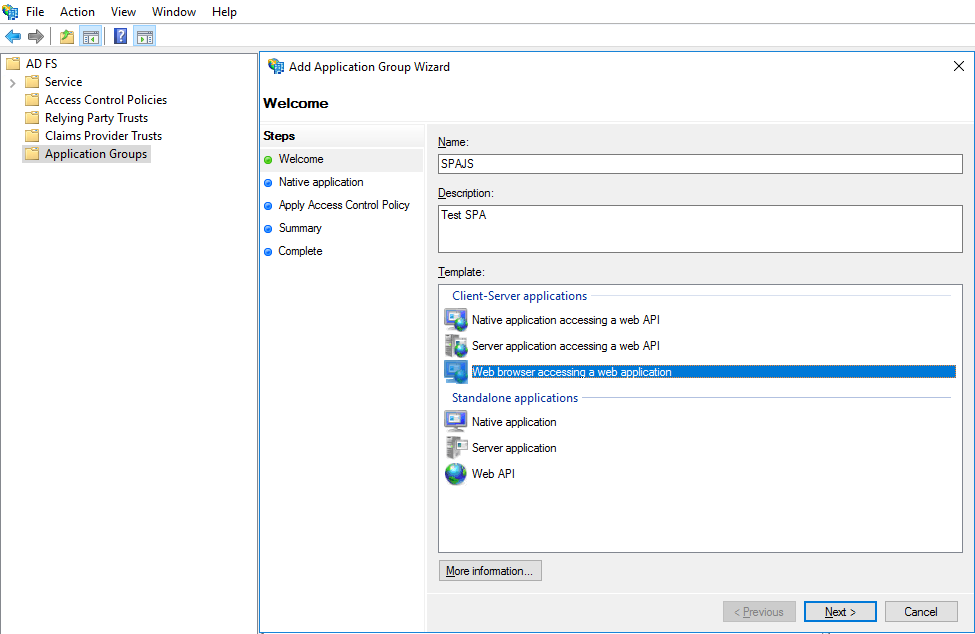
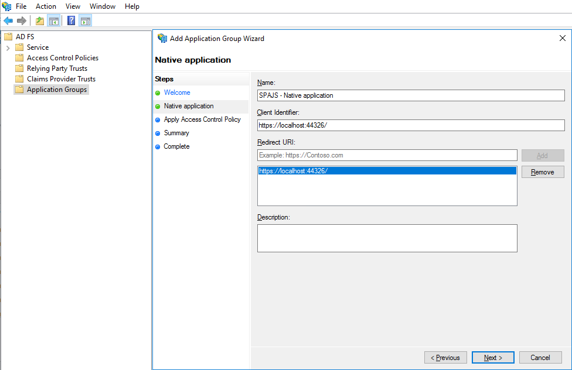
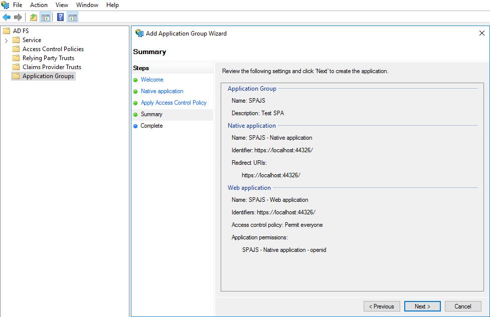

# Build a single page web application using OAuth and ADAL.JS with AD FS 2016 or later

This walkthrough provides instruction for authenticating against AD FS using ADAL for JavaScript securing an AngularJS based single page application, implemented with an ASP.NET Web API backend.

In this scenario, when the user signs in, the JavaScript front end uses [Active Directory Authentication Library for JavaScript (ADAL.JS)](https://github.com/AzureAD/azure-activedirectory-library-for-js) and the implicit authorization grant to obtain an ID token (id_token) from Azure AD. The token is cached and the client attaches it to the request as the bearer token when making calls to its Web API back end, which is secured using the OWIN middleware.

>[!IMPORTANT]
>The example that you can build here is for educational purposes only. These instructions are for the simplest, most minimal implementation possible to expose the required elements of the model. The example may not include all aspects of error handling and other relate functionality.

>[!NOTE]
>This walkthrough is applicable **only** to AD FS Server 2016 and later 

## Overview
In this sample we will be creating an authentication flow where a single page application client will be authenticating against AD FS to secure access to the WebAPI resources on the backend. Below is the overall authentication flow

When using a single page application, the user navigates to a starting location, from where starting page and a collection of JavaScript files and HTML views are loaded. You need to configure the Active Directory Authentication Library (ADAL) to know the critical information about your application, i.e. the AD FS instance, client ID, so that it can direct the authentication to your AD FS.

If ADAL sees a trigger for authentication, it uses the information provided by the application and directs the authentication to your AD FS STS.  The single page application, which is registered as a public client in AD FS, is automatically configured for implicit grant flow. The authorization request results in an ID token that is returned back to the application via a #fragment. Further calls to the backend WebAPI will carry this ID token as the bearer token in the header to gain access to the WebAPI.

## Setting up the development box
This walk-through uses Visual Studio 2015. The project uses ADAL JS library. To learn about ADAL please read [Active Directory Authentication Library .NET.](https://msdn.microsoft.com/library/azure/mt417579.aspx)

## Setting up the environment
For this walkthrough we will be using a basic setup of:

1.	DC: Domain controller for the domain in which AD FS will be hosted
2.	AD FS Server: The AD FS Server for the domain
3.	Development Machine: Machine where we have Visual Studio installed and will be developing our sample

You can, if you want, use only two machines. One for DC/AD FS and the other for developing the sample.

How to setup the domain controller and AD FS is beyond the scope of this article. For additional deployment information see:

- [AD DS Deployment](../../ad-ds/deploy/AD-DS-Deployment.md)
- [AD FS Deployment](../AD-FS-Deployment.md)

## Clone or download this repository
We will be using the sample application created for integrating Azure AD into an AngularJS single page app and modifying it to instead secure the backend resource by using AD FS.

From your shell or command line:

    git clone https://github.com/Azure-Samples/active-directory-angularjs-singlepageapp.git

## About the Code
The key files containing authentication logic are the following:

**App.js** - injects the ADAL module dependency, provides the app configuration values used by ADAL for driving protocol interactions with AAD and indicates which routes should not be accessed without previous authentication.

**index.html** - contains a reference to adal.js

**HomeController.js**- shows how to take advantage of the login() and logOut() methods in ADAL.

**UserDataController.js** - shows how to extract user information from the cached id_token.

**Startup.Auth.cs** - contains configuration for the WebAPI to use Active Directory Federation Service for bearer authentication.

## Registering the public client in AD FS
In the sample, the WebAPI is configured to listen at https://localhost:44326/. The application group **Web browser accessing a web application** can be used for configuring implicit grant flow application.

1. Open the AD FS management console and click on **Add Application Group**. In the **Add Application Group Wizard** enter the name of the application, description and select the **Web browser accessing a web application** template from the **Client-Server applications** section as shown below

    

2. On the next page **Native application**, provide the application client identifier and redirect URI as shown below

    

3. On the next page **Apply Access Control Policy** leave the permissions as *Permit everyone*

4. The summary page should look similar to below

    

5. Click on **Next** to complete the addition of the application group and close the wizard.

## Modifying the sample
Configure ADAL JS

Open the **app.js** file and change the **adalProvider.init** definition to:

	adalProvider.init(
        {
            instance: 'https://fs.contoso.com/', // your STS URL
            tenant: 'adfs',                      // this should be adfs
            clientId: 'https://localhost:44326/', // your client ID of the
            //cacheLocation: 'localStorage', // enable this for IE, as sessionStorage does not work for localhost.
        },
        $httpProvider
        );

|Configuration|Description|
|--------|--------|
|instance|Your STS URL, e.g. https://fs.contoso.com/|
|tenant|Keep it as 'adfs'|
|clientID|This is the client ID you specified while configuring the public client for your single page application|

## Configure WebAPI to use AD FS
Open the **Startup.Auth.cs** file in the sample and add the following at the beginning:

	using System.IdentityModel.Tokens;

remove:

                app.UseWindowsAzureActiveDirectoryBearerAuthentication(
    new WindowsAzureActiveDirectoryBearerAuthenticationOptions
    {
    Audience = ConfigurationManager.AppSettings["ida:Audience"],
    Tenant = ConfigurationManager.AppSettings["ida:Tenant"]
    });

and add:

    app.UseActiveDirectoryFederationServicesBearerAuthentication(
    new ActiveDirectoryFederationServicesBearerAuthenticationOptions
    {
    MetadataEndpoint = ConfigurationManager.AppSettings["ida:AdfsMetadataEndpoint"],
    TokenValidationParameters = new TokenValidationParameters()
    {
    ValidAudience = ConfigurationManager.AppSettings["ida:Audience"],
    ValidIssuer = ConfigurationManager.AppSettings["ida:Issuer"]
    }
    }
    );

|Parameter|Description|
|--------|--------|
|ValidAudience|This configures the value of 'audience' that will be checked against in the token|
|ValidIssuer|This configures the value of 'issuer that will be checked against in the token|
|MetadataEndpoint|This points to the metadata information of your STS|

## Add application configuration for AD FS
Change the appsettings as below:

    <appSettings>
    <add key="ida:Audience" value="https://localhost:44326/" />
    <add key="ida:AdfsMetadataEndpoint" value="https://fs.contoso.com/federationmetadata/2007-06/federationmetadata.xml" />
    <add key="ida:Issuer" value="https://fs.contoso.com/adfs" />
      </appSettings>

## Running the solution
Clean the solution, rebuild the solution and run it. If you want to see detailed traces, launch Fiddler and enable HTTPS decryption.

The browser (use Chrome browser) will load the SPA and you will be presented with the following screen:

Click on Login.  The ToDo List will trigger the authentication flow and ADAL JS will direct the authentication to AD FS

In Fiddler you can see the token being returned as part of the URL in the # fragment.

You will be able to now call the backend API to add ToDo List items for the logged-in user:

## Next Steps
[AD FS Development](../../ad-fs/AD-FS-Development.md)  
