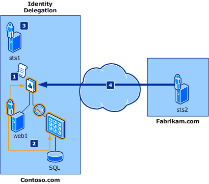

# Identity delegation scenario with AD FS


[Starting with the .NET Framework 4.5, Windows Identity Foundation (WIF) has been fully integrated into the .NET Framework. The version of WIF addressed by this topic, WIF 3.5, is deprecated and should only be used when developing against the .NET Framework 3.5 SP1 or the .NET Framework 4. For more information about WIF in the .NET Framework 4.5, also known as WIF 4.5, see the Windows Identity Foundation documentation in the .NET Framework 4.5 Development Guide.] 

This scenario describes an application that needs to access back-end resources that require the identity delegation chain to perform access control checks. A simple identity delegation chain usually consists of the information on the initial caller and the identity of the immediate caller.

With the Kerberos delegation model on the Windows platform today, the back-end resources have access only to the identity of the immediate caller and not to that of the initial caller. This model is commonly referred to as the trusted subsystem model. WIF maintains the identity of the initial caller as well as the immediate caller in the delegation chain using the Actor property.

The following diagram illustrates a typical identity delegation scenario in which a Fabrikam employee accesses resources exposed in a Contoso.com application.



The fictional users participating in this scenario are:

- Frank: A Fabrikam employee who wants to access Contoso resources.
- Daniel: A Contoso application developer who implements the necessary changes in the application.
- Adam: The Contoso IT administrator.

The components involved in this scenario are:

- web1: A Web application with links to back-end resources that require the delegated identity of the initial caller. This application is built with ASP.NET.
- A Web service that accesses a SQL Server, which requires the delegated identity of the initial caller, along with that of the immediate caller. This service is built with WCF.
- sts1: An STS that is in the role of claims provider, and emits claims that are expected by the application (web1). It has established trust with Fabrikam.com and also with the application.
- sts2: An STS that is in the role of identity provider for Fabrikam.com and provides an end point that the Fabrikam employee uses to authenticate. It has established trust with Contoso.com so that Fabrikam employees are allowed to access resources on Contoso.com.

>[!NOTE] 
>The term “ActAs token”, which is used often in this scenario, refers to a token that is issued by an STS and contains the user's identity. The Actor property contains the STS's identity.

As shown in the previous diagram, the flow in this scenario is:


1. The Contoso application is configured to obtain an ActAs token that contains both the Fabrikam employee's identity and the immediate caller's identity in the Actor property. Daniel has implemented these changes to the application.
2. The Contoso application is configured to pass the ActAs token to the back-end service. Daniel has implemented these changes to the application.
3. The Contoso Web service is configured to validate the ActAs token by calling sts1. Adam has enabled sts1 to process delegation requests.
4. Fabrikam user Frank accesses the Contoso application and is given access to the back-end resources.

## Set Up the Identity Provider (IP)

There are three options available for the Fabrikam.com administrator, Frank:


1. Purchase and install an STS product such as Active Directory® Federation Services (AD FS).
2. Subscribe to a cloud STS product such as LiveID STS.
3. Build a custom STS using WIF.

For this sample scenario, we assume that Frank selects option1 and installs AD FS as the IP-STS. He also configures an end point, named \windowsauth, to authenticate the users. By referring to the AD FS product documentation and talking to Adam, the Contoso IT administrator, Frank establishes trust with the Contoso.com domain.

## Set Up the Claims Provider

The options available for the Contoso.com administrator, Adam, are the same as described previously for the identity provider. For this sample scenario, we assume that Adam selects Option 1 and installs AD FS 2.0 as the RP-STS.

## Set Up Trust with the IP and Application

By referring to the AD FS documentation, Adam establishes trust between Fabrikam.com and the application.

## Set Up Delegation

AD FS provides delegation processing. By referring to the AD FS documentation, Adam enables the processing of ActAs tokens.

## Application-Specific Changes

The following changes must be made to add support for identity delegation to an existing application. Daniel uses WIF to make these changes.


- Cache the bootstrap token that web1 received from sts1.
- Use CreateChannelActingAs with the issued token to create a channel to the back-end Web service.
- Call the back-end service's method.

## Cache the Bootstrap Token

The bootstrap token is the initial token issued by the STS, and the application extracts claims from it. In this sample scenario, this token is issued by sts1 for the user Frank, and the application caches it. The following code sample shows how to retrieve a bootstrap token in a ASP.NET application:

```
// Get the Bootstrap Token
SecurityToken bootstrapToken = null;

IClaimsPrincipal claimsPrincipal = Thread.CurrentPrincipal as IClaimsPrincipal;
if ( claimsPrincipal != null )
{
    IClaimsIdentity claimsIdentity = (IClaimsIdentity)claimsPrincipal.Identity;
    bootstrapToken = claimsIdentity.BootstrapToken;
}
```
WIF provides a method, [CreateChannelActingAs](https://msdn.microsoft.com/library/ee733863.aspx), that creates a channel of the specified type that augments token issuance requests with the specified security token as an ActAs element. You can pass the bootstrap token to this method and then call the necessary service method on the returned channel. In this sample scenario, Frank's identity has the [Actor](https://msdn.microsoft.com/library/microsoft.identitymodel.claims.iclaimsidentity.actor.aspx) property set to web1's identity.

The following code snippet shows how to call to the Web service with [CreateChannelActingAs](https://msdn.microsoft.com/library/ee733863.aspx) and then call one of the service's methods, ComputeResponse, on the returned channel:

```
// Get the channel factory to the backend service from the application state
ChannelFactory<IService2Channel> factory = (ChannelFactory<IService2Channel>)Application[Global.CachedChannelFactory];

// Create and setup channel to talk to the backend service
IService2Channel channel;
lock (factory)
{
// Setup the ActAs to point to the caller's token so that we perform a 
// delegated call to the backend service
// on behalf of the original caller.
    channel = factory.CreateChannelActingAs<IService2Channel>(callerToken);
}

string retval = null;

// Call the backend service and handle the possible exceptions
try
{
    retval = channel.ComputeResponse(value);
    channel.Close();
} catch (Exception exception)
{
    StringBuilder sb = new StringBuilder();
    sb.AppendLine("An unexpected exception occurred.");
    sb.AppendLine(exception.StackTrace);
    channel.Abort();
    retval = sb.ToString();
}

```
## Web Service-Specific Changes

Since the Web service is built with WCF and enabled for WIF, once the binding is configured with IssuedSecurityTokenParameters with the proper Issuer address, the validation of the ActAs is automatically handled by WIF. 

The Web service exposes the specific methods needed by the application. There are no specific code changes needed on the service. The following code sample shows the configuration of the Web service with IssuedSecurityTokenParameters:

```
// Configure the issued token parameters with the correct settings
IssuedSecurityTokenParameters itp = new IssuedSecurityTokenParameters( "http://docs.oasis-open.org/wss/oasis-wss-saml-token-profile-1.1#SAMLV1.1" );
itp.IssuerMetadataAddress = new EndpointAddress( "http://localhost:6000/STS/mex" );
itp.IssuerAddress = new EndpointAddress( "http://localhost:6000/STS" );

// Create the security binding element
SecurityBindingElement sbe = SecurityBindingElement.CreateIssuedTokenForCertificateBindingElement( itp );
sbe.MessageSecurityVersion = MessageSecurityVersion.WSSecurity11WSTrust13WSSecureConversation13WSSecurityPolicy12BasicSecurityProfile10;

// Create the HTTP transport binding element
HttpTransportBindingElement httpBE = new HttpTransportBindingElement();

// Create the custom binding using the prepared binding elements
CustomBinding binding = new CustomBinding( sbe, httpBE );

using ( ServiceHost host = new ServiceHost( typeof( Service2 ), new Uri( "http://localhost:6002/Service2" ) ) )
{
    host.AddServiceEndpoint( typeof( IService2 ), binding, "" );
    host.Credentials.ServiceCertificate.SetCertificate( "CN=localhost", StoreLocation.LocalMachine, StoreName.My );

// Enable metadata generation via HTTP GET
    ServiceMetadataBehavior smb = new ServiceMetadataBehavior();
    smb.HttpGetEnabled = true;
    host.Description.Behaviors.Add( smb );
    host.AddServiceEndpoint( typeof( IMetadataExchange ), MetadataExchangeBindings.CreateMexHttpBinding(), "mex" );

// Configure the service host to use WIF
    ServiceConfiguration configuration = new ServiceConfiguration();
    configuration.IssuerNameRegistry = new TrustedIssuerNameRegistry();

    FederatedServiceCredentials.ConfigureServiceHost( host, configuration );

    host.Open();

    Console.WriteLine( "Service2 started, press ENTER to stop ..." );
    Console.ReadLine();

    host.Close();
}
```

## Next Steps
[AD FS Development](../../ad-fs/AD-FS-Development.md)  
