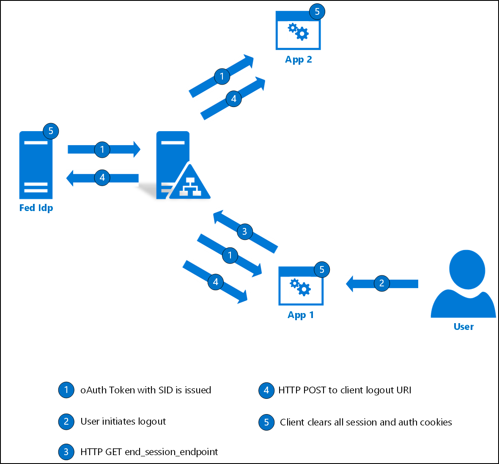

#  Single log-out for OpenID Connect with AD FS

## Overview
Building on the initial Oauth support in AD FS in Windows Server 2012 R2, AD FS 2016 introduced the support for OpenId Connect sign-on. With [KB4038801](https://support.microsoft.com/en-gb/help/4038801/windows-10-update-kb4038801), AD FS 2016 now supports single log-out for OpenId Connect scenarios. This article provides an overview of the single log-out for OpenId Connect scenario and provides guidance on how to use it for your OpenId Connect applications in AD FS.


## Discovery doc
OpenID Connect uses a JSON document called a "Discovery document" to provide details about configuration.  This includes URIs of the authentication, token, userinfo, and public-endpoints.  The following is an example of the discovery doc.

```
{
"issuer":"https://fs.fabidentity.com/adfs",
"authorization_endpoint":"https://fs.fabidentity.com/adfs/oauth2/authorize/",
"token_endpoint":"https://fs.fabidentity.com/adfs/oauth2/token/",
"jwks_uri":"https://fs.fabidentity.com/adfs/discovery/keys",
"token_endpoint_auth_methods_supported":["client_secret_post","client_secret_basic","private_key_jwt","windows_client_authentication"],
"response_types_supported":["code","id_token","code id_token","id_token token","code token","code id_token token"],
"response_modes_supported":["query","fragment","form_post"],
"grant_types_supported":["authorization_code","refresh_token","client_credentials","urn:ietf:params:oauth:grant-type:jwt-bearer","implicit","password","srv_challenge"],
"subject_types_supported":["pairwise"],
"scopes_supported":["allatclaims","email","user_impersonation","logon_cert","aza","profile","vpn_cert","winhello_cert","openid"],
"id_token_signing_alg_values_supported":["RS256"],
"token_endpoint_auth_signing_alg_values_supported":["RS256"],
"access_token_issuer":"http://fs.fabidentity.com/adfs/services/trust",
"claims_supported":["aud","iss","iat","exp","auth_time","nonce","at_hash","c_hash","sub","upn","unique_name","pwd_url","pwd_exp","sid"],
"microsoft_multi_refresh_token":true,
"userinfo_endpoint":"https://fs.fabidentity.com/adfs/userinfo",
"capabilities":[],
"end_session_endpoint":"https://fs.fabidentity.com/adfs/oauth2/logout",
"as_access_token_token_binding_supported":true,
"as_refresh_token_token_binding_supported":true,
"resource_access_token_token_binding_supported":true,
"op_id_token_token_binding_supported":true,
"rp_id_token_token_binding_supported":true,
"frontchannel_logout_supported":true,
"frontchannel_logout_session_supported":true
} 
 
```


The following additional values will be available in the discovery doc to indicate support for Front Channel Logout:

- frontchannel_logout_supported: value will be 'true'
- frontchannel_logout_session_supported: value will be 'true'.
- end_session_endpoint: this is the OAuth logout URI that the client can use to initiate logout on the server.


## AD FS server configuration
The AD FS property EnableOAuthLogout will be enabled by default.  This property tells the AD FS server to browse for the URL (LogoutURI) with the SID to initiate logout on the client. 
If you do not have [KB4038801](https://support.microsoft.com/en-gb/help/4038801/windows-10-update-kb4038801) installed you can use the following PowerShell command:

```PowerShell
Set-ADFSProperties -EnableOAuthLogout $true
```

>[!NOTE]
> `EnableOAuthLogout` parameter will be marked as obsolete after installing [KB4038801](https://support.microsoft.com/en-gb/help/4038801/windows-10-update-kb4038801). `EnableOAUthLogout` will always be true and will have no impact on the logout functionality.

>[!NOTE]
>frontchannel_logout is supported **only** after installtion of [KB4038801](https://support.microsoft.com/en-gb/help/4038801/windows-10-update-kb4038801)

## Client configuration
Client needs to implement a url which 'logs off' the logged in user. Administrator can configure the LogoutUri in the client configuration using the following PowerShell cmdlets. 


- `(Add | Set)-AdfsNativeApplication`
- `(Add | Set)-AdfsServerApplication`
- `(Add | Set)-AdfsClient`

```PowerShell
Set-AdfsClient -LogoutUri <url>
```

The `LogoutUri` is the url used by AF FS to "log off" the user. For implementing the `LogoutUri`, the client needs to ensure it clears the authentication state of the user in the application, for example, dropping the authentication tokens that it has. AD FS will browse to that URL, with the SID as the query parameter, signaling the relying party / application to log off the user. 




1.	**OAuth token with session ID**: AD FS includes session id in the OAuth token at the time of id_token token issuance. This will be used later by AD FS to identify the relevant SSO cookies to be cleaned up for the user.
2.	**User initiates logout on App1**: The user can initiate a logout from any of the logged in applications. In this example scenario, a user initiates a logout from App1.
3.	**Application sends logout request to AD FS**: After the user initiates logout, the application sends a GET request to end_session_endpoint of AD FS. The application can optionally include id_token_hint as a parameter to this request. If id_token_hint is present, AD FS will use it in conjunction with session ID to figure out which URI the client should be redirected to after logout (post_logout_redirect_uri).  The post_logout_redirect_uri should be a valid uri registered with AD FS using the RedirectUris parameter.
4.	**AD FS sends sign-out to logged-in clients**: AD FS uses the session identifier value to find the relevant clients the user is logged in to. The identified clients are sent request on the LogoutUri registered with AD FS to initiate a logout on the client side.

## FAQs
**Q:** I do not see the frontchannel_logout_supported and frontchannel_logout_session_supported parameters in the discovery doc.</br>
**A:** Ensure that you have [KB4038801](https://support.microsoft.com/en-gb/help/4038801/windows-10-update-kb4038801) installed on all the AD FS servers. Refer to Single log-out in Server 2016 with [KB4038801](https://support.microsoft.com/en-gb/help/4038801/windows-10-update-kb4038801).

**Q:** I have configured single logout as directed, but user stays logged-in on other clients.</br>
**A:** Ensure that `LogoutUri` is set for all the clients where the user is logged-in. Also, AD FS does a best-case attempt to send the sign-out request on the registered `LogoutUri`. Client must implement logic to handle the request and take action to sign-out the user from application.</br>

**Q:** If after logout, one of the clients goes back to AD FS with a valid refresh token, will AD FS issue an access token?</br>
**A:** Yes. It is the responsibility of the client application to drop all authenticated artifacts after a sign-out request was received at the registered `LogoutUri`.


## Next Steps
[AD FS Development](../../ad-fs/AD-FS-Development.md)  
