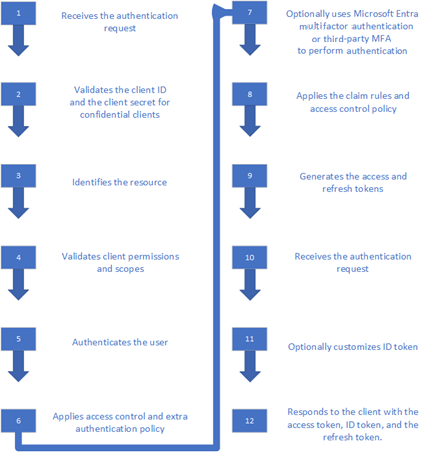

# AD FS OpenID Connect/OAuth Concepts
Applies to AD FS 2016 and later
 
## Modern Authentication Actors 

|Actor| Description|
|-----|-----|
|End User|This is the security principal (users, applications, services and groups) who needs to access the resource.|  
|Client|This is your web application, identified by its client ID. The client is usually the party that the end user interacts with, and it requests tokens from the authorization server.
|Authorization Server / Identity Provider (IdP)| This is your AD FS server. It is responsible for verifying the identity of security principals that exist in an organization's directory. It issues security tokens (bearer access token, ID token, refresh token) upon successful authentication of those security principals.
|Resource Server / Resource Provider / Relying Party| This is where the resource or data resides. It trusts the Authorization Server to securely authenticate and authorize the Client and uses Bearer access tokens to ensure that access to a resource can be granted.

Following diagram provides the most basic relationship between the actors:


## Application Types 
 

|Application Type|Description|Role|
|-----|-----|-----|
|Native application|Sometimes called a **public client**, this is intended to be a client app that runs on a pc or device and with which the user interacts.|Requests tokens from the authorization server (AD FS) for user access to resources. Sends HTTP requests to protected resources, using the tokens as HTTP headers.| 
|Server application (Web app)|A web application that runs on a server and is generally accessible to users via a browser. Because it is capable of maintaining its own client 'secret' or credential, it is sometimes called a **confidential client**. |Requests tokens from the authorization server (AD FS) for user access to resources. Before requesting token, client (Web App) needs to authenticate using its secret. | 
|Web API|The end resource the user is accessing. Think of these as the new representation of "relying parties".|Consumes bearer access tokens obtained by the clients| 

## Application Group 
 
Every OAuth client (native or web app) or resource (web api) configured with AD FS needs to be associated with an application group. The clients in an application group can be configured to access the resources in the same group. An application group can contain multiple clients and resources.  

## Security Tokens 
 
Modern authentication uses following token types: 
- **id_token**: A JWT token issued by authorization server (AD FS) and consumed by the client. Claims in the ID token will contain information about the user so that client can use that.  
- **access_token**: A JWT token issued by authorization server (AD FS) and intended to be consumed by the resource. The 'aud' or audience claim of this token must match the identifier of the resource or Web API.  
- **refresh_token**: This is token issued by AD FS for client to use when it needs to refresh the id_token and access_token. The token is opaque to the client and can only be consumed by AD FS.  

## Scopes 
 
While registering a resource in AD FS, scopes can be configured to allow AD FS to perform specific actions. In addition to configuring the scope, the scope value is also required to be sent in the request for AD FS to perform the action. For e.g., Admin needs to configure scope as openid during resource registration and application (client) needs to send scope = openid in the auth request for AD FS to issue ID Token. Details on the scopes available in AD FS are provided below 
 
- aza - If using [OAuth 2.0 Protocol Extensions for Broker Clients](https://docs.microsoft.com/openspecs/windows_protocols/ms-oapxbc/2f7d8875-0383-4058-956d-2fb216b44706) and if the scope parameter contains the scope "aza", the server issues a new primary refresh token and sets it in the refresh_token field of the response, as well as setting the refresh_token_expires_in field to the lifetime of the new primary refresh token if one is enforced. 
- openid - Allows application to request use of the OpenID Connect authorization protocol. 
- logon_cert - The logon_cert scope allows an application to request logon certificates, which can be used to interactively logon authenticated users. The AD FS server omits the access_token parameter from the response and instead provides a base64-encoded CMS certificate chain or a CMC full PKI response. More details available [here](https://docs.microsoft.com/openspecs/windows_protocols/ms-oapx/32ce8878-7d33-4c02-818b-6c9164cc731e).
- user_impersonation - The user_impersonation scope is necessary to successfully request an on-behalf-of access token from AD FS. For details on how to use this scope refer to [Build a multi-tiered application using On-Behalf-Of (OBO) using OAuth with AD FS 2016](ad-fs-on-behalf-of-authentication-in-windows-server.md). 
- allatclaims – The allatclaims scope allows the application to request claims in access token to be added in the ID Token as well.   
- vpn_cert - The vpn_cert scope allows an application to request VPN certificates, which can be used to establish VPN connections using EAP-TLS authentication. This is not supported anymore. 
- email - Allows application to request email claim for the signed in user.  
- profile - Allows application to request profile related claims for the sign-in user.  

## Claims 
 
Security tokens (access and ID tokens) issued by AD FS contain claims, or assertions of information about the subject that has been authenticated. Applications can use claims for various tasks, including: 
- Validate the token 
- Identify the subject's directory tenant 
- Display user information 
- Determine the subject's authorization 
The claims present in any given security token are dependent upon the type of token, the type of credential used to authenticate the user, and the application configuration.  
 
## High level AD FS authentication flow 




 1. AD FS receives auth request from the client.  
 
 2.	AD FS validates the client ID in the auth request with the client ID obtained during client and resource registration in AD FS. If using confidential client, then AD FS also validates the client secret provided in the auth request. AD FS also validate the redirect uri of the Client. 
 
 3.	AD FS identifies the resource which the client wants to access through the resource parameter passed in the auth request. If using MSAL client library, then resource parameter is not sent. Instead the resource url is sent as a part of the scope parameter: *scope = [resource url]//[scope values e.g., openid]*. 

    If resource is not passed using resource or scope parameter, ADFS will use a default resource urn:microsoft:userinfo whose polices (e.g.,MFA, Issuance or authorization policy) can't be configured. 
 
 4.	Next AD FS validates whether client has the permissions to access the resource. AD FS also validates whether the scopes passed in the auth request matches the scopes configured while registering the resource. If the client doesn't have the permissions or the right scopes are not sent in the auth request the auth flow is terminated.   
 
 5.	Once permissions and scopes are validated, AD FS authenticates the user using the configured [authentication method](../operations/configure-authentication-policies.md).   

 6.	If [additional authentication method](../operations/configure-additional-authentication-methods-for-ad-fs.md) is required as per the resource policy or the global auth policy, AD FS triggers the additional authentication. 

 7. AD FS uses [Azure MFA](../operations/configure-ad-fs-and-azure-mfa.md) or [3rd party MFA](../operations/additional-authentication-methods-ad-fs.md) to perform authentication.   
 
 8.	Once user is authenticated, AD FS applies the [claim rules](../deployment/configuring-claim-rules.md) (determines the claims sent to resource as a part of the security tokens) and [access control polices](../operations/ad-fs-client-access-policies.md) (determines that user has met the required conditions to access the resource).   

 9.	Next, AD FS generates the Access and Refresh Tokens.. 

 10. AD FS also generates the ID token. 
 
 11. If the scope = allatclaims is included in the auth request, [ID token is customized](custom-id-tokens-in-ad-fs.md) to include claims in the access token based on the defined claim rules. 
    
 12. Once the required tokens are generated and customized, AD FS responds to the client including the tokens. Only if the auth request includes scope = openid, ID token is included in the response. Client can always obtain the ID token post authentication using the token endpoint. 

## Types of libraries 
  
Two types of libraries are used with AD FS: 
- **Client libraries**: Native clients and server apps use client libraries to acquire access tokens for calling a resource such as a Web API. Microsoft Authentication Library (MSAL) is the latest and recommended client library when using AD FS 2019. Active Directory Authentication Library (ADAL) is recommended for AD FS 2016.  

- **Server middleware libraries**: Web apps use server middleware libraries for user sign in. Web APIs use server middleware libraries to validate tokens that are sent by native clients or by other servers. OWIN (Open Web Interface for .NET) is the recommended middleware library. 

## Customize ID Token (additional claims in ID Token)
 
In certain scenarios it is possible that the Web app (client) needs additional claims in an ID token to help in the functionality. This can be achieved by using one of the following options. 

**Option 1:** Should be used when using a public client and web app does not have a resource that it is trying to access. The option requires 
1.	response_mode set as form_post 
2.	Relying party identifier (Web API identifier) is same as client identifier


**Option 2:** Should be used when web app has a resource that it is trying to access and needs to pass additional claims through ID token. Both public and confidential clients can be used. The option requires 
1.	response_mode set as form_post 
2.	KB4019472 is installed on your AD FS servers 
3.	Scope allatclaims assigned to the client – RP pair. You can assign the scope by using the Grant-ADFSApplicationPermission (Use Set-AdfsApplicationPermission if already granted once) PowerShell cmdlet as indicated in the example below: 

    ``` powershell
    Grant-AdfsApplicationPermission -ClientRoleIdentifier "https://my/privateclient" -ServerRoleIdentifier "https://rp/fedpassive" -ScopeNames "allatclaims","openid"
    ```


To better understand how to configure a Web App in ADFS to acquire customized ID token see [Customize claims to be emitted in id_token when using OpenID Connect or OAuth with AD FS 2016 or later](Custom-Id-Tokens-in-AD-FS.md).

## Single log-out

Single logout results in ending all the client sessions using the session id. AD FS 2016 and later supports single log-out for OpenID Connect/OAuth. For more details see [Single log-out for OpenID Connect with AD FS](ad-fs-logout-openid-connect.md).


## AD FS Endpoints

|AD FS Endpoint|Description|
|-----|-----|
|/authorize|AD FS returns an authorization code which can be used to obtain the access token|
|/token|AD FS returns an access token which can be used to access the resource (Web API)|
|/userinfo|AD FS returns claims about the authenticated user|
|/devicecode|AD FS returns the device code and user code|
|/logout|AD FS logs out the user|
|/keys|AD FS public keys used to sign responses|
|/.well-known/openid-configuration|AD FS returns OAuth/OpenID Connect metadata|
