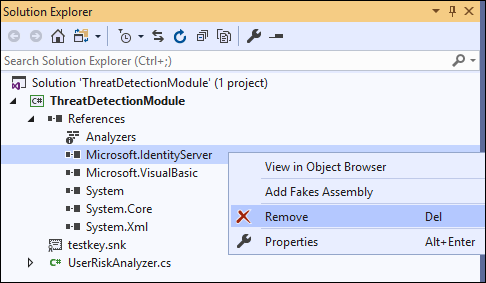
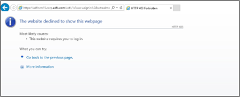

# Build Plug-ins with AD FS 2019 Risk Assessment Model

You can now build your own plug-ins to block or assign a risk score to authentication requests during various stages – request received, pre-authentication and post-authentication. This can be accomplished using the new Risk Assessment Model introduced with AD FS 2019. 

## What is the Risk Assessment Model?

The Risk Assessment Model is a set of interfaces and classes which enable developers to read authentication request headers and implement their own risk assessment logic. The implemented code (plug-in) then runs in line with AD FS authentication process. For eg, using the interfaces and classes included with the model, you can implement code to either block or allow authentication request based on the client IP address included in the request header. AD FS will execute the code for each authentication request and take appropriate action as per the implemented logic. 

The model allows to plug-in code at any of three stages of AD FS authentication pipeline as shown below


1.	**Request Received Stage** – Enables building plug-ins to allow or block request when AD FS receives the authentication request i.e. before user enters credentials. You can use the request context (eg, client IP, Http method, proxy server DNS, etc.) available at this stage to perform the risk assessment. For eg, you can build a plug-in to read the IP from the request context and block the authentication request if the IP is in the pre-defined list of risky IPs. 

2.	**Pre-Authentication Stage** – Enables building plug-ins to allow or block request at the point where user provides the credentials but before AD FS evaluates them. At this stage, in addition to the request context you also have information on the security context (eg, user token, user identifier, etc) and the protocol context (eg, authentication protocol, clientid, resourceid, etc) to use in your risk assessment logic. For eg, you can build a plug-in to prevent password spray attacks by reading the user password from the user token and blocking the authentication request if the password is in the pre-defined list of risky passwords. 

3.	**Post-Authentication** – Enables building plug-in to assess risk after user has provided credentials and AD FS has performed authentication. At this stage, in addition to the request context, security context, and protocol context, you also have information on the authentication result (Success or Failure). The plug-in can evaluate the risk score based on the available information and pass the risk score to claim and policy rules for further evaluation. 

To better understand how to build a risk assessment plug-in and run it in line with AD FS process, let's build a sample plug-in that blocks the requests coming from certain **extranet** IPs identified as risky, register the plug-in with AD FS and finally test the functionality. 

>[!NOTE]
>This walkthrough is only to show you how you can create a sample plug-in. By no means is the solution we are creating an enterprise ready solution.  

## Building a sample plug-in

### Pre-requisites
Following is the list of pre-requisites required to build this sample plug-in

- AD FS 2019 installed and configured
- .NET Framework 4.7 and above
- Visual Studio

### Build plug-in dll
The following procedure will walk you through building a sample plug-in dll.

1. Download the sample plug-in, use Git Bash and type the following: 

   ```
   git clone https://github.com/Microsoft/adfs-sample-RiskAssessmentModel-RiskyIPBlock
   ```

2. Create a **.csv** file at any location on your AD FS server (In my case, I created the **authconfigdb.csv** file at **C:\extensions**) and add the IPs you want to block to this file. 

   The sample plug-in will block any authentication requests coming from the **Extranet IPs** listed in this file. 

   >{!NOTE]
   > If you have an AD FS Farm, you can create the file on any or all the AD FS servers. Any of the files can be used to import the risky IPs into AD FS. We will discuss the import process in detail in the [Register the plug-in dll with AD FS](#register-the-plug-in-dll-with-ad-fs) section below. 

3. Open the project `ThreatDetectionModule.sln` using Visual Studio

4. Remove the `Microsoft.IdentityServer.dll` from the Solutions Explorer as shown below:</br>
   

5. Add reference to the `Microsoft.IdentityServer.dll` of your AD FS as shown below

   a.	Right click on **References** in **Solutions Explorer** and select **Add Reference…**</br> 
   
   
   b.	On the **Reference Manager** window select **Browse**. In the **Select the files to reference…** dialogue, select `Microsoft.IdentityServer.dll` from your AD FS installation folder (in my case **C:\Windows\ADFS**) and click **Add**.
   
   >[!NOTE]
   >In my case I am building the plug-in on the AD FS server itself. If your development environment is on a different server, copy the `Microsoft.IdentityServer.dll` from your AD FS installation folder on AD FS server on to your development box.</br> 
   
   
   
   c.	Click **OK** on the **Reference Manager** window after making sure `Microsoft.IdentityServer.dll` checkbox is selected</br>
   
 
6. All the classes and references are now in place to do a build.   However, since the output of this project is a dll,  it will have to be installed into the **Global Assembly Cache**, or GAC, of the AD FS server and the dll needs to be signed first. This can be done as follows:

   a.	**Right-click** on the name of the project, ThreatDetectionModule. From the menu, click **Properties**.</br>
   
   
   b.	From the **Properties** page, click **Signing**, on the left, and then check the checkbox marked **Sign the assembly**. From the **Choose a strong name key file**: pull down menu, select **<New...>**</br>
   

   c.	In the **Create Strong Name Key dialogue**, type a name (you can choose any name) for the key, uncheck the checkbox **Protect my key file with password**. Then, click **OK**.
   </br>
 
   d.	Save the project as shown below</br>
   

7. Build the project by clicking **Build** and then **Rebuild Solution** as shown below</br>
   
 
   Check the **Output window**, at the bottom of the screen, to see if any errors occurred</br>
   


The plug-in (dll) is now ready for use and is in the **\bin\Debug** folder of the project folder (In my case, that's **C:\extensions\ThreatDetectionModule\bin\Debug\ThreatDetectionModule.dll**). 

The next step is to register this dll with AD FS, so it runs in line with AD FS authentication process. 

### Register the plug-in dll with AD FS

We need to register the dll in AD FS by using the `Register-AdfsThreatDetectionModule` PowerShell command on the AD FS server, however, before we register, we need to get the Public Key Token. This public key token was created when we created the key and signed the dll using that key. To learn what the Public Key Token for the dll is, you can use the **SN.exe** as follows

1. Copy the dll file from the **\bin\Debug** folder to another location (In my case copying it to **C:\extensions**)

2. Start the **Developer Command Prompt** for Visual Studio and go to the directory containing the **sn.exe** (In my case the directory is **C:\Program Files (x86)\Microsoft SDKs\Windows\v10.0A\bin\NETFX 4.7.2 Tools**)
   

3. Run the **SN** command with the **-T** parameter and the location of the file (In my case `SN -T “C:\extensions\ThreatDetectionModule.dll”`)
   </br>
   The command will provide you the public key token (For me, the **Public Key Token is 714697626ef96b35**)

4. Add the dll to the **Global Assembly Cache** of the AD FS server
   Our best practice would be that you create a proper installer for your project and use the installer to add the file to the GAC. Another solution is to use **Gacutil.exe** (more information on **Gacutil.exe** available [here](https://docs.microsoft.com/dotnet/framework/tools/gacutil-exe-gac-tool)) on your development machine.  Since I have my visual studio on the same server as AD FS, I will be using **Gacutil.exe** as follows

   a.	On Developer Command Prompt for Visual Studio and go to the directory containing the **Gacutil.exe** (In my case the directory is **C:\Program Files (x86)\Microsoft SDKs\Windows\v10.0A\bin\NETFX 4.7.2 Tools**)

   b.	Run the **Gacutil** command (In my case `Gacutil /IF C:\extensions\ThreatDetectionModule.dll`)
   
 
   >[!NOTE]
   >If you have an AD FS farm, the above needs to be executed on each AD FS server in the farm. 

5. Open **Windows PowerShell** and run the following command to register the dll
   ```
   Register-AdfsThreatDetectionModule -Name "<Add a name>" -TypeName "<class name that implements interface>, <dll name>, Version=10.0.0.0, Culture=neutral, PublicKeyToken=< Add the Public Key Token from Step 2. above>" -ConfigurationFilePath "<path of the .csv file>”
   ```
   In my case, the command is: 
   ```
   Register-AdfsThreatDetectionModule -Name "IPBlockPlugin" -TypeName "ThreatDetectionModule.UserRiskAnalyzer, ThreatDetectionModule, Version=10.0.0.0, Culture=neutral, PublicKeyToken=714697626ef96b35" -ConfigurationFilePath "C:\extensions\authconfigdb.csv”
   ```
 
   >[!NOTE]
   >You need to register the dll only once, even if you have an AD FS farm. 

6. Restart the AD FS service after registering the dll

That's it, the dll is now registered with AD FS and ready for use!

 >[!NOTE]
 > If any changes are made to the plugin and the project is rebuilt, then the updated dll needs to be registered again. Before registering, you will need to unregister the current dll using the following command:</br></br>
 >`
  UnRegister-AdfsThreatDetectionModule -Name "<name used while registering the dll in 5. above>"
 >`</br></br> 
 >In my case, the command is:
 >``` 
 >UnRegister-AdfsThreatDetectionModule -Name "IPBlockPlugin"
 >```

### Testing the plug-in

1. Open the **authconfig.csv** file we created earlier (in my case at location **C:\extensions**) and add the **Extranet IPs** you want to block. Every IP should be on a separate line and there should be no spaces at the end</br>
   
 
2. Save and close the file

3. Import the updated file in AD FS by running the following PowerShell command 

   ```
   Import-AdfsThreatDetectionModuleConfiguration -name "<name given while registering the dll>" -ConfigurationFilePath "<path of the .csv file>"
   ```
 
   In my case, the command is: 
   ```
   Import-AdfsThreatDetectionModuleConfiguration -name "IPBlockPlugin" -ConfigurationFilePath "C:\extensions\authconfigdb.csv")
   ```
 
4. Initiate authentication request from the server with the same IP you added in **authconfig.csv**.

   For this demonstration, I will be using [AD FS Help Claims X-Ray tool](https://adfshelp.microsoft.com/ClaimsXray/TokenRequest) to initiate a request. If you would like to use the X-Ray tool, please follow the instructions 

   Enter federation server instance and hit **Test Authentication** button.</br> 
    

5. Authentication is blocked as shown below.</br>
   
 
Now that we know how to build and register the plug-in, let's walkthrough the plug-in code to understand the implementation using the new interfaces and classes introduced with the model. 

## Plug-in code walkthrough

Open the project `ThreatDetectionModule.sln` using Visual Studio and then open the main file **UserRiskAnalyzer.cs** from the **Solutions Explorer** on the right of the screen</br>

 
The file contains the main class UserRiskAnalyzer which implements the abstract class [ThreatDetectionModule](https://docs.microsoft.com/dotnet/api/microsoft.identityserver.public.threatdetectionframework.threatdetectionmodule?view=adfs-2019) and interface [IRequestReceivedThreatDetectionModule](https://docs.microsoft.com/dotnet/api/microsoft.identityserver.public.threatdetectionframework.irequestreceivedthreatdetectionmodule?view=adfs-2019) to read the IP from the request context, compare the obtained IP with the IPs loaded from AD FS DB, and block request if there is an IP match. Let's go over these types in more detail

### ThreatDetectionModule abstract class

This abstract class loads the plug-in into AD FS pipeline making it possible to run the plug-in code in line with AD FS process. 

```
public abstract class ThreatDetectionModule 
{ 
    protected ThreatDetectionModule(); 
 
    public abstract string VendorName { get; } 
    public abstract string ModuleIdentifier { get; } 
 
 public abstract void OnAuthenticationPipelineLoad(ThreatDetectionLogger logger, ThreatDetectionModuleConfiguration configData); 
 public abstract void OnAuthenticationPipelineUnload(ThreatDetectionLogger logger); 
  public abstract void OnConfigurationUpdate(ThreatDetectionLogger logger, ThreatDetectionModuleConfiguration configData); 
 }   
```
The class includes following methods and properties.

|Method |Type|Definition|
|-----|-----|-----| 
|[OnAuthenticationPipelineLoad](https://docs.microsoft.com/dotnet/api/microsoft.identityserver.public.threatdetectionframework.threatdetectionmodule.onauthenticationpipelineload?view=adfs-2019) |Void|Called by AD FS when the plugin is loaded into its pipeline| 
|[OnAuthenticationPipelineUnload](https://docs.microsoft.com/dotnet/api/microsoft.identityserver.public.threatdetectionframework.threatdetectionmodule.onauthenticationpipelineunload?view=adfs-2019) |Void|Called by AD FS when the plugin is unloaded from its pipeline| 
|[OnConfigurationUpdate](https://docs.microsoft.com/dotnet/api/microsoft.identityserver.public.threatdetectionframework.threatdetectionmodule.onconfigurationupdate?view=adfs-2019)| Void|Called by AD FS on config update |
|**Property** |**Type** |**Definition**|
|[VendorName](https://docs.microsoft.com/dotnet/api/microsoft.identityserver.public.threatdetectionframework.threatdetectionmodule.vendorname?view=adfs-2019)|String |Gets the name of the vendor owning the plugin|
|[ModuleIdentifier](https://docs.microsoft.com/dotnet/api/microsoft.identityserver.public.threatdetectionframework.threatdetectionmodule.moduleidentifier?view=adfs-2019)|String |Gets the identifier of the plugin|

In our sample plugin, we are using [OnAuthenticationPipelineLoad](https://docs.microsoft.com/dotnet/api/microsoft.identityserver.public.threatdetectionframework.threatdetectionmodule.onauthenticationpipelineload?view=adfs-2019) and [OnConfigurationUpdate](https://docs.microsoft.com/dotnet/api/microsoft.identityserver.public.threatdetectionframework.threatdetectionmodule.onconfigurationupdate?view=adfs-2019) methods to read the pre-defined IPs from AD FS DB. [OnAuthenticationPipelineLoad](https://docs.microsoft.com/dotnet/api/microsoft.identityserver.public.threatdetectionframework.threatdetectionmodule.onauthenticationpipelineload?view=adfs-2019) is called when plug-in is registered with AD FS while [OnConfigurationUpdate](https://docs.microsoft.com/dotnet/api/microsoft.identityserver.public.threatdetectionframework.threatdetectionmodule.onconfigurationupdate?view=adfs-2019) is called when the .csv is imported using the `Import-AdfsThreatDetectionModuleConfiguration` cmdlet. 

#### IRequestReceivedThreatDetectionModule Interface

This [interface](https://docs.microsoft.com/dotnet/api/microsoft.identityserver.public.threatdetectionframework.irequestreceivedthreatdetectionmodule?view=adfs-2019) enables you to implement risk assessment at the point where AD FS receives the authentication request but before user enters credentials i.e. at Received Request stage of the authentication process. 
 
```
public interface IRequestReceivedThreatDetectionModule
{
Task<ThrottleStatus> EvaluateRequest (
ThreatDetectionLogger logger, 
RequestContext requestContext );
}
```

The interface includes [EvaluateRequest](https://docs.microsoft.com/dotnet/api/microsoft.identityserver.public.threatdetectionframework.irequestreceivedthreatdetectionmodule.evaluaterequest?view=adfs-2019) method which allows you to use the context of the authentication request passed in the requestContext input parameter to write your risk assessment logic. The requestContext parameter is of type [RequestContext](https://docs.microsoft.com/dotnet/api/microsoft.identityserver.public.threatdetectionframework.requestcontext?view=adfs-2019). 

The other input parameter passed is logger which is type [ThreatDetectionLogger](https://docs.microsoft.com/dotnet/api/microsoft.identityserver.public.threatdetectionframework.threatdetectionlogger?view=adfs-2019). The parameter can be used to write the error, audit and/or debug messages to AD FS logs. 

The method returns [ThrottleStatus](https://docs.microsoft.com/dotnet/api/microsoft.identityserver.public.threatdetectionframework.throttlestatus?view=adfs-2019) (0 if NotEvaluated, 1 to Block, and 2 to Allow) to AD FS which then either blocks or allows the request.

In our sample plug-in, [EvaluateRequest](https://docs.microsoft.com/dotnet/api/microsoft.identityserver.public.threatdetectionframework.irequestreceivedthreatdetectionmodule.evaluaterequest?view=adfs-2019) method implementation parses the [clientIpAddress](https://docs.microsoft.com/dotnet/api/microsoft.identityserver.public.threatdetectionframework.requestcontext.clientipaddresses?view=adfs-2019#Microsoft_IdentityServer_Public_ThreatDetectionFramework_RequestContext_ClientIpAddresses) from the [requestContext](https://docs.microsoft.com/dotnet/api/microsoft.identityserver.public.threatdetectionframework.requestcontext?view=adfs-2019) parameter and compares it with all the IPs loaded from the AD FS DB. If a match is found, method returns 2 for **Block**, else it returns 1 for **Allow**. Based on the returned value, AD FS either blocks or allows the request. 

>[!NOTE]
>The sample plug-in discussed above implements only IRequestReceivedThreatDetectionModule interface. However, the risk assessment model provides two additional interfaces –IPreAuthenticationThreatDetectionModule (to implement risk assessment logic duing pre-authentication stage) and IPostAuthenticationThreatDetectionModule (to implement risk assessment logic during post-authentication stage). The details on the two interfaces are provided below. 

#### IPreAuthenticationThreatDetectionModule Interface 

This [interface](https://docs.microsoft.com/dotnet/api/microsoft.identityserver.public.threatdetectionframework.ipreauthenticationthreatdetectionmodule?view=adfs-2019) enables you to implement risk assessment logic at the point where user provides the credentials but before AD FS evaluates them i.e. pre-authentication stage. 

```
public interface IPreAuthenticationThreatDetectionModule
{
Task<ThrottleStatus> EvaluatePreAuthentication (
ThreatDetectionLogger logger, 
RequestContext requestContext, 
SecurityContext securityContext, 
ProtocolContext protocolContext, 
IList<Claim> additionalClams
);
}
```
The interface includes [EvaluatePreAuthentication](https://docs.microsoft.com/dotnet/api/microsoft.identityserver.public.threatdetectionframework.ipreauthenticationthreatdetectionmodule.evaluatepreauthentication?view=adfs-2019) method which allows you to use the information passed in the [RequestContext requestContext](https://docs.microsoft.com/dotnet/api/microsoft.identityserver.public.threatdetectionframework.requestcontext?view=adfs-2019), [SecurityContext securityContext](https://docs.microsoft.com/dotnet/api/microsoft.identityserver.public.threatdetectionframework.securitycontext?view=adfs-2019), [ProtocolContext protocolContext](https://docs.microsoft.com/dotnet/api/microsoft.identityserver.public.threatdetectionframework.protocolcontext?view=adfs-2019), and [IList<Claim> additionalClams](https://docs.microsoft.com/dotnet/api/system.collections.generic.ilist-1?view=netframework-4.7.2) input parameters to write your pre-authentication risk assessment logic. 

>[!NOTE]
>For list of properties passed with each context type, visit [RequestContext](https://docs.microsoft.com/dotnet/api/microsoft.identityserver.public.threatdetectionframework.requestcontext?view=adfs-2019), [SecurityContext](https://docs.microsoft.com/dotnet/api/microsoft.identityserver.public.threatdetectionframework.securitycontext?view=adfs-2019), and [ProtocolContext](https://docs.microsoft.com/dotnet/api/microsoft.identityserver.public.threatdetectionframework.protocolcontext?view=adfs-2019) class definitions. 

The other input parameter passed is logger which is type [ThreatDetectionLogger](https://docs.microsoft.com/dotnet/api/microsoft.identityserver.public.threatdetectionframework.threatdetectionlogger?view=adfs-2019). The parameter can be used to write the error, audit and/or debug messages to AD FS logs.

The method returns [ThrottleStatus](https://docs.microsoft.com/dotnet/api/microsoft.identityserver.public.threatdetectionframework.throttlestatus?view=adfs-2019) (0 if NotEvaluated, 1 to Block, and 2 to Allow) to AD FS which then either blocks or allows the request. 

#### IPostAuthenticationThreatDetectionModule Interface

This [interface](https://docs.microsoft.com/dotnet/api/microsoft.identityserver.public.threatdetectionframework.ipostauthenticationthreatdetectionmodule?view=adfs-2019) enables you to implement risk assessment logic after user has provided credentials and AD FS has performed authentication i.e. post-authentication stage. 

```
public interface IPostAuthenticationThreatDetectionModule
{
Task<RiskScore> EvaluatePostAuthentication (
ThreatDetectionLogger logger, 
RequestContext requestContext, 
SecurityContext securityContext, 
ProtocolContext protocolContext, 
AuthenticationResult authenticationResult, 
IList<Claim> additionalClams
);
}
```

The interface includes [EvaluatePostAuthentication](https://docs.microsoft.com/dotnet/api/microsoft.identityserver.public.threatdetectionframework.ipostauthenticationthreatdetectionmodule.evaluatepostauthentication?view=adfs-2019) method which allows you to use the information passed in the [RequestContext requestContext](https://docs.microsoft.com/dotnet/api/microsoft.identityserver.public.threatdetectionframework.requestcontext?view=adfs-2019), [SecurityContext securityContext](https://docs.microsoft.com/dotnet/api/microsoft.identityserver.public.threatdetectionframework.securitycontext?view=adfs-2019), [ProtocolContext protocolContext](https://docs.microsoft.com/dotnet/api/microsoft.identityserver.public.threatdetectionframework.protocolcontext?view=adfs-2019), and [IList<Claim> additionalClams](https://docs.microsoft.com/dotnet/api/system.collections.generic.ilist-1?view=netframework-4.7.2) input parameters to write your post-authentication risk assessment logic. 

>[!NOTE]
> For complete list of properties passed with each context type, refer [RequestContext](https://docs.microsoft.com/dotnet/api/microsoft.identityserver.public.threatdetectionframework.requestcontext?view=adfs-2019), [SecurityContext](https://docs.microsoft.com/dotnet/api/microsoft.identityserver.public.threatdetectionframework.securitycontext?view=adfs-2019), and [ProtocolContext](https://docs.microsoft.com/dotnet/api/microsoft.identityserver.public.threatdetectionframework.protocolcontext?view=adfs-2019) class definitions. 

The other input parameter passed is logger which is type [ThreatDetectionLogger](https://docs.microsoft.com/dotnet/api/microsoft.identityserver.public.threatdetectionframework.threatdetectionlogger?view=adfs-2019). The parameter can be used to write the error, audit and/or debug messages to AD FS logs. 

The method returns the [Risk Score](https://docs.microsoft.com/dotnet/api/microsoft.identityserver.authentication.riskscoreconstants?view=adfs-2019) which can be used in AD FS policy and claim rules. 

>[!NOTE]
>For plug-in to work, the main class (in this case UserRiskAnalyzer) needs to derive [ThreatDetectionModule](https://docs.microsoft.com/dotnet/api/microsoft.identityserver.public.threatdetectionframework.threatdetectionmodule?view=adfs-2019) abstract class and should implement at least one of the three interfaces described above. Once the dll is registered, AD FS checks which of the interfaces are implemented and calls them at appropriate stage in the pipeline.

### FAQs

**Why should I build these plug-ins?**</br>
**A:** These plug-ins not only provide you additional capability to secure your environment from attacks such as password spray attacks, but also give you the flexibility to build your own risk assessment logic based on your requirements. 

**Where are the logs captured?**</br>
**A:** You can write error logs to “AD FS/Admin” event log using WriteAdminLogErrorMessage method, audit logs to “AD FS Auditing” security log using WriteAuditMessage method and debug logs to “AD FS Tracing” debug log using WriteDebugMessage method. 

**Can adding these plug-ins increase AD FS authentication process latency?**</br>
**A:** Latency impact will be determined by the time taken to execute the risk assessment logic you implement. We recommend evaluating the latency impact before deploying the plug-in in production enviroment. 

**Why can't AD FS suggest the list of risky IPs, users, etc?**</br>
**A:** Though not currently available, we are working on building the intelligence to suggest risky IPs, users, etc. in the Pluggable Risk Assessment Model. We will share the launch dates soon. 
